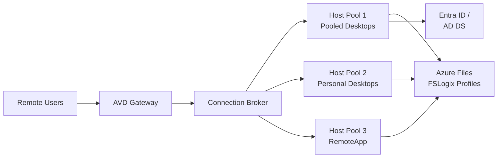

# Azure Virtual Desktop: escritorios virtuales en la nube

## Resumen

**Azure Virtual Desktop (AVD)** ofrece escritorios Windows 10/11 y aplicaciones RemoteApp desde Azure. Multiusuario, FSLogix profiles, autoscaling, integration con Entra ID. En este post verás setup de host pools, session hosts, FSLogix storage, autoscale, y monitoring.

<!-- more -->

## ¿Qué es Azure Virtual Desktop?

**VDI en Azure:**



**Ventajas vs on-premises VDI:**
- ✅ Sin CAPEX (infraestructura hardware)
- ✅ Multiusuario Windows 11 (hasta 20 usuarios/VM)
- ✅ Autoscaling (apagar VMs fuera de horario)
- ✅ GPU VMs para CAD, rendering, ML
- ✅ Global presence (reduce latency)

---

## Componentes AVD

**Host Pool:** Colección de VMs idénticas (session hosts)
- **Pooled:** Usuarios comparten VMs (non-persistent)
- **Personal:** 1 usuario = 1 VM (persistent)

**Application Group:** Define qué usuarios acceden a qué apps/desktops

**Workspace:** Agrupa application groups (portal para usuarios)

**FSLogix:** Profiles storage (documentos, settings) en Azure Files

---

## Setup: Host Pool pooled

### Crear Host Pool

```bash
# Variables
RESOURCE_GROUP="rg-avd-prod"
LOCATION="westeurope"
HOSTPOOL_NAME="hp-pooled-prod"
WORKSPACE_NAME="ws-avd-prod"
VNET_NAME="vnet-avd"
SUBNET_NAME="subnet-session-hosts"

# Crear VNet
az network vnet create \
  --resource-group $RESOURCE_GROUP \
  --name $VNET_NAME \
  --address-prefix 10.0.0.0/16 \
  --subnet-name $SUBNET_NAME \
  --subnet-prefix 10.0.1.0/24

# Host Pool (pooled)
az desktopvirtualization hostpool create \
  --resource-group $RESOURCE_GROUP \
  --name $HOSTPOOL_NAME \
  --location $LOCATION \
  --host-pool-type Pooled \
  --load-balancer-type BreadthFirst \  # BreadthFirst = distribuir usuarios uniformemente
  --max-session-limit 10 \  # Max 10 usuarios por VM
  --preferred-app-group-type Desktop
```

### Crear Workspace

```bash
az desktopvirtualization workspace create \
  --resource-group $RESOURCE_GROUP \
  --name $WORKSPACE_NAME \
  --location $LOCATION \
  --friendly-name "Production AVD Workspace"
```

### Application Group

```bash
# Desktop application group
az desktopvirtualization applicationgroup create \
  --resource-group $RESOURCE_GROUP \
  --name ag-desktop-pooled \
  --location $LOCATION \
  --host-pool-arm-path /subscriptions/$SUB_ID/resourceGroups/$RESOURCE_GROUP/providers/Microsoft.DesktopVirtualization/hostPools/$HOSTPOOL_NAME \
  --application-group-type Desktop \
  --friendly-name "Pooled Desktops"

# Asociar a Workspace
az desktopvirtualization workspace update \
  --resource-group $RESOURCE_GROUP \
  --name $WORKSPACE_NAME \
  --application-group-references /subscriptions/$SUB_ID/resourceGroups/$RESOURCE_GROUP/providers/Microsoft.DesktopVirtualization/applicationGroups/ag-desktop-pooled
```

### Asignar usuarios

```bash
# Asignar grupo de usuarios al application group
az role assignment create \
  --assignee-object-id $USER_GROUP_OBJECT_ID \
  --role "Desktop Virtualization User" \
  --scope /subscriptions/$SUB_ID/resourceGroups/$RESOURCE_GROUP/providers/Microsoft.DesktopVirtualization/applicationGroups/ag-desktop-pooled
```

---

## Session Hosts: deployment

### Crear VMs (session hosts)

```bash
# Imagen Windows 11 Multi-session
IMAGE_ID="/subscriptions/$SUB_ID/resourceGroups/$RESOURCE_GROUP/providers/Microsoft.Compute/galleries/sig_avd/images/win11-multisession/versions/latest"

# Registration token (válido 1 hora)
TOKEN=$(az desktopvirtualization hostpool retrieve-registration-token \
  --resource-group $RESOURCE_GROUP \
  --name $HOSTPOOL_NAME \
  --expiration-time "2025-10-05T23:59:59Z" \
  --query token -o tsv)

# Loop crear 3 session hosts
for i in {1..3}; do
  VM_NAME="vmavd-prod-$i"
  
  # Crear VM
  az vm create \
    --resource-group $RESOURCE_GROUP \
    --name $VM_NAME \
    --location $LOCATION \
    --size Standard_D4s_v3 \
    --image $IMAGE_ID \
    --vnet-name $VNET_NAME \
    --subnet $SUBNET_NAME \
    --admin-username avdadmin \
    --admin-password 'P@ssw0rd123!' \
    --license-type Windows_Client \  # Hybrid benefit
    --public-ip-address "" \  # Sin IP pública
    --nsg "" \  # Usar NSG del subnet
    --accelerated-networking true
  
  # Instalar AVD agent (via custom script extension)
  az vm extension set \
    --resource-group $RESOURCE_GROUP \
    --vm-name $VM_NAME \
    --name CustomScriptExtension \
    --publisher Microsoft.Compute \
    --settings "{\"fileUris\":[\"https://stscripts.blob.core.windows.net/avd/install-avd-agent.ps1\"],\"commandToExecute\":\"powershell -ExecutionPolicy Unrestricted -File install-avd-agent.ps1 -Token $TOKEN\"}"
done
```

**Script install-avd-agent.ps1:**

```powershell
param(
    [string]$Token
)

# Download AVD agents
$agentUrl = "https://query.prod.cms.rt.microsoft.com/cms/api/am/binary/RWrmXv"
$bootloaderUrl = "https://query.prod.cms.rt.microsoft.com/cms/api/am/binary/RWrxrH"

Invoke-WebRequest -Uri $agentUrl -OutFile "C:\AVD-Agent.msi"
Invoke-WebRequest -Uri $bootloaderUrl -OutFile "C:\AVD-Bootloader.msi"

# Install agents
Start-Process msiexec.exe -ArgumentList "/i C:\AVD-Agent.msi /quiet /qn /norestart REGISTRATIONTOKEN=$Token" -Wait
Start-Process msiexec.exe -ArgumentList "/i C:\AVD-Bootloader.msi /quiet /qn /norestart" -Wait

# Restart
Restart-Computer -Force
```

---

## FSLogix: profiles storage

### Azure Files para FSLogix

```bash
# Storage Account (Premium para mejor performance)
STORAGE_ACCOUNT="stfslogixprod$RANDOM"
az storage account create \
  --resource-group $RESOURCE_GROUP \
  --name $STORAGE_ACCOUNT \
  --location $LOCATION \
  --sku Premium_LRS \
  --kind FileStorage \
  --enable-large-file-share

# File share
SHARE_NAME="profiles"
az storage share-rm create \
  --resource-group $RESOURCE_GROUP \
  --storage-account $STORAGE_ACCOUNT \
  --name $SHARE_NAME \
  --quota 1024 \  # 1 TB
  --enabled-protocols SMB

# Obtener storage key
STORAGE_KEY=$(az storage account keys list \
  --resource-group $RESOURCE_GROUP \
  --account-name $STORAGE_ACCOUNT \
  --query "[0].value" -o tsv)
```

### Configurar FSLogix en session hosts

```powershell
# Script FSLogix config (ejecutar en cada session host)
$StorageAccountName = "stfslogixprodXXX"
$ShareName = "profiles"
$StorageKey = "<STORAGE_KEY>"

# Crear credential en Windows Credential Manager
cmdkey /add:"$StorageAccountName.file.core.windows.net" /user:"Azure\$StorageAccountName" /pass:$StorageKey

# Registry FSLogix
$RegPath = "HKLM:\SOFTWARE\FSLogix\Profiles"
New-Item -Path $RegPath -Force | Out-Null

Set-ItemProperty -Path $RegPath -Name "Enabled" -Value 1 -Type DWord
Set-ItemProperty -Path $RegPath -Name "VHDLocations" -Value "\\$StorageAccountName.file.core.windows.net\$ShareName" -Type MultiString
Set-ItemProperty -Path $RegPath -Name "SizeInMBs" -Value 30000 -Type DWord  # 30 GB max profile
Set-ItemProperty -Path $RegPath -Name "IsDynamic" -Value 1 -Type DWord  # Dynamic VHD (crece según uso)
Set-ItemProperty -Path $RegPath -Name "DeleteLocalProfileWhenVHDShouldApply" -Value 1 -Type DWord

# Reiniciar FSLogix service
Restart-Service -Name frxsvc -Force
```

**Permisos NTFS en share:**

```powershell
# Montar share como drive
net use Z: \\$StorageAccountName.file.core.windows.net\$ShareName /user:Azure\$StorageAccountName $StorageKey

# Permisos:
# - Users: Read, Write (no Delete)
# - CREATOR OWNER: Full Control (solo su profile)
icacls Z:\ /grant "DOMAIN\Users:(OI)(CI)(M)"
icacls Z:\ /grant "CREATOR OWNER:(OI)(CI)(F)"
icacls Z:\ /remove "Users"

net use Z: /delete
```

---

## Autoscale: apagar VMs fuera de horario

### Scaling plan

```bash
# Crear scaling plan
az desktopvirtualization scaling-plan create \
  --resource-group $RESOURCE_GROUP \
  --name scaling-plan-prod \
  --location $LOCATION \
  --time-zone "W. Europe Standard Time" \
  --host-pool-references \
    hostPoolArmPath=/subscriptions/$SUB_ID/resourceGroups/$RESOURCE_GROUP/providers/Microsoft.DesktopVirtualization/hostPools/$HOSTPOOL_NAME \
    scalingPlanEnabled=true

# Schedules
az desktopvirtualization scaling-plan create \
  --resource-group $RESOURCE_GROUP \
  --name scaling-plan-prod \
  --schedules '[
    {
      "name": "Weekday-RampUp",
      "daysOfWeek": ["Monday","Tuesday","Wednesday","Thursday","Friday"],
      "rampUpStartTime": {"hour":7,"minute":0},
      "peakStartTime": {"hour":9,"minute":0},
      "rampDownStartTime": {"hour":18,"minute":0},
      "offPeakStartTime": {"hour":20,"minute":0},
      "rampUpLoadBalancingAlgorithm": "BreadthFirst",
      "rampUpMinimumHostsPct": 20,
      "rampUpCapacityThresholdPct": 60,
      "peakLoadBalancingAlgorithm": "DepthFirst",
      "rampDownLoadBalancingAlgorithm": "DepthFirst",
      "rampDownMinimumHostsPct": 10,
      "rampDownCapacityThresholdPct": 90,
      "rampDownForceLogoffUsers": true,
      "rampDownWaitTimeMinutes": 15,
      "rampDownNotificationMessage": "System will log you off in 15 minutes. Save your work.",
      "offPeakLoadBalancingAlgorithm": "DepthFirst"
    }
  ]'
```

**Explicación schedule:**

| Fase | Horario | Comportamiento |
|------|---------|----------------|
| **Ramp-Up** | 07:00-09:00 | Encender 20% VMs, BreadthFirst (distribuir usuarios) |
| **Peak** | 09:00-18:00 | Todas VMs disponibles, DepthFirst (llenar VMs antes de crear nuevas) |
| **Ramp-Down** | 18:00-20:00 | Avisar usuarios, force logoff tras 15 min, apagar VMs vacías |
| **Off-Peak** | 20:00-07:00 | Solo 10% VMs encendidas |

---

## RemoteApp: publicar apps individuales

### Application Group (RemoteApp)

```bash
# RemoteApp application group
az desktopvirtualization applicationgroup create \
  --resource-group $RESOURCE_GROUP \
  --name ag-remoteapp-office \
  --location $LOCATION \
  --host-pool-arm-path /subscriptions/$SUB_ID/resourceGroups/$RESOURCE_GROUP/providers/Microsoft.DesktopVirtualization/hostPools/$HOSTPOOL_NAME \
  --application-group-type RemoteApp \
  --friendly-name "Office Apps"

# Asociar a workspace
az desktopvirtualization workspace update \
  --resource-group $RESOURCE_GROUP \
  --name $WORKSPACE_NAME \
  --application-group-references \
    /subscriptions/$SUB_ID/resourceGroups/$RESOURCE_GROUP/providers/Microsoft.DesktopVirtualization/applicationGroups/ag-desktop-pooled \
    /subscriptions/$SUB_ID/resourceGroups/$RESOURCE_GROUP/providers/Microsoft.DesktopVirtualization/applicationGroups/ag-remoteapp-office
```

### Publicar apps

```bash
# Publicar Word
az desktopvirtualization application create \
  --resource-group $RESOURCE_GROUP \
  --application-group-name ag-remoteapp-office \
  --name "Microsoft Word" \
  --command-line-setting Require \
  --command-line-arguments "" \
  --file-path "C:\Program Files\Microsoft Office\root\Office16\WINWORD.EXE" \
  --icon-path "C:\Program Files\Microsoft Office\root\Office16\WINWORD.EXE" \
  --icon-index 0 \
  --show-in-portal true

# Publicar Excel
az desktopvirtualization application create \
  --resource-group $RESOURCE_GROUP \
  --application-group-name ag-remoteapp-office \
  --name "Microsoft Excel" \
  --command-line-setting Require \
  --file-path "C:\Program Files\Microsoft Office\root\Office16\EXCEL.EXE" \
  --icon-path "C:\Program Files\Microsoft Office\root\Office16\EXCEL.EXE" \
  --icon-index 0 \
  --show-in-portal true
```

---

## Monitoring y diagnostics

### Diagnostic settings

```bash
# Habilitar logs
az monitor diagnostic-settings create \
  --name avd-diagnostics \
  --resource /subscriptions/$SUB_ID/resourceGroups/$RESOURCE_GROUP/providers/Microsoft.DesktopVirtualization/hostpools/$HOSTPOOL_NAME \
  --logs '[
    {"category":"Connection","enabled":true},
    {"category":"Error","enabled":true},
    {"category":"Management","enabled":true},
    {"category":"Feed","enabled":true}
  ]' \
  --workspace /subscriptions/$SUB_ID/resourceGroups/$RESOURCE_GROUP/providers/Microsoft.OperationalInsights/workspaces/law-prod
```

### KQL queries

```kusto
// User connections timeline
WVDConnections
| where TimeGenerated > ago(24h)
| where State == "Connected" or State == "Completed"
| project TimeGenerated, UserName, SessionHostName, State
| order by TimeGenerated desc

// Failed connections
WVDConnections
| where TimeGenerated > ago(24h)
| where State == "Failed"
| summarize Count = count() by UserName, CorrelationId, ErrorMessage = tostring(parse_json(Errors)[0])
| order by Count desc

// Session host performance
Perf
| where TimeGenerated > ago(1h)
| where ObjectName == "Processor" and CounterName == "% Processor Time" and InstanceName == "_Total"
| where Computer startswith "vmavd-"
| summarize AvgCPU = avg(CounterValue) by Computer
| where AvgCPU > 80

// FSLogix profile load time
WVDCheckpoints
| where TimeGenerated > ago(24h)
| where Name == "FSLogix Profile Loaded"
| extend LoadTime = Parameters.LoadTimeMs
| summarize AvgLoadTime = avg(toint(LoadTime)) by UserName
| order by AvgLoadTime desc
```

### Alertas

```bash
# Alerta: session host unhealthy
az monitor metrics alert create \
  --name alert-avd-host-unhealthy \
  --resource-group $RESOURCE_GROUP \
  --scopes /subscriptions/$SUB_ID/resourceGroups/$RESOURCE_GROUP/providers/Microsoft.DesktopVirtualization/hostpools/$HOSTPOOL_NAME \
  --condition "avg AvailableSessionCapacity < 10" \
  --window-size 5m \
  --action $ACTION_GROUP_ID \
  --severity 1

# Alerta: failed connections
az monitor scheduled-query create \
  --name alert-avd-failed-connections \
  --resource-group $RESOURCE_GROUP \
  --scopes $LOG_ANALYTICS_ID \
  --condition "count > 5" \
  --condition-query "WVDConnections | where State == 'Failed' | where TimeGenerated > ago(5m) | count" \
  --window-size 5m \
  --action $ACTION_GROUP_ID
```

---

## GPU VMs para CAD/Design

### Crear host pool con GPU

```bash
# Host pool para GPU workloads
az desktopvirtualization hostpool create \
  --resource-group $RESOURCE_GROUP \
  --name hp-gpu-cad \
  --location $LOCATION \
  --host-pool-type Personal \  # Personal para CAD users
  --load-balancer-type Persistent \
  --max-session-limit 1 \
  --preferred-app-group-type Desktop

# Session host con GPU (NV series)
az vm create \
  --resource-group $RESOURCE_GROUP \
  --name vmavd-gpu-1 \
  --size Standard_NV12s_v3 \  # NVIDIA Tesla M60
  --image $IMAGE_ID \
  --vnet-name $VNET_NAME \
  --subnet $SUBNET_NAME \
  --admin-username avdadmin \
  --admin-password 'P@ssw0rd123!'

# Instalar NVIDIA drivers (extensión)
az vm extension set \
  --resource-group $RESOURCE_GROUP \
  --vm-name vmavd-gpu-1 \
  --name NvidiaGpuDriverWindows \
  --publisher Microsoft.HpcCompute \
  --version 1.4
```

---

## Buenas prácticas

**Design:**
- ✅ Pooled para task workers (call center, data entry)
- ✅ Personal para power users (developers, CAD)
- ✅ RemoteApp para apps específicas (Office, LOB apps)
- ✅ Separate host pools por departamento/security level

**Security:**
- ✅ Entra ID join (no AD DS si es posible)
- ✅ Conditional Access policies (MFA, device compliance)
- ✅ No public IPs en session hosts
- ✅ RDP Shortpath (UDP optimizado)
- ✅ Screen capture protection

**Performance:**
- ✅ Premium SSD para session hosts
- ✅ Azure Files Premium para FSLogix (4,000 IOPS mínimo)
- ✅ Accelerated networking en VMs
- ✅ ExpressRoute para on-premises (< 20ms latency)

**Cost optimization:**
- ✅ Autoscale (apagar VMs off-hours)
- ✅ Spot VMs para non-production
- ✅ B-series VMs para light users
- ✅ Hybrid benefit licensing

---

## Troubleshooting

### Problema: User no ve workspace

**Check:**
1. Usuario asignado a Application Group?
2. Application Group asociado a Workspace?

```bash
# Ver role assignments
az role assignment list \
  --scope /subscriptions/$SUB_ID/resourceGroups/$RESOURCE_GROUP/providers/Microsoft.DesktopVirtualization/applicationGroups/ag-desktop-pooled
```

### Problema: FSLogix profile no carga

```kusto
// Ver errores FSLogix
WVDErrors
| where TimeGenerated > ago(1h)
| where Source == "FSLogix"
| project TimeGenerated, UserName, Message
```

**Fix común:** Permisos NTFS incorrectos en share

### Problema: Latency alta

```bash
# Test network latency desde session host
Test-NetConnection -ComputerName <client-ip> -Port 3389 -InformationLevel Detailed
```

**Fix:** Habilitar RDP Shortpath (UDP)

---

## Costes

**Estimación:**

```
Session hosts (3x D4s_v3):
- Compute: 3 × $140/mes = $420/mes
- Storage (OS disks): 3 × $10/mes = $30/mes

FSLogix storage (Azure Files Premium 1TB):
- Storage: $204/mes
- Transactions: ~$20/mes

AVD service: GRATIS (solo pagas VMs + storage)

Total: ~$674/mes (para 30 usuarios)
Costo por usuario: ~$22/mes

Con autoscale (apagar 12h/día):
- Compute: $210/mes (50% ahorro)
- Total: ~$464/mes ($15/usuario)
```

---

## Referencias

- [Azure Virtual Desktop Documentation](https://learn.microsoft.com/azure/virtual-desktop/)
- [FSLogix Profile Containers](https://learn.microsoft.com/fslogix/profile-container-configuration-reference)
- [Autoscale](https://learn.microsoft.com/azure/virtual-desktop/autoscale-scaling-plan)
- [RDP Shortpath](https://learn.microsoft.com/azure/virtual-desktop/rdp-shortpath)
