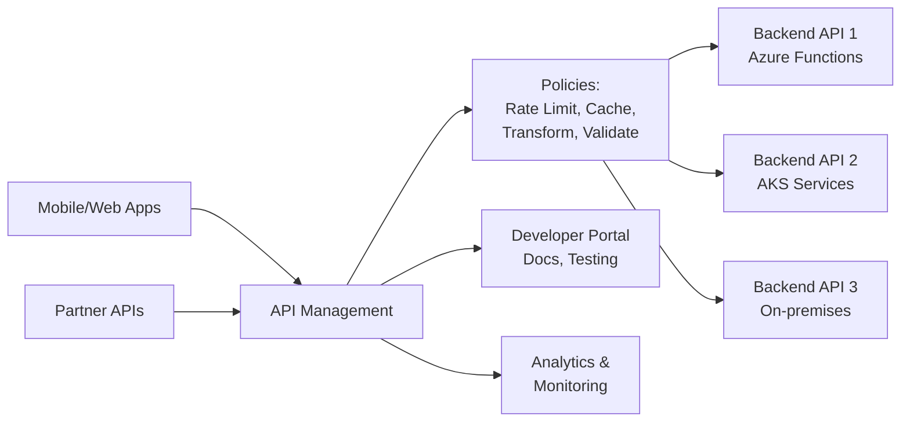

# Azure API Management: gateway centralizado para APIs

## Resumen

**API Management (APIM)** centraliza gestión de APIs, aplica políticas (rate limiting, caching, transformations), maneja autenticación OAuth/JWT, y publica documentación. En este post verás setup de APIM, policies críticas, OAuth integration, backends, y monitoring.

<!-- more -->

## ¿Qué es Azure API Management?

**API Gateway pattern:**



**Casos de uso:**

- Exponer microservices como API unificada
- Rate limiting para evitar abuse
- Transformar requests/responses (XML ↔ JSON)
- Cachear responses (reducir carga backends)
- Autenticación centralizada (OAuth, JWT)
- Versioning y breaking changes control

---

## Setup básico APIM

### Crear instancia APIM

```bash
# Variables
RESOURCE_GROUP="rg-apim-prod"
LOCATION="westeurope"
APIM_NAME="apim-prod-$RANDOM"
VNET_NAME="vnet-apim"
SUBNET_APIM="subnet-apim"

# Crear APIM (Developer tier - 30 min deployment)
az apim create \
  --resource-group $RESOURCE_GROUP \
  --name $APIM_NAME \
  --location $LOCATION \
  --publisher-email admin@example.com \
  --publisher-name "Example Corp" \
  --sku-name Developer \  # Developer, Basic, Standard, Premium
  --enable-managed-identity true

# Nota: Deployment tarda ~30 minutos
```

**SKUs comparación:**

| SKU | Max requests/sec | SLA | Multi-region | Internal VNet | Precio/mes |
|-----|------------------|-----|--------------|---------------|------------|
| **Developer** | 500 | No SLA | ❌ | ❌ | ~$50 |
| **Basic** | 1,000 | 99.95% | ❌ | ❌ | ~$160 |
| **Standard** | 2,500 | 99.95% | ❌ | ❌ | ~$700 |
| **Premium** | 4,000 | 99.99% | ✅ | ✅ | ~$2,800 |

---

## APIs y Operations

### Importar API desde OpenAPI spec

```bash
# Importar API desde URL OpenAPI
az apim api import \
  --resource-group $RESOURCE_GROUP \
  --service-name $APIM_NAME \
  --api-id petstore-api \
  --path /petstore \
  --display-name "Pet Store API" \
  --protocols https \
  --specification-format OpenApi \
  --specification-url https://petstore3.swagger.io/api/v3/openapi.json

# O desde archivo local
az apim api import \
  --resource-group $RESOURCE_GROUP \
  --service-name $APIM_NAME \
  --api-id orders-api \
  --path /orders \
  --display-name "Orders API" \
  --protocols https \
  --specification-format OpenApiJson \
  --specification-path ./openapi-orders.json \
  --service-url https://backend-orders.azurewebsites.net
```

### Crear API manualmente

```bash
# Crear API
az apim api create \
  --resource-group $RESOURCE_GROUP \
  --service-name $APIM_NAME \
  --api-id products-api \
  --path /products \
  --display-name "Products API" \
  --protocols https \
  --service-url https://backend-products.azurewebsites.net

# Agregar operation GET /products
az apim api operation create \
  --resource-group $RESOURCE_GROUP \
  --service-name $APIM_NAME \
  --api-id products-api \
  --operation-id get-products \
  --method GET \
  --url-template "/" \
  --display-name "Get all products"

# Operation GET /products/{id}
az apim api operation create \
  --resource-group $RESOURCE_GROUP \
  --service-name $APIM_NAME \
  --api-id products-api \
  --operation-id get-product-by-id \
  --method GET \
  --url-template "/{id}" \
  --display-name "Get product by ID" \
  --template-parameters name=id description="Product ID" type=string required=true

# Operation POST /products
az apim api operation create \
  --resource-group $RESOURCE_GROUP \
  --service-name $APIM_NAME \
  --api-id products-api \
  --operation-id create-product \
  --method POST \
  --url-template "/" \
  --display-name "Create product"
```

---

## Policies: transformaciones y seguridad

### Rate limiting

```xml
<!-- Policy: Rate limit 100 calls/minuto por subscription key -->
<policies>
    <inbound>
        <rate-limit calls="100" renewal-period="60" />
        <base />
    </inbound>
</policies>
```

```bash
# Aplicar policy a API level
az apim api policy create \
  --resource-group $RESOURCE_GROUP \
  --service-name $APIM_NAME \
  --api-id products-api \
  --xml-policy '<policies>
    <inbound>
        <rate-limit calls="100" renewal-period="60" />
        <base />
    </inbound>
</policies>'
```

### Caching

```xml
<!-- Cache responses por 1 hora -->
<policies>
    <inbound>
        <cache-lookup vary-by-developer="false" vary-by-developer-groups="false">
            <vary-by-query-parameter>category</vary-by-query-parameter>
            <vary-by-query-parameter>page</vary-by-query-parameter>
        </cache-lookup>
        <base />
    </inbound>
    <outbound>
        <cache-store duration="3600" />  <!-- 1 hora -->
        <base />
    </outbound>
</policies>
```

### Request/Response transformation

```xml
<!-- Transformar JSON request a backend legacy XML -->
<policies>
    <inbound>
        <base />
        <!-- Validar JWT token -->
        <validate-jwt header-name="Authorization" failed-validation-httpcode="401">
            <openid-config url="https://login.microsoftonline.com/{tenant}/.well-known/openid-configuration" />
            <required-claims>
                <claim name="aud">
                    <value>api://myapp</value>
                </claim>
            </required-claims>
        </validate-jwt>

        <!-- JSON to XML transformation -->
        <json-to-xml apply="always" consider-accept-header="false" />

        <!-- Set backend header -->
        <set-header name="X-API-Key" exists-action="override">
            <value>{{backend-api-key}}</value>
        </set-header>
    </inbound>
    <backend>
        <base />
    </backend>
    <outbound>
        <!-- XML to JSON transformation -->
        <xml-to-json kind="direct" apply="always" consider-accept-header="false" />

        <!-- Remove internal headers -->
        <set-header name="X-Powered-By" exists-action="delete" />
        <set-header name="X-AspNet-Version" exists-action="delete" />

        <base />
    </outbound>
    <on-error>
        <base />
        <!-- Custom error response -->
        <return-response>
            <set-status code="500" reason="Internal Server Error" />
            <set-body>@{
                return new JObject(
                    new JProperty("error", context.LastError.Message),
                    new JProperty("timestamp", DateTime.UtcNow.ToString("o"))
                ).ToString();
            }</set-body>
        </return-response>
    </on-error>
</policies>
```

### IP filtering

```xml
<!-- Whitelist IPs corporativas -->
<policies>
    <inbound>
        <ip-filter action="allow">
            <address>203.0.113.0</address>
            <address-range from="198.51.100.0" to="198.51.100.255" />
        </ip-filter>
        <base />
    </inbound>
</policies>
```

### Quota (límite mensual)

```xml
<!-- Quota: 10,000 calls/mes por subscription -->
<policies>
    <inbound>
        <quota calls="10000" bandwidth="102400" renewal-period="2592000" />
        <base />
    </inbound>
</policies>
```

### Mock responses (testing)

```xml
<!-- Mock response sin llamar backend -->
<policies>
    <inbound>
        <mock-response status-code="200" content-type="application/json" />
        <base />
    </inbound>
</policies>
```

---

## Autenticación: OAuth 2.0 / Entra ID

### Validar JWT tokens

```xml
<policies>
    <inbound>
        <validate-jwt header-name="Authorization" failed-validation-httpcode="401" failed-validation-error-message="Unauthorized">
            <openid-config url="https://login.microsoftonline.com/{tenant-id}/.well-known/openid-configuration" />
            <audiences>
                <audience>api://myapp-api</audience>
            </audiences>
            <issuers>
                <issuer>https://sts.windows.net/{tenant-id}/</issuer>
            </issuers>
            <required-claims>
                <claim name="roles" match="any">
                    <value>API.Read</value>
                    <value>API.Write</value>
                </claim>
            </required-claims>
        </validate-jwt>
        <base />
    </inbound>
</policies>
```

### OAuth authorization server

```bash
# Configurar authorization server (Entra ID)
az apim api authorization-server create \
  --resource-group $RESOURCE_GROUP \
  --service-name $APIM_NAME \
  --server-id entra-oauth \
  --display-name "Entra ID OAuth" \
  --client-registration-endpoint "https://login.microsoftonline.com/{tenant}/oauth2/v2.0/authorize" \
  --authorization-endpoint "https://login.microsoftonline.com/{tenant}/oauth2/v2.0/authorize" \
  --token-endpoint "https://login.microsoftonline.com/{tenant}/oauth2/v2.0/token" \
  --client-id $CLIENT_ID \
  --client-secret $CLIENT_SECRET \
  --grant-types authorizationCode \
  --default-scope "api://myapp-api/.default"
```

**Flujo OAuth en Developer Portal:**

1. User click "Try It" en operation
2. APIM redirige a Entra ID login
3. User aprueba scopes
4. APIM recibe token y llama backend
5. Response mostrado en portal

---

## Backends: múltiples servicios

### Named values (variables)

```bash
# Crear named value para backend URL
az apim nv create \
  --resource-group $RESOURCE_GROUP \
  --service-name $APIM_NAME \
  --named-value-id backend-url-prod \
  --display-name "Backend URL Production" \
  --value "https://backend-prod.azurewebsites.net"

# Named value secreto (API key)
az apim nv create \
  --resource-group $RESOURCE_GROUP \
  --service-name $APIM_NAME \
  --named-value-id backend-api-key \
  --display-name "Backend API Key" \
  --value "secret-key-12345" \
  --secret true
```

**Usar en policy:**

```xml
<set-backend-service base-url="{{backend-url-prod}}" />
<set-header name="X-API-Key" exists-action="override">
    <value>{{backend-api-key}}</value>
</set-header>
```

### Backend entity

```bash
# Crear backend
az apim backend create \
  --resource-group $RESOURCE_GROUP \
  --service-name $APIM_NAME \
  --backend-id backend-orders \
  --title "Orders Backend" \
  --url https://orders-api.azurewebsites.net \
  --protocol http

# Backend con circuit breaker
az apim backend update \
  --resource-group $RESOURCE_GROUP \
  --service-name $APIM_NAME \
  --backend-id backend-orders \
  --set "circuitBreaker.rules[0].failureCondition.count=5" \
  --set "circuitBreaker.rules[0].failureCondition.interval=PT1M" \
  --set "circuitBreaker.rules[0].tripDuration=PT1M"
```

**Policy con backend:**

```xml
<set-backend-service backend-id="backend-orders" />
```

---

## Products y Subscriptions

### Crear product

```bash
# Product: Starter (gratis, rate limited)
az apim product create \
  --resource-group $RESOURCE_GROUP \
  --service-name $APIM_NAME \
  --product-id starter \
  --product-name "Starter Plan" \
  --description "Free tier with rate limits" \
  --subscription-required true \
  --approval-required false \
  --subscriptions-limit 1 \
  --state published

# Agregar API al product
az apim product api add \
  --resource-group $RESOURCE_GROUP \
  --service-name $APIM_NAME \
  --product-id starter \
  --api-id products-api

# Policy del product (rate limit)
az apim product policy create \
  --resource-group $RESOURCE_GROUP \
  --service-name $APIM_NAME \
  --product-id starter \
  --xml-policy '<policies>
    <inbound>
        <rate-limit calls="10" renewal-period="60" />
        <quota calls="1000" renewal-period="86400" />
        <base />
    </inbound>
</policies>'
```

### Crear subscription

```bash
# Subscription para usuario
az apim subscription create \
  --resource-group $RESOURCE_GROUP \
  --service-name $APIM_NAME \
  --subscription-id sub-user-123 \
  --name "User 123 Subscription" \
  --scope /products/starter \
  --state active

# Obtener subscription keys
az apim subscription show \
  --resource-group $RESOURCE_GROUP \
  --service-name $APIM_NAME \
  --subscription-id sub-user-123 \
  --query "{primary:primaryKey, secondary:secondaryKey}"
```

**Llamar API con subscription key:**

```bash
curl -H "Ocp-Apim-Subscription-Key: <PRIMARY_KEY>" \
  https://apim-prod-xxx.azure-api.net/products
```

---

## Versioning y Revisions

### API versions

```bash
# Version 1 (original)
az apim api create \
  --resource-group $RESOURCE_GROUP \
  --service-name $APIM_NAME \
  --api-id products-api-v1 \
  --path /v1/products \
  --display-name "Products API v1" \
  --service-url https://backend-v1.azurewebsites.net \
  --api-version v1 \
  --api-version-set-id products-versions

# Version 2 (breaking changes)
az apim api create \
  --resource-group $RESOURCE_GROUP \
  --service-name $APIM_NAME \
  --api-id products-api-v2 \
  --path /v2/products \
  --display-name "Products API v2" \
  --service-url https://backend-v2.azurewebsites.net \
  --api-version v2 \
  --api-version-set-id products-versions
```

**Acceso:**

```
GET https://apim-prod.azure-api.net/v1/products  → Backend v1
GET https://apim-prod.azure-api.net/v2/products  → Backend v2
```

### Revisions (sin breaking changes)

```bash
# Crear revision
az apim api revision create \
  --resource-group $RESOURCE_GROUP \
  --service-name $APIM_NAME \
  --api-id products-api \
  --api-revision 2 \
  --api-revision-description "Added caching policy"

# Editar revision 2 (no afecta prod)
az apim api policy create \
  --resource-group $RESOURCE_GROUP \
  --service-name $APIM_NAME \
  --api-id products-api \
  --api-revision 2 \
  --xml-policy '<policies>
    <inbound>
        <cache-lookup vary-by-developer="false" />
        <base />
    </inbound>
    <outbound>
        <cache-store duration="3600" />
        <base />
    </outbound>
</policies>'

# Hacer current (promover a producción)
az apim api release create \
  --resource-group $RESOURCE_GROUP \
  --service-name $APIM_NAME \
  --api-id products-api \
  --api-revision 2 \
  --release-id release-2 \
  --notes "Enabled caching"
```

---

## Developer Portal customization

### Habilitar Developer Portal

```bash
# El portal está habilitado por defecto en:
# https://{apim-name}.developer.azure-api.net

# Publicar cambios en portal
az apim publish \
  --resource-group $RESOURCE_GROUP \
  --name $APIM_NAME
```

**Customización (Portal Admin):**

1. Login: `https://{apim-name}.management.azure-api.net`
2. Developer Portal → Design
3. Cambiar colores, logo, CSS custom
4. Agregar páginas custom
5. Publish changes

---

## Monitoring y analytics

### Application Insights integration

```bash
# Crear App Insights
az monitor app-insights component create \
  --resource-group $RESOURCE_GROUP \
  --app apim-insights \
  --location $LOCATION \
  --workspace $LOG_ANALYTICS_ID

INSTRUMENTATION_KEY=$(az monitor app-insights component show \
  --resource-group $RESOURCE_GROUP \
  --app apim-insights \
  --query instrumentationKey -o tsv)

# Configurar logger en APIM
az apim logger create \
  --resource-group $RESOURCE_GROUP \
  --service-name $APIM_NAME \
  --logger-id appinsights-logger \
  --logger-type applicationInsights \
  --credentials instrumentationKey=$INSTRUMENTATION_KEY

# Habilitar diagnostic API
az apim diagnostic create \
  --resource-group $RESOURCE_GROUP \
  --service-name $APIM_NAME \
  --diagnostic-id applicationinsights \
  --logger-id appinsights-logger \
  --always-log allErrors \
  --sampling-percentage 100
```

### Queries KQL útiles

```kusto
// Top 10 APIs por requests
requests
| where cloud_RoleName == "apim-prod"
| summarize Count = count() by operation_Name
| top 10 by Count desc

// Latency por operation
requests
| where cloud_RoleName == "apim-prod"
| summarize AvgDuration = avg(duration), P95 = percentile(duration, 95) by operation_Name
| order by AvgDuration desc

// Errores HTTP 5xx
requests
| where cloud_RoleName == "apim-prod"
| where resultCode >= 500
| project timestamp, operation_Name, resultCode, duration, client_IP
| order by timestamp desc

// Rate limit violations
traces
| where message contains "rate limit"
| project timestamp, message, customDimensions.SubscriptionId
```

### Alertas

```bash
# Alerta: latency > 2s
az monitor metrics alert create \
  --name alert-apim-latency \
  --resource-group $RESOURCE_GROUP \
  --scopes /subscriptions/$SUB_ID/resourceGroups/$RESOURCE_GROUP/providers/Microsoft.ApiManagement/service/$APIM_NAME \
  --condition "avg Duration > 2000" \
  --window-size 5m \
  --action $ACTION_GROUP_ID

# Alerta: error rate > 5%
az monitor metrics alert create \
  --name alert-apim-errors \
  --resource-group $RESOURCE_GROUP \
  --scopes /subscriptions/$SUB_ID/resourceGroups/$RESOURCE_GROUP/providers/Microsoft.ApiManagement/service/$APIM_NAME \
  --condition "total FailedRequests / total TotalRequests > 0.05" \
  --window-size 5m \
  --action $ACTION_GROUP_ID
```

---

## Self-hosted Gateway (hybrid/on-premises)

### Deploy self-hosted gateway

```bash
# Crear gateway
az apim gateway create \
  --resource-group $RESOURCE_GROUP \
  --service-name $APIM_NAME \
  --gateway-id gateway-onprem \
  --location-data name="On-Premises Datacenter"

# Obtener token
TOKEN=$(az apim gateway token create \
  --resource-group $RESOURCE_GROUP \
  --service-name $APIM_NAME \
  --gateway-id gateway-onprem \
  --key-type primary \
  --expiry "2025-12-31T23:59:59Z" \
  --query value -o tsv)
```

**Deploy en Kubernetes:**

```yaml
# gateway-deployment.yaml
apiVersion: apps/v1
kind: Deployment
metadata:
  name: apim-gateway
  namespace: apim
spec:
  replicas: 2
  selector:
    matchLabels:
      app: apim-gateway
  template:
    metadata:
      labels:
        app: apim-gateway
    spec:
      containers:
      - name: gateway
        image: mcr.microsoft.com/azure-api-management/gateway:2.3
        env:
        - name: config.service.endpoint
          value: "https://apim-prod.management.azure-api.net/subscriptions/{sub}/resourceGroups/{rg}/providers/Microsoft.ApiManagement/service/apim-prod"
        - name: config.service.auth
          value: "GatewayKey <TOKEN>"
        ports:
        - containerPort: 8080
        - containerPort: 8081
---
apiVersion: v1
kind: Service
metadata:
  name: apim-gateway
  namespace: apim
spec:
  type: LoadBalancer
  ports:
  - name: http
    port: 80
    targetPort: 8080
  - name: https
    port: 443
    targetPort: 8081
  selector:
    app: apim-gateway
```

---

## Buenas prácticas

**Design:**

- ✅ Usar Products para agrupar APIs por plan (Free, Basic, Premium)
- ✅ Versioning para breaking changes (`/v1/`, `/v2/`)
- ✅ Revisions para non-breaking changes
- ✅ Named values para configuraciones por entorno

**Security:**

- ✅ Validate JWT tokens en inbound policy
- ✅ IP filtering para admin APIs
- ✅ Rate limiting + quota por product
- ✅ Remove internal headers en outbound

**Performance:**

- ✅ Cache responses estáticas (GET requests)
- ✅ Mock responses para testing (sin backend)
- ✅ Backend circuit breaker (evitar cascade failures)

**Monitoring:**

- ✅ Application Insights integration
- ✅ Alertas en latency y error rate
- ✅ Custom logging con trace policies

---

## Costes

**Estimación Premium tier:**

```
Premium tier:
- Gateway: $2,800/mes (1 unit)
- Bandwidth: $0.09/GB outbound
- Calls: GRATIS (incluidos)

Ejemplo producción:
- Gateway: $2,800/mes
- 10 TB bandwidth: $900/mes
- Total: ~$3,700/mes

Developer tier (non-production):
- Gateway: $50/mes
- Sin SLA, límite 500 req/s
```

---

## Referencias

- [APIM Documentation](https://learn.microsoft.com/azure/api-management/)
- [Policy Reference](https://learn.microsoft.com/azure/api-management/api-management-policies)
- [OAuth 2.0 Authorization](https://learn.microsoft.com/azure/api-management/api-management-howto-oauth2)
- [Self-hosted Gateway](https://learn.microsoft.com/azure/api-management/self-hosted-gateway-overview)
