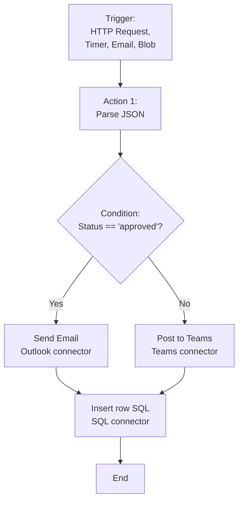

# Azure Logic Apps: workflows de integración sin código

## Resumen

Voy al grano: **Logic Apps** automatiza workflows de integración con 400+ conectores (Office 365, Salesforce, SAP, Twitter, SQL). Visual designer, triggers, actions, conditions, loops. En este post verás diseño de workflows, conectores críticos, error handling, y deployment con Bicep/ARM.

<!-- more -->

## ¿Qué es Logic Apps?

**Integration Platform as a Service (iPaaS):**



**Casos de uso:**
- Procesar archivos al subirlos a Blob Storage
- Integrar CRM (Salesforce) con ERP (SAP)
- Aprobar facturas por email
- Monitorear Twitter y alertar en Teams
- ETL simple (extract, transform, load)

---

## Standard vs Consumption

| Feature | **Consumption** | **Standard** |
|---------|----------------|--------------|
| Hosting | Multi-tenant | Single-tenant (App Service Plan) |
| Pricing | Por ejecución | Por plan (fijo) |
| VNet integration | ❌ | ✅ |
| Stateful/Stateless | Solo Stateful | Ambos |
| Local development | Limitado | VS Code full support |
| Precio típico | $0.000025/acción | ~$200/mes |

**Cuándo usar Standard:**
- High throughput (>1M actions/mes)
- VNet integration requerida
- Dev/test local con VS Code
- Stateless workflows (mejor performance)

---

## Crear Logic App (Consumption)

### Portal Azure

```bash
# Crear Logic App Consumption
az logic workflow create \
  --resource-group $RESOURCE_GROUP \
  --location $LOCATION \
  --name logic-app-blob-processor \
  --definition '{
    "definition": {
      "$schema": "https://schema.management.azure.com/providers/Microsoft.Logic/schemas/2016-06-01/workflowdefinition.json#",
      "triggers": {},
      "actions": {},
      "outputs": {}
    }
  }'
```

**Desde Portal:** Azure Portal → Logic Apps → Create → Consumption → Designer

---

## Workflow ejemplo: procesar blobs

### Trigger: When a blob is added

```json
{
  "triggers": {
    "When_a_blob_is_added": {
      "type": "ApiConnection",
      "inputs": {
        "host": {
          "connection": {
            "name": "@parameters('$connections')['azureblob']['connectionId']"
          }
        },
        "method": "get",
        "path": "/v2/datasets/@{encodeURIComponent('AccountNameFromSettings')}/triggers/batch/onupdatedfile",
        "queries": {
          "folderId": "/uploads",
          "maxFileCount": 10,
          "checkBothCreatedAndModifiedDateTime": false
        }
      },
      "recurrence": {
        "frequency": "Minute",
        "interval": 5
      }
    }
  }
}
```

### Action: Get blob content

```json
{
  "actions": {
    "Get_blob_content": {
      "type": "ApiConnection",
      "inputs": {
        "host": {
          "connection": {
            "name": "@parameters('$connections')['azureblob']['connectionId']"
          }
        },
        "method": "get",
        "path": "/v2/datasets/@{encodeURIComponent('AccountNameFromSettings')}/files/@{encodeURIComponent(triggerBody()?['Id'])}/content"
      },
      "runAfter": {}
    }
  }
}
```

### Action: Parse JSON

```json
{
  "Parse_JSON": {
    "type": "ParseJson",
    "inputs": {
      "content": "@body('Get_blob_content')",
      "schema": {
        "type": "object",
        "properties": {
          "orderId": {"type": "string"},
          "customer": {"type": "string"},
          "total": {"type": "number"}
        }
      }
    },
    "runAfter": {
      "Get_blob_content": ["Succeeded"]
    }
  }
}
```

### Action: Insert row (SQL)

```json
{
  "Insert_row_SQL": {
    "type": "ApiConnection",
    "inputs": {
      "host": {
        "connection": {
          "name": "@parameters('$connections')['sql']['connectionId']"
        }
      },
      "method": "post",
      "path": "/v2/datasets/@{encodeURIComponent('default')}/tables/@{encodeURIComponent('[dbo].[Orders]')}/items",
      "body": {
        "OrderId": "@{body('Parse_JSON')?['orderId']}",
        "Customer": "@{body('Parse_JSON')?['customer']}",
        "Total": "@{body('Parse_JSON')?['total']}",
        "ProcessedDate": "@{utcNow()}"
      }
    },
    "runAfter": {
      "Parse_JSON": ["Succeeded"]
    }
  }
}
```

### Action: Send email (Outlook)

```json
{
  "Send_email_confirmation": {
    "type": "ApiConnection",
    "inputs": {
      "host": {
        "connection": {
          "name": "@parameters('$connections')['outlook']['connectionId']"
        }
      },
      "method": "post",
      "path": "/v2/Mail",
      "body": {
        "To": "admin@example.com",
        "Subject": "Order @{body('Parse_JSON')?['orderId']} processed",
        "Body": "<p>Order details:<br>Customer: @{body('Parse_JSON')?['customer']}<br>Total: $@{body('Parse_JSON')?['total']}</p>",
        "Importance": "Normal"
      }
    },
    "runAfter": {
      "Insert_row_SQL": ["Succeeded"]
    }
  }
}
```

---

## Control flow: conditions, loops, scopes

### Condition

```json
{
  "Condition_Check_Total": {
    "type": "If",
    "expression": {
      "and": [
        {
          "greater": [
            "@body('Parse_JSON')?['total']",
            1000
          ]
        }
      ]
    },
    "actions": {
      "Send_approval_email": {
        "type": "ApiConnection",
        "inputs": {
          "host": {
            "connection": {
              "name": "@parameters('$connections')['outlook']['connectionId']"
            }
          },
          "method": "post",
          "path": "/v2/Mail",
          "body": {
            "To": "manager@example.com",
            "Subject": "Approval required for order @{body('Parse_JSON')?['orderId']}",
            "Body": "Order total: $@{body('Parse_JSON')?['total']}"
          }
        }
      }
    },
    "else": {
      "actions": {
        "Auto_approve": {
          "type": "Response",
          "inputs": {
            "statusCode": 200,
            "body": {"status": "auto-approved"}
          }
        }
      }
    }
  }
}
```

### ForEach loop

```json
{
  "ForEach_OrderItem": {
    "type": "Foreach",
    "foreach": "@body('Parse_JSON')?['items']",
    "actions": {
      "Insert_order_item": {
        "type": "ApiConnection",
        "inputs": {
          "host": {
            "connection": {
              "name": "@parameters('$connections')['sql']['connectionId']"
            }
          },
          "method": "post",
          "path": "/v2/datasets/@{encodeURIComponent('default')}/tables/@{encodeURIComponent('[dbo].[OrderItems]')}/items",
          "body": {
            "OrderId": "@{body('Parse_JSON')?['orderId']}",
            "ProductId": "@{items('ForEach_OrderItem')?['productId']}",
            "Quantity": "@{items('ForEach_OrderItem')?['quantity']}"
          }
        }
      }
    }
  }
}
```

### Until loop

```json
{
  "Until_Job_Completed": {
    "type": "Until",
    "expression": "@equals(body('Check_Job_Status')?['status'], 'completed')",
    "limit": {
      "count": 60,
      "timeout": "PT1H"
    },
    "actions": {
      "Check_Job_Status": {
        "type": "Http",
        "inputs": {
          "method": "GET",
          "uri": "https://api.example.com/jobs/@{variables('jobId')}/status"
        }
      },
      "Delay_30_seconds": {
        "type": "Wait",
        "inputs": {
          "interval": {
            "count": 30,
            "unit": "Second"
          }
        },
        "runAfter": {
          "Check_Job_Status": ["Succeeded"]
        }
      }
    }
  }
}
```

### Scope (agrupación y error handling)

```json
{
  "Scope_Database_Operations": {
    "type": "Scope",
    "actions": {
      "Insert_Order": {
        "type": "ApiConnection",
        "inputs": { /* ... */ }
      },
      "Insert_OrderItems": {
        "type": "ApiConnection",
        "inputs": { /* ... */ },
        "runAfter": {
          "Insert_Order": ["Succeeded"]
        }
      }
    }
  },
  "Scope_Error_Handler": {
    "type": "Scope",
    "actions": {
      "Send_error_notification": {
        "type": "ApiConnection",
        "inputs": {
          "host": {
            "connection": {
              "name": "@parameters('$connections')['teams']['connectionId']"
            }
          },
          "method": "post",
          "path": "/v3/messages",
          "body": {
            "channelId": "@parameters('teamsChannelId')",
            "message": {
              "subject": "Logic App Error",
              "body": {
                "content": "<p>Error in workflow: @{actions('Scope_Database_Operations')?['error']?['message']}</p>"
              }
            }
          }
        }
      }
    },
    "runAfter": {
      "Scope_Database_Operations": ["Failed", "Skipped", "TimedOut"]
    }
  }
}
```

---

## Conectores críticos

### HTTP connector (REST APIs)

```json
{
  "HTTP_Call_External_API": {
    "type": "Http",
    "inputs": {
      "method": "POST",
      "uri": "https://api.external.com/v1/orders",
      "headers": {
        "Authorization": "Bearer @{parameters('apiToken')}",
        "Content-Type": "application/json"
      },
      "body": {
        "orderId": "@{body('Parse_JSON')?['orderId']}",
        "timestamp": "@{utcNow()}"
      }
    },
    "retryPolicy": {
      "type": "fixed",
      "count": 4,
      "interval": "PT20S"
    }
  }
}
```

### Azure Functions connector

```json
{
  "Call_Azure_Function": {
    "type": "Function",
    "inputs": {
      "function": {
        "id": "/subscriptions/{sub}/resourceGroups/{rg}/providers/Microsoft.Web/sites/func-validator/functions/ValidateOrder"
      },
      "method": "POST",
      "body": "@body('Parse_JSON')"
    }
  }
}
```

### Service Bus connector

```json
{
  "Send_message_to_queue": {
    "type": "ApiConnection",
    "inputs": {
      "host": {
        "connection": {
          "name": "@parameters('$connections')['servicebus']['connectionId']"
        }
      },
      "method": "post",
      "path": "/@{encodeURIComponent('orders-queue')}/messages",
      "body": {
        "ContentData": "@{base64(body('Parse_JSON'))}"
      },
      "queries": {
        "systemProperties": "None"
      }
    }
  }
}
```

### Cosmos DB connector

```json
{
  "Create_or_update_document": {
    "type": "ApiConnection",
    "inputs": {
      "host": {
        "connection": {
          "name": "@parameters('$connections')['cosmosdb']['connectionId']"
        }
      },
      "method": "post",
      "path": "/v2/cosmosdb/@{encodeURIComponent('OrdersDB')}/colls/@{encodeURIComponent('Orders')}/docs",
      "body": {
        "id": "@{body('Parse_JSON')?['orderId']}",
        "customer": "@{body('Parse_JSON')?['customer']}",
        "total": "@{body('Parse_JSON')?['total']}",
        "timestamp": "@{utcNow()}"
      }
    }
  }
}
```

---

## Error handling y retry

### Configure retry policy

```json
{
  "HTTP_with_retry": {
    "type": "Http",
    "inputs": {
      "method": "POST",
      "uri": "https://api.unreliable.com/data"
    },
    "retryPolicy": {
      "type": "exponential",
      "count": 4,
      "interval": "PT10S",
      "maximumInterval": "PT1H",
      "minimumInterval": "PT5S"
    }
  }
}
```

### Try-Catch pattern con Scopes

```json
{
  "Try_Block": {
    "type": "Scope",
    "actions": {
      "Risky_Operation": {
        "type": "Http",
        "inputs": { /* ... */ }
      }
    }
  },
  "Catch_Block": {
    "type": "Scope",
    "actions": {
      "Log_Error": {
        "type": "AppendToStringVariable",
        "inputs": {
          "name": "errorLog",
          "value": "@{actions('Risky_Operation')?['error']?['message']}"
        }
      },
      "Send_Alert": {
        "type": "ApiConnection",
        "inputs": { /* Teams/Email */ }
      }
    },
    "runAfter": {
      "Try_Block": ["Failed", "Skipped", "TimedOut"]
    }
  }
}
```

---

## Deployment con Bicep

### Logic App Consumption

```bicep
// logic-app.bicep
param location string = resourceGroup().location
param logicAppName string = 'logic-app-blob-processor'
param storageAccountConnectionString string

resource blobConnection 'Microsoft.Web/connections@2016-06-01' = {
  name: 'azureblob'
  location: location
  properties: {
    displayName: 'Azure Blob Storage'
    api: {
      id: '/subscriptions/${subscription().subscriptionId}/providers/Microsoft.Web/locations/${location}/managedApis/azureblob'
    }
    parameterValues: {
      accountName: 'stproddata'
      accessKey: storageAccountConnectionString
    }
  }
}

resource logicApp 'Microsoft.Logic/workflows@2019-05-01' = {
  name: logicAppName
  location: location
  properties: {
    state: 'Enabled'
    definition: {
      '$schema': 'https://schema.management.azure.com/providers/Microsoft.Logic/schemas/2016-06-01/workflowdefinition.json#'
      contentVersion: '1.0.0.0'
      parameters: {
        '$connections': {
          defaultValue: {}
          type: 'Object'
        }
      }
      triggers: {
        When_a_blob_is_added: {
          type: 'ApiConnection'
          inputs: {
            host: {
              connection: {
                name: '@parameters(\'$connections\')[\'azureblob\'][\'connectionId\']'
              }
            }
            method: 'get'
            path: '/v2/datasets/@{encodeURIComponent(\'AccountNameFromSettings\')}/triggers/batch/onupdatedfile'
          }
        }
      }
      actions: {
        // Actions here...
      }
    }
    parameters: {
      '$connections': {
        value: {
          azureblob: {
            connectionId: blobConnection.id
            connectionName: 'azureblob'
            id: '/subscriptions/${subscription().subscriptionId}/providers/Microsoft.Web/locations/${location}/managedApis/azureblob'
          }
        }
      }
    }
  }
}
```

---

## Monitoring

### Diagnostic logs

```bash
az monitor diagnostic-settings create \
  --name logic-app-diagnostics \
  --resource /subscriptions/$SUB_ID/resourceGroups/$RESOURCE_GROUP/providers/Microsoft.Logic/workflows/logic-app-blob-processor \
  --logs '[{"category":"WorkflowRuntime","enabled":true}]' \
  --workspace $LOG_ANALYTICS_ID
```

### KQL queries

```kusto
// Failed runs
AzureDiagnostics
| where ResourceType == "WORKFLOWS"
| where status_s == "Failed"
| project TimeGenerated, resource_workflowName_s, resource_runId_s, error_message_s
| order by TimeGenerated desc

// Run duration
AzureDiagnostics
| where ResourceType == "WORKFLOWS"
| where status_s == "Succeeded"
| extend Duration = endTime_t - startTime_t
| summarize AvgDuration = avg(Duration) by resource_workflowName_s

// Action success rate
AzureDiagnostics
| where ResourceType == "WORKFLOWS"
| summarize Total = count(), Failed = countif(status_s == "Failed") by resource_actionName_s
| extend SuccessRate = 100.0 * (Total - Failed) / Total
| order by SuccessRate asc
```

---

## Buenas prácticas

**Design:**
- ✅ Usar Scopes para agrupar actions relacionadas
- ✅ Implement try-catch pattern con runAfter
- ✅ Variables para datos compartidos entre actions
- ✅ Parameters para configuraciones por entorno

**Performance:**
- ✅ Stateless workflows para high throughput (Standard)
- ✅ Batch triggers (procesar múltiples items juntos)
- ✅ Until loops con timeout y count limit
- ✅ Async pattern para operaciones largas

**Security:**
- ✅ Managed Identity para conectores Azure
- ✅ Key Vault para secrets (connection strings, API keys)
- ✅ No hardcodear credentials en definition
- ✅ Secure inputs/outputs (ocultar datos sensibles en logs)

**Cost optimization:**
- ✅ Consumption para < 1M actions/mes
- ✅ Standard con stateless para > 1M actions/mes
- ✅ Evitar polling frecuente (usar Event Grid triggers)

---

## Costes

**Consumption:**

```
Actions: $0.000025/action
Built-in actions: GRATIS
Enterprise connectors: $0.001/action

Ejemplo:
- 100,000 actions/mes: $2.50/mes
- 1M actions/mes: $25/mes
- Con enterprise connectors: $1,025/mes
```

**Standard:**

```
Workflow Standard S1:
- Plan: ~$200/mes (includes 100,000 actions)
- Additional actions: GRATIS
- Enterprise connectors: GRATIS

Break-even: ~8M actions/mes (vs Consumption)
```

---

## Referencias

- [Logic Apps Documentation](https://learn.microsoft.com/azure/logic-apps/)
- [Connectors Reference](https://learn.microsoft.com/connectors/)
- [Workflow Definition Language](https://learn.microsoft.com/azure/logic-apps/logic-apps-workflow-definition-language)
- [Standard vs Consumption](https://learn.microsoft.com/azure/logic-apps/logic-apps-overview)
