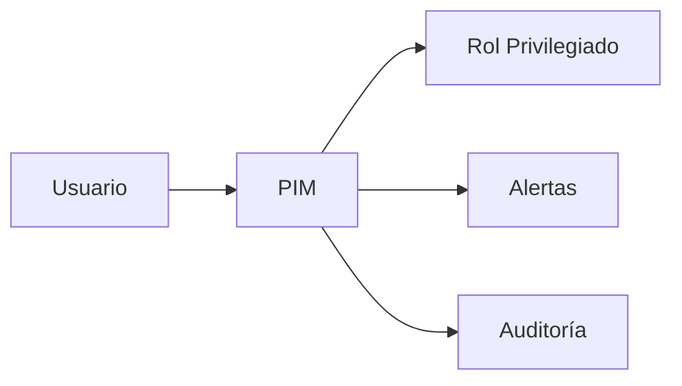

# Azure AD PIM: Just-In-Time y alertas avanzadas

## Resumen
Cómo usar Privileged Identity Management (PIM) en Azure AD para acceso JIT y alertas de seguridad. Post directo para admins y arquitectos cloud.

## ¿Qué es PIM JIT?

- Acceso Just-In-Time (JIT) a roles privilegiados
- Alertas por uso sospechoso
- Auditoría y compliance

## Arquitectura / Funcionamiento


## Configuración rápida

1. Activar PIM:
```bash
az ad pim role assignment list
```

2. Configurar alertas:
```bash
az ad pim alert list --role "Global Administrator"
```

3. Acceso JIT:
```bash
az ad pim role assignment activate --role "Global Administrator" --duration 1
```

## Auditoría y compliance

- Revisar logs:
```bash
az ad pim audit list
```

- Alertas automáticas:
```bash
az monitor metrics alert create --name alert-pim --resource-group $RG --scopes /subscriptions/$SUB_ID/resourceGroups/$RG/providers/Microsoft.Authorization/roleAssignments --condition "total SuspiciousPIMActivations > 0" --window-size 5m --action $ACTION_GROUP_ID
```

## Buenas prácticas

- Usar PIM para todos los roles críticos
- Configurar alertas y auditoría
- Revisar logs semanalmente
- Validar con MCP

## Referencias

- [Azure AD PIM](https://learn.microsoft.com/azure/active-directory/privileged-identity-management/pim-configure)
- [Just-In-Time Access](https://learn.microsoft.com/azure/active-directory/privileged-identity-management/pim-how-to-activate-role)
- [Alertas PIM](https://learn.microsoft.com/azure/active-directory/privileged-identity-management/pim-alerts)
