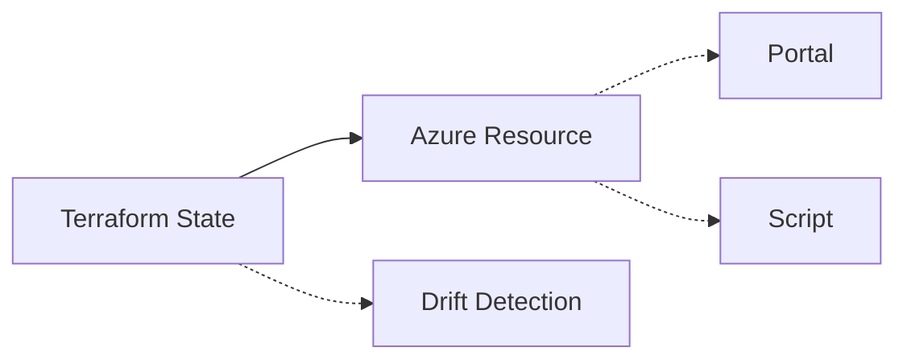

# Terraform en Azure: detección y corrección de drift

## Resumen
Cómo detectar y corregir drift en recursos Azure gestionados con Terraform. Post directo para admins y DevOps: comandos prácticos y ejemplos reproducibles.

## ¿Qué es el drift?
- Cambios fuera de Terraform (portal, scripts, etc)
- Recursos "fuera de sync" con el estado deseado
- Impacto: errores, inseguridad, compliance roto

## Arquitectura / Funcionamiento


## Detección de drift
1. Comprobar estado:
```bash
terraform plan
```
2. Usar azurerm_resource_drifts:
```hcl
resource "azurerm_resource_drifts" "example" {
  resource_id = azurerm_virtual_machine.example.id
}
```
3. Validar con Azure Policy:
```bash
az policy state list --resource-group $RG --policy-assignment $POLICY
```

## Corrección de drift
1. Aplicar cambios:
```bash
terraform apply
```
2. Forzar recreación:
```bash
terraform taint azurerm_virtual_machine.example
terraform apply
```
3. Reimportar recursos:
```bash
terraform import azurerm_virtual_machine.example /subscriptions/xxx/resourceGroups/xxx/providers/Microsoft.Compute/virtualMachines/xxx
```

## Buenas prácticas
- Auditar drift semanalmente
- Usar Policy para detectar cambios manuales
- Documentar excepciones
- Validar con MCP y Terraform Registry

## Referencias
- [Terraform Drift Detection](https://learn.microsoft.com/en-us/azure/developer/terraform/overview)
- [Terraform Registry azurerm](https://registry.terraform.io/providers/hashicorp/azurerm/latest/docs)
- [Azure Policy](https://learn.microsoft.com/en-us/azure/governance/policy/overview)
