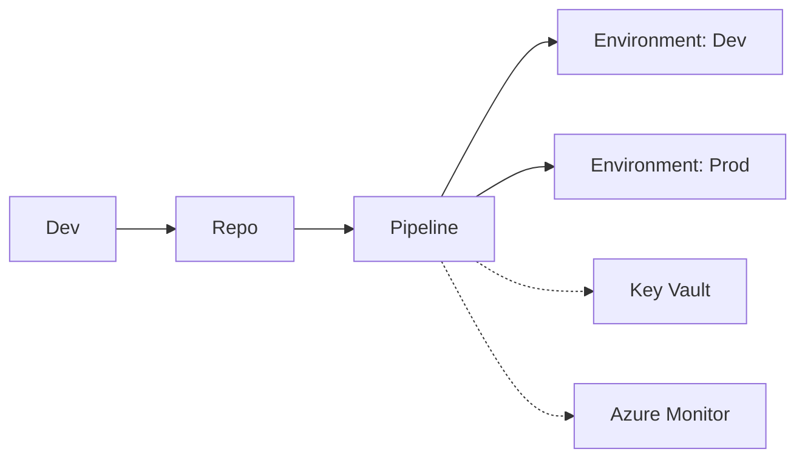

# Azure DevOps Pipelines: environments, approvals y seguridad de secretos

## Resumen
Azure DevOps Pipelines permite CI/CD seguro con environments, approvals y gestión avanzada de secretos. Este post va directo: cómo definir environments, configurar approvals, proteger secretos y auditar despliegues.

## ¿Qué es Pipelines avanzado?
- Environments para dev, test, prod
- Approvals y checks antes de despliegue
- Secure secrets (Key Vault, variable groups)
- Auditoría y compliance
- Integración con Azure Monitor

## Arquitectura / Cómo funciona


## Definir environments y approvals
1. Crear environment:
```bash
# Portal: Pipelines > Environments > New environment
# Ejemplo: "prod-env"
```
2. Configurar approval:
```yaml
environments:
  - name: prod-env
    resourceType: VirtualMachine
    approval:
      steps:
        - script: echo "Aprobado por admin"
```
3. Checks avanzados:
- Deployment gates (Azure Monitor, REST API, Query Work Item)

## Seguridad de secretos
- Usar Azure Key Vault:
```yaml
variables:
- group: kv-secrets
steps:
- task: AzureKeyVault@2
  inputs:
    azureSubscription: 'MySub'
    KeyVaultName: 'kv-prod'
    SecretsFilter: 'DbPassword,ApiKey'
    RunAsPreJob: true
```
- Variable groups (portal):
```bash
# Pipelines > Library > Variable groups > Link secrets
```
- Secure files (certificados, pfx):
```bash
# Pipelines > Library > Secure files
```

## Auditoría y compliance
- Auditar deployments:
```bash
az pipelines runs list --pipeline-name "prod-pipeline"
```
- Monitorizar cambios:
```bash
az monitor activity-log list --resource-group $RESOURCE_GROUP
```
- Alertas por cambios no aprobados:
```bash
az monitor metrics alert create --name alert-unapproved --resource-group $RESOURCE_GROUP --scopes /subscriptions/$SUB_ID/resourceGroups/$RESOURCE_GROUP/providers/Microsoft.DevOps/pipelines/prod-pipeline --condition "total UnapprovedDeployments > 0" --window-size 5m --action $ACTION_GROUP_ID
```

## Buenas prácticas
- Usar environments y approvals en todos los despliegues a prod
- Proteger secretos en Key Vault o variable groups
- Auditar deployments y cambios semanalmente
- Integrar alertas con Monitor y Sentinel
- Usar secure files para certificados

## Costes
- Azure DevOps: gratis hasta 1,800 min/mes
- Key Vault: ~$0.03/secret/mes
- Monitor: ~$2.30/GB

## Referencias
- [Azure DevOps Environments](https://learn.microsoft.com/azure/devops/pipelines/process/environments)
- [Approvals and Checks](https://learn.microsoft.com/azure/devops/pipelines/process/approvals)
- [Key Vault Integration](https://learn.microsoft.com/azure/devops/pipelines/library/variable-groups)
- [Audit and Compliance](https://learn.microsoft.com/azure/devops/organizations/audit/audit-log)
