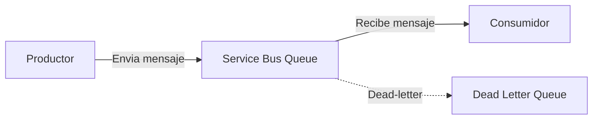

## Resumen

**Azure Service Bus** es el servicio de mensajería empresarial de Azure. Permite desacoplar aplicaciones y servicios mediante colas y topics, ideal para arquitecturas distribuidas y microservicios. Este post va directo a admins y DevOps que necesitan integrar sistemas de forma fiable y segura.

## ¿Qué es Azure Service Bus?
Azure Service Bus es un servicio PaaS de mensajería que ofrece:
- Colas (Queues) para comunicación punto a punto
- Topics y subscriptions para pub/sub
- Entrega garantizada y ordenada
- Soporte para mensajes transaccionales y sesiones
- Integración con RBAC y Managed Identities

## Arquitectura / Cómo funciona

- El productor envía mensajes a la cola
- El consumidor los procesa de forma asíncrona
- Mensajes fallidos van a la Dead Letter Queue

## Uso práctico: crear y usar una cola

### 1. Crear un Service Bus Namespace y una cola
```bash
# Variables
RESOURCE_GROUP="my-rg"
LOCATION="westeurope"
SB_NAMESPACE="my-sb-namespace"
QUEUE="myqueue"

# Crear namespace
az servicebus namespace create \
  --resource-group $RESOURCE_GROUP \
  --name $SB_NAMESPACE \
  --location $LOCATION

# Crear cola
az servicebus queue create \
  --resource-group $RESOURCE_GROUP \
  --namespace-name $SB_NAMESPACE \
  --name $QUEUE
```


### 2. Enviar y recibir mensajes (Python, passwordless recomendado)
```python
import asyncio
from azure.servicebus.aio import ServiceBusClient
from azure.servicebus import ServiceBusMessage
from azure.identity.aio import DefaultAzureCredential

FULLY_QUALIFIED_NAMESPACE = "<namespace>.servicebus.windows.net"
QUEUE_NAME = "myqueue"

async def send_message():
  credential = DefaultAzureCredential()
  async with ServiceBusClient(FULLY_QUALIFIED_NAMESPACE, credential) as client:
    sender = client.get_queue_sender(QUEUE_NAME)
    async with sender:
      msg = ServiceBusMessage("Hola Azure Service Bus!")
      await sender.send_messages(msg)
    await credential.close()

async def receive_message():
  credential = DefaultAzureCredential()
  async with ServiceBusClient(FULLY_QUALIFIED_NAMESPACE, credential) as client:
    receiver = client.get_queue_receiver(QUEUE_NAME)
    async with receiver:
      async for msg in receiver:
        print("Mensaje recibido:", str(msg))
        await receiver.complete_message(msg)
    await credential.close()

# Ejecutar
asyncio.run(send_message())
asyncio.run(receive_message())
```

Más detalles y ejemplos oficiales:
- [Quickstart: Python passwordless](https://learn.microsoft.com/en-us/azure/service-bus-messaging/service-bus-python-how-to-use-queues#authenticate-the-app-to-azure)
- [Service Bus security baseline](https://learn.microsoft.com/en-us/security/benchmark/azure/baselines/service-bus-security-baseline)
- [Dead-letter queues](https://learn.microsoft.com/en-us/azure/service-bus-messaging/service-bus-dead-letter-queues)

## Buenas prácticas / Seguridad
- Usa Managed Identities en vez de connection strings
- Activa el cifrado con claves gestionadas por el cliente (CMK) si es necesario
- Configura reglas de red y firewall
- Usa colas de dead-letter para mensajes no procesables
- Monitoriza con Azure Monitor y alertas

## Referencias
- [Documentación oficial Azure Service Bus](https://learn.microsoft.com/es-es/azure/service-bus-messaging/service-bus-messaging-overview)
- [SDK Python Azure Service Bus](https://learn.microsoft.com/es-es/python/api/overview/azure/servicebus)
