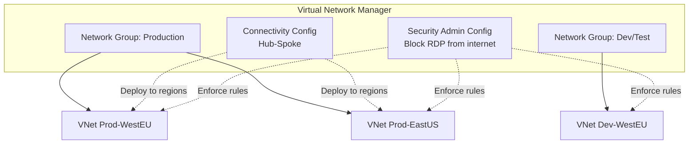

# Azure Virtual Network Manager: Gestión centralizada de redes

## Resumen

Voy al grano: Azure Virtual Network Manager (AVNM) centraliza la gestión de conectividad y seguridad de cientos o miles de VNets desde un solo panel. Creas topologías hub-spoke o mesh con clicks, defines security admin rules que se evalúan **antes** que los NSGs, y despliegas cambios por regiones de forma controlada. Sin scripts custom, sin gestionar peerings manualmente.

<!-- more -->

## ¿Qué es Azure Virtual Network Manager?

AVNM es un servicio de **gestión de red centralizada** que opera sobre un scope definido (subscriptions o management groups). Permite:

- **Connectivity configurations**: Hub-spoke, mesh, o hybrid topologies
- **Security admin rules**: Reglas globales evaluadas antes que NSGs
- **Network groups**: Agrupación lógica de VNets (manual o con Azure Policy)
- **Deployment por regiones**: Roll out controlado de cambios

**Conceptos clave:**



**Vs. gestión manual:**

| Manual (VNet peerings) | AVNM |
|-----------------------|------|
| 1 peering por cada conexión | 1 config para N VNets |
| NSGs distribuidos | Security admin rules centralizadas |
| Scripts PowerShell/Terraform | Portal + CLI + IaC |
| Sin rollback | Deployment controlado por regiones |

## Arquitectura y scope

```bash
# Crear AVNM con scope de Management Group
RESOURCE_GROUP="rg-network-manager"
LOCATION="westeurope"
AVNM_NAME="avnm-global"
MG_ID="/providers/Microsoft.Management/managementGroups/contoso"
SUBSCRIPTION_ID=$(az account show --query id -o tsv)

# Crear resource group
az group create --name $RESOURCE_GROUP --location $LOCATION

# Crear Virtual Network Manager
az network manager create \
  --name $AVNM_NAME \
  --resource-group $RESOURCE_GROUP \
  --location $LOCATION \
  --scope-accesses "Connectivity" "SecurityAdmin" \
  --network-manager-scopes managementGroups="$MG_ID"

# Alternativamente, scope sobre subscriptions específicas
az network manager create \
  --name $AVNM_NAME \
  --resource-group $RESOURCE_GROUP \
  --location $LOCATION \
  --scope-accesses "Connectivity" "SecurityAdmin" \
  --network-manager-scopes subscriptions="/subscriptions/$SUBSCRIPTION_ID"
```

**Scope types:**
- **Management Group**: Aplica a todas las subs bajo el MG (recomendado empresas)
- **Subscription list**: Lista explícita de subscriptions
- **Cross-tenant**: Con Azure Lighthouse para MSPs

**Scope accesses:**
- `Connectivity`: Hub-spoke, mesh topologies
- `SecurityAdmin`: Security admin rules (evaluadas antes NSGs)
- `Routing`: User-defined routes (en preview)

## Network Groups: Agrupación lógica

```bash
# Crear Network Group estático (manual)
az network manager group create \
  --name "ng-production" \
  --network-manager-name $AVNM_NAME \
  --resource-group $RESOURCE_GROUP \
  --description "Production VNets in all regions"

# Añadir VNets manualmente al grupo
VNET_ID_1="/subscriptions/$SUBSCRIPTION_ID/resourceGroups/rg-prod-westeu/providers/Microsoft.Network/virtualNetworks/vnet-prod-westeu"
VNET_ID_2="/subscriptions/$SUBSCRIPTION_ID/resourceGroups/rg-prod-eastus/providers/Microsoft.Network/virtualNetworks/vnet-prod-eastus"

az network manager group static-member create \
  --name "vnet-prod-westeu" \
  --network-group "ng-production" \
  --network-manager $AVNM_NAME \
  --resource-group $RESOURCE_GROUP \
  --resource-id "$VNET_ID_1"

az network manager group static-member create \
  --name "vnet-prod-eastus" \
  --network-group "ng-production" \
  --network-manager $AVNM_NAME \
  --resource-group $RESOURCE_GROUP \
  --resource-id "$VNET_ID_2"
```

**Network Group dinámico (Azure Policy):**
```json
{
  "networkGroupId": "/subscriptions/.../networkGroups/ng-production",
  "conditionalMembership": {
    "policyDefinitionId": "/providers/Microsoft.Authorization/policyDefinitions/...",
    "condition": "[contains(resourceGroup().tags['Environment'], 'Production')]"
  }
}
```

**Ventajas Policy-based:**
- Auto-inclusión de VNets con tag `Environment=Production`
- No necesitas actualizar membresía manualmente
- Compliance auditable con Azure Policy

## Topología Hub-Spoke con direct connectivity

```bash
# Crear Hub VNet (si no existe)
az network vnet create \
  --name vnet-hub-westeu \
  --resource-group rg-hub \
  --location westeurope \
  --address-prefix 10.0.0.0/16 \
  --subnet-name GatewaySubnet \
  --subnet-prefix 10.0.1.0/24

HUB_VNET_ID=$(az network vnet show --name vnet-hub-westeu --resource-group rg-hub --query id -o tsv)

# Crear Network Group para spokes
az network manager group create \
  --name "ng-spokes-prod" \
  --network-manager-name $AVNM_NAME \
  --resource-group $RESOURCE_GROUP \
  --description "Production spoke VNets"

# Crear connectivity configuration (Hub-Spoke)
az network manager connect-config create \
  --configuration-name "config-hub-spoke-prod" \
  --description "Hub-spoke with direct spoke connectivity" \
  --applies-to-groups "[{
    \"networkGroupId\": \"/subscriptions/$SUBSCRIPTION_ID/resourceGroups/$RESOURCE_GROUP/providers/Microsoft.Network/networkManagers/$AVNM_NAME/networkGroups/ng-spokes-prod\",
    \"groupConnectivity\": \"DirectlyConnected\",
    \"isGlobal\": true,
    \"useHubGateway\": \"True\"
  }]" \
  --connectivity-topology "HubAndSpoke" \
  --hubs "[{\"resourceId\": \"$HUB_VNET_ID\", \"resourceType\": \"Microsoft.Network/virtualNetworks\"}]" \
  --delete-existing-peering true \
  --is-global true \
  --network-manager-name $AVNM_NAME \
  --resource-group $RESOURCE_GROUP
```

**Parámetros clave:**

| Parámetro | Descripción |
|-----------|-------------|
| `groupConnectivity: DirectlyConnected` | Spokes pueden hablar entre sí (mesh dentro del grupo) |
| `isGlobal: true` | Cross-region connectivity |
| `useHubGateway: True` | Spokes usan VPN/ExpressRoute gateway del hub |
| `deleteExistingPeering: true` | Elimina peerings manuales al desplegar |

**Routing resultante:**
```
Spoke A (West EU) → Hub → Spoke B (East US)  [SIN direct connectivity]
Spoke A (West EU) ↔ Spoke B (West EU)        [CON direct connectivity - same group]
```

## Topología Mesh global

```bash
# Crear Mesh configuration (todos hablan con todos)
az network manager connect-config create \
  --configuration-name "config-mesh-global" \
  --description "Global mesh for all production VNets" \
  --applies-to-groups "[{
    \"networkGroupId\": \"/subscriptions/$SUBSCRIPTION_ID/resourceGroups/$RESOURCE_GROUP/providers/Microsoft.Network/networkManagers/$AVNM_NAME/networkGroups/ng-production\",
    \"groupConnectivity\": \"None\"
  }]" \
  --connectivity-topology "Mesh" \
  --is-global true \
  --network-manager-name $AVNM_NAME \
  --resource-group $RESOURCE_GROUP
```

**Mesh vs. Hub-Spoke:**

| Mesh | Hub-Spoke |
|------|-----------|
| N×(N-1)/2 conexiones lógicas | N conexiones (N spokes → 1 hub) |
| Latencia mínima entre spokes | Tráfico pasa por hub |
| No necesita hub VNet | Requiere hub VNet con gateway |
| Ideal: <50 VNets misma región | Ideal: >50 VNets multi-región |

**Regional vs. Global Mesh:**
- **Regional** (`isGlobal: false`): Solo VNets en misma región conectadas
- **Global** (`isGlobal: true`): Cross-region, mayor latencia pero full connectivity

## Security Admin Rules

```bash
# Crear Security Admin Configuration
az network manager security-admin-config create \
  --configuration-name "config-security-baseline" \
  --network-manager-name $AVNM_NAME \
  --resource-group $RESOURCE_GROUP \
  --description "Baseline security rules for all VNets"

# Crear Rule Collection
az network manager security-admin-config rule-collection create \
  --configuration-name "config-security-baseline" \
  --name "rc-deny-internet-inbound" \
  --network-manager-name $AVNM_NAME \
  --resource-group $RESOURCE_GROUP \
  --applies-to-groups "[{
    \"networkGroupId\": \"/subscriptions/$SUBSCRIPTION_ID/resourceGroups/$RESOURCE_GROUP/providers/Microsoft.Network/networkManagers/$AVNM_NAME/networkGroups/ng-production\"
  }]"

# Regla: Denegar RDP desde internet (priority 100 - alta)
az network manager security-admin-config rule-collection rule create \
  --configuration-name "config-security-baseline" \
  --rule-collection-name "rc-deny-internet-inbound" \
  --rule-name "deny-rdp-from-internet" \
  --network-manager-name $AVNM_NAME \
  --resource-group $RESOURCE_GROUP \
  --kind "Custom" \
  --protocol "Tcp" \
  --direction "Inbound" \
  --source-address-prefix "*" \
  --source-port-ranges "*" \
  --destination-address-prefix "*" \
  --destination-port-ranges "3389" \
  --access "Deny" \
  --priority 100

# Regla: Forzar permitir Azure Monitor Agent (priority 50 - más alta)
az network manager security-admin-config rule-collection rule create \
  --configuration-name "config-security-baseline" \
  --rule-collection-name "rc-deny-internet-inbound" \
  --rule-name "allow-azure-monitor-agent" \
  --network-manager-name $AVNM_NAME \
  --resource-group $RESOURCE_GROUP \
  --kind "Custom" \
  --protocol "Tcp" \
  --direction "Outbound" \
  --source-address-prefix "VirtualNetwork" \
  --source-port-ranges "*" \
  --destination-address-prefix "AzureMonitor" \
  --destination-port-ranges "443" \
  --access "AlwaysAllow" \
  --priority 50
```

**Tipos de Security Admin Rules:**

| Access Type | Comportamiento |
|-------------|----------------|
| `Allow` | Permite tráfico, pero NSG puede denegarlo |
| `Deny` | Deniega tráfico, NSG no puede permitirlo |
| `AlwaysAllow` | **Fuerza permiso** incluso si NSG lo deniega |

**Orden de evaluación:**
```
1. Security Admin Rules (priority 1-4096, menor = mayor prioridad)
   ↓
2. NSG Rules (evaluadas SI admin rules permiten)
   ↓
3. Default rules (AllowVNetInbound, DenyAllInbound, etc.)
```

**Caso de uso AlwaysAllow:**
```bash
# Security scanner debe acceder SIEMPRE, incluso si NSG lo bloquea
az network manager security-admin-config rule-collection rule create \
  ... \
  --source-address-prefix "20.20.20.20" \  # IP del scanner
  --destination-address-prefix "*" \
  --destination-port-ranges "443" \
  --access "AlwaysAllow" \
  --priority 10
```

## Deployment de configuraciones

```bash
# Deploy connectivity configuration a regiones específicas
CONFIG_ID="/subscriptions/$SUBSCRIPTION_ID/resourceGroups/$RESOURCE_GROUP/providers/Microsoft.Network/networkManagers/$AVNM_NAME/connectivityConfigurations/config-hub-spoke-prod"

az network manager post-commit \
  --network-manager-name $AVNM_NAME \
  --resource-group $RESOURCE_GROUP \
  --commit-type "Connectivity" \
  --configuration-ids "$CONFIG_ID" \
  --target-locations "westeurope" "eastus"

# Deploy security admin configuration
SECURITY_CONFIG_ID="/subscriptions/$SUBSCRIPTION_ID/resourceGroups/$RESOURCE_GROUP/providers/Microsoft.Network/networkManagers/$AVNM_NAME/securityAdminConfigurations/config-security-baseline"

az network manager post-commit \
  --network-manager-name $AVNM_NAME \
  --resource-group $RESOURCE_GROUP \
  --commit-type "SecurityAdmin" \
  --configuration-ids "$SECURITY_CONFIG_ID" \
  --target-locations "westeurope" "eastus" "northeurope"
```

**Deployment considerations:**
- **NO toma efecto** hasta que ejecutas `post-commit`
- **Regional deployment**: Solo afecta VNets en `target-locations`
- **Rollback**: Puedes revertir deployment desde portal
- **Multiple configs**: Despliegas conectividad y seguridad independientemente

## Verificar configuraciones aplicadas

```bash
# Ver configuraciones en una VNet específica
VNET_NAME="vnet-prod-westeu"
VNET_RG="rg-prod-westeu"

# Connectivity applied
az network vnet show \
  --name $VNET_NAME \
  --resource-group $VNET_RG \
  --query "{name:name, networkManagerConnections:networkManagerConnections}" -o yaml

# Desde Portal:
# VNet → Network Manager → Connectivity configurations
# VNet → Network Manager → Security admin configurations
```

**Effective routes (ver peerings creados):**
```bash
# En una VM de la VNet
NIC_ID=$(az vm show --name myVM --resource-group $VNET_RG --query "networkProfile.networkInterfaces[0].id" -o tsv)

az network nic show-effective-route-table \
  --ids $NIC_ID \
  --query "value[?nextHopType=='ConnectedGroup' || nextHopType=='VNetPeering']" -o table
```

**NextHopType:**
- `ConnectedGroup`: Mesh o direct connectivity entre spokes
- `VNetPeering`: Hub-spoke peering
- `VirtualNetworkGateway`: Tráfico via VPN/ExpressRoute

## Buenas prácticas

**Scope design:**
- **Root MG scope** para security admin rules (applies to all)
- **Intermediate MG** para connectivity (por landing zone)
- **Evita múltiples AVNMs** en mismo scope (conflictos)

**Network Groups:**
- **Policy-based** para auto-scaling (tag-based membership)
- **Static** para casos específicos (hub VNet, shared services)
- **Máximo 50 network groups** por AVNM (Standard tier)

**Security Admin Rules:**
- **Priority 1-100**: Reglas críticas (deny RDP, allow scanners)
- **Priority 101-500**: Reglas de compliance
- **Priority 501-4096**: Reglas específicas por team
- **Always document** por qué usas AlwaysAllow

**Deployment strategy:**
```bash
# 1. Despliega a región test
az network manager post-commit ... --target-locations "westeurope"

# 2. Valida (1 semana)
# 3. Despliega a prod regions progresivamente
az network manager post-commit ... --target-locations "eastus"  # Week 1
az network manager post-commit ... --target-locations "northeurope"  # Week 2
```

## Monitorización y troubleshooting

```bash
# Ver estado de deployments
az network manager list-deployment-status \
  --network-manager-name $AVNM_NAME \
  --resource-group $RESOURCE_GROUP \
  --regions "westeurope" "eastus"

# Diagnostics en VNet
az network watcher show-topology \
  --resource-group $VNET_RG \
  --query "resources[?type=='Microsoft.Network/virtualNetworks'].{name:name, peerings:properties.virtualNetworkPeerings}"
```

**Azure Monitor queries:**
```kusto
// Peerings creados por AVNM
AzureActivity
| where OperationNameValue contains "MICROSOFT.NETWORK/VIRTUALNETWORKS/VIRTUALNETWORKPEERINGS/WRITE"
| where Caller contains "NetworkManager"
| project TimeGenerated, ResourceId, Caller, ActivityStatus

// Security admin rules applied
AzureDiagnostics
| where Category == "NetworkSecurityGroupRuleCounter"
| where RuleName startswith "SecurityAdmin"
| summarize count() by RuleName, Direction, Action
```

**Troubleshooting común:**

| Error | Causa | Solución |
|-------|-------|----------|
| "Configuration not applied" | No deployed to target region | Ejecutar `post-commit` |
| "Peering conflict" | Peering manual existe | Enable `deleteExistingPeering` |
| "Security rule not enforced" | NSG priority más alta | Admin rules evalúan ANTES de NSG |
| "Cross-tenant VNet not visible" | Falta Azure Lighthouse | Configure Lighthouse delegation |

## Costos

**Pricing model:**
- **Charged por VNet con config aplicada** (no por AVNM instance)
- **€4.50/VNet/mes** (aprox.) con connectivity config deployed
- **€9/VNet/mes** (aprox.) con connectivity + security admin
- **Peering traffic**: Standard VNet peering charges apply

**Ejemplo cálculo:**
```
100 VNets con hub-spoke + security admin:
- AVNM: 100 VNets × €9/mes = €900/mes
- Peering: 1 TB cross-region × €0.035/GB = €35/mes
- Total: €935/mes
```

**Vs. manual:**
```
Manual management:
- 100 VNets × 99 peerings each = 9,900 peering configs
- Tiempo: ~2 FTE × €5K/mes = €10K/mes
- Automation scripts: €5K setup + €1K/mes maintenance
- Total: €11K/mes + mayor error rate
```

**Free tier:**
- **No existe** free tier para AVNM
- **Alternativa dev/test**: Usa standalone VNet peerings (<10 VNets)

## Referencias

- [AVNM Overview](https://learn.microsoft.com/en-us/azure/virtual-network-manager/overview)
- [Connectivity configurations](https://learn.microsoft.com/en-us/azure/virtual-network-manager/concept-connectivity-configuration)
- [Security admin rules](https://learn.microsoft.com/en-us/azure/virtual-network-manager/concept-security-admins)
- [Network groups y Azure Policy](https://learn.microsoft.com/en-us/azure/virtual-network-manager/concept-network-groups)
- [AVNM en Azure Landing Zones](https://learn.microsoft.com/en-us/azure/cloud-adoption-framework/ready/azure-best-practices/azure-virtual-network-manager)
- [FAQ](https://learn.microsoft.com/en-us/azure/virtual-network-manager/faq)
