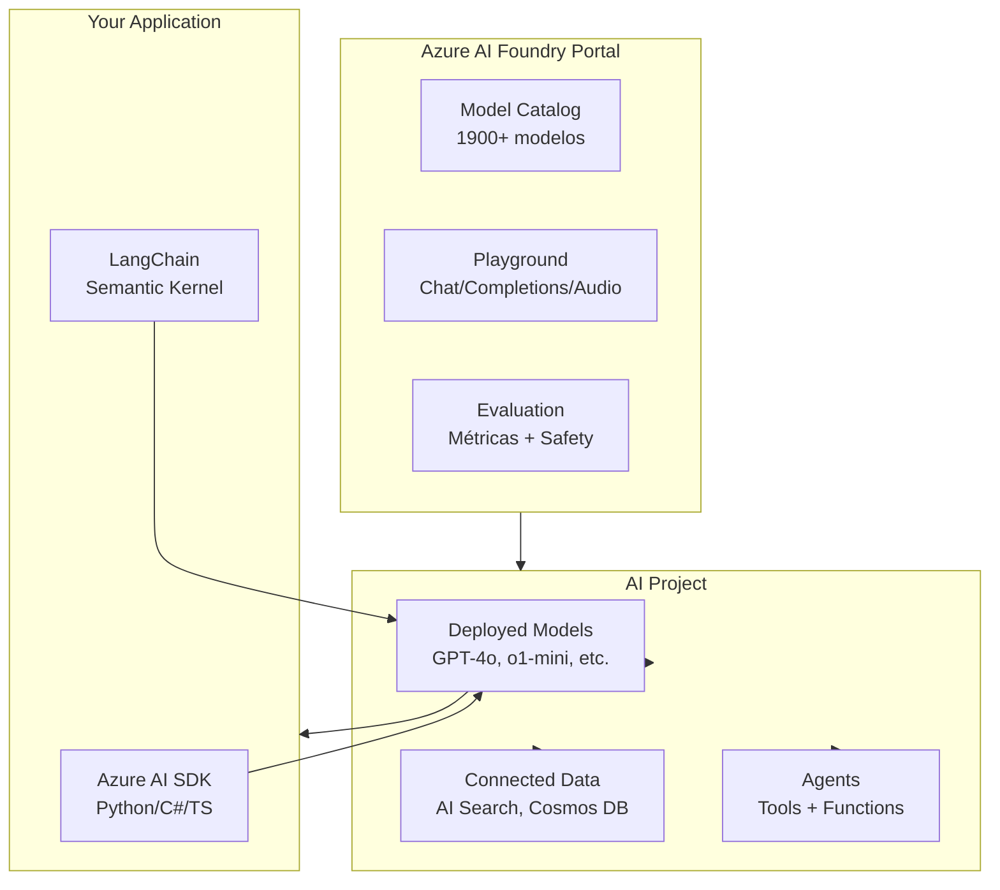

# Azure AI Foundry: tu hub unificado para IA generativa en Azure

## Resumen

**Azure AI Foundry** (antes Azure AI Studio) es la plataforma unificada de Microsoft para desarrollar, desplegar y gestionar aplicaciones de IA generativa. Con acceso a **1900+ modelos** (GPT-4o, o1, DeepSeek, Llama...), un entorno colaborativo tipo MLOps, y herramientas para RAG, evaluación y monitorización, todo en un portal integrado.

Si trabajas con Azure OpenAI, LangChain, o quieres construir copilots/agents, este es tu punto de partida.

<!-- more -->

## ¿Qué es Azure AI Foundry?

Azure AI Foundry es el **hub centralizado** para IA en Azure. Piensa en ello como el "Azure DevOps de la IA": gestiona proyectos, equipos, recursos, modelos y despliegues en un entorno empresarial seguro.

**Funciones principales:**

- **Catálogo de modelos**: 1900+ modelos de Microsoft, OpenAI, Meta, Hugging Face, DeepSeek
- **Despliegue flexible**: Serverless (MaaS), Hosted, BYOM (Bring Your Own Model)
- **RAG integrado**: Conecta a Azure AI Search, Cosmos DB, tus datos privados
- **Evaluación automática**: Métricas de calidad, seguridad, costes
- **Monitorización**: Consumo de tokens, latencia, safety issues en producción
- **Gestión de prompts**: Versionado, plantillas, ingeniería de prompts
- **Integración con código**: SDKs Python/C#/Java/TypeScript, compatible con LangChain/Semantic Kernel

**Diferencia clave con Azure Machine Learning:**

- **Azure ML**: Entrenamiento de modelos custom, MLOps clásico, AutoML
- **Azure AI Foundry**: Modelos pre-entrenados, IA generativa, copilots, agents

Puedes usar ambos en paralelo según tu caso.

---

## Arquitectura básica



**Flujo típico:**

1. **Crear proyecto** en AI Foundry (hub compartido o standalone)
2. **Desplegar modelos** desde el catálogo (GPT-4o, embeddings, etc.)
3. **Conectar datos** (Azure AI Search para RAG)
4. **Desarrollar** con SDK o playground
5. **Evaluar** calidad/seguridad con métricas automáticas
6. **Desplegar** a producción con monitorización

---

## Despliegue rápido: GPT-4o en 5 minutos

### Paso 1: Crear proyecto desde el portal

```bash
# Autenticarse en Azure
az login

# Variables
RESOURCE_GROUP="rg-ai-foundry"
LOCATION="eastus2"
PROJECT_NAME="my-ai-project"

# Crear proyecto (también desde portal web: https://ai.azure.com)
# Opción 1: Standalone project (recomendado para empezar)
# Opción 2: Hub-based project (para equipos grandes)
```

**Desde el portal web** (más rápido):

1. Ir a [https://ai.azure.com](https://ai.azure.com)
2. **Start building** → Seleccionar **gpt-4o**
3. **Use this model** → Crear proyecto automáticamente
4. Deploy → **Open in playground**

### Paso 2: Desplegar GPT-4o desde catálogo

Desde **Model catalog** en el portal:

1. Buscar `gpt-4o` o `gpt-4o-mini`
2. **Use this model** → **Deploy**
3. Configurar:
   - **Deployment type**: Standard (pay-as-you-go) o Provisioned (reservado)
   - **Tokens per minute**: Ajustar según cuota
   - **Content filter**: Default (Responsible AI activado)

!!! warning "Disponibilidad regional"
    GPT-4o está disponible en: East US, East US 2, North Central US, Sweden Central, West Europe, Japan East, Australia East. Verifica [aquí](https://learn.microsoft.com/azure/ai-foundry/openai/concepts/models#model-summary-table-and-region-availability).

### Paso 3: Consumir desde Python

```bash
# Instalar dependencias
pip install openai azure-ai-projects azure-identity
```

```python
import os
from azure.ai.projects import AIProjectClient
from azure.identity import DefaultAzureCredential

# Autenticación automática (usa tu sesión az login)
credential = DefaultAzureCredential()

# Conectar al proyecto (endpoint desde portal: Overview → Project endpoint)
project = AIProjectClient(
    endpoint="https://<tu-recurso>.services.ai.azure.com/api/projects/<project-id>",
    credential=credential,
)

# Obtener cliente OpenAI
client = project.get_openai_client(api_version="2024-10-21")

# Chat completion
response = client.chat.completions.create(
    model="gpt-4o",  # Nombre del deployment
    messages=[
        {"role": "system", "content": "Eres un asistente técnico de Azure."},
        {"role": "user", "content": "Explica qué es Azure Container Apps en 50 palabras."}
    ],
    temperature=0.7,
    max_tokens=150
)

print(response.choices[0].message.content)
```

**Variables de entorno recomendadas:**

```bash
export PROJECT_ENDPOINT="https://<tu-recurso>.services.ai.azure.com/api/projects/<project-id>"
export MODEL_DEPLOYMENT_NAME="gpt-4o"
```

---

## RAG: conectar tus datos con Azure AI Search

**¿Qué es RAG?** Retrieval Augmented Generation: el modelo consulta tus documentos antes de responder, evitando alucinaciones.

### Paso 1: Desplegar embedding model

Necesitas un modelo para vectorizar consultas:

1. Desde **Model catalog** → Buscar `text-embedding-ada-002`
2. Deploy (mismo proceso que GPT-4o)

### Paso 2: Configurar Azure AI Search

```bash
# Crear servicio de búsqueda
az search service create \
  --name my-search-service \
  --resource-group $RESOURCE_GROUP \
  --location $LOCATION \
  --sku standard

# Obtener API key
az search admin-key show \
  --service-name my-search-service \
  --resource-group $RESOURCE_GROUP
```

### Paso 3: Indexar documentos (ejemplo con SDK)

```python
from azure.ai.projects import AIProjectClient
from azure.identity import DefaultAzureCredential

project = AIProjectClient(
    endpoint=os.environ["PROJECT_ENDPOINT"],
    credential=DefaultAzureCredential(),
)

# Conectar Azure AI Search desde el proyecto
# (Portal: Settings → Connections → Add connection → Azure AI Search)

# Crear índice vectorial con documentos
# Usar import wizard en portal o código:
# https://learn.microsoft.com/azure/ai-foundry/how-to/index-add
```

### Paso 4: Query con RAG

```python
# Una vez configurado AI Search en el proyecto
response = client.chat.completions.create(
    model="gpt-4o",
    messages=[
        {"role": "user", "content": "¿Qué dice la documentación sobre backups?"}
    ],
    extra_body={
        "data_sources": [{
            "type": "azure_search",
            "parameters": {
                "endpoint": "https://my-search-service.search.windows.net",
                "index_name": "docs-index",
                "authentication": {"type": "system_assigned_managed_identity"}
            }
        }]
    }
)
```

!!! tip "Wizard todo-en-uno"
    Desde el portal: **Import and vectorize data** wizard → sube PDFs/Word/URLs y genera todo automáticamente (índice + embeddings + conexión).

---

## Agents: LLMs con herramientas

Los **Agents** son modelos con capacidades extra: búsqueda web, ejecución de código, llamadas a funciones custom.

### Ejemplo: Agent con Code Interpreter

```python
from azure.ai.agents.models import CodeInterpreterTool

# Crear agent con herramienta de código
agent = project.agents.create_agent(
    model="gpt-4o",
    name="data-analyst-agent",
    instructions="Ayudas a analizar datos y generar gráficos. Usa Code Interpreter.",
    tools=[CodeInterpreterTool()]
)

# Crear thread (conversación persistente)
thread = project.agents.threads.create()

# Enviar mensaje
message = project.agents.messages.create(
    thread_id=thread.id,
    role="user",
    content="Grafica una línea con pendiente 4 e intercepción 9"
)

# Ejecutar agent
run = project.agents.runs.create_and_process(
    thread_id=thread.id,
    agent_id=agent.id
)

# Obtener respuesta (puede incluir imágenes generadas)
messages = project.agents.messages.list(thread_id=thread.id)
for msg in messages:
    print(f"{msg.role}: {msg.content}")

    # Descargar imágenes generadas
    for img in msg.image_contents:
        project.agents.files.save(
            file_id=img.image_file.file_id,
            file_name=f"{img.image_file.file_id}.png"
        )
```

### Herramientas disponibles

- **Code Interpreter**: Ejecuta Python, genera gráficos
- **File Search**: Busca en documentos subidos (PDFs, Word)
- **Function Calling**: Ejecuta funciones custom (API calls, DB queries)
- **Azure AI Search**: Búsqueda vectorial en datos empresariales
- **Azure Functions**: Ejecuta lógica serverless

---

## Modelos destacados en 2024-2025

| Modelo | Uso | Contexto | Novedad |
|--------|-----|----------|---------|
| **gpt-4o** | Chat, visión, audio | 128K tokens | Multimodal completo |
| **gpt-4o-mini** | Tareas ligeras | 128K tokens | Más barato que 4o |
| **o1-preview** | Razonamiento complejo | 128K tokens | Chain-of-thought interno |
| **o3-mini** | Razonamiento rápido | 128K tokens | Lanzado enero 2025 |
| **gpt-4o-audio-preview** | Audio real-time | 128K tokens | Voice + text simultáneos |
| **text-embedding-ada-002** | Embeddings | - | Para RAG/búsqueda |

**Modelos de razonamiento (o1/o3):**

- **No soportan** system messages, streaming, function calling aún
- **Sí soportan** visión, prompts largos, razonamiento multi-paso
- Ideal para: código complejo, matemáticas, análisis profundo

**Modelos de audio:**

- **gpt-4o-realtime-preview**: Conversaciones bidireccionales (WebRTC)
- **gpt-4o-audio-preview**: Completions con entrada/salida de voz
- Usa `/audio/transcriptions` o Realtime API

---

## Evaluación automática

Azure AI Foundry incluye métricas para evaluar respuestas:

```python
from azure.ai.evaluation import evaluate, GroundednessEvaluator

# Evaluar si las respuestas están basadas en contexto
groundedness = GroundednessEvaluator(model_config={
    "api_version": "2024-10-21",
    "azure_deployment": "gpt-4o"
})

results = evaluate(
    data="test_data.jsonl",  # Datos de prueba
    evaluators={
        "groundedness": groundedness
    }
)

print(results.metrics_summary)
```

**Métricas disponibles:**

- **Groundedness**: ¿La respuesta usa solo el contexto?
- **Relevance**: ¿Responde la pregunta?
- **Coherence**: ¿Es coherente la respuesta?
- **Fluency**: ¿Es natural el lenguaje?
- **Safety**: ¿Contiene contenido dañino?

Resultados exportables a Azure ML para tracking de experimentos.

---

## Seguridad y compliance

### Content Filters (Responsible AI)

Por defecto, todos los deployments tienen filtros activados:

- **Hate**: Bloquea lenguaje odioso
- **Sexual**: Bloquea contenido sexual explícito
- **Violence**: Bloquea violencia gráfica
- **Self-harm**: Bloquea contenido autolesivo

**Configuración custom:**

1. Portal → **Content filters**
2. Crear filtro custom (ajustar niveles: Low/Medium/High)
3. Asignar al deployment

!!! warning "Modificar filtros requiere aprobación"
    Para bajar niveles de filtrado (p.ej. uso médico), necesitas solicitar aprobación vía [formulario de Microsoft](https://aka.ms/oai/modifiedcontentfilter).

### Monitorización de uso

Dashboard automático en **Deployments → Monitoring**:

- Tokens consumidos por minuto/día
- Latencia P50/P95/P99
- Errores 429 (rate limit exceeded)
- Safety violations (bloqueos por filtros)

Exporta métricas a Azure Monitor/Log Analytics para alertas custom.

---

## Costes típicos

**GPT-4o (Standard deployment):**

- **Input**: $2.50 / 1M tokens
- **Output**: $10.00 / 1M tokens
- Ejemplo: 100K tokens input + 20K tokens output = $0.45

**GPT-4o-mini:**

- **Input**: $0.15 / 1M tokens
- **Output**: $0.60 / 1M tokens
- ~15x más barato que GPT-4o

**Embeddings (text-embedding-ada-002):**

- $0.10 / 1M tokens

**Provisioned Throughput Units (PTU):**

- Para workloads predecibles con alta demanda
- Reserva capacidad mensual (300/500/1000 PTU)
- Consultar [calculadora de precios](https://azure.microsoft.com/pricing/details/cognitive-services/openai-service/)

!!! tip "Optimización de costes"

    - Usa `gpt-4o-mini` para tareas simples (clasificación, resúmenes)
    - Activa **prompt caching** (reduce 50% costes en prompts repetidos)
    - Configura `max_tokens` para evitar respuestas largas innecesarias

---

## Buenas prácticas

### 1. Gestión de proyectos

- **Un proyecto por aplicación/equipo**: Aisla recursos y permisos
- **Usa hub-based projects** para equipos grandes (recursos compartidos)
- **Versiona tus prompts**: Guarda templates en el proyecto

### 2. Desarrollo seguro

```python
# Siempre usa managed identity en producción (no API keys)
from azure.identity import ManagedIdentityCredential

credential = ManagedIdentityCredential()
project = AIProjectClient(endpoint=endpoint, credential=credential)
```

### 3. Monitorización

- **Activa Application Insights**: Traza cada llamada al modelo
- **Configura alertas**: Rate limits, latencias >2s, errores 429
- **Logging estructurado**: Incluye `user_id`, `session_id` en metadatos

### 4. Evaluación continua

- **Crea test sets** con casos reales (gold standard)
- **Ejecuta evaluaciones en CI/CD** antes de desplegar
- **Monitoriza drift**: Calidad de respuestas en producción

### 5. Integración con DevOps

```yaml
# Azure DevOps pipeline example
- task: AzureCLI@2
  inputs:
    azureSubscription: 'my-subscription'
    scriptType: 'bash'
    scriptLocation: 'inlineScript'
    inlineScript: |
      # Deploy model via Azure CLI
      az ml online-deployment create \
        --resource-group $(resourceGroup) \
        --workspace-name $(projectName) \
        --file deployment.yml
```

---

## Casos de uso reales

### 1. Copilot interno empresarial

**Arquitectura:**

- GPT-4o + RAG con SharePoint/OneDrive
- Azure AI Search para documentos corporativos
- Filtros de contenido + auditoría completa

**Implementación:** 2-3 días con wizard de importación

### 2. Análisis de logs con agents

**Herramientas:**

- Code Interpreter para ejecutar queries KQL
- Function calling para consultar Log Analytics
- Generación de dashboards automáticos

**Prompt ejemplo:**

```
Analiza logs de los últimos 7 días en el workspace 'prod-logs'.
Encuentra errores HTTP 500, agrúpalos por servicio, y genera gráfico de tendencias.
```

### 3. Asistente de soporte técnico

**Componentes:**

- o1-mini para razonamiento (diagnóstico)
- File Search con knowledge base (runbooks)
- Function calling para ejecutar scripts de remediación

**Flujo:**

1. Usuario describe problema
2. Agent busca en runbooks
3. Agent propone solución paso a paso
4. (Opcional) Ejecuta script de fix vía Azure Function

---

## Diferencias con servicios similares

| Aspecto | Azure AI Foundry | Azure OpenAI Service | Azure ML |
|---------|------------------|---------------------|----------|
| **Foco** | IA generativa end-to-end | Solo API OpenAI | ML tradicional |
| **Modelos** | 1900+ (multi-vendor) | Solo OpenAI | Custom training |
| **Playground** | Integrado | Básico | No |
| **RAG** | Built-in + wizard | Manual | Manual |
| **Agents** | Nativo | No | No |
| **Evaluación** | Automática | Manual | MLOps completo |
| **Uso típico** | Copilots, chatbots | Integraciones API | Predicción, visión |

**¿Cuándo usar cada uno?**

- **AI Foundry**: Aplicaciones con LLMs (copilots, RAG, agents)
- **Azure OpenAI Service**: Solo API sin gestión de proyecto
- **Azure ML**: Entrenar modelos custom, no IA generativa

---

## Limitaciones conocidas

1. **o1/o3 models**: No soportan streaming ni function calling aún
2. **Realtime audio**: Solo disponible en East US 2 y Sweden Central
3. **Provisioned deployments**: Requieren compromiso mensual (no pay-as-you-go)
4. **Content filters**: No puedes desactivarlos completamente (política Microsoft)
5. **Quotas regionales**: GPT-4o limitado a 10K TPM en algunas regiones

**Workarounds comunes:**

- **Rate limits**: Usa global deployments (enruta automáticamente)
- **Regiones sin modelo X**: Crea multi-region deployment con failover
- **Costes altos**: Empieza con gpt-4o-mini, sube a 4o solo cuando necesites

---

## Migración desde Azure OpenAI Service

Si ya usas Azure OpenAI Service directamente:

**Cambios en código:**

```python
# Antes (Azure OpenAI Service directo)
from openai import AzureOpenAI
client = AzureOpenAI(
    azure_endpoint="https://myopenai.openai.azure.com",
    api_key="xxx"
)

# Ahora (Azure AI Foundry)
from azure.ai.projects import AIProjectClient
from azure.identity import DefaultAzureCredential

project = AIProjectClient(
    endpoint="https://myresource.services.ai.azure.com/api/projects/myproject",
    credential=DefaultAzureCredential()  # Sin API keys
)
client = project.get_openai_client(api_version="2024-10-21")
```

**Beneficios de migrar:**

- Gestión centralizada de modelos/datos/evaluaciones
- Agents y RAG sin implementación custom
- Métricas y monitorización automáticas
- Integración con Azure AI Search/Cosmos DB

---

## Próximos pasos

### Tutoriales oficiales

1. [Quickstart: Get started with Azure AI Foundry](https://learn.microsoft.com/azure/ai-foundry/quickstarts/get-started-code)
2. [Build a RAG app with the SDK](https://learn.microsoft.com/azure/ai-foundry/tutorials/copilot-sdk-create-resources)
3. [Create and use agents](https://learn.microsoft.com/azure/ai-foundry/agents/quickstart)

### Recursos útiles

- **Pricing calculator**: [https://azure.microsoft.com/pricing/details/cognitive-services/openai-service/](https://azure.microsoft.com/pricing/details/cognitive-services/openai-service/)
- **Model availability by region**: [https://learn.microsoft.com/azure/ai-foundry/openai/concepts/models](https://learn.microsoft.com/azure/ai-foundry/openai/concepts/models)
- **GitHub samples**: [https://github.com/Azure/azure-ai-foundry-samples](https://github.com/Azure/azure-ai-foundry-samples)
- **RAG code samples**: [https://github.com/Azure/azure-search-vector-samples](https://github.com/Azure/azure-search-vector-samples)

### Laboratorios prácticos

- [MS Learn: Build a RAG chatbot](https://learn.microsoft.com/training/modules/build-copilot-ai-studio/)
- [MS Learn: Evaluate generative AI apps](https://learn.microsoft.com/training/modules/evaluate-generative-ai-apps/)

---

## Referencias

- [Azure AI Foundry Documentation](https://learn.microsoft.com/azure/ai-foundry/)
- [What's new in Azure OpenAI](https://learn.microsoft.com/azure/ai-foundry/openai/whats-new)
- [Azure AI Foundry vs Azure ML](https://learn.microsoft.com/ai/ai-studio-experiences-overview)
- [Model catalog overview](https://learn.microsoft.com/azure/ai-foundry/foundry-models-overview)
- [Responsible AI with content filters](https://learn.microsoft.com/azure/ai-services/openai/concepts/content-filter)
