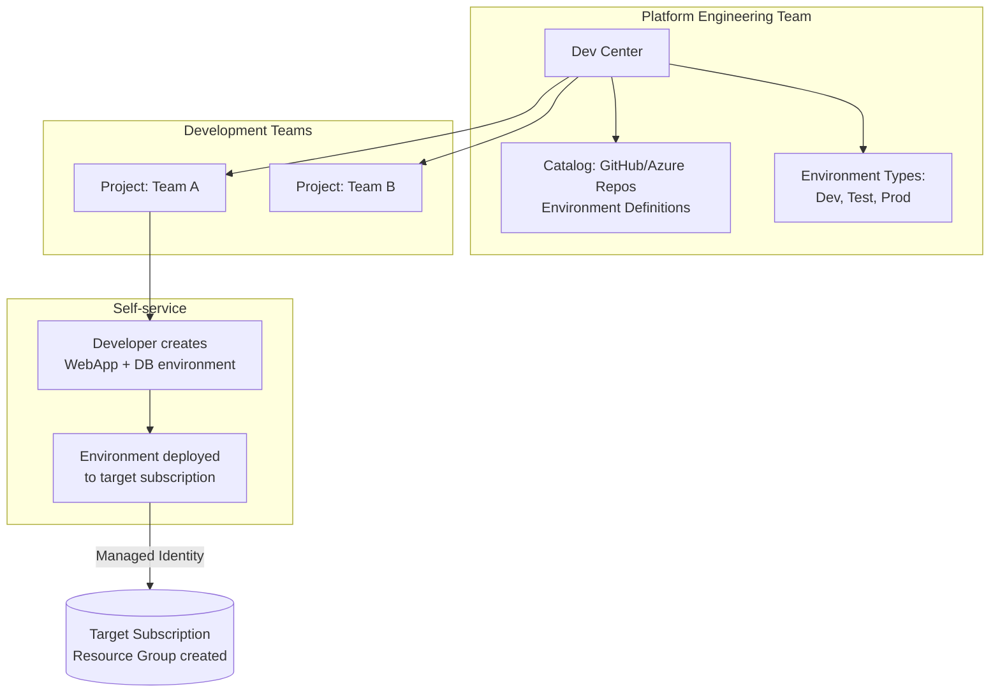

# Azure Deployment Environments: Self-service para desarrolladores

## Resumen

Azure Deployment Environments es el reemplazo de DevTest Labs, diseñado para que equipos de desarrollo creen entornos completos (App Service + Cosmos + Key Vault + Storage) desde un catálogo de plantillas IaC sin esperar a Platform Engineering. Dev Centers centralizan la gobernanza, Projects definen permisos, y developers despliegan con CLI/Portal. Zero acceso a subscriptions de producción.

<!-- more -->

## ¿Qué es Azure Deployment Environments?

Azure Deployment Environments (ADE) es una plataforma de **infraestructura self-service** que permite a developers crear entornos pre-aprobados desde plantillas IaC (Bicep, ARM, Terraform con extensibilidad).

**Actores clave:**

| Rol | Responsabilidad |
|-----|-----------------|
| **Platform Engineers** | Crean Dev Centers, definen environment types (Dev, Test, Prod), aprueban catalogs |
| **Developers** | Crean environments desde definitions aprobadas, despliegan apps |
| **Security/Compliance** | Auditan deployments, definen Azure Policies en subscriptions target |

**Arquitectura:**



**Ventajas vs. DevTest Labs:**

- ✅ **IaC nativo**: Bicep/ARM/Terraform (vs. custom JSON en Labs)
- ✅ **Multi-resource**: Despliegues complejos (App Service + dependencies)
- ✅ **RBAC granular**: Deployment Environments User, Project Admin
- ✅ **Integration**: Azure CLI, Portal, Azure Developer CLI (`azd`)
- ✅ **Catalogs**: Git-based (versioning, PR approval)

## Crear Dev Center con catalog

```bash
# Variables
RESOURCE_GROUP="rg-devcenter"
LOCATION="westeurope"
DEVCENTER_NAME="dc-contoso"
SUBSCRIPTION_ID=$(az account show --query id -o tsv)

# Crear resource group
az group create --name $RESOURCE_GROUP --location $LOCATION

# Crear Dev Center
az devcenter admin devcenter create \
  --name $DEVCENTER_NAME \
  --resource-group $RESOURCE_GROUP \
  --location $LOCATION \
  --identity-type SystemAssigned

# Obtener principal ID de Managed Identity
DEVCENTER_PRINCIPAL=$(az devcenter admin devcenter show \
  --name $DEVCENTER_NAME \
  --resource-group $RESOURCE_GROUP \
  --query identity.principalId -o tsv)

# Asignar roles en subscription (necesario para deployments)
az role assignment create \
  --assignee $DEVCENTER_PRINCIPAL \
  --role "Contributor" \
  --scope "/subscriptions/$SUBSCRIPTION_ID"

az role assignment create \
  --assignee $DEVCENTER_PRINCIPAL \
  --role "User Access Administrator" \
  --scope "/subscriptions/$SUBSCRIPTION_ID"
```

**Managed Identity roles:**

- `Contributor`: Crear recursos en target subscriptions
- `User Access Administrator`: Asignar RBAC a developers en environments creados

## Añadir catalog con environment definitions

```bash
# Opción 1: Microsoft Quick Start Catalog (samples)
az devcenter admin catalog create \
  --name "QuickStartCatalog" \
  --resource-group $RESOURCE_GROUP \
  --dev-center $DEVCENTER_NAME \
  --git-hub \
    uri="https://github.com/microsoft/devcenter-catalog.git" \
    branch="main" \
    path="/Environments"

# Opción 2: Catalog privado (GitHub con PAT)
GITHUB_PAT="ghp_XXXXXXXXXXXXXXXX"  # Personal Access Token
KEYVAULT_NAME="kv-devcenter"

# Crear Key Vault para almacenar PAT
az keyvault create \
  --name $KEYVAULT_NAME \
  --resource-group $RESOURCE_GROUP \
  --location $LOCATION

# Dar acceso al Dev Center al Key Vault
az keyvault set-policy \
  --name $KEYVAULT_NAME \
  --object-id $DEVCENTER_PRINCIPAL \
  --secret-permissions get

# Almacenar PAT
az keyvault secret set \
  --vault-name $KEYVAULT_NAME \
  --name "github-pat" \
  --value "$GITHUB_PAT"

# Crear catalog privado
PAT_SECRET_ID=$(az keyvault secret show --vault-name $KEYVAULT_NAME --name "github-pat" --query id -o tsv)

az devcenter admin catalog create \
  --name "PrivateCatalog" \
  --resource-group $RESOURCE_GROUP \
  --dev-center $DEVCENTER_NAME \
  --git-hub \
    uri="https://github.com/contoso/infrastructure-templates.git" \
    branch="main" \
    path="/environments" \
    secret-identifier="$PAT_SECRET_ID"

# Opción 3: Azure DevOps Repos
az devcenter admin catalog create \
  --name "AzureDevOpsCatalog" \
  --resource-group $RESOURCE_GROUP \
  --dev-center $DEVCENTER_NAME \
  --ado-git \
    uri="https://dev.azure.com/contoso/InfrastructureTemplates/_git/environments" \
    branch="main" \
    path="/" \
    secret-identifier="$PAT_SECRET_ID"
```

**Catalog sync:**

- **Manual**: Portal → Catalog → Sync button
- **Automático**: Every 30 min (habilitable en catalog settings)

## Estructura de Environment Definition

```plaintext
# Repositorio GitHub/Azure DevOps
/environments/
  ├── webapp-sql/
  │   ├── environment.yaml        # Manifest
  │   ├── main.bicep              # IaC template
  │   └── parameters.json         # Default parameters
  ├── aks-cluster/
  │   ├── environment.yaml
  │   └── main.bicep
  └── sandbox/
      ├── environment.yaml
      └── main.bicep
```

**environment.yaml (manifest):**
```yaml
name: WebApp with SQL Database
version: 1.0.0
description: Azure App Service with SQL Database and Key Vault
runner: ARM  # ARM, Bicep, or custom runner (Terraform via extensibility)
templatePath: main.bicep
parameters:
  - id: appName
    name: Application Name
    description: Name for the App Service
    type: string
    required: true
  - id: sqlAdminUser
    name: SQL Admin Username
    type: string
    default: sqladmin
  - id: environment
    name: Environment Type
    type: string
    allowed:
      - dev
      - test
      - prod
    default: dev
```

**main.bicep (IaC template):**
```bicep
@description('App Service name')
param appName string

@description('SQL admin username')
param sqlAdminUser string

@description('SQL admin password')
@secure()
param sqlAdminPassword string

@description('Environment type')
@allowed(['dev', 'test', 'prod'])
param environment string = 'dev'

@description('Location')
param location string = resourceGroup().location

// App Service Plan
resource appServicePlan 'Microsoft.Web/serverfarms@2023-01-01' = {
  name: 'plan-${appName}-${environment}'
  location: location
  sku: {
    name: environment == 'prod' ? 'P1v3' : 'B1'
    tier: environment == 'prod' ? 'PremiumV3' : 'Basic'
  }
}

// App Service
resource appService 'Microsoft.Web/sites@2023-01-01' = {
  name: '${appName}-${environment}'
  location: location
  properties: {
    serverFarmId: appServicePlan.id
    httpsOnly: true
  }
}

// SQL Server
resource sqlServer 'Microsoft.Sql/servers@2023-05-01-preview' = {
  name: 'sql-${appName}-${environment}'
  location: location
  properties: {
    administratorLogin: sqlAdminUser
    administratorLoginPassword: sqlAdminPassword
    version: '12.0'
  }
}

// SQL Database
resource sqlDatabase 'Microsoft.Sql/servers/databases@2023-05-01-preview' = {
  parent: sqlServer
  name: 'db-${appName}'
  location: location
  sku: {
    name: environment == 'prod' ? 'S1' : 'Basic'
    tier: environment == 'prod' ? 'Standard' : 'Basic'
  }
}

// Key Vault
resource keyVault 'Microsoft.KeyVault/vaults@2023-07-01' = {
  name: 'kv-${appName}-${uniqueString(resourceGroup().id)}'
  location: location
  properties: {
    sku: {
      family: 'A'
      name: 'standard'
    }
    tenantId: subscription().tenantId
    accessPolicies: []
  }
}

// Store connection string in Key Vault
resource secret 'Microsoft.KeyVault/vaults/secrets@2023-07-01' = {
  parent: keyVault
  name: 'SqlConnectionString'
  properties: {
    value: 'Server=tcp:${sqlServer.properties.fullyQualifiedDomainName},1433;Database=${sqlDatabase.name};User ID=${sqlAdminUser};Password=${sqlAdminPassword};'
  }
}

output appServiceUrl string = 'https://${appService.properties.defaultHostName}'
output keyVaultName string = keyVault.name
```

## Environment Types y Projects

```bash
# Crear Environment Types en Dev Center (global)
az devcenter admin environment-type create \
  --name "Dev" \
  --resource-group $RESOURCE_GROUP \
  --dev-center $DEVCENTER_NAME

az devcenter admin environment-type create \
  --name "Test" \
  --resource-group $RESOURCE_GROUP \
  --dev-center $DEVCENTER_NAME

az devcenter admin environment-type create \
  --name "Prod" \
  --resource-group $RESOURCE_GROUP \
  --dev-center $DEVCENTER_NAME

# Crear Project (para un team específico)
PROJECT_NAME="project-team-frontend"

az devcenter admin project create \
  --name $PROJECT_NAME \
  --resource-group $RESOURCE_GROUP \
  --location $LOCATION \
  --dev-center-id "/subscriptions/$SUBSCRIPTION_ID/resourceGroups/$RESOURCE_GROUP/providers/Microsoft.DevCenter/devcenters/$DEVCENTER_NAME" \
  --description "Frontend team development environments"

# Configurar Project Environment Types (mapea a subscriptions)
TARGET_SUB_DEV="/subscriptions/$SUBSCRIPTION_ID"  # Subscription para Dev
TARGET_SUB_PROD="/subscriptions/aaaa0a0a-bb1b-cc2c-dd3d-eeeeee4e4e4e"  # Subscription para Prod

# Dev environment type en project
az devcenter admin project-environment-type create \
  --name "Dev" \
  --resource-group $RESOURCE_GROUP \
  --project $PROJECT_NAME \
  --deployment-target-id "$TARGET_SUB_DEV" \
  --status "Enabled" \
  --identity-type "SystemAssigned" \
  --roles "{\"b24988ac-6180-42a0-ab88-20f7382dd24c\":{}}"  # Contributor role UUID

# Prod environment type (diferente subscription, más restrictivo)
az devcenter admin project-environment-type create \
  --name "Prod" \
  --resource-group $RESOURCE_GROUP \
  --project $PROJECT_NAME \
  --deployment-target-id "$TARGET_SUB_PROD" \
  --status "Enabled" \
  --identity-type "SystemAssigned" \
  --roles "{\"acdd72a7-3385-48ef-bd42-f606fba81ae7\":{}}"  # Reader role UUID (restrictivo)

# Asignar developers al project
DEVELOPER_USER_ID="user@contoso.com"

az role assignment create \
  --assignee $DEVELOPER_USER_ID \
  --role "Deployment Environments User" \
  --scope "/subscriptions/$SUBSCRIPTION_ID/resourceGroups/$RESOURCE_GROUP/providers/Microsoft.DevCenter/projects/$PROJECT_NAME"
```

**Roles en Project:**

- `Deployment Environments User`: Crear/eliminar environments
- `DevCenter Project Admin`: Gestionar environment types del project
- `Deployment Environments Reader`: Solo lectura

## Developers: Crear environments

```bash
# Listar environment definitions disponibles
az devcenter dev environment-definition list \
  --dev-center $DEVCENTER_NAME \
  --project-name $PROJECT_NAME \
  -o table

# Crear environment
ENVIRONMENT_NAME="frontend-dev-jdoe"

az devcenter dev environment create \
  --dev-center-name $DEVCENTER_NAME \
  --project-name $PROJECT_NAME \
  --environment-name $ENVIRONMENT_NAME \
  --environment-type "Dev" \
  --catalog-name "QuickStartCatalog" \
  --environment-definition-name "webapp-sql" \
  --parameters '{
    "appName": "myapp",
    "sqlAdminUser": "sqladmin",
    "sqlAdminPassword": "P@ssw0rd123!",
    "environment": "dev"
  }' \
  --description "John Doe frontend development"

# Ver status del deployment
az devcenter dev environment show \
  --dev-center-name $DEVCENTER_NAME \
  --project-name $PROJECT_NAME \
  --environment-name $ENVIRONMENT_NAME \
  --query "{name:name, provisioningState:provisioningState, resourceGroupId:resourceGroupId}" -o yaml

# Listar environments del developer
az devcenter dev environment list \
  --dev-center $DEVCENTER_NAME \
  --project-name $PROJECT_NAME \
  -o table

# Eliminar environment (limpieza)
az devcenter dev environment delete \
  --dev-center-name $DEVCENTER_NAME \
  --project-name $PROJECT_NAME \
  --environment-name $ENVIRONMENT_NAME \
  --yes
```

**Developer Portal (UI):**
```
https://devportal.microsoft.com
→ Projects → Select Project
→ New Environment
→ Choose Definition (webapp-sql)
→ Fill Parameters
→ Deploy
```

## Azure Developer CLI integration

```bash
# Instalar azd
curl -fsSL https://aka.ms/install-azd.sh | bash

# Inicializar proyecto azd con ADE
mkdir my-app && cd my-app
azd init --template minimal

# Configurar para usar ADE
cat > azure.yaml <<EOF
name: my-app
services:
  web:
    project: ./src
    language: dotnet
    host: appservice

pipeline:
  provider: azdo

platform:
  type: devcenter
EOF

# Crear environment con azd
azd env new dev-jdoe

# Set ADE variables
azd env set AZURE_DEVCENTER_NAME $DEVCENTER_NAME
azd env set AZURE_DEVCENTER_PROJECT $PROJECT_NAME
azd env set AZURE_DEVCENTER_ENVIRONMENT_TYPE "Dev"
azd env set AZURE_DEVCENTER_CATALOG_NAME "QuickStartCatalog"
azd env set AZURE_DEVCENTER_DEFINITION_NAME "webapp-sql"

# Provision infrastructure
azd provision

# Deploy application code
azd deploy
```

**azd vs. az CLI:**

- `azd`: Developer workflow (provision + deploy code)
- `az devcenter`: Admin/Platform Engineering tasks

## Buenas prácticas

**Catalog organization:**
```
/environments/
  ├── web-apps/         # Agrupado por tipo
  │   ├── dotnet-webapp/
  │   └── nodejs-webapp/
  ├── databases/
  │   ├── sql-basic/
  │   └── cosmos-nosql/
  └── shared-services/
      ├── monitoring-stack/
      └── networking/
```

**Environment Definition naming:**

- **Descriptivo**: `webapp-postgresql-redis` vs. `env1`
- **Versionado**: `v1.0.0` en `environment.yaml`
- **Tags**: Incluye tags en Bicep para cost tracking
  ```bicep
  tags: {
    Environment: environment
    ManagedBy: 'AzureDeploymentEnvironments'
    CostCenter: '${appName}-${environment}'
  }
  ```

**Security:**
```bash
# Secretos NUNCA en parameters (usa Key Vault references)
param sqlAdminPassword string = '@Microsoft.KeyVault(SecretUri=${keyVaultSecretUri})'

# Managed Identity para acceso a resources
resource appService 'Microsoft.Web/sites@2023-01-01' = {
  identity: {
    type: 'SystemAssigned'
  }
}

# RBAC en target subscriptions
az role assignment create \
  --assignee $DEVCENTER_PRINCIPAL \
  --role "Contributor" \
  --scope "/subscriptions/$SUBSCRIPTION_ID/resourceGroups/rg-allowed-*"  # Scope limitado
```

**Cost management:**
```bicep
// Auto-shutdown VMs en Dev environments
resource vm 'Microsoft.Compute/virtualMachines@2023-09-01' = if (environment == 'dev') {
  properties: {
    scheduledEventsProfile: {
      terminateNotificationProfile: {
        enable: true
        notBeforeTimeout: 'PT5M'
      }
    }
  }
}

// SKUs por environment type
var skuMap = {
  dev: 'B1'
  test: 'S1'
  prod: 'P1v3'
}
```

## Monitorización y governance

```bash
# Ver deployments en Activity Log
az monitor activity-log list \
  --resource-group "rg-ade-environments-*" \
  --caller $DEVCENTER_PRINCIPAL \
  --query "[?operationName.value contains 'Microsoft.Resources/deployments']" -o table

# Azure Policy para compliance (aplicado en target subscription)
az policy assignment create \
  --name "EnforceTagsOnEnvironments" \
  --policy "/providers/Microsoft.Authorization/policyDefinitions/96670d01-0a4d-4649-9c89-2d3abc0a5025" \
  --scope "/subscriptions/$SUBSCRIPTION_ID" \
  --params '{
    "tagName": {"value": "ManagedBy"},
    "tagValue": {"value": "AzureDeploymentEnvironments"}
  }'

# Cost analysis por environment
az consumption usage list \
  --start-date 2025-10-01 \
  --end-date 2025-10-31 \
  --query "[?contains(tags.ManagedBy, 'AzureDeploymentEnvironments')].{name:instanceName, cost:pretaxCost}" \
  --output table
```

**Azure Monitor queries:**
```kusto
// Environments creados por usuario
AzureActivity
| where OperationNameValue contains "MICROSOFT.DEVCENTER/PROJECTS/ENVIRONMENTS/WRITE"
| summarize count() by Caller, bin(TimeGenerated, 1d)
| render timechart

// Failed deployments
AzureActivity
| where ResourceProvider == "Microsoft.DevCenter"
| where ActivityStatusValue == "Failed"
| project TimeGenerated, Caller, OperationNameValue, ActivityStatusValue, Properties
```

## Costos

**Pricing model:**

- **€0.007/vCore-hour** (aprox.) por environments activos
- **Catalogs**: Sin coste (storage en Git gratuito)
- **Recursos desplegados**: Según pricing de cada servicio (App Service, SQL, etc.)

**Ejemplo mensual:**
```
Team de 10 developers:
- 10 environments Dev activos 24/7 × 720h × €0.007/vCore = €50/mes
- Recursos Azure (App Service B1 + SQL Basic) × 10 = €100/mes
- Total ADE: €150/mes

Vs. manual provisioning:
- Platform Engineer time: 20h/mes × €80/h = €1,600/mes
- Ahorro: €1,450/mes (90% reducción)
```

**Free tier:**

- **No existe** free tier específico
- **Alternativa**: Usa Azure Free Account (primeros 12 meses con créditos)

## Referencias

- [ADE Overview](https://learn.microsoft.com/en-us/azure/deployment-environments/overview)
- [Quickstart: Configure ADE](https://learn.microsoft.com/en-us/azure/deployment-environments/quickstart-create-and-configure-devcenter)
- [Environment definitions](https://learn.microsoft.com/en-us/azure/deployment-environments/configure-environment-definition)
- [Catalogs with GitHub/Azure Repos](https://learn.microsoft.com/en-us/azure/deployment-environments/how-to-configure-catalog)
- [Azure Developer CLI + ADE](https://learn.microsoft.com/en-us/azure/deployment-environments/concept-azure-developer-cli-with-deployment-environments)
- [RBAC in ADE](https://learn.microsoft.com/en-us/azure/deployment-environments/concept-deployment-environments-role-based-access-control)
