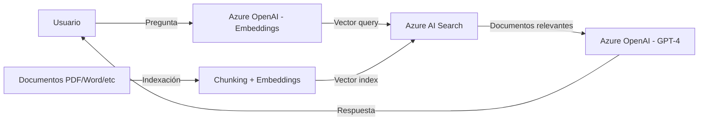

# Azure OpenAI Service con RAG: Chatea con tus propios datos

## Resumen

Retrieval Augmented Generation (RAG) es el patrón que permite a modelos como GPT-4 responder preguntas basándose en tus datos corporativos. Voy al grano: combinar Azure OpenAI con Azure AI Search te permite crear chatbots que conocen tu documentación, productos o políticas internas sin tener que reentrenar modelos.

<!-- more -->

## ¿Qué es RAG?

RAG mejora las respuestas del LLM (Large Language Model) añadiendo un paso de **búsqueda de información** antes de generar la respuesta. En lugar de confiar solo en el conocimiento del modelo, el sistema:

1. **Busca** documentos relevantes en tu base de datos vectorial
2. **Recupera** los fragmentos más relevantes (chunks)
3. **Aumenta** el contexto de la consulta con esa información
4. **Genera** una respuesta basada en tus datos reales

**Ventajas clave:**
- No necesitas reentrenar el modelo con tus datos
- Reduces alucinaciones (el modelo inventa menos)
- Mantienes control sobre qué datos se usan
- Actualizas contenido sin redeployar el modelo

## Arquitectura de RAG con Azure



**Componentes esenciales:**

- **Azure OpenAI**: Modelos `text-embedding-ada-002` (embeddings) y `gpt-4o` o `gpt-35-turbo` (chat)
- **Azure AI Search**: Vector store con capacidad de búsqueda híbrida (keyword + semantic)
- **Chunking**: Divide documentos en fragmentos de 500-1000 tokens
- **Vector index**: Almacena embeddings para búsqueda por similitud

## Desplegar Azure OpenAI con modelos

```bash
# Variables
RESOURCE_GROUP="rg-openai-rag"
LOCATION="swedencentral"  # Regiones con GPT-4: eastus, francecentral, swedencentral
OPENAI_NAME="openai-rag-$(whoami)"

# Crear resource group
az group create --name $RESOURCE_GROUP --location $LOCATION

# Crear Azure OpenAI resource
az cognitiveservices account create \
  --name $OPENAI_NAME \
  --resource-group $RESOURCE_GROUP \
  --location $LOCATION \
  --kind OpenAI \
  --sku S0 \
  --custom-domain $OPENAI_NAME

# Desplegar modelo de embeddings
az cognitiveservices account deployment create \
  --resource-group $RESOURCE_GROUP \
  --name $OPENAI_NAME \
  --deployment-name text-embedding-ada-002 \
  --model-name text-embedding-ada-002 \
  --model-version "2" \
  --model-format OpenAI \
  --sku-name "Standard" \
  --sku-capacity 120

# Desplegar modelo de chat
az cognitiveservices account deployment create \
  --resource-group $RESOURCE_GROUP \
  --name $OPENAI_NAME \
  --deployment-name gpt-4o \
  --model-name gpt-4o \
  --model-version "2024-05-13" \
  --model-format OpenAI \
  --sku-name "Standard" \
  --sku-capacity 10
```

**Capacidades (TPM - Tokens Per Minute):**
- `text-embedding-ada-002`: 120K TPM para procesamiento de documentos
- `gpt-4o`: 10K TPM (ajusta según carga esperada)

## Crear Azure AI Search con vector index

```bash
# Variables
SEARCH_NAME="search-rag-$(whoami)"

# Crear AI Search (Basic tier mínimo para RAG)
az search service create \
  --name $SEARCH_NAME \
  --resource-group $RESOURCE_GROUP \
  --location $LOCATION \
  --sku Basic \
  --partition-count 1 \
  --replica-count 1

# Habilitar semantic ranker (mejora relevancia)
az search service update \
  --name $SEARCH_NAME \
  --resource-group $RESOURCE_GROUP \
  --semantic-search free
```

**SKUs recomendados:**
- **Basic**: Hasta 15GB, ideal para POCs
- **Standard S1**: Producción pequeña-mediana (25GB, 12 particiones)
- **Standard S2+**: Empresas con múltiples índices

## Código Python: Chat con tus datos

```python
from openai import AzureOpenAI
from azure.identity import DefaultAzureCredential, get_bearer_token_provider
import os

# Autenticación con Managed Identity
token_provider = get_bearer_token_provider(
    DefaultAzureCredential(), 
    "https://cognitiveservices.azure.com/.default"
)

# Cliente OpenAI
client = AzureOpenAI(
    base_url=f"https://{os.getenv('OPENAI_NAME')}.openai.azure.com/openai/v1/",
    api_key=token_provider
)

# Chat con grounding data de Azure AI Search
completion = client.chat.completions.create(
    model="gpt-4o",
    messages=[
        {"role": "system", "content": "Eres un asistente técnico que responde basándose solo en la documentación proporcionada."},
        {"role": "user", "content": "¿Cómo configurar autoscaler en AKS?"}
    ],
    extra_body={
        "data_sources": [{
            "type": "azure_search",
            "parameters": {
                "endpoint": f"https://{os.getenv('SEARCH_NAME')}.search.windows.net",
                "index_name": "docs-index",
                "authentication": {
                    "type": "api_key",
                    "key": os.getenv("AZURE_AI_SEARCH_API_KEY")
                },
                "query_type": "vector_semantic_hybrid",  # Combina keyword + vector + semantic
                "top_n_documents": 5,
                "strictness": 3  # 1-5: cuánto confiar en los docs (3 = balance)
            }
        }]
    }
)

print(completion.choices[0].message.content)
```

**Parámetros clave:**
- `query_type`: 
  - `simple`: Solo keyword
  - `vector`: Solo similitud semántica
  - `vector_semantic_hybrid`: **Recomendado** - máxima precisión
- `top_n_documents`: Cuántos chunks recuperar (5-10 típico)
- `strictness`: Nivel de adherencia a los docs (1=flexible, 5=estricto)

## Indexación de documentos

```python
from azure.search.documents import SearchClient
from azure.search.documents.indexes import SearchIndexClient
from azure.search.documents.indexes.models import (
    SearchIndex,
    SimpleField,
    SearchableField,
    VectorSearch,
    VectorSearchProfile,
    HnswAlgorithmConfiguration
)

# Crear índice con campos vector
index_client = SearchIndexClient(
    endpoint=f"https://{SEARCH_NAME}.search.windows.net",
    credential=DefaultAzureCredential()
)

index = SearchIndex(
    name="docs-index",
    fields=[
        SimpleField(name="id", type="Edm.String", key=True),
        SearchableField(name="content", type="Edm.String"),
        SearchableField(name="title", type="Edm.String"),
        SearchField(
            name="content_vector",
            type="Collection(Edm.Single)",
            vector_search_dimensions=1536,  # text-embedding-ada-002
            vector_search_profile_name="myHnswProfile"
        )
    ],
    vector_search=VectorSearch(
        profiles=[VectorSearchProfile(
            name="myHnswProfile",
            algorithm_configuration_name="myHnsw"
        )],
        algorithms=[HnswAlgorithmConfiguration(name="myHnsw")]
    )
)

index_client.create_index(index)
```

**HNSW (Hierarchical Navigable Small World):**
- Algoritmo de búsqueda de vecinos más cercanos
- Balance velocidad/precisión óptimo para RAG
- Alternativa: Exhaustive KNN (más preciso, más lento)

## Buenas prácticas

**Chunking estratégico:**
- **Tamaño**: 500-1000 tokens por chunk (ni muy corto ni muy largo)
- **Overlap**: 10-20% entre chunks para no perder contexto
- **Metadata**: Incluye título, fecha, categoría para filtrado

**Prompt engineering:**
```python
system_prompt = """Eres un asistente técnico de Azure.
REGLAS:
1. Responde SOLO basándote en los documentos proporcionados
2. Si no encuentras la respuesta en los docs, di "No tengo esa información"
3. Cita la fuente cuando sea posible
4. Sé conciso y técnico"""
```

**Seguridad:**
- Usa **Managed Identity** en producción (evita API keys)
- Implementa **RBAC** en Azure AI Search para control de acceso
- **Private endpoints** para tráfico interno
- **Content filtering** en Azure OpenAI (detección de contenido dañino)

## Monitorización

```bash
# Métricas clave en Azure Monitor
az monitor metrics list \
  --resource $OPENAI_NAME \
  --resource-group $RESOURCE_GROUP \
  --resource-type "Microsoft.CognitiveServices/accounts" \
  --metric "TokenTransaction" "Latency" "TotalCalls"

# Query para búsquedas en AI Search
az monitor log-analytics query \
  --workspace $(az monitor log-analytics workspace show --name myWorkspace --resource-group $RESOURCE_GROUP --query id -o tsv) \
  --analytics-query "AzureDiagnostics | where ResourceProvider == 'MICROSOFT.SEARCH' | where OperationName == 'Query.Search' | summarize count() by bin(TimeGenerated, 5m)"
```

**Alertas recomendadas:**
- Latencia > 5 segundos en chat completions
- Tasa de error > 5%
- Consumo de tokens cerca del límite de cuota
- Búsquedas sin resultados (índice incompleto)

## Costos aproximados

| Componente | SKU | Precio mensual |
|------------|-----|----------------|
| Azure OpenAI (embeddings) | 120K TPM | ~€30 (1M tokens = €0.10) |
| Azure OpenAI (GPT-4o) | 10K TPM | ~€150 (1M input = €5, 1M output = €15) |
| Azure AI Search | Basic | €70/mes |
| **Total estimado** | | **€250/mes** (POC) |

**Optimización:**
- Cachea embeddings de documentos (calcular 1 vez)
- Usa `gpt-35-turbo` para casos simples (70% más barato)
- Ajusta TPM según uso real (puedes empezar con 1K)

## Referencias

- [RAG en Azure AI Search - Oficial](https://learn.microsoft.com/en-us/azure/search/retrieval-augmented-generation-overview)
- [Tutorial RAG con .NET](https://learn.microsoft.com/en-us/dotnet/ai/tutorials/tutorial-ai-vector-search)
- [Azure OpenAI Samples - GitHub](https://github.com/Azure-Samples/azure-search-openai-demo)
- [Vector search en Azure AI Search](https://learn.microsoft.com/en-us/azure/search/vector-search-overview)
- [Prompt engineering - Best practices](https://learn.microsoft.com/en-us/azure/ai-services/openai/concepts/prompt-engineering)
