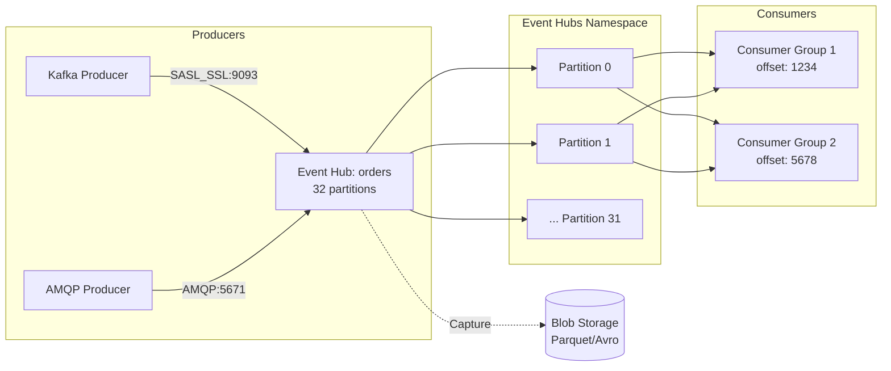

# Azure Event Hubs con Kafka: Streaming sin gestionar clusters

## Resumen

Voy al grano: Azure Event Hubs soporta el protocolo Kafka de forma nativa. Puedes apuntar tus aplicaciones Kafka existentes al endpoint de Event Hubs cambiando solo el connection string. Sin gestionar Zookeeper, sin actualizar brokers, sin parches de seguridad. Totalmente gestionado con auto-inflate, geo-replication y 99.99% SLA.

<!-- more -->

## ¿Qué es Event Hubs con Kafka?

Azure Event Hubs es una plataforma de **streaming de eventos** que actúa como **Kafka-as-a-Service**. Implementa el wire protocol de Apache Kafka (versiones ≥1.0), permitiendo a tus aplicaciones Kafka conectarse sin cambios de código.

**Mapeo conceptual Kafka ↔ Event Hubs:**

| Kafka Concept | Event Hubs Equivalent |
|---------------|----------------------|
| Cluster | Namespace |
| Topic | Event Hub |
| Partition | Partition |
| Consumer Group | Consumer Group |
| Offset | Offset |
| Broker | Managed by Azure (invisible) |

**Ventajas vs. Kafka self-managed:**
- ✅ **Zero ops**: No gestión de brokers, Zookeeper, networking
- ✅ **Auto-scaling**: Throughput Units o Processing Units ajustables
- ✅ **Built-in features**: Capture (archiving), Schema Registry, Geo-DR
- ✅ **Seguridad**: Managed Identity, Private Link, IP firewall
- ✅ **SLA**: 99.99% (Standard/Premium), 99.95% (Dedicated)

## Arquitectura de Event Hubs



**Componentes clave:**

- **Namespace**: Contenedor de Event Hubs (equivalente a Kafka cluster)
- **Event Hub**: Topic individual con particiones
- **Partitions**: Logs ordenados para paralelización (1-32 Standard, hasta 200 Premium/Dedicated)
- **Consumer Groups**: Vista independiente del stream (hasta 20 por Event Hub)
- **Throughput Units (TU)**: Capacidad de ingesta (1 TU = 1 MB/s in, 2 MB/s out)

## Crear Event Hubs namespace con Kafka

```bash
# Variables
RESOURCE_GROUP="rg-eventhubs-kafka"
LOCATION="westeurope"
NAMESPACE="evhns-kafka-$(whoami)"
EVENT_HUB="orders"

# Crear resource group
az group create --name $RESOURCE_GROUP --location $LOCATION

# Crear namespace Standard (mínimo para Kafka)
az eventhubs namespace create \
  --name $NAMESPACE \
  --resource-group $RESOURCE_GROUP \
  --location $LOCATION \
  --sku Standard \
  --capacity 1 \
  --enable-auto-inflate true \
  --maximum-throughput-units 10

# Crear Event Hub (Kafka topic)
az eventhubs eventhub create \
  --name $EVENT_HUB \
  --namespace-name $NAMESPACE \
  --resource-group $RESOURCE_GROUP \
  --partition-count 32 \
  --retention-time-hours 168  # 7 días

# Obtener connection string
CONNECTION_STRING=$(az eventhubs namespace authorization-rule keys list \
  --resource-group $RESOURCE_GROUP \
  --namespace-name $NAMESPACE \
  --name RootManageSharedAccessKey \
  --query primaryConnectionString -o tsv)

echo "Kafka endpoint: $NAMESPACE.servicebus.windows.net:9093"
echo "Connection string: $CONNECTION_STRING"
```

**SKUs y capacidades:**

| Tier | TUs/PUs | Partitions max | Consumer groups | Retention | Precio/hora* |
|------|---------|----------------|-----------------|-----------|--------------|
| **Basic** | 1-20 TU | 1 | 1 | 1 día | ~€0.02/TU |
| **Standard** | 1-20 TU | 32 | 20 | 7 días | ~€0.028/TU |
| **Premium** | 1-16 PU | 100 | 100 | 90 días | ~€1.40/PU |
| **Dedicated** | CU | 200 | 1000 | 90 días | ~€7.50/CU |

*1 TU = 1 MB/s ingress, 2 MB/s egress. 1 PU = 1 CU = recursos dedicados

## Migrar aplicación Kafka existente

**Antes (Kafka self-hosted):**
```properties
# producer.properties
bootstrap.servers=kafka-broker1:9092,kafka-broker2:9092,kafka-broker3:9092
security.protocol=PLAINTEXT
```

**Después (Event Hubs):**
```properties
# producer.properties
bootstrap.servers=evhns-kafka-user.servicebus.windows.net:9093
security.protocol=SASL_SSL
sasl.mechanism=PLAIN
sasl.jaas.config=org.apache.kafka.common.security.plain.PlainLoginModule required \
  username="$ConnectionString" \
  password="Endpoint=sb://evhns-kafka-user.servicebus.windows.net/;SharedAccessKeyName=RootManageSharedAccessKey;SharedAccessKey=XXXXXX";

# Opcional: Desactivar idempotence si usas Kafka <2.0
# enable.idempotence=false
```

**Código Java sin cambios:**
```java
import org.apache.kafka.clients.producer.*;
import java.util.Properties;

public class EventHubsProducer {
    public static void main(String[] args) {
        Properties props = new Properties();
        props.load(new FileInputStream("producer.properties"));
        
        // Código Kafka estándar - ¡cero cambios!
        Producer<String, String> producer = new KafkaProducer<>(props);
        
        for (int i = 0; i < 100; i++) {
            ProducerRecord<String, String> record = new ProducerRecord<>(
                "orders",  // Event Hub name (Kafka topic)
                "key-" + i,
                "order data " + i
            );
            producer.send(record, (metadata, exception) -> {
                if (exception == null) {
                    System.out.printf("Sent to partition %d, offset %d%n", 
                        metadata.partition(), metadata.offset());
                } else {
                    exception.printStackTrace();
                }
            });
        }
        producer.close();
    }
}
```

## Consumer con Kafka API

```java
import org.apache.kafka.clients.consumer.*;
import java.time.Duration;
import java.util.*;

public class EventHubsConsumer {
    public static void main(String[] args) {
        Properties props = new Properties();
        props.setProperty("bootstrap.servers", "evhns-kafka.servicebus.windows.net:9093");
        props.setProperty("security.protocol", "SASL_SSL");
        props.setProperty("sasl.mechanism", "PLAIN");
        props.setProperty("sasl.jaas.config", 
            "org.apache.kafka.common.security.plain.PlainLoginModule required " +
            "username=\"$ConnectionString\" " +
            "password=\"Endpoint=sb://evhns-kafka.servicebus.windows.net/;SharedAccessKeyName=...;SharedAccessKey=...\";");
        
        props.setProperty("group.id", "order-processors");  // Consumer group
        props.setProperty("key.deserializer", "org.apache.kafka.common.serialization.StringDeserializer");
        props.setProperty("value.deserializer", "org.apache.kafka.common.serialization.StringDeserializer");
        props.setProperty("auto.offset.reset", "earliest");
        
        Consumer<String, String> consumer = new KafkaConsumer<>(props);
        consumer.subscribe(Collections.singletonList("orders"));
        
        while (true) {
            ConsumerRecords<String, String> records = consumer.poll(Duration.ofMillis(100));
            for (ConsumerRecord<String, String> record : records) {
                System.out.printf("partition=%d, offset=%d, key=%s, value=%s%n",
                    record.partition(), record.offset(), record.key(), record.value());
            }
            consumer.commitSync();  // Commit offsets
        }
    }
}
```

**Consumer groups best practices:**
- **1 consumer per partition** (máximo paralelismo)
- **Hasta 5 consumers per partition** (todos reciben los mismos eventos)
- **20 consumer groups max** por Event Hub (Standard tier)

## Python con kafka-python

```python
from kafka import KafkaProducer, KafkaConsumer
import os

# Connection string desde variable entorno
CONNECTION_STRING = os.getenv("EVENT_HUBS_CONNECTION_STRING")
NAMESPACE = CONNECTION_STRING.split("//")[1].split(".")[0]

# Producer
producer = KafkaProducer(
    bootstrap_servers=f'{NAMESPACE}.servicebus.windows.net:9093',
    security_protocol='SASL_SSL',
    sasl_mechanism='PLAIN',
    sasl_plain_username='$ConnectionString',
    sasl_plain_password=CONNECTION_STRING,
    value_serializer=lambda v: v.encode('utf-8')
)

# Enviar eventos
for i in range(100):
    future = producer.send('orders', key=f'key-{i}'.encode(), value=f'order-{i}')
    record_metadata = future.get(timeout=10)
    print(f"Sent to partition {record_metadata.partition}, offset {record_metadata.offset}")

producer.flush()
producer.close()

# Consumer
consumer = KafkaConsumer(
    'orders',
    bootstrap_servers=f'{NAMESPACE}.servicebus.windows.net:9093',
    security_protocol='SASL_SSL',
    sasl_mechanism='PLAIN',
    sasl_plain_username='$ConnectionString',
    sasl_plain_password=CONNECTION_STRING,
    group_id='python-consumers',
    auto_offset_reset='earliest',
    value_deserializer=lambda m: m.decode('utf-8')
)

for message in consumer:
    print(f"partition={message.partition}, offset={message.offset}, value={message.value}")
```

## Event Hubs Capture (archivo automático)

```bash
# Habilitar Capture en Event Hub existente
STORAGE_ACCOUNT="evhcapture$(whoami)"
CONTAINER="eventhubs-capture"

# Crear storage account
az storage account create \
  --name $STORAGE_ACCOUNT \
  --resource-group $RESOURCE_GROUP \
  --location $LOCATION \
  --sku Standard_LRS

# Crear container
az storage container create \
  --name $CONTAINER \
  --account-name $STORAGE_ACCOUNT

# Obtener Storage ID
STORAGE_ID=$(az storage account show --name $STORAGE_ACCOUNT --resource-group $RESOURCE_GROUP --query id -o tsv)

# Habilitar Capture
az eventhubs eventhub update \
  --resource-group $RESOURCE_GROUP \
  --namespace-name $NAMESPACE \
  --name $EVENT_HUB \
  --enable-capture true \
  --capture-interval 300 \
  --capture-size-limit 314572800 \
  --destination-name EventHubArchive.AzureBlockBlob \
  --storage-account $STORAGE_ID \
  --blob-container $CONTAINER \
  --archive-name-format "{Namespace}/{EventHub}/{PartitionId}/{Year}/{Month}/{Day}/{Hour}/{Minute}/{Second}"
```

**Capture settings:**
- `capture-interval`: Cada 5 min (60-900 segundos)
- `capture-size-limit`: 300 MB max (10-524288000 bytes)
- **Formato**: Avro o Parquet (configurable desde Portal)
- **Path template**: `{Namespace}/{EventHub}/...` (útil para Data Lake)

**Caso de uso:**
```
Kafka Producer → Event Hub → Capture → Blob Storage
                            ↓
                    Kafka Consumer (real-time)
                            ↓
                    Azure Synapse/Databricks (batch analytics)
```

## Partitioning y escalado

```python
# Enviar con partition key (garantiza orden por key)
producer.send(
    'orders',
    key='customer-123',  # Todos eventos de customer-123 → misma partition
    value='order data'
)

# Enviar a partition específica (no recomendado)
producer.send(
    'orders',
    value='order data',
    partition=5  # Rompe HA si partition falla
)

# Round-robin (sin key ni partition)
producer.send('orders', value='order data')  # Distribuye uniformemente
```

**Fórmula de particionamiento:**
```
partition = hash(key) % num_partitions
```

**Escalado con auto-inflate:**
```bash
# Configurado en namespace creation:
# --enable-auto-inflate true
# --maximum-throughput-units 10

# Cuando alcanzas 80% de 1 TU, auto-escala a 2 TU
# Hasta máximo configurado (10 TU en este caso)
```

## Managed Identity (passwordless)

```bash
# Habilitar Managed Identity en Event Hubs namespace
az eventhubs namespace identity assign \
  --resource-group $RESOURCE_GROUP \
  --namespace-name $NAMESPACE \
  --system-assigned

# Asignar rol "Azure Event Hubs Data Owner"
PRINCIPAL_ID=$(az eventhubs namespace identity show \
  --resource-group $RESOURCE_GROUP \
  --namespace-name $NAMESPACE \
  --query principalId -o tsv)

az role assignment create \
  --assignee $PRINCIPAL_ID \
  --role "Azure Event Hubs Data Owner" \
  --scope $(az eventhubs namespace show --name $NAMESPACE --resource-group $RESOURCE_GROUP --query id -o tsv)
```

**Producer con Managed Identity (Java):**
```java
import com.azure.identity.DefaultAzureCredential;
import com.azure.identity.DefaultAzureCredentialBuilder;
import org.apache.kafka.clients.producer.*;
import java.util.Properties;

Properties props = new Properties();
props.put("bootstrap.servers", "evhns-kafka.servicebus.windows.net:9093");
props.put("security.protocol", "SASL_SSL");
props.put("sasl.mechanism", "OAUTHBEARER");

// Obtener token de Managed Identity
DefaultAzureCredential credential = new DefaultAzureCredentialBuilder().build();
String token = credential.getToken(
    new TokenRequestContext().addScopes("https://eventhubs.azure.net/.default")
).block().getToken();

props.put("sasl.jaas.config", String.format(
    "org.apache.kafka.common.security.oauthbearer.OAuthBearerLoginModule required " +
    "oauth.bearer.token=\"%s\";", token
));

Producer<String, String> producer = new KafkaProducer<>(props);
```

## Buenas prácticas

**Particionamiento:**
- **32 partitions** (Standard): 1 MB/s × 32 = 32 MB/s max teórico
- **Partition key**: Usa customer_id, device_id (alta cardinalidad)
- **Evita**: Enviar directamente a partition (baja HA)

**Throughput Units:**
- **1 TU**: 1 MB/s ingress, 2 MB/s egress, 84 GB/día
- **Regla**: 1 TU por cada 1 MB/s ingress esperado
- **Auto-inflate**: Activa para picos de tráfico

**Retention:**
- **Standard**: 1-7 días (7 días recomendado)
- **Premium/Dedicated**: Hasta 90 días
- **Capture**: Archiva a Blob Storage si necesitas >90 días

**Consumer groups:**
- **1 CG por aplicación lógica** (analytics, archiving, alerting)
- **No compartas CGs** entre apps (offset conflicts)

## Monitorización

```bash
# Métricas clave
az monitor metrics list \
  --resource $(az eventhubs namespace show --name $NAMESPACE --resource-group $RESOURCE_GROUP --query id -o tsv) \
  --metric "IncomingMessages" "OutgoingMessages" "IncomingBytes" "OutgoingBytes" "ThrottledRequests" "ServerErrors"

# Query de eventos throttled (señal de necesitar más TUs)
az monitor log-analytics query \
  --workspace $WORKSPACE_ID \
  --analytics-query "AzureDiagnostics | where ResourceProvider == 'MICROSOFT.EVENTHUB' | where Category == 'OperationalLogs' | where Level == 'Warning' | where Message contains 'throttled'"
```

**Alertas recomendadas:**
- **ThrottledRequests > 0**: Necesitas más TUs
- **ServerErrors > 1%**: Revisar configuración
- **Capture failures**: Verificar permisos Storage Account
- **Consumer lag > 100K messages**: Escalar consumers

## Costos estimados

| Configuración | TUs/PUs | Partitions | Capture | Coste mensual* |
|---------------|---------|------------|---------|----------------|
| **Dev/Test** | 1 TU Standard | 4 | No | ~€20 |
| **Producción pequeña** | 5 TU Standard | 32 | Sí | ~€120 |
| **Producción media** | 2 PU Premium | 100 | Sí | ~€1,000 |
| **Empresa** | 1 CU Dedicated | 200 | Sí | ~€5,400 |

*Precios aproximados West Europe

**Capture pricing:**
- **Primeras 100 GB/mes**: Incluido
- **>100 GB**: ~€0.10/GB capturado
- **Storage**: Según Blob Storage (LRS ~€0.018/GB/mes)

## Referencias

- [Event Hubs con Kafka - Overview](https://learn.microsoft.com/en-us/azure/event-hubs/azure-event-hubs-apache-kafka-overview)
- [Migration guide Kafka → Event Hubs](https://learn.microsoft.com/en-us/azure/event-hubs/apache-kafka-migration-guide)
- [Event Hubs features](https://learn.microsoft.com/en-us/azure/event-hubs/event-hubs-features)
- [Partitions y escalado](https://learn.microsoft.com/en-us/azure/event-hubs/event-hubs-scalability)
- [Event Hubs Capture](https://learn.microsoft.com/en-us/azure/event-hubs/event-hubs-capture-overview)
- [Kafka ecosystem samples](https://github.com/Azure/azure-event-hubs-for-kafka)
