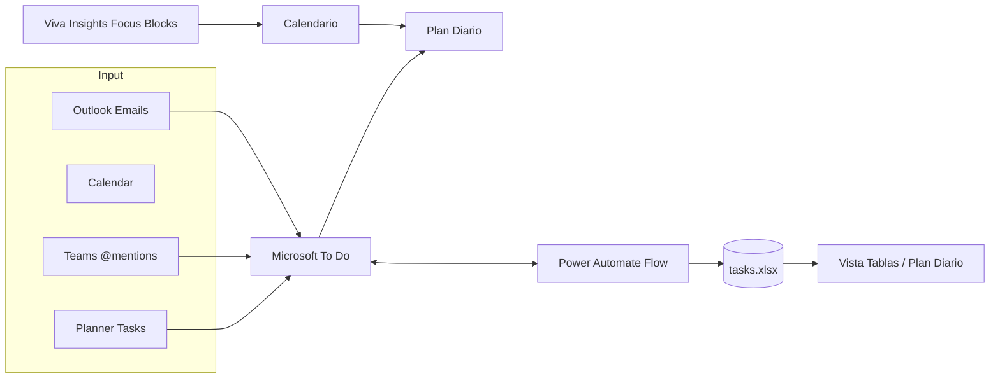
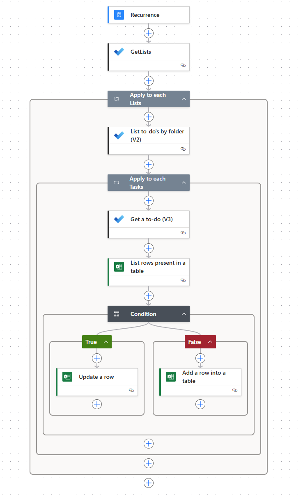

# Sistema de planificación diaria contextual con Microsoft 365

## Resumen

Sistema práctico para planificar el día usando Microsoft 365 (To Do, Outlook, Teams, Power Automate, Viva Insights) con enfoque GTD y priorización realista. Incluye flujo de sincronización `tasks.xlsx`, tablas operativas y buenas prácticas sin relleno.

## ¿Qué es este sistema?

- Origen único de verdad de tareas personales y de equipo
- Priorización visual (🔴🟡🟢) + Big Rock diario
- Sincronización automática To Do → Excel (`tasks.xlsx`) vía Power Automate
- Integración con Outlook (correo/calendario) y Teams (menciones y actividad)
- Protección de bloques de foco usando Viva Insights (focus plan)

## Arquitectura / Flujo operativo




## Componentes clave

| Componente | Rol | Notas |
|------------|-----|-------|
| Microsoft To Do | Captura y priorización | Vista unificada (Outlook + Planner + manual) |
| Power Automate | Sincronización | Flujo cada 4h actualiza/crea filas en Excel |
| Excel Online (Business) | `tasks.xlsx` persistencia | Auditoría + posible análisis Power BI |
| Outlook Calendar | Bloques de ejecución | Deep Work + comunicaciones en ventanas controladas |
| Teams | Comunicaciones accionables | Filtrar @menciones y actividad directa |
| Viva Insights | Focus plan | Silencia notificaciones en bloques críticos |

## Flujo Power Automate (resumen)

Acciones (según JSON del flujo real):

1. Trigger: Recurrence cada 4h
2. GetLists (To Do lists)
3. ForEach listas → List To-Dos
4. Para cada tarea:
   - Get_a_to-do (detalle)
   - Excel `List rows present in a table` filtrando por `IDTarea`
   - If existe → `Update a row`
   - Else → `Add a row into a table`

Campos críticos que se sincronizan: Lista, IDLista, Tarea (title), Estado, Prioridad (importance), FechaVencimiento, Notas, ReminderDateTime, CreatedDateTime, LastModifiedDateTimeToDo, FlagSyncPendiente.

Beneficios:

- Evita duplicados: Excel refleja estado real
- Permite validar antes de sugerir una tarea (regla No duplicidad)
- Base para auditoría (quién, cuándo, cambios)

Así queda por ahora:



!!! Tip
    Se podría implementar que también se borrara una fila del excel si se borrara desde Microsoft TO DO

!!! Warning
    No se puede establecer sincronización bidireccional todavía porque los steps de TO DO no están en los conectores de Power Automate(28/10/2025)

## Implementación práctica rápida

El prompt completo lo dejé en otro post a parte para mayor legibilidad: [Sistema de Planificación Diaria Contextual con Microsoft 365 Prompt]

[Sistema de Planificación Diaria Contextual con Microsoft 365 Prompt]: 20251026_planificacion_diaria_m365_prompt.md

## Ejemplo de salida completo (datos ficticios)

### 1. 🎯 Foco del Día

| Campo | Valor |
|-------|-------|
| **Fecha** | Martes, 28/10/2025 |
| **Big Rock** | Diseñar esquema inicial de automatización "Proyecto Orion" |
| **Tiempo dedicado** | 2h Deep Work (bloque único) |
| **Herramienta** | Microsoft To Do (⭐) |
| **Resultado esperado** | Documento `orion_automation_outline.md` en OneDrive |

### 2. 🗓️ Agenda y Bloques Temporales

| Hora | Tipo | Actividad | Objetivo | App | Notas |
|------|------|----------|----------|-----|-------|
| 08:45-09:00 | Preparación | Revisión rápida inbox + To Do | Limpiar entrada | Outlook/To Do | Máx 15 min |
| 09:00-11:00 | Deep Work | Big Rock Orion | Generar estructura | Focusing (Viva) | Notifs OFF |
| 11:00-11:20 | Comunicación | Correos 🔴 | Desbloquear | Outlook | Solo alta |
| 11:20-11:40 | Comunicación | Chats @mención | Cerrar pendientes | Teams | Filtrar actividad |
| 13:00-13:30 | Tareas secundarias | 2 micro tareas | Soporte | To Do | Ver sección 4 |
| 16:30-16:45 | Cierre | Checklist diario | Preparar mañana | To Do | Big Rock siguiente |

### 3. 📧 Priorización de Comunicaciones (últimas 24h ficticias)

| Pri | Origen | Remitente/Canal | Asunto | Acción requerida | Respuesta sugerida | Tiempo |
|-----|--------|-----------------|--------|------------------|--------------------|-------|
| 🔴 | Outlook "Para mí" | Usuario.Test | Acl. dependencias Orion | Confirmar supuestos | "Dependencias validadas: sólo API Core y Storage. Sigo." | 8m |
| 🔴 | Teams @mención | Canal #arquitectura | Revisión diagrama preliminar | Dar feedback | "Añado nota sobre colas y reintentos." | 6m |
| 🟡 | Teams chat 1:1 | Dev.Helper | Pregunta naming conv. | Indicar patrón | "Usar prefijo 'orion-' + función." | 4m |
| 🟢 | Outlook CC | Notificaciones | Informe semanal | Leer luego | - | 3m |

### 4. ✅ Tareas Secundarias (máx 3)

| # | Tarea | Origen | Tiempo est. | Herramienta | Dependencias |
|---|-------|--------|-------------|-------------|--------------|
| 1 | Documentar convención de nombres orion-* | To Do | 10m | OneDrive | Ninguna |
| 2 | Actualizar lista canales activos | To Do | 10m | Teams | Canales vigentes |
| 3 | Revisar borrador diagrama cola retry | Planner | 15m | Whiteboard | Diagrama creado |

### 5. 📂 Colaboración y Documentos

| Documento | Ubicación | Estado | Acción |
|-----------|----------|--------|--------|
| orion_automation_outline.md | /OneDrive/Proyectos/Orion | Nuevo | Crear secciones |
| naming_guidelines.md | /OneDrive/Shared | Borrador | Añadir apartado colas |
| arch_diagram.drawio | /OneDrive/Designs | Revisión | Confirmar flujos |

### 6. 📝 Tareas Faltantes (validación previa)

```text
🔴 [ALTA] Crear outline inicial Proyecto Orion today
🟡 [MEDIA] Añadir sección colas en naming_guidelines.md today
🟢 [BAJA] Programar revisión informal diagrama retry in 3 days
```
Todas inexistentes en estado completado en la fuente (ejemplo ficticio).

### 7. ⏭️ Cierre (plantilla aplicada)

| Item | Estado | Acción |
|------|--------|--------|
| Big Rock completado | ☐ | Reprogramar mañana si no |
| Comunicaciones 🔴 resueltas | ☐ | Escalar si bloqueo |
| Tareas incompletas movidas | ☐ | Etiqueta #mañana |
| Sync verificada | ☐ | Revisar timestamps |
| Big Rock siguiente definido | ☐ | Bloquear 09:00 |

Checklist:

- [ ] Marcar tareas completadas en To Do
- [ ] Validar no duplicados nuevos
- [ ] Bloquear Deep Work mañana
- [ ] Confirmar ausencia de 🔴 pendientes

---


## Buenas prácticas operativas

| Área | Recomendación |
|------|---------------|
| Captura | Procesar inbox máximo 3 veces/día, nunca en continuo |
| Prioridad | 1 solo Big Rock; si falla → causa raíz en cierre |
| Deep Work | Bloques > 90m con notificaciones silenciadas (Focus plan) |
| Sincronización | Revisar flujo si FlagSyncPendiente ≠ FALSE persistente |
| Ruido Teams | Limitar notificaciones a @menciones y chats directos |
| Excel | Evitar editar manualmente filas salvo columna de auditoría |
| Privacidad | No colocar PII sensible en notas de tarea (almacenadas en Excel) |

## Seguridad y Compliance

- Minimizar datos sensibles en `Notas`
- Revisar permisos de OneDrive (no compartir `tasks.xlsx` públicamente)
- Conectores estándar (To Do, Excel Online Business) → cumplimiento base M365
- Auditoría: timestamps `CreatedDateTime` y `LastModifiedDateTimeToDo` permiten trazar secuencia

## Limitaciones

| Área | Límite | Mitigación |
|------|--------|------------|
| Frecuencia sync | Cada 4h (ejemplo) | Ajustar a 4h si alta rotación |
| Colisiones edición | Cambios simultáneos Excel vs flujo | Tratar Excel como lectura / solo flujo escribe |
| Latencia notificaciones Teams | Depende configuración usuario | Enfoque en bloques revisión comunicaciones |
| Focus plan | Usuarios pueden cancelar bloques | Educar en protección mínima diaria |

## Extensiones posibles

- Power BI sobre `tasks.xlsx` (tendencias prioridad)
- Power Automate adicional: mover tareas vencidas a lista "Revisión"
- Integrar con Planner para tareas de equipo críticas
- Script de limpieza de tareas completadas >30 días

## Referencias oficiales

- Microsoft To Do API (Graph): https://learn.microsoft.com/en-us/graph/todo-concept-overview
- Integración tareas Outlook / To Do / Planner (comparativa): https://learn.microsoft.com/en-us/microsoft-365/community/which-task-management-option
- Excel Online (Business) connector: https://learn.microsoft.com/en-us/connectors/excelonlinebusiness/
- Power Automate conexiones: https://learn.microsoft.com/en-us/power-automate/add-manage-connections
- Teams activity / notificaciones buenas prácticas: https://learn.microsoft.com/en-us/graph/teams-activity-feed-notifications-best-practices
- Viva Insights Focus / Book focus time: https://learn.microsoft.com/en-us/viva/insights/personal/briefing/be-focus
- Focus plan / hábitos productividad: https://learn.microsoft.com/en-us/viva/insights/personal/teams/focus
- Planner + Tasks integración en Teams: https://learn.microsoft.com/en-us/microsoft-365/community/which-task-management-option#tasks-by-planner-and-to-do-teams-app
