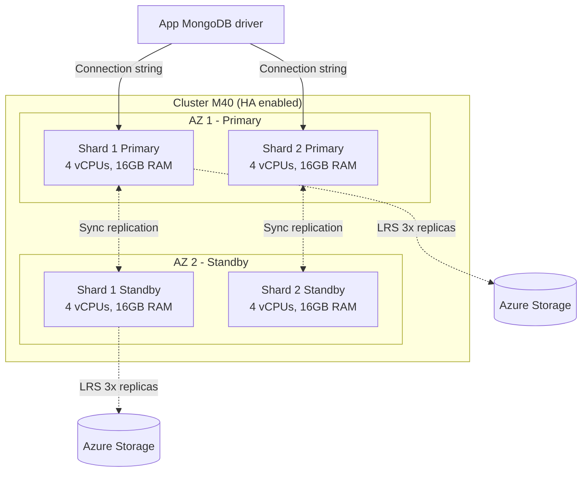

# Azure Cosmos DB for MongoDB vCore: MongoDB nativo con vector search

## Resumen

Azure Cosmos DB for MongoDB vCore es MongoDB real en Azure, con arquitectura vCore (CPU + RAM) que escala vertical y horizontalmente sin downtime. Soporte nativo para vector search (DiskANN), sharding automático y 99.99% SLA con HA activado. Ideal para lift & shift de aplicaciones MongoDB existentes o nuevas apps que necesiten queries complejas, aggregations y transacciones distribuidas.

<!-- more -->

## ¿Qué es Cosmos DB for MongoDB vCore?

Azure Cosmos DB ofrece **dos arquitecturas** para MongoDB:

| Característica | **RU-based** | **vCore-based** |
|----------------|--------------|-----------------|
| Modelo de escalado | Request Units (granular) | Cluster tiers (M30, M40, M50...) |
| Ideal para | Apps cloud-native, point reads | Lift & shift, queries complejas |
| Aggregation pipelines | Limitado | Full support |
| Transacciones distribuidas | No | Sí |
| Vector search | No | Sí (IVF, HNSW, DiskANN) |
| SLA | 99.999% (multi-region writes) | 99.99% (HA habilitado) |
| Precio base | Pay-per-request | ~€150/mes (M30) |

**Cuándo elegir vCore:**
- Migras de MongoDB Atlas/on-prem (lift & shift)
- Queries con `$lookup`, `$facet`, transacciones multi-documento
- Necesitas embeddings para RAG (vector search nativo)
- Prefieres modelo predictivo (cores + RAM vs. RUs)

## Arquitectura vCore



**Componentes clave:**
- **Shards**: Nodos físicos con datos (escalado horizontal)
- **Availability Zones**: 2 AZs cuando HA habilitado (primary + standby)
- **LRS storage**: 3 réplicas síncronas por shard (incluso sin HA)
- **Auto-sharding**: Mapeo automático logical→physical shards

## Cluster tiers disponibles

| Tier | vCPUs | RAM | Storage base | Precio/hora* |
|------|-------|-----|--------------|--------------|
| **M10** | 1 | 2 GiB | 32 GB | ~€0.11 |
| **M20** | 2 | 4 GiB | 32 GB | ~€0.22 |
| **M30** | 2 | 8 GB | 128 GB | ~€0.24 |
| **M40** | 4 | 16 GB | 128 GB | ~€0.48 |
| **M50** | 8 | 32 GB | 128 GB | ~€0.96 |
| **M60** | 16 | 64 GB | 128 GB | ~€1.92 |
| **M80** | 32 | 128 GB | 128 GB | ~€3.84 |
| **M200** | 64 | 256 GB | 128 GB | ~€7.68 |

*Precios aproximados sin HA (con HA se duplica coste)

**Escalado independiente:**
- Compute: Cambiar tier (M30→M40) sin downtime
- Storage: Escalar disco de 128GB hasta 32TB por shard
- Horizontal: Añadir shards para distribuir carga

## Crear cluster con Azure CLI

```bash
# Variables
RESOURCE_GROUP="rg-mongodb-vcore"
LOCATION="eastus"
CLUSTER_NAME="mongo-prod-$(whoami)"
ADMIN_USER="mongoadmin"
ADMIN_PASS="P@ssw0rd$(date +%s)"  # Genera password único

# Crear resource group
az group create --name $RESOURCE_GROUP --location $LOCATION

# Desplegar cluster usando Bicep (recomendado)
cat > main.bicep <<EOF
param clusterName string = '$CLUSTER_NAME'
param location string = resourceGroup().location
param adminUsername string = '$ADMIN_USER'

@secure()
param adminPassword string

resource mongoCluster 'Microsoft.DocumentDB/mongoClusters@2024-07-01' = {
  name: clusterName
  location: location
  properties: {
    administratorLogin: adminUsername
    administratorLoginPassword: adminPassword
    serverVersion: '6.0'
    nodeGroupSpecs: [
      {
        kind: 'Shard'
        sku: 'M40'
        diskSizeGB: 128
        enableHa: true
        nodeCount: 2  // 2 shards
      }
    ]
  }
}

output connectionString string = mongoCluster.properties.connectionString
EOF

# Desplegar
az deployment group create \
  --resource-group $RESOURCE_GROUP \
  --template-file main.bicep \
  --parameters adminPassword="$ADMIN_PASS"

# Obtener connection string
CONNECTION_STRING=$(az deployment group show \
  --resource-group $RESOURCE_GROUP \
  --name main \
  --query properties.outputs.connectionString.value -o tsv)

echo "Connection string: $CONNECTION_STRING"
```

**Parámetros críticos:**
- `serverVersion`: `"5.0"`, `"6.0"`, `"7.0"` (latest)
- `sku`: Tier del cluster (M30 mínimo para producción)
- `enableHa`: `true` para 99.99% SLA (duplica coste)
- `nodeCount`: Número de shards (escala horizontal)

## Conectar con MongoDB drivers

```python
from pymongo import MongoClient
from azure.identity import DefaultAzureCredential

# Opción 1: Connection string con credenciales
client = MongoClient(
    "mongodb+srv://mongoadmin:P@ssw0rd@mongo-prod.mongocluster.cosmos.azure.com/?tls=true&authMechanism=SCRAM-SHA-256&retrywrites=false&maxIdleTimeMS=120000"
)

# Opción 2: Managed Identity (OIDC) - Recomendado producción
from pymongo.auth_oidc import OIDCCallback

def azure_oidc_callback(timeout):
    credential = DefaultAzureCredential()
    token = credential.get_token("https://cosmos.azure.com/.default")
    return {"access_token": token.token}

auth_props = {"OIDC_CALLBACK": OIDCCallback(azure_oidc_callback)}

client = MongoClient(
    "mongodb+srv://mongo-prod.global.mongocluster.cosmos.azure.com/",
    authMechanism="MONGODB-OIDC",
    authMechanismProperties=auth_props,
    tls=True,
    retryWrites=True
)

# Operaciones normales MongoDB
db = client["ecommerce"]
products = db["products"]

# Insert
products.insert_one({
    "name": "Azure Hoodie",
    "price": 49.99,
    "category": "clothing",
    "tags": ["azure", "swag"]
})

# Query con aggregation pipeline
pipeline = [
    {"$match": {"category": "clothing"}},
    {"$group": {"_id": "$category", "avg_price": {"$avg": "$price"}}},
    {"$sort": {"avg_price": -1}}
]
results = list(products.aggregate(pipeline))
print(results)
```

**Connection string params:**
- `tls=true`: HTTPS requerido
- `authMechanism`: `SCRAM-SHA-256` (credenciales) o `MONGODB-OIDC` (Managed Identity)
- `retryWrites=false`: Cosmos DB gestiona retries
- `maxIdleTimeMS=120000`: Timeout de conexión

## Vector search con DiskANN

```python
# 1. Crear índice vector (DiskANN para >50K vectors)
db.command({
    "createIndexes": "products",
    "indexes": [
        {
            "key": {"description_vector": "cosmosSearch"},
            "name": "vector_index_diskann",
            "cosmosSearchOptions": {
                "kind": "vector-diskann",
                "similarity": "COS",  # Cosine similarity
                "dimensions": 1536    # text-embedding-ada-002
            }
        }
    ]
})

# 2. Insertar documentos con embeddings
from openai import AzureOpenAI

openai_client = AzureOpenAI(
    base_url="https://myopenai.openai.azure.com/openai/v1/",
    api_key=os.getenv("AZURE_OPENAI_KEY")
)

# Generar embedding
description = "Blue cotton hoodie with Azure logo"
embedding = openai_client.embeddings.create(
    model="text-embedding-ada-002",
    input=description
).data[0].embedding

# Insertar con vector
products.insert_one({
    "name": "Azure Hoodie",
    "description": description,
    "description_vector": embedding,
    "price": 49.99
})

# 3. Vector similarity search
query = "sweatshirt with cloud logo"
query_embedding = openai_client.embeddings.create(
    model="text-embedding-ada-002",
    input=query
).data[0].embedding

results = products.aggregate([
    {
        "$search": {
            "cosmosSearch": {
                "vector": query_embedding,
                "path": "description_vector",
                "k": 5  # Top 5 resultados
            }
        }
    },
    {"$project": {"name": 1, "description": 1, "price": 1, "score": {"$meta": "searchScore"}}}
])

for doc in results:
    print(f"{doc['name']}: {doc['score']}")
```

**Tipos de índice vector:**

| Tipo | Vector count | Cluster tier | Características |
|------|-------------|--------------|-----------------|
| **IVF** | <10K | M10-M20 | Rápido build, menor recall |
| **HNSW** | <50K | M30+ | Mejor recall, más memoria |
| **DiskANN** | 50K-500K+ | M30+ | **Recomendado**: high recall, bajo latency |

**Similarity metrics:**
- `COS`: Cosine similarity (recomendado para text embeddings)
- `IP`: Inner product
- `L2`: Euclidean distance

## Escalado vertical y horizontal

```bash
# Escalar verticalmente (M40 → M50) - Zero downtime
az cosmosdb mongocluster update \
  --resource-group $RESOURCE_GROUP \
  --cluster-name $CLUSTER_NAME \
  --node-group-spec sku=M50

# Escalar storage (128GB → 512GB)
az cosmosdb mongocluster update \
  --resource-group $RESOURCE_GROUP \
  --cluster-name $CLUSTER_NAME \
  --node-group-spec diskSizeGB=512

# Escalar horizontalmente (2 → 4 shards)
az cosmosdb mongocluster update \
  --resource-group $RESOURCE_GROUP \
  --cluster-name $CLUSTER_NAME \
  --node-group-spec nodeCount=4

# Habilitar HA en cluster existente
az cosmosdb mongocluster update \
  --resource-group $RESOURCE_GROUP \
  --cluster-name $CLUSTER_NAME \
  --node-group-spec enableHa=true
```

**Rebalanceo automático:**
- Al añadir shards, los datos se redistribuyen automáticamente
- No requiere definir shard key hasta >1TB
- Zero downtime durante operaciones de escalado

## Buenas prácticas

**Sharding estratégico:**
- **<1TB**: No necesitas shard key explícito (auto-sharding)
- **>1TB**: Define shard key en campo con alta cardinalidad
  ```javascript
  sh.shardCollection("ecommerce.orders", { "customer_id": "hashed" })
  ```
- **Avoid hotspots**: No uses `_id` secuencial como shard key

**High Availability:**
- **HA habilitado**: 2 AZs, failover automático <30s
- **Sin HA**: LRS con 3 réplicas (99.9% SLA)
- **Backup**: Continuous backup con 7 días retention (incluido)

**Security:**
```bash
# Private endpoint (tráfico interno VNet)
az network private-endpoint create \
  --name mongo-pe \
  --resource-group $RESOURCE_GROUP \
  --vnet-name myVnet \
  --subnet default \
  --private-connection-resource-id $(az cosmosdb mongocluster show --name $CLUSTER_NAME --resource-group $RESOURCE_GROUP --query id -o tsv) \
  --group-ids MongoCluster \
  --connection-name mongo-conn

# Firewall IP rules (desde portal o CLI)
az cosmosdb mongocluster firewall rule create \
  --resource-group $RESOURCE_GROUP \
  --cluster-name $CLUSTER_NAME \
  --rule-name AllowMyIP \
  --start-ip-address 203.0.113.1 \
  --end-ip-address 203.0.113.1
```

## Monitorización

```bash
# Métricas clave en Azure Monitor
az monitor metrics list \
  --resource $(az cosmosdb mongocluster show --name $CLUSTER_NAME --resource-group $RESOURCE_GROUP --query id -o tsv) \
  --metric "CpuPercent" "MemoryPercent" "DiskUsagePercent" "RequestsTotal"

# Diagnóstico de queries lentas (slow query log)
# Habilitar en Portal: Diagnostic Settings → MongoRequests
```

**Alertas recomendadas:**
- CPU > 80% durante 5 min → Escalar tier
- Memory > 90% → Considerar M50+ o sharding
- Disk > 85% → Expandir storage
- Failed requests > 1% → Revisar connection pooling

## Migración desde MongoDB Atlas/On-prem

```bash
# Opción 1: mongodump/mongorestore (downtime)
mongodump --uri="mongodb://source-server:27017" --out=/backup
mongorestore --uri="$CONNECTION_STRING" /backup

# Opción 2: Azure Database Migration Service (online, zero downtime)
# 1. Crear DMS en portal
# 2. Configurar source (Atlas/on-prem) y target (Cosmos DB vCore)
# 3. Iniciar migración continua con CDC
# 4. Cutover cuando esté sincronizado

# Opción 3: Azure Data Factory (programático)
az datafactory create --resource-group $RESOURCE_GROUP --name myDataFactory --location $LOCATION
```

**Checklist migración:**
- ✅ Validar server version compatible (5.0, 6.0, 7.0)
- ✅ Revisar índices y aggregation pipelines
- ✅ Ajustar connection pooling (maxPoolSize=100 recomendado)
- ✅ Probar failover con HA habilitado

## Costos optimizados

| Escenario | Tier | HA | Storage | Coste mensual* |
|-----------|------|----|---------|--------------| 
| Dev/Test | M30 | No | 128GB | ~€175 |
| Producción pequeña | M40 | Sí | 256GB | ~€700 |
| Producción media | M50 | Sí | 512GB | ~€1,400 |
| Empresa (4 shards) | M60 | Sí | 1TB | ~€5,600 |

*Precios aproximados región East US

**Ahorro de costes:**
- **Free tier**: M25 con 32GB storage gratis (permanente)
- **Sin HA en dev**: 50% ahorro vs. HA habilitado
- **Auto-pause**: No disponible (cluster siempre activo)
- **Reserved capacity**: Hasta 65% descuento con commitment 1-3 años

## Referencias

- [Cosmos DB for MongoDB vCore - Overview](https://learn.microsoft.com/en-us/azure/cosmos-db/mongodb/vcore/introduction)
- [Vector search con DiskANN](https://learn.microsoft.com/en-us/azure/cosmos-db/mongodb/vcore/vector-search)
- [Scalability patterns](https://learn.microsoft.com/en-us/azure/cosmos-db/mongodb/vcore/scalability-overview)
- [High Availability](https://learn.microsoft.com/en-us/azure/cosmos-db/mongodb/vcore/high-availability)
- [RU vs vCore comparison](https://learn.microsoft.com/en-us/azure/cosmos-db/mongodb/vcore/faq)
- [Migration options](https://learn.microsoft.com/en-us/azure/cosmos-db/mongodb/vcore/migration-options)
