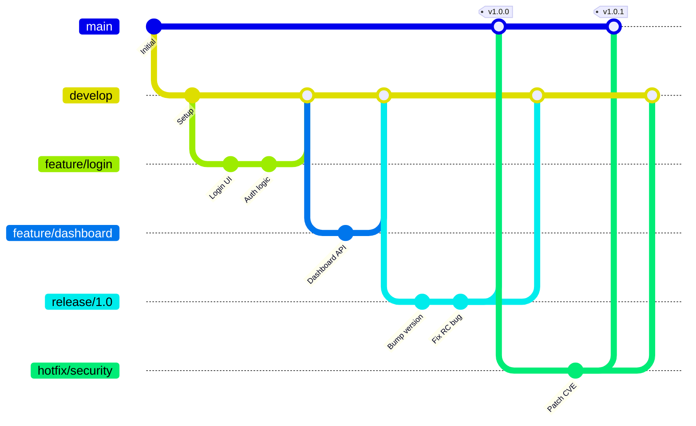
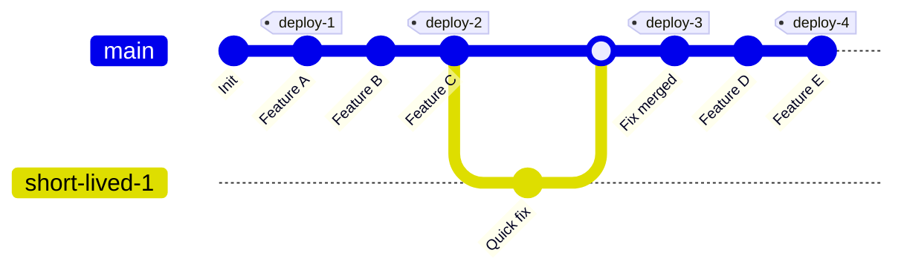
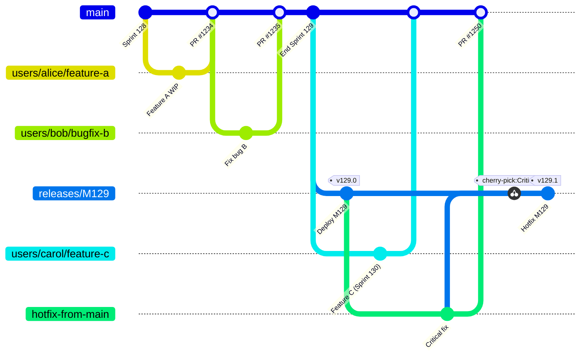
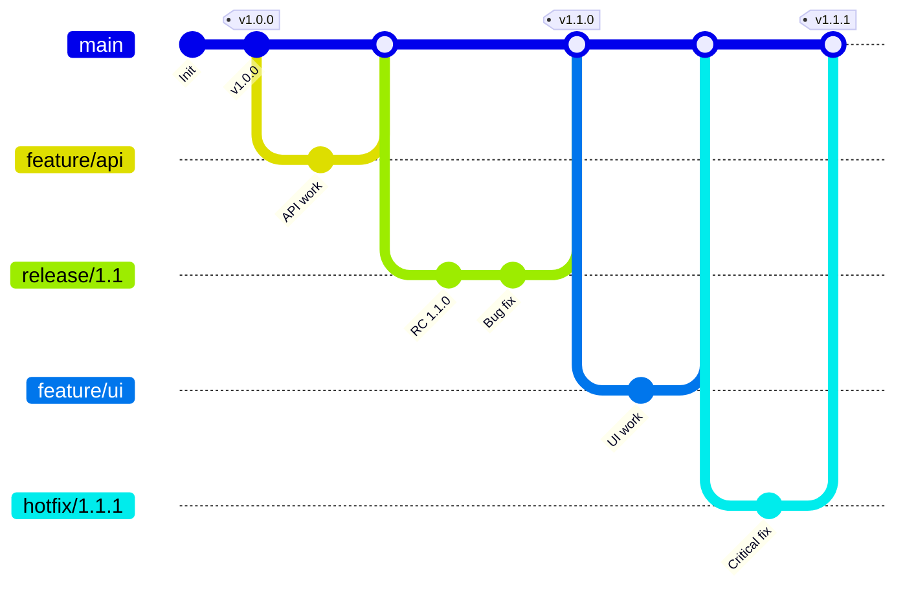
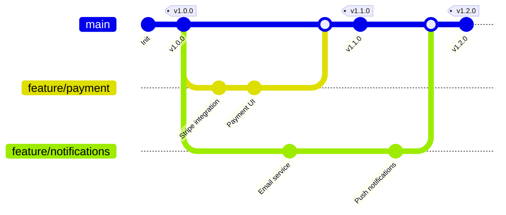

# Git Workflows: GitFlow vs GitHub Flow vs Trunk-Based vs Release Flow

## Resumen

Existen múltiples **estrategias de branching Git** para gestionar el desarrollo de software: **GitFlow** (modelo complejo con develop/feature/release/hotfix branches para equipos grandes), **GitHub Flow** (minimalista con feature branches + main + deploy before merge), **GitLab Flow** (híbrido con environment branches staging/production para control deployment), **Trunk-Based Development** (commits directos a main con short-lived branches <24h, usado por Google/Facebook), **Release Flow** (trunk-based + release branches sin merge back, usado por Microsoft Azure), **OneFlow** (GitFlow simplificado eliminando develop branch), y **Feature Branch Workflow** (básico con feature branches + pull requests). Cada estrategia se adapta a diferentes tamaños de equipo, frecuencia de releases, madurez CI/CD y control de environments.

<!-- more -->

## ¿Por qué necesitas una estrategia de branching?

**Sin estrategia definida** surgen problemas:

- **Merge hell**: Branches long-lived (>2 semanas) generan conflictos masivos al integrar
- **Release delays**: No hay proceso claro para promocionar código a producción
- **Hotfix chaos**: Bugs críticos en producción sin workflow para fixes urgentes
- **Code quality drift**: Sin pull requests, código sin revisar llega a main
- **Deployment uncertainty**: "¿Qué commits están en producción ahora?"

**Una estrategia de branching define**:

1. **Tipos de branches**: main/develop/feature/release/hotfix
2. **Naming conventions**: `feature/user-auth`, `hotfix/sql-injection`
3. **Merge strategy**: Fast-forward, squash, merge commit
4. **Review process**: Pull requests obligatorios, code owners
5. **Release cadence**: Continuous deployment vs sprint-based releases

## Comparativa rápida

| Estrategia | Branches principales | Branches auxiliares | Complejidad | Equipo ideal | Release frequency |
|------------|----------------------|---------------------|-------------|--------------|-------------------|
| **GitFlow** | main + develop | feature, release, hotfix | 🔴 Alta | >10 devs, releases planificadas | Mensual/trimestral |
| **GitHub Flow** | main | feature | 🟢 Baja | 3-10 devs, CD | Diaria/continua |
| **GitLab Flow** | main | production, staging, feature | 🟡 Media | 5-30 devs, environment-based | Variable por entorno |
| **Trunk-Based** | main (trunk) | short-lived (<24h) | 🟡 Media | >50 devs, CD maduro | Múltiples/día |
| **Release Flow** | main | release (long-lived) | 🟡 Media | >100 devs, sprints | Sprint-based (2-3 semanas) |
| **OneFlow** | main | release, feature, hotfix | 🟡 Media | 10-50 devs | Sprint/mensual |
| **Feature Branch** | main | feature | 🟢 Baja | <5 devs, flexible | Variable |

## GitFlow

### Arquitectura GitFlow



### Branches en GitFlow

**1. main (producción)**

- Código en producción siempre
- Solo merges desde release o hotfix
- Cada merge = tag de versión (v1.0.0, v1.0.1)

**2. develop (integración)**

- Branch principal de desarrollo
- Developers mergen aquí via pull requests
- Siempre buildable pero no production-ready

**3. feature/* (nuevas features)**

```bash
# Crear feature branch desde develop
git checkout develop
git pull origin develop
git checkout -b feature/user-authentication

# Desarrollo...
git add .
git commit -m "Add JWT token validation"

# Push y crear pull request a develop
git push origin feature/user-authentication
```

**Naming conventions**:

- `feature/user-authentication`
- `feature/payment-gateway`
- `feature/JIRA-1234-oauth-integration`

**Lifetime**: 1-2 semanas (idealmente <1 sprint)

**4. release/* (preparación release)**

```bash
# Crear release branch desde develop (fin de sprint)
git checkout develop
git checkout -b release/1.2.0

# Solo bug fixes en release branch
git commit -m "Fix: Update copyright year"
git commit -m "Bump version to 1.2.0"

# Merge a main (producción)
git checkout main
git merge --no-ff release/1.2.0
git tag -a v1.2.0 -m "Release version 1.2.0"
git push origin main --tags

# Merge back a develop (traer fixes)
git checkout develop
git merge --no-ff release/1.2.0
git push origin develop

# Eliminar release branch
git branch -d release/1.2.0
```

**5. hotfix/* (fixes urgentes producción)**

```bash
# Crear hotfix desde main (producción rota)
git checkout main
git checkout -b hotfix/sql-injection-cve-2024-1234

# Fix crítico
git commit -m "Fix: Sanitize SQL inputs"

# Merge a main
git checkout main
git merge --no-ff hotfix/sql-injection-cve-2024-1234
git tag -a v1.2.1 -m "Hotfix: SQL injection patch"
git push origin main --tags

# Merge a develop (evitar regresión)
git checkout develop
git merge --no-ff hotfix/sql-injection-cve-2024-1234
git push origin develop

# Si existe release branch activo, merge ahí también
git checkout release/1.3.0
git merge --no-ff hotfix/sql-injection-cve-2024-1234
```

### Configuración GitFlow (Azure DevOps/GitHub)

**Branch policies (Azure DevOps)**:

```bash
# Proteger main: solo merges desde release/hotfix
az repos policy merge-strategy create \
  --repository-id <REPO_ID> \
  --branch main \
  --blocking true \
  --enabled true \
  --use-squash-merge false

# Proteger develop: require pull request + 2 reviewers
az repos policy approver-count create \
  --repository-id <REPO_ID> \
  --branch develop \
  --blocking true \
  --enabled true \
  --minimum-approver-count 2 \
  --creator-vote-counts false
```

**GitHub branch protection (main)**:

```yaml
# .github/branch-protection.yml
branches:
  main:
    protection:
      required_pull_request_reviews:
        required_approving_review_count: 2
        dismiss_stale_reviews: true
      required_status_checks:
        strict: true
        contexts:
          - "ci/build"
          - "ci/tests"
      enforce_admins: true
      restrictions:
        users: []
        teams: ["release-managers"]
```

### Ventajas GitFlow

✅ **Clara separación producción/desarrollo**: main = prod, develop = staging

✅ **Soporte múltiples versiones**: Mantener v1.x y v2.x simultáneamente

✅ **Hotfix process robusto**: Pathway claro para emergency fixes

✅ **Release candidates**: Testing exhaustivo en release branch antes de prod

### Desventajas GitFlow

❌ **Complejidad alta**: 5 tipos de branches, reglas merge complejas

❌ **Merge overhead**: Hotfix debe mergearse a main + develop + release (si existe)

❌ **No apto para CD**: Release branch conflicts con continuous deployment

❌ **Long-lived branches**: Feature branches >2 semanas = merge hell

### Cuándo usar GitFlow

- ✅ Equipos >10 developers
- ✅ Releases planificadas (mensual/trimestral)
- ✅ Múltiples versiones en producción (SaaS multi-tenant con versiones legacy)
- ✅ Proceso release riguroso (QA manual extensivo)
- ❌ **NO** si haces continuous deployment (múltiples deploys/día)

## GitHub Flow

### Arquitectura GitHub Flow

```mermaid
gitGraph
    commit id: "Initial"
    commit id: "v1.0.0" tag: "v1.0.0"

    branch feature/api-v2
    checkout feature/api-v2
    commit id: "API schema"
    commit id: "Endpoints"

    checkout main
    commit id: "Hotfix CSS"

    checkout feature/api-v2
    commit id: "Tests"
    checkout main
    merge feature/api-v2 id: "Deploy + Merge"
    commit id: "v1.1.0" tag: "v1.1.0"

    branch feature/websockets
    checkout feature/websockets
    commit id: "WS server"
    commit id: "Client lib"
    checkout main
    merge feature/websockets id: "Deploy + Merge"
    commit id: "v1.2.0" tag: "v1.2.0"
```

### Workflow GitHub Flow

**Reglas simples**:

1. **main siempre deployable**: Cada commit en main puede ir a producción
2. **Feature branches desde main**: `git checkout -b feature/new-feature`
3. **Push regularmente**: Backup y feedback temprano
4. **Pull request para feedback**: Antes de merge, discusión + review
5. **Deploy antes de merge**: Testing en staging/producción
6. **Merge después de aprobar deploy**: Si deploy OK → merge PR

### Ejemplo práctico

**Paso 1: Crear feature branch**

```bash
git checkout main
git pull origin main
git checkout -b feature/dark-mode

# Desarrollo
git add .
git commit -m "Add dark mode toggle component"
git push origin feature/dark-mode
```

**Paso 2: Abrir pull request**

```bash
# GitHub CLI
gh pr create \
  --title "Feature: Dark mode support" \
  --body "Implements dark mode with system preference detection. Closes #456" \
  --base main \
  --head feature/dark-mode
```

**Paso 3: CI/CD automático (GitHub Actions)**

```yaml
# .github/workflows/pr.yml
name: PR Validation
on:
  pull_request:
    branches: [main]

jobs:
  test-and-deploy:
    runs-on: ubuntu-latest
    steps:
      - uses: actions/checkout@v3

      - name: Run tests
        run: npm test

      - name: Build
        run: npm run build

      - name: Deploy to staging
        if: success()
        run: |
          # Deploy PR to unique staging URL
          vercel deploy --token=${{ secrets.VERCEL_TOKEN }} \
            --env=staging \
            --meta="pr=${{ github.event.pull_request.number }}"

      - name: Comment staging URL
        uses: actions/github-script@v6
        with:
          script: |
            github.rest.issues.createComment({
              issue_number: context.issue.number,
              owner: context.repo.owner,
              repo: context.repo.repo,
              body: '🚀 Deployed to staging: https://pr-${{ github.event.pull_request.number }}.staging.example.com'
            })
```

**Paso 4: Review + test en staging**

```bash
# Reviewers prueban en staging URL
# https://pr-123.staging.example.com

# Si hay bugs, push nuevos commits
git commit -m "Fix: Dark mode contrast ratio"
git push origin feature/dark-mode
# CI/CD redeploy automáticamente
```

**Paso 5: Deploy a producción**

```bash
# Opción A: Deploy manual antes de merge
# Deploy feature branch a producción para validar
vercel deploy --prod --token=$VERCEL_TOKEN

# Si deploy exitoso → merge PR
gh pr merge 123 --squash --delete-branch
```

**Opción B: Auto-deploy post-merge (recomendado)**

```yaml
# .github/workflows/deploy.yml
name: Deploy Production
on:
  push:
    branches: [main]

jobs:
  deploy:
    runs-on: ubuntu-latest
    steps:
      - uses: actions/checkout@v3
      - name: Deploy to production
        run: vercel deploy --prod --token=${{ secrets.VERCEL_TOKEN }}
```

### Deploy antes de merge (crítico)

**Problema sin pre-deploy**: Merge → Deploy → Bug en prod → Rollback urgente

**Solución GitHub Flow**:

```bash
# 1. PR abierto → Deploy automático a staging
https://pr-123.staging.example.com

# 2. Review + QA en staging
# 3. Si staging OK → Deploy a producción (canary/blue-green)
# 4. Si producción OK durante 30min → Merge PR a main
# 5. Si producción falla → NO merge, fix en feature branch
```

**Ventaja**: main **siempre** refleja código en producción (no código "esperando deploy")

### Variantes GitHub Flow

**1. Squash merge (recomendado)**

```bash
# Convierte 10 commits en feature branch → 1 commit en main
gh pr merge 123 --squash --delete-branch

# Resultado: Historia main limpia
# main: feat: Add dark mode (PR #123)
#   En lugar de:
#   - WIP dark mode
#   - Fix typo
#   - Update tests
#   - Fix linter
#   ...
```

**2. Merge commit (preserva historia)**

```bash
gh pr merge 123 --merge
# Crea merge commit explícito en main
```

**3. Rebase (historia lineal)**

```bash
gh pr merge 123 --rebase
# Replay commits de feature branch sobre main
# Historia lineal sin merge commits
```

### Ventajas GitHub Flow

✅ **Simplicidad extrema**: Solo main + feature branches

✅ **Continuous deployment**: Deploy múltiples veces/día sin friction

✅ **Fast feedback**: Deploy antes de merge = bugs detectados pre-merge

✅ **Historia limpia**: Squash merge = 1 commit por feature en main

### Desventajas GitHub Flow

❌ **No release branches**: Difícil mantener múltiples versiones (v1.x, v2.x)

❌ **Deploy obligatorio**: Requiere CI/CD maduro (no manual QA)

❌ **Hotfix = feature branch**: No distinción entre feature y hotfix

❌ **No staging prolongado**: Código debe estar production-ready al merge

### Cuándo usar GitHub Flow

- ✅ Continuous deployment (múltiples deploys/día)
- ✅ SaaS single-version (todos usuarios misma versión)
- ✅ CI/CD automatizado (tests + deploy automáticos)
- ✅ Equipos pequeños-medios (3-20 devs)
- ❌ **NO** si necesitas releases planificadas con QA manual extensivo

## Trunk-Based Development

### Arquitectura Trunk-Based



### Principios Trunk-Based

**1. Commits directos a main (equipos maduros)**

```bash
# Sin branches: commit directo a trunk
git checkout main
git pull --rebase origin main

# Cambio pequeño (<2h trabajo)
git add .
git commit -m "feat: Add user avatar upload"
git push origin main

# CI/CD deploy automático a producción en <10 min
```

**2. Short-lived branches (<24 horas)**

```bash
# Para cambios que requieren >2h
git checkout -b quick-fix-validation
# Trabajo durante 4-8 horas
git commit -m "Fix: Email validation regex"

# Merge mismo día (NO pull request largo)
git checkout main
git pull --rebase origin main
git merge quick-fix-validation --ff-only
git push origin main
git branch -d quick-fix-validation
```

**3. Feature flags para features incompletas**

```javascript
// Feature flag: ocultar feature en desarrollo
if (featureFlags.isEnabled('new-checkout-flow')) {
  return <NewCheckoutFlow />;
} else {
  return <LegacyCheckoutFlow />;
}
```

```bash
# Commit código incomplete a main (con flag disabled)
git commit -m "feat: New checkout flow (behind feature flag)"
git push origin main

# Deploy a producción → feature oculta para usuarios
# Developers pueden testear con flag enabled

# Cuando feature completa → enable flag
featureFlags.enable('new-checkout-flow', { rollout: 10 }); // 10% usuarios
# Gradual rollout: 10% → 50% → 100%

# Eliminar flag cuando 100% estable
git commit -m "refactor: Remove new-checkout-flow feature flag"
```

### Configuración Trunk-Based (Google/Facebook style)

**CI/CD ultra-rápido (obligatorio)**:

```yaml
# .github/workflows/trunk.yml
name: Trunk CI/CD
on:
  push:
    branches: [main]

jobs:
  test-and-deploy:
    runs-on: ubuntu-latest
    timeout-minutes: 10  # Forzar tests rápidos

    steps:
      - uses: actions/checkout@v3

      # Parallel test execution
      - name: Unit tests
        run: npm run test:unit -- --parallel
        timeout-minutes: 3

      - name: Integration tests
        run: npm run test:integration
        timeout-minutes: 5

      - name: Deploy to production
        if: success()
        run: |
          # Canary deploy (1% traffic)
          kubectl set image deployment/app app=myapp:${{ github.sha }}
          kubectl rollout status deployment/app

          # Monitor metrics 5 min
          ./scripts/monitor-canary.sh

          # If metrics OK → full rollout
          kubectl scale deployment/app --replicas=20
```

**Pre-commit hooks (calidad local)**:

```bash
# .husky/pre-commit
#!/bin/bash
npm run lint
npm run test:unit
npm run build

# Si falla → commit bloqueado
```

**Branch protection (permitir solo fast-forward)**:

```bash
# Azure DevOps: Forzar squash/rebase (no merge commits)
az repos policy merge-strategy create \
  --repository-id <REPO_ID> \
  --branch main \
  --blocking true \
  --use-squash-merge true

# GitHub: Linear history
gh api repos/:owner/:repo/branches/main/protection \
  --method PUT \
  --field required_linear_history=true
```

### Scaled Trunk-Based (Google/Facebook >1000 devs)

**Monorepo con virtual branches**:

```bash
# Google: 1 repo gigante, 1 branch (trunk)
# 2+ billion lines of code
# 25,000+ developers
# 40,000+ commits/día

# Bazel: Builds incrementales ultra-rápidos
bazel build //services/search/...
# Solo rebuilds changed dependencies (graph-based)

# Tests afectados solamente
bazel test --test_tag_filters=affected //...
```

**Continuous Integration at Scale**:

```yaml
# 40K commits/día = 1 commit cada 2 segundos
# CI debe ser instantáneo

# Presubmit tests (antes de commit)
- Lint changed files (2 sec)
- Unit tests affected modules (30 sec)
- Build affected targets (1 min)

# Postsubmit tests (después de commit, async)
- Full integration tests (10 min)
- E2E tests (30 min)
- Performance regression tests (1 hour)

# Si postsubmit falla → auto-revert commit
```

### Ventajas Trunk-Based

✅ **Merge conflicts mínimos**: Branches <24h = pequeños cambios fáciles de integrar

✅ **CI/CD velocidad máxima**: Deploy múltiples veces/día (hasta 100+/día en Google)

✅ **Simplicidad extrema**: Solo main branch, no GitFlow mental overhead

✅ **Feedback loop ultra-corto**: Bug detectado en <10 min (no días)

### Desventajas Trunk-Based

❌ **Requiere CI/CD maduro**: Tests rápidos (<5 min) y confiables (no flaky tests)

❌ **Cultura team alta**: Disciplina para commits pequeños y frecuentes

❌ **Feature flags overhead**: Código con `if (flag)` por todas partes

❌ **No releases tradicionales**: Difícil hacer "release 2.0 en 3 meses"

### Cuándo usar Trunk-Based

- ✅ Equipos muy experimentados (seniors >50%)
- ✅ CI/CD ultra-automatizado (deploy <10 min desde commit)
- ✅ Test coverage alto (>80%) y tests rápidos
- ✅ SaaS continuous deployment (Facebook/Netflix/Google model)
- ❌ **NO** si equipo junior o CI/CD inmaduro

## Release Flow (Microsoft Azure)

### Arquitectura Release Flow



### Workflow Release Flow

**Desarrollo continuo en main (como Trunk-Based)**:

```bash
# Developer crea topic branch (1-3 días)
git checkout -b users/alice/add-oauth-provider

# Commits frecuentes
git commit -m "Add Google OAuth client ID config"
git commit -m "Implement OAuth callback handler"
git push origin users/alice/add-oauth-provider

# Pull request a main (NO a release branch)
az repos pr create \
  --title "Add Google OAuth provider" \
  --source-branch users/alice/add-oauth-provider \
  --target-branch main \
  --reviewers security-team
```

**CI/CD rápido (pre-merge)**:

```yaml
# azure-pipelines-pr.yml
trigger: none
pr:
  branches:
    include:
      - main

pool:
  vmImage: ubuntu-latest

steps:
  # Fast tests (5 min)
  - script: npm run test:unit
    displayName: Unit tests

  - script: npm run test:integration
    displayName: Integration tests
    timeoutInMinutes: 5

  # Build validation
  - script: npm run build
    displayName: Build

  # Policy compliance
  - task: ComponentGovernanceComponentDetection@0
    displayName: Security scan
```

**Merge a main (squash)**:

```bash
# Auto-complete PR después de approvals
az repos pr update \
  --id 1234 \
  --auto-complete true \
  --squash true \
  --delete-source-branch true

# Resultado: 1 commit limpio en main
# "Add Google OAuth provider (#1234)"
```

**Sprint-based releases (cada 3 semanas)**:

```bash
# Fin de Sprint 129 → crear release branch
git checkout main
git pull origin main
git checkout -b releases/M129

# Tag release
git tag -a v129.0 -m "Release Sprint 129"
git push origin releases/M129 --tags

# Deploy release branch a producción (ring-based)
# Ring 0 (internal): 1%   → 1 hora monitoring
# Ring 1 (early):    10%  → 24 horas monitoring
# Ring 2 (broad):    50%  → 48 horas monitoring
# Ring 3 (full):     100% → release completo
```

**Hotfix workflow (fix en main, cherry-pick a release)**:

```bash
# Bug crítico descubierto en producción (releases/M129)
# SIEMPRE fix en main primero (evita regression en M130)

git checkout main
git checkout -b users/alice/hotfix-sql-injection

git commit -m "Fix: Sanitize SQL query parameters"
git push origin users/alice/hotfix-sql-injection

# Pull request a main
az repos pr create \
  --title "Hotfix: SQL injection vulnerability" \
  --source-branch users/alice/hotfix-sql-injection \
  --target-branch main

# Merge a main
az repos pr update --id 1250 --auto-complete true --squash true

# Cherry-pick a release branch (Azure DevOps UI o CLI)
git checkout releases/M129
git cherry-pick <commit-hash-from-main>
git push origin releases/M129

# Tag hotfix
git tag -a v129.1 -m "Hotfix: SQL injection patch"
git push origin releases/M129 --tags

# Deploy v129.1 a producción (fast-track rings)
```

**Release branches nunca merge back a main**:

```
❌ INCORRECTO:
releases/M129 → merge back to main

✅ CORRECTO:
- Hotfix en main → cherry-pick to releases/M129
- releases/M129 es snapshot de main en momento del release
- Next release (M130) branches desde main actualizado
```

### Naming conventions Release Flow

```bash
# Topic branches (short-lived, 1-5 días)
users/alice/feature-name
users/bob/bugfix-description
users/carol/refactor-component

# Release branches (long-lived, 3-6 meses)
releases/M129  # Sprint 129
releases/M130  # Sprint 130

# Tags
v129.0  # Release Sprint 129
v129.1  # Hotfix 1 Sprint 129
v130.0  # Release Sprint 130
```

### Branch policies (Azure DevOps)

```bash
# Proteger main: require PR + 2 reviewers + CI pass
az repos policy approver-count create \
  --branch main \
  --repository-id <REPO_ID> \
  --blocking true \
  --enabled true \
  --minimum-approver-count 2 \
  --creator-vote-counts false

az repos policy build create \
  --branch main \
  --repository-id <REPO_ID> \
  --blocking true \
  --enabled true \
  --build-definition-id <BUILD_ID> \
  --display-name "PR Validation" \
  --queue-on-source-update-only true

# Proteger release branches: solo cherry-picks desde main
az repos policy merge-strategy create \
  --branch releases/* \
  --repository-id <REPO_ID> \
  --blocking true \
  --use-squash-merge false \
  --allow-no-fast-forward false
```

### Ventajas Release Flow

✅ **Trunk-based benefits**: CI/CD rápido, merge conflicts mínimos

✅ **Sprint-aligned releases**: Deploy predecible cada 3 semanas

✅ **Hotfix sin bloquear desarrollo**: Main sigue abierto durante hotfix

✅ **Múltiples releases en prod**: Ring-based deployment (Ring 2 en v129, Ring 3 en v130)

✅ **Escalable**: Microsoft Azure DevOps usa esto con 500+ devs

### Desventajas Release Flow

❌ **Cherry-pick overhead**: Hotfixes deben aplicarse manualmente a release branches

❌ **Release branch long-lived**: 3-6 meses de support = merge conflicts ocasionales

❌ **No apto para continuous deployment puro**: Releases cada 3 semanas (no diario)

### Cuándo usar Release Flow

- ✅ Equipos grandes (>50 devs)
- ✅ Sprint-based development (Scrum)
- ✅ Releases predecibles (cada 2-4 semanas)
- ✅ Múltiples versiones en producción simultáneamente (rings)
- ✅ CI/CD maduro pero no continuous deployment extremo

## GitLab Flow

### Arquitectura GitLab Flow (Environment-based)

```mermaid
gitGraph
    commit id: "Init"

    branch feature/api
    checkout feature/api
    commit id: "API changes"
    checkout main
    merge feature/api id: "Merge to main"

    branch staging
    checkout staging
    merge main id: "Deploy to staging"

    branch production
    checkout production
    merge staging id: "Deploy to prod"

    checkout main
    branch feature/ui
    commit id: "UI update"
    checkout main
    merge feature/ui

    checkout staging
    merge main id: "Staging update"

    checkout main
    branch hotfix/critical
    commit id: "Critical fix"
    checkout main
    merge hotfix/critical

    checkout production
    merge main id: "Hotfix to prod"
```

### Concepto GitLab Flow

**GitLab Flow** es un híbrido entre **GitHub Flow** (simplicidad) y **GitFlow** (control releases). Introduce **environment branches** (staging, production) para mapear Git branches a deployment environments.

**Diferencias clave**:

- **GitHub Flow**: main = producción inmediata (CD puro)
- **GitFlow**: develop + release branches (complejo)
- **GitLab Flow**: main + environment branches (balance)

### Variantes GitLab Flow

**1. Production branch (downstream)**

```bash
# Desarrollo en main
git checkout main
git checkout -b feature/new-dashboard
git commit -m "Add analytics dashboard"
git push origin feature/new-dashboard

# Merge a main (como GitHub Flow)
git checkout main
git merge feature/new-dashboard

# Deploy a staging (automático CI/CD)
git checkout staging
git merge main
git push origin staging
# CI/CD → Deploy to staging environment

# Si staging OK → Deploy a production
git checkout production
git merge staging
git push origin production
# CI/CD → Deploy to production environment
```

**Estructura**:

```
main (latest code, may be unstable)
  ↓ merge
staging (testing environment)
  ↓ merge (after QA approval)
production (production environment)
```

**2. Release branches (upstream, like GitFlow lite)**

```bash
# Para software con versiones (mobile apps, libraries)
git checkout main
git checkout -b release/2.3

# Deploy release branch a stores/registries
# Hotfixes en release branch
git checkout -b hotfix/2.3.1 release/2.3
git commit -m "Fix crash on Android 12"
git checkout release/2.3
git merge hotfix/2.3.1
git tag v2.3.1

# Merge hotfix back a main
git checkout main
git merge hotfix/2.3.1
```

**3. Environment branches + Release branches (híbrido)**

```bash
# Para equipos grandes con múltiples environments + versiones
main
  ↓
staging (test environment)
  ↓
pre-production (UAT environment)
  ↓
production (live environment)

# + Release branches para versiones legacy
release/2.0 (support 2.0.x)
release/3.0 (support 3.0.x)
```

### Workflow GitLab Flow detallado

**Feature development**:

```bash
# 1. Crear feature branch desde main
git checkout main
git pull origin main
git checkout -b feature/user-notifications

# 2. Desarrollo + commits
git add .
git commit -m "Add push notification service"
git push origin feature/user-notifications

# 3. Merge request (GitLab) o pull request
# Reviewers aprueban, CI/CD tests pasan

# 4. Merge a main
git checkout main
git merge --no-ff feature/user-notifications
git push origin main
```

**Deployment pipeline (environment branches)**:

```yaml
# .gitlab-ci.yml
stages:
  - build
  - test
  - deploy-staging
  - deploy-production

deploy_staging:
  stage: deploy-staging
  script:
    - echo "Deploying to staging..."
    - ./deploy.sh staging
  only:
    - staging  # Trigger cuando staging branch actualiza
  environment:
    name: staging
    url: https://staging.example.com

deploy_production:
  stage: deploy-production
  script:
    - echo "Deploying to production..."
    - ./deploy.sh production
  only:
    - production  # Trigger cuando production branch actualiza
  environment:
    name: production
    url: https://example.com
  when: manual  # Require manual approval
```

**Promotion workflow**:

```bash
# Código pasa: main → staging → production

# Step 1: Merge feature a main
git checkout main
git merge feature/payment-gateway

# Step 2: Promote main to staging (automático o manual)
git checkout staging
git merge main
git push origin staging
# GitLab CI/CD → Deploy to staging.example.com

# Step 3: QA testing en staging (manual)
# Testers validan en staging environment

# Step 4: Promote staging a production (manual approval)
git checkout production
git merge staging  # O merge main directamente
git push origin production
# GitLab CI/CD → Manual approval → Deploy to example.com
```

### Hotfix workflow GitLab Flow

```bash
# Bug crítico en production

# Opción A: Fix en main, fast-forward a production
git checkout main
git checkout -b hotfix/security-patch
git commit -m "Fix: SQL injection vulnerability"
git checkout main
git merge hotfix/security-patch

# Skip staging, merge directo a production (emergency)
git checkout production
git merge main
git push origin production

# Opción B: Cherry-pick a production (si main divergió mucho)
git checkout production
git cherry-pick <commit-hash-from-main>
git push origin production

# Sync staging después
git checkout staging
git merge main
```

### Ventajas GitLab Flow

✅ **Environment branches = Visual deployment state**: Cada branch refleja estado de un environment real

✅ **Flexible**: Funciona con CD continuo (production branch) o releases planificadas (release branches)

✅ **Simple que GitFlow**: Sin develop branch, menos complejidad

✅ **Control deployment**: Staging → Production promotion manual/automática

✅ **GitLab CI/CD integration**: Environment branches = GitLab environments con URLs, logs, rollbacks

### Desventajas GitLab Flow

❌ **Merge overhead**: Main → staging → production = 2 merges por deploy

❌ **Divergence risk**: Si production tiene hotfixes no mergeados a main = conflicts

❌ **Not pure CD**: Production branch añade friction vs GitHub Flow (deploy from main)

❌ **Environment drift**: Staging puede divergir de production (config differences)

### Cuándo usar GitLab Flow

- ✅ Equipos medianos (5-30 devs)
- ✅ Múltiples environments (dev/staging/pre-prod/prod)
- ✅ Manual QA en staging before production
- ✅ Deploy frequency variable (no necesariamente CD extremo)
- ✅ Usando GitLab CI/CD (integration nativa)
- ❌ **NO** si haces CD puro desde main (usa GitHub Flow)

## OneFlow

### Arquitectura OneFlow



### Concepto OneFlow

**OneFlow** es una simplificación de **GitFlow** creada por Adam Ruka. Elimina el **develop branch** (principal diferencia con GitFlow), manteniendo solo **main** como branch principal.

**GitFlow vs OneFlow**:

| Aspecto | GitFlow | OneFlow |
|---------|---------|---------|
| **Main branch** | main (producción) | main (desarrollo + producción) |
| **Develop branch** | develop (desarrollo) | ❌ Eliminado |
| **Feature branches** | Desde develop | Desde main |
| **Release branches** | Desde develop → merge a main + develop | Desde main → merge back a main |
| **Hotfix branches** | Desde main → merge a main + develop | Desde main/release → merge a main |
| **Complejidad** | 🔴 Alta | 🟡 Media |

### Workflow OneFlow

**Feature development**:

```bash
# Crear feature branch desde main (igual que GitHub Flow)
git checkout main
git pull origin main
git checkout -b feature/shopping-cart

# Desarrollo
git commit -m "Add cart service"
git commit -m "Add cart UI components"
git push origin feature/shopping-cart

# Pull request a main
gh pr create --base main --head feature/shopping-cart

# Merge a main (squash)
gh pr merge --squash --delete-branch
```

**Release process** (diferencia clave vs GitHub Flow):

```bash
# Cuando listo para release → crear release branch
git checkout main
git checkout -b release/2.0.0

# Bump version, changelog, release notes
git commit -m "chore: Bump version to 2.0.0"

# Bug fixes en release branch (como GitFlow)
git commit -m "fix: Validation error in checkout"
git commit -m "fix: Typo in confirmation email"

# Tag release
git tag -a v2.0.0 -m "Release 2.0.0"
git push origin release/2.0.0 --tags

# Deploy release branch a producción

# Merge release branch BACK to main (diferencia con GitFlow)
git checkout main
git merge --no-ff release/2.0.0
git push origin main

# Release branch puede mantenerse (para hotfixes) o eliminarse
```

**Hotfix workflow**:

```bash
# Opción A: Hotfix desde release branch (si existe)
git checkout release/2.0.0
git checkout -b hotfix/2.0.1
git commit -m "fix: Critical security patch"

git checkout release/2.0.0
git merge hotfix/2.0.1
git tag -a v2.0.1 -m "Hotfix 2.0.1"
git push origin release/2.0.0 --tags

# Merge hotfix a main
git checkout main
git merge hotfix/2.0.1
git push origin main

# Opción B: Hotfix desde main (si no hay release branch)
git checkout main
git checkout -b hotfix/critical-fix
git commit -m "fix: Emergency patch"
git checkout main
git merge hotfix/critical-fix
git tag -a v2.0.1 -m "Hotfix 2.0.1"
```

### Variantes OneFlow

**1. Short-lived release branches** (recomendado):

```bash
# Release branch solo durante RC testing (1-2 semanas)
git checkout -b release/3.0.0
# Testing + bug fixes
git tag v3.0.0
git checkout main
git merge release/3.0.0
git branch -d release/3.0.0  # Eliminar después de release
```

**2. Long-lived release branches** (múltiples versiones):

```bash
# Mantener release branches para support largo plazo
release/2.0  # Support 2.0.x (6 meses)
release/3.0  # Support 3.0.x (current)
main         # Development 4.0
```

### Ventajas OneFlow

✅ **Más simple que GitFlow**: Sin develop branch = menos complejidad

✅ **Main siempre buildable**: Como Trunk-Based, main es source of truth

✅ **Flexible release timing**: Release branches cuando necesites, no obligatorios

✅ **Hotfix process claro**: Desde release o main, merge back to main

✅ **Historia limpia**: Merge commits claros para releases

### Desventajas OneFlow

❌ **No tan simple como GitHub Flow**: Release branches añaden complejidad

❌ **Merge back confusion**: Devs pueden olvidar merge release → main

❌ **No apto para CD extremo**: Release branches conflicts con continuous deployment

### Cuándo usar OneFlow

- ✅ Equipos medianos (10-50 devs)
- ✅ Releases planificadas pero no extremadamente rigurosas
- ✅ Quieres simplicidad de GitHub Flow + release branches de GitFlow
- ✅ SaaS con versioning (v2.x, v3.x) pero sin develop branch
- ❌ **NO** si haces CD múltiples veces/día (usa GitHub Flow o Trunk-Based)

## Feature Branch Workflow (básico)

### Arquitectura Feature Branch



### Workflow básico

```bash
# 1. Crear feature branch
git checkout main
git pull origin main
git checkout -b feature/add-search

# 2. Desarrollo
git add src/search/
git commit -m "Add full-text search with Elasticsearch"
git push origin feature/add-search

# 3. Pull request
gh pr create --base main --head feature/add-search

# 4. Code review + CI
# 5. Merge (squash/merge/rebase según preferencia team)
gh pr merge --squash --delete-branch

# 6. Pull main actualizado
git checkout main
git pull origin main
```

### Ventajas Feature Branch

✅ **Simplicidad máxima**: Solo main + feature branches (como GitHub Flow sin deploy pre-merge)

✅ **Flexible**: Funciona con CI/CD o sin él

✅ **Code review natural**: Pull requests obligatorios

### Desventajas Feature Branch

❌ **Long-lived branches risk**: Sin disciplina, branches viven semanas/meses

❌ **No hotfix process**: Hotfixes = feature branches (no distinción)

❌ **Merge conflicts**: Si branches viven >1 semana

### Cuándo usar Feature Branch

- ✅ Equipos muy pequeños (<5 devs)
- ✅ Sin CI/CD maduro (manual QA)
- ✅ Proyectos open-source (contributors externos)
- ✅ Prototipado/MVPs (no producción crítica)

## Elección de estrategia

### Flowchart decisión

```
¿Tamaño equipo?
├─ <5 devs → Feature Branch Workflow
├─ 5-20 devs →
│   ├─ CD diario → GitHub Flow
│   ├─ Múltiples environments → GitLab Flow
│   └─ Sprint releases → Release Flow (si >20 devs)
├─ 10-50 devs →
│   ├─ Releases con versioning → OneFlow
│   └─ Environments staging/prod → GitLab Flow
└─ >50 devs →
    ├─ CD extremo (Google/FB) → Trunk-Based
    ├─ Sprint releases (Microsoft) → Release Flow
    └─ Releases planificadas largas → GitFlow

¿Frecuencia deployment?
├─ Múltiples/día → Trunk-Based o GitHub Flow
├─ Diario con staging → GitLab Flow
├─ Sprint-based (2-3 semanas) → Release Flow o OneFlow
└─ Mensual/trimestral → GitFlow

¿CI/CD maturity?
├─ Alto (tests <5 min, deploy <10 min) → Trunk-Based
├─ Medio (tests <20 min) → GitHub Flow / Release Flow / GitLab Flow
├─ Medio-bajo (manual QA staging) → GitLab Flow / OneFlow
└─ Bajo (manual QA) → GitFlow / Feature Branch

¿Versiones en producción?
├─ Single version (SaaS) → GitHub Flow / Trunk-Based
├─ Environments (staging/prod) → GitLab Flow
├─ 2-3 versions (rings) → Release Flow
├─ Versioning semántico (v2.x, v3.x) → OneFlow
└─ Múltiples versiones legacy → GitFlow

¿Herramienta principal?
├─ GitLab → GitLab Flow (environment integration)
├─ GitHub → GitHub Flow / Release Flow
├─ Azure DevOps → Release Flow
└─ Tool-agnostic → Trunk-Based / OneFlow
```

### Migración entre estrategias

**GitFlow → OneFlow**:

```bash
# 1. Merge develop a main (one-time)
git checkout main
git merge develop --ff-only
git push origin main

# 2. Eliminar develop branch
git push origin --delete develop

# 3. Feature branches desde main (no desde develop)
# 4. Release branches merge back a main
```

**GitFlow → GitHub Flow**:

```bash
# 1. Eliminar develop branch (como OneFlow)
git checkout main
git merge develop --ff-only
git push origin main
git push origin --delete develop

# 2. Eliminar release branches long-lived
# 3. Habilitar CD pipeline (deploy on merge to main)
# 4. Feature flags para features incompletas
```

**GitHub Flow → GitLab Flow**:

```bash
# 1. Crear staging branch desde main
git checkout -b staging main
git push origin staging

# 2. Crear production branch desde staging
git checkout -b production staging
git push origin production

# 3. Workflow: main → staging → production
# 4. Configurar GitLab CI/CD environments
```

**GitLab Flow → GitHub Flow**:

```bash
# 1. Eliminar environment branches (staging/production)
git push origin --delete staging production

# 2. Deploy directamente desde main
# 3. CI/CD deploy on merge to main
```

**Feature Branch → Trunk-Based**:

```bash
# 1. Reducir lifetime branches (<24h)
# 2. Implementar feature flags
# 3. Commits más frecuentes (daily)
# 4. Fast CI/CD (<5 min)
```

**GitHub Flow → Release Flow**:

```bash
# 1. Mantener main como trunk
# 2. Crear release branches al fin de sprint
git checkout -b releases/M1 main
# 3. Hotfixes via cherry-pick
```

**OneFlow → Release Flow**:

```bash
# 1. Release branches long-lived (no merge back)
# 2. Cherry-pick hotfixes en lugar de merge
# 3. Sprint cadence (crear release cada N semanas)
```

## Mejores prácticas (universales)

### 1. Keep branches short-lived

```bash
# ❌ BAD: Branch vive 6 semanas
git log --oneline feature/new-api
# 2024-09-01: Start new API
# 2024-10-15: Finish new API (89 commits, 5000 LoC changed)

# ✅ GOOD: Branch vive 2 días
git log --oneline feature/api-user-endpoint
# 2024-10-13: Add user endpoint (3 commits, 150 LoC)
```

**Táctica: Break down large features**

```bash
# Gran feature: Rewrite API (6 semanas)
# Dividir en:
feature/api-models         # 2 días
feature/api-user-endpoint  # 2 días
feature/api-auth-endpoint  # 3 días
feature/api-data-endpoint  # 2 días
# Total: 9 días distribuidos en 6 semanas (parallel + smaller PRs)
```

### 2. Commit frequently, push daily

```bash
# ❌ BAD: 1 commit gigante al final
git commit -m "Implement entire checkout flow" # 2000 LoC

# ✅ GOOD: Commits incrementales
git commit -m "Add checkout page component"       # 150 LoC
git commit -m "Integrate payment gateway"         # 200 LoC
git commit -m "Add order confirmation email"      # 100 LoC
git commit -m "Add checkout flow tests"           # 300 LoC
```

### 3. Sync con main frecuentemente

```bash
# Daily: actualizar feature branch con main
git checkout feature/my-feature
git fetch origin
git rebase origin/main  # o merge si prefieres
git push --force-with-lease origin feature/my-feature
```

### 4. Squash merges para historia limpia

```bash
# ❌ Historia main sucia
* feat: Add login
* WIP
* Fix typo
* Linter errors
* Final fixes
* Merge feature/login

# ✅ Historia main limpia (squash)
* feat: Add login with OAuth support (#234)
```

### 5. Naming conventions consistentes

```bash
# Tipos de branches
feature/  → Nuevas features
bugfix/   → Bug fixes
hotfix/   → Emergency production fixes
release/  → Release branches
docs/     → Documentation updates

# Con ticket ID
feature/JIRA-1234-user-authentication
bugfix/GH-456-fix-memory-leak

# Con username (large teams)
users/alice/feature-oauth
users/bob/bugfix-validation
```

### 6. Branch protection rules

```yaml
# GitHub branch protection (main)
required_pull_request_reviews:
  required_approving_review_count: 2
  dismiss_stale_reviews: true
  require_code_owner_reviews: true

required_status_checks:
  strict: true  # Require up-to-date with main
  contexts:
    - ci/tests
    - ci/build
    - security/scan

enforce_admins: false  # Admins pueden bypass para hotfixes
allow_force_pushes: false
allow_deletions: false
```

### 7. Automated CI/CD gates

```yaml
# Checks obligatorios antes de merge
- Lint pass
- Unit tests pass (coverage >80%)
- Integration tests pass
- Build success
- Security scan (no critical vulnerabilities)
- Performance regression (<10% degradation)
```

## Casos de uso reales

### Startup (5 devs, MVP)

**Estrategia**: Feature Branch Workflow

```bash
# Simple: main + feature branches
# Manual QA, deploy semanal
# Sin CI/CD inicial

git checkout -b feature/user-signup
# Desarrollo 3 días
gh pr create --base main
# Manual review + test en staging
gh pr merge --squash
# Deploy manual viernes
```

### Scale-up (20 devs, product-market fit)

**Estrategia**: GitHub Flow

```bash
# CD pipeline implementado
# Deploy múltiple/día
# Feature flags para features grandes

git checkout -b feature/premium-tier
# Feature flag: premium_tier_enabled = false
git push origin feature/premium-tier

# CI/CD deploy a staging automático
# Habilitar flag para testing interno
featureFlags.enable('premium_tier_enabled', { users: ['internal'] })

# Merge → deploy a prod (flag disabled para users)
gh pr merge --squash

# Gradual rollout
featureFlags.enable('premium_tier_enabled', { rollout: 10 }) # 10%
featureFlags.enable('premium_tier_enabled', { rollout: 100 }) # 100%
```

### Enterprise (500 devs, múltiples productos)

**Estrategia**: Release Flow

```bash
# Sprint 3-semanas
# 200+ PRs/día merging a main
# Release branch por sprint

# Developer workflow
git checkout -b users/alice/JIRA-5678-api-v3
# 2 días desarrollo
az repos pr create --target-branch main

# Sprint end (cada 3 semanas)
git checkout -b releases/2024.11
# Deploy ring-based (1% → 10% → 50% → 100%)

# Hotfix mid-sprint
git checkout -b users/bob/hotfix-auth
# Fix en main
az repos pr complete
# Cherry-pick to releases/2024.11
```

### Google-scale (1000+ devs, monorepo)

**Estrategia**: Trunk-Based Development

```bash
# Commits directos a trunk (o branches <24h)
# 40,000+ commits/día
# Tests ultra-rápidos (<5 min)

# Presubmit tests (antes de commit)
bazel test //services/search:unit_tests  # 30 sec

# Commit
git commit -m "Optimize search ranking algorithm"
git push origin main

# Postsubmit tests (async, post-commit)
bazel test //...  # Full test suite, 30 min

# Auto-rollback si postsubmit falla
```

## Herramientas

### Git aliases útiles

```bash
# ~/.gitconfig
[alias]
  # Sync con main rápido
  sync = !git fetch origin && git rebase origin/main

  # Historia limpia
  lg = log --graph --oneline --all --decorate

  # Squash últimos N commits
  squash = "!f() { git reset --soft HEAD~$1 && git commit; }; f"

  # Limpiar branches mergeadas
  clean-merged = "!git branch --merged | grep -v '\\*\\|main\\|develop' | xargs -n 1 git branch -d"
```

### Azure DevOps CLI

```bash
# Crear PR desde CLI
az repos pr create \
  --title "feat: Add Redis caching layer" \
  --description "Implements Redis cache for API responses. Reduces latency 70%." \
  --source-branch feature/redis-cache \
  --target-branch main \
  --reviewers alice@contoso.com bob@contoso.com

# Auto-complete PR con policies
az repos pr update \
  --id 1234 \
  --auto-complete true \
  --squash true \
  --delete-source-branch true
```

### GitHub CLI

```bash
# Crear PR con labels/reviewers
gh pr create \
  --title "feat: Add Stripe payment integration" \
  --body "Closes #456" \
  --base main \
  --head feature/stripe \
  --reviewer alice,bob \
  --label enhancement,high-priority

# Merge con squash
gh pr merge 123 --squash --delete-branch --admin
```

## Resumen comparativo

| Métrica | GitFlow | GitHub Flow | GitLab Flow | Trunk-Based | Release Flow | OneFlow |
|---------|---------|-------------|-------------|-------------|--------------|---------|
| **Complejidad aprendizaje** | 🔴 Alta | 🟢 Baja | 🟡 Media | 🟡 Media | 🟡 Media | 🟡 Media |
| **Merge conflicts** | 🔴 Frecuentes | 🟡 Ocasionales | 🟡 Ocasionales | 🟢 Raros | 🟢 Raros | 🟡 Ocasionales |
| **Deploy velocity** | 🔴 Lento (semanal) | 🟢 Rápido (diario) | � Variable | �🟢 Ultra-rápido | 🟡 Sprint-based | 🟡 Sprint/semanal |
| **CI/CD requirement** | 🟡 Medio | 🟢 Alto | 🟢 Alto | 🔴 Muy alto | 🟢 Alto | 🟡 Medio |
| **Hotfix support** | 🟢 Excelente | 🟡 Bueno | 🟢 Excelente | 🟡 Bueno | 🟢 Excelente | 🟢 Excelente |
| **Multi-version support** | 🟢 Excelente | 🔴 Pobre | � Bueno | 🔴 Pobre | 🟡 Bueno | 🟢 Bueno |
| **Environment control** | 🔴 Pobre | 🔴 Pobre | 🟢 Excelente | �🔴 Pobre | 🟡 Bueno | 🔴 Pobre |
| **Team size óptimo** | >10 devs | 3-20 devs | 5-30 devs | >50 devs | >50 devs | 10-50 devs |
| **Usado por** | Legacy enterprise | Startups/SaaS | GitLab users | Google/Facebook | Microsoft Azure | Mid-size teams |

## Referencias

- [Microsoft Release Flow Documentation](https://learn.microsoft.com/en-us/devops/develop/how-microsoft-develops-devops)
- [GitHub Flow Guide](https://docs.github.com/en/get-started/quickstart/github-flow)
- [GitLab Flow Documentation](https://docs.gitlab.com/ee/topics/gitlab_flow.html)
- [Trunk Based Development](https://trunkbaseddevelopment.com/)
- [GitFlow Original Paper](https://nvie.com/posts/a-successful-git-branching-model/)
- [OneFlow by Adam Ruka](https://www.endoflineblog.com/oneflow-a-git-branching-model-and-workflow)
- [Azure DevOps Branching Strategies](https://learn.microsoft.com/en-us/azure/devops/repos/git/git-branching-guidance)
