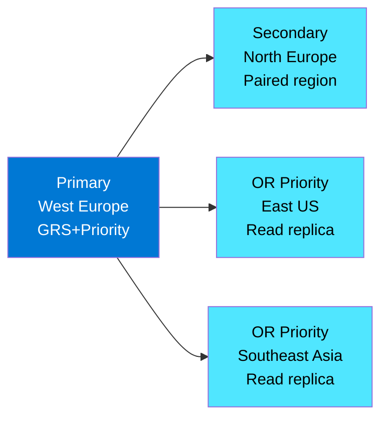
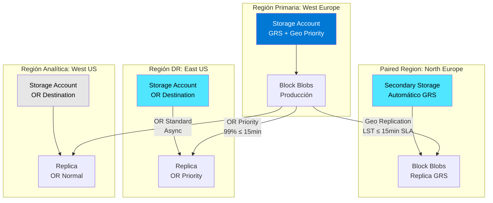

# Azure Storage Priority Replication: Replicación acelerada con SLA

## Resumen

Priority Replication acelera la replicación de datos en Azure Storage con SLA de 15 minutos para cumplir requisitos estrictos de RPO (Recovery Point Objective). Disponible para geo-redundancia (GRS/GZRS) y Object Replication entre cuentas.

## ¿Qué es Priority Replication?

Priority Replication es una capacidad de Azure Storage que **prioriza el tráfico de replicación** y proporciona **garantías SLA** para sincronización de datos entre regiones. Diseñada para escenarios donde el tiempo de replicación es crítico para cumplimiento y continuidad de negocio.

**Dos variantes disponibles**:

1. **Geo Priority Replication**: Para cuentas con GRS/GZRS (redundancia entre regiones)
2. **Object Replication Priority**: Para políticas de Object Replication entre cuentas

**SLA clave**: 99.0% del mes de facturación con Last Sync Time (LST) ≤ 15 minutos

## Geo Priority Replication

Acelera la replicación entre región primaria y secundaria para cuentas con GRS (Geo-Redundant Storage) o GZRS (Geo-Zone-Redundant Storage).

### Disponibilidad y limitaciones

**Regiones soportadas**: Todas las regiones públicas con GRS/GZRS **excepto**:

- West India
- Switzerland West

**Requisitos para GZRS**:

- Región debe soportar Availability Zones
- Región debe tener paired region

### Beneficios principales

1. **RPO garantizado**: Confianza en tiempo de sincronización para cumplimiento
2. **Failover sin sorpresas**: LST predecible si ocurre failover no planificado
3. **Monitoreo mejorado**: Telemetría detallada vía Azure Monitor
4. **SLA respaldado**: Garantía de 99.0% del mes con lag ≤ 15 minutos

### Exclusiones del SLA

El SLA **NO aplica** en estos casos:

**Por tipo de blob**:

- Page blobs y append blobs (SLA solo para Block Blobs)
- Cuentas con llamadas API de Page/Append Blob en últimos 30 días
- Cuentas con features que crean estos blobs (Change Feed, Object Replication, logs en Azure Monitor)

**Por condición de cuenta**:

- LST > 15 minutos durante habilitación de la feature
- Transfer rate > 1 Gbps con backlog pendiente
- > 100 CopyBlob requests/segundo con backlog pendiente

**Por eventos operacionales**:

- Unplanned failover (desactiva automáticamente la feature)
- Durante conversión GRS ↔ GZRS (no afecta si se mantiene dentro de guardrails)

### Habilitar Geo Priority Replication

#### Durante creación de cuenta nueva

**Azure CLI**:

```bash
# Variables
RESOURCE_GROUP="rg-storage-prod"
STORAGE_ACCOUNT="stgeopriorityprod"
LOCATION="westeurope"

# Crear cuenta con Geo Priority Replication
az storage account create \
  --name $STORAGE_ACCOUNT \
  --resource-group $RESOURCE_GROUP \
  --location $LOCATION \
  --sku Standard_GRS \
  --enable-blob-geo-priority-replication true
```

**Azure PowerShell**:

```powershell
# Variables
$rgName = "rg-storage-prod"
$storageAccountName = "stgeopriorityprod"
$location = "westeurope"

# Crear cuenta con Geo Priority Replication
$account = New-AzStorageAccount `
  -ResourceGroupName $rgName `
  -StorageAccountName $storageAccountName `
  -SkuName Standard_GRS `
  -Location $location `
  -EnableBlobGeoPriorityReplication $true
```

#### En cuentas existentes

**Habilitar**:

```bash
# Azure CLI
az storage account update \
  --name $STORAGE_ACCOUNT \
  --resource-group $RESOURCE_GROUP \
  --enable-blob-geo-priority-replication true
```

```powershell
# PowerShell
Set-AzStorageAccount `
  -ResourceGroupName $rgName `
  -StorageAccountName $storageAccountName `
  -EnableBlobGeoPriorityReplication $true
```

**Deshabilitar**:

```bash
# Azure CLI
az storage account update \
  --name $STORAGE_ACCOUNT \
  --resource-group $RESOURCE_GROUP \
  --enable-blob-geo-priority-replication false
```

```powershell
# PowerShell
Set-AzStorageAccount `
  -ResourceGroupName $rgName `
  -StorageAccountName $storageAccountName `
  -EnableBlobGeoPriorityReplication $false
```

### Monitorear cumplimiento con Geo Blob Lag

**Métrica nueva (Preview)**: `Geo Blob Lag` - segundos desde última copia completa entre regiones.

**Habilitar preview**:

1. Azure Portal → Subscriptions → Preview features
2. Feature: `AllowGeoPriorityReplicationMetricsInPortal`
3. Provider: `Microsoft.Storage`

**Acceder a métricas**:

- Portal: Storage Account → **Redundancy** o **Metrics**
- Métrica: **Geo Blob Lag metric (preview)**

!!! warning "Tiempo de activación"
    Las métricas pueden tardar hasta **24 horas** en aparecer tras registrar la feature.

**Uso para validar SLA**:

Monitorear que el lag se mantiene ≤ 15 minutos durante el 99% del mes. Si excede, ese período se excluye del SLA.

## Object Replication Priority

Acelera la replicación entre cuentas de storage usando Object Replication policies. Garantiza que 99.0% de objetos se replican en **≤ 15 minutos** cuando origen y destino están en el **mismo continente**.

### Disponibilidad

**Regiones soportadas**: Todas las regiones públicas **excepto**:

- West India
- Switzerland West

**Portal experience** (Preview):

- Feature: `AllowPriorityObjectReplicationInPortal`
- Provider: `Microsoft.Storage`

### Beneficios principales

1. **SLA de rendimiento**: 99% de objetos en ≤ 15 minutos (mismo continente)
2. **Métricas automáticas**: Activación automática de OR metrics
3. **Visibilidad mejorada**: Time buckets (0-5 min, 5-10 min, >24h)
4. **DR garantizado**: Confianza en tiempos para disaster recovery

### Exclusiones del SLA

El SLA **NO aplica** a:

**Por características del objeto**:

- Objetos > 5 GB
- Objetos modificados > 10 veces/segundo

**Por geografía**:

- Origen y destino en continentes diferentes

**Por tamaño de cuenta**:

- Cuentas > 5 PB
- Cuentas con > 10 mil millones de blobs

**Por condiciones operativas**:

- Transfer rate > 1 Gbps con backlog pendiente
- > 1,000 PUT/DELETE ops/segundo con backlog pendiente
- Durante replicación de blobs existentes tras crear/actualizar policy

!!! note "Limitación de políticas"
    Solo **1 policy** por cuenta origen puede tener Priority Replication habilitado (aunque la cuenta soporte hasta 2 policies).

### Habilitar Object Replication Priority

#### Durante creación de nueva policy

**Azure CLI**:

```bash
# Variables
SRC_ACCOUNT="stgsourceprod"
DST_ACCOUNT="stgdestinationdr"
SRC_CONTAINER="data"
DST_CONTAINER="data-replica"

# Crear policy con Priority Replication
az storage account or-policy create \
  --account-name $DST_ACCOUNT \
  --source-account $SRC_ACCOUNT \
  --destination-container $DST_CONTAINER \
  --source-container $SRC_CONTAINER \
  --min-creation-time "2025-11-11T00:00:00Z" \
  --enable-metrics true \
  --priority-replication true
```

**Azure PowerShell**:

```powershell
# Variables
$rgName = "rg-storage-prod"
$srcAccountName = "stgsourceprod"
$dstAccountName = "stgdestinationdr"
$srcAccountResourceID = "/subscriptions/{sub-id}/resourceGroups/{rg}/providers/Microsoft.Storage/storageAccounts/$srcAccountName"
$srcContainer = "data"
$dstContainer = "data-replica"

# Crear regla y policy con Priority Replication
$rule = New-AzStorageObjectReplicationPolicyRule `
  -SourceContainer $srcContainer `
  -DestinationContainer $dstContainer

$dstPolicy = Set-AzStorageObjectReplicationPolicy `
  -ResourceGroupName $rgName `
  -StorageAccountName $dstAccountName `
  -PolicyId default `
  -SourceAccount $srcAccountResourceID `
  -Rule $rule `
  -EnableMetric $true `
  -EnablePriorityReplication $true

# Aplicar policy en cuenta origen
$srcPolicy = Set-AzStorageObjectReplicationPolicy `
  -ResourceGroupName $rgName `
  -StorageAccountName $srcAccountName `
  -InputObject $dstPolicy

# Verificar habilitación
$srcPolicy.PriorityReplication.Enabled
```

#### En policies existentes

**Habilitar**:

```bash
# Azure CLI
az storage account or-policy update \
  --account-name $DST_ACCOUNT \
  --source-account $SRC_ACCOUNT \
  --destination-container $DST_CONTAINER \
  --source-container $SRC_CONTAINER \
  --min-creation-time "2025-11-11T00:00:00Z" \
  --enable-metrics true \
  --priority-replication true
```

```powershell
# PowerShell
$dstPolicy = Set-AzStorageObjectReplicationPolicy `
  -ResourceGroupName $rgName `
  -StorageAccountName $dstAccountName `
  -PolicyId default `
  -SourceAccount $srcAccountResourceID `
  -Rule $rule `
  -EnableMetric $true `
  -EnablePriorityReplication $true

$srcPolicy = Set-AzStorageObjectReplicationPolicy `
  -ResourceGroupName $rgName `
  -StorageAccountName $srcAccountName `
  -InputObject $dstPolicy

# Confirmar
$srcPolicy.PriorityReplication.Enabled
```

**Deshabilitar**:

```bash
# Azure CLI
az storage account or-policy update \
  --account-name $DST_ACCOUNT \
  --source-account $SRC_ACCOUNT \
  --destination-container $DST_CONTAINER \
  --source-container $SRC_CONTAINER \
  --min-creation-time "2025-11-11T00:00:00Z" \
  --enable-metrics true \
  --priority-replication false
```

```powershell
# PowerShell - cambiar a $false
$dstPolicy = Set-AzStorageObjectReplicationPolicy `
  -ResourceGroupName $rgName `
  -StorageAccountName $dstAccountName `
  -PolicyId default `
  -SourceAccount $srcAccountResourceID `
  -Rule $rule `
  -EnableMetric $true `
  -EnablePriorityReplication $false
```

### Monitorear SLA de Object Replication

Cuando OR Priority Replication está habilitada, **OR metrics se activan automáticamente**.

**Métricas disponibles**:

| Métrica | Descripción | Dimensiones |
|---------|-------------|-------------|
| `Operations pending for replication` | Total de operaciones pendientes | Time buckets |
| `Bytes pending for replication` | Bytes pendientes de replicar | Time buckets |

**Time buckets**:

- 0-5 minutos
- 5-10 minutos
- 10-15 minutos
- 15-30 minutos
- 30 minutos - 2 horas
- 2-8 horas
- 8-24 horas
- > 24 horas

**Validar SLA**:

Monitorear que buckets grandes (>15 min) estén en **cero o cerca de cero** durante el mes.

**Verificar replicación de blob individual**:

```bash
# Comprobar estado de replicación
az storage blob show \
  --account-name $SRC_ACCOUNT \
  --container-name $SRC_CONTAINER \
  --name myblob.txt \
  --query 'objectReplicationSourceProperties[].rules[].status' \
  --output tsv \
  --auth-mode login
```

Estado `Completed` = blob disponible en destino garantizado.

## Precios

### Geo Priority Replication

**Inicio de facturación**: 1 de enero de 2026

- Cuentas existentes con feature habilitada
- Cuentas nuevas que habiliten la feature

**Coste**: Por GB (consultar [Azure Storage Pricing](https://azure.microsoft.com/pricing/details/storage/))

### Object Replication Priority

**Coste**: Por GB de nuevo ingress

**Costes adicionales estándar** (igual que OR normal):

- Transacciones de lectura (origen)
- Transacciones de escritura (destino)
- Network egress

!!! warning "Facturación post-desactivación"
    Ambas features facturan durante **30 días** adicionales tras deshabilitarlas.

## Casos de uso

### Cumplimiento normativo estricto

**Escenario**: Sector financiero/salud con regulaciones de RPO < 15 minutos.

```bash
# Storage account para datos regulados
az storage account create \
  --name stgcomplianceprod \
  --resource-group rg-compliance \
  --location westeurope \
  --sku Standard_GZRS \
  --enable-blob-geo-priority-replication true \
  --tags "Compliance=Financial" "RPO=15min"
```

**Validación**:

- Monitorear Geo Blob Lag diariamente
- Alertas si lag > 10 minutos
- Reportes mensuales de LST para auditorías

### Disaster Recovery con RTO/RPO garantizados

**Escenario**: Aplicación crítica con SLA de DR < 1 hora.

```bash
# Source: Producción (North Europe)
SRC_ACCOUNT="stgappprodneu"
# Destination: DR (West Europe)
DST_ACCOUNT="stgappdrweu"

# Policy OR con Priority Replication
az storage account or-policy create \
  --account-name $DST_ACCOUNT \
  --source-account $SRC_ACCOUNT \
  --destination-container app-data \
  --source-container app-data \
  --min-creation-time "2025-11-11T00:00:00Z" \
  --enable-metrics true \
  --priority-replication true
```

**Beneficio**: Confianza en que datos están en DR site en ≤ 15 minutos.

### Arquitectura multi-región con HA

**Escenario**: Servicio global con réplicas en múltiples continentes.



**Configuración**:

1. **Primary (West Europe)**: GRS + Geo Priority Replication
2. **Secondary paired (North Europe)**: Automático con GRS
3. **US replica**: Object Replication Priority (mismo continente que origen - garantiza SLA)
4. **Asia replica**: Object Replication normal (diferente continente - sin SLA)

### Sincronización de entornos Dev/Test

**Escenario**: Copiar producción a staging con datos frescos.

```powershell
# Policy OR Priority: Prod → Staging
$rule = New-AzStorageObjectReplicationPolicyRule `
  -SourceContainer "production-data" `
  -DestinationContainer "staging-data"

$policy = Set-AzStorageObjectReplicationPolicy `
  -ResourceGroupName "rg-prod" `
  -StorageAccountName "stgstaging" `
  -PolicyId default `
  -SourceAccount "/subscriptions/{id}/resourceGroups/rg-prod/providers/Microsoft.Storage/storageAccounts/stgprod" `
  -Rule $rule `
  -EnableMetric $true `
  -EnablePriorityReplication $true
```

**Beneficio**: Staging siempre con datos < 15 minutos antiguos.

## Arquitectura recomendada

### Patrón Geo-Redundant + Object Replication



**Capas de protección**:

1. **Local redundancy**: ZRS/LRS en región primaria
2. **Geo redundancy con SLA**: Geo Priority Replication a paired region
3. **DR cross-region con SLA**: OR Priority a región DR (mismo continente)
4. **Analítica/archive**: OR estándar a región de análisis

## Buenas prácticas

### Diseño de cuenta

1. **Segregar por SLA**:
   - Cuentas con Priority Replication: Solo Block Blobs
   - Cuentas con Page/Append Blobs: Sin Priority Replication

2. **Evitar exclusiones del SLA**:
   - No habilitar Change Feed si no es necesario
   - No activar diagnostic logs a storage en cuenta con Priority Replication
   - Usar cuentas dedicadas para logs (sin Priority)

3. **Tagging para governance**:

```bash
az storage account create \
  --name $STORAGE_ACCOUNT \
  --resource-group $RESOURCE_GROUP \
  --tags \
    "PriorityReplication=Enabled" \
    "SLA-RPO=15min" \
    "CostCenter=IT-Production" \
    "Compliance=Required"
```

### Monitoreo proactivo

**Alertas recomendadas**:

```bash
# Alert si Geo Blob Lag > 10 minutos (margen de seguridad)
az monitor metrics alert create \
  --name "High-Geo-Lag-Alert" \
  --resource $STORAGE_ACCOUNT_ID \
  --condition "avg GeoBlobLag > 600" \
  --window-size 5m \
  --evaluation-frequency 1m \
  --action-group-id $ACTION_GROUP_ID
```

**Dashboard de cumplimiento**:

- Geo Blob Lag (hourly average)
- OR pending operations por time bucket
- Throughput vs 1 Gbps threshold
- CopyBlob operations vs 100 ops/sec threshold

### Optimización de costes

1. **Evaluar necesidad real de SLA**:
   - Priority Replication: Workloads críticos con RPO estricto
   - GRS/OR estándar: Workloads tolerantes a lag > 15 min

2. **Lifecycle management**:

```json
{
  "rules": [
    {
      "name": "tierToCool",
      "type": "Lifecycle",
      "definition": {
        "filters": {
          "blobTypes": ["blockBlob"]
        },
        "actions": {
          "baseBlob": {
            "tierToCool": {
              "daysAfterModificationGreaterThan": 30
            }
          }
        }
      }
    }
  ]
}
```

Datos en Cool tier siguen replicándose con Priority pero con menor coste de storage.

3. **Revisar policies OR**:
   - Una sola policy con Priority Replication por cuenta origen
   - Otras policies: OR estándar

### Seguridad

1. **Network security**:

```bash
# Restringir acceso a VNETs
az storage account update \
  --name $STORAGE_ACCOUNT \
  --resource-group $RESOURCE_GROUP \
  --default-action Deny

az storage account network-rule add \
  --account-name $STORAGE_ACCOUNT \
  --resource-group $RESOURCE_GROUP \
  --vnet-name my-vnet \
  --subnet app-subnet
```

2. **Encryption**:
   - Customer-managed keys (CMK) para datos en reposo
   - HTTPS obligatorio para datos en tránsito

3. **RBAC granular**:
   - Storage Blob Data Contributor: Apps que escriben
   - Storage Blob Data Reader: Apps DR que solo leen
   - Storage Account Contributor: Operadores que gestionan replicación

## Troubleshooting

### Geo Blob Lag > 15 minutos

**Diagnóstico**:

```bash
# Ver LST actual
az storage account show \
  --name $STORAGE_ACCOUNT \
  --resource-group $RESOURCE_GROUP \
  --query "geoReplicationStats.lastSyncTime" \
  --output tsv

# Comprobar throughput
az monitor metrics list \
  --resource $STORAGE_ACCOUNT_ID \
  --metric "Egress" \
  --start-time $(date -u -d '1 hour ago' +%Y-%m-%dT%H:%M:%SZ) \
  --interval PT5M \
  --aggregation Average
```

**Causas comunes**:

1. **Throughput > 1 Gbps**: Reducir ingress o escalar a múltiples cuentas
2. **CopyBlob > 100 ops/sec**: Distribuir copies en el tiempo
3. **Page/Append blobs**: Revisar si hay features creando estos blobs inadvertidamente

### OR metrics no aparecen

**Validaciones**:

```powershell
# Comprobar que metrics están habilitadas
$policy = Get-AzStorageObjectReplicationPolicy `
  -ResourceGroupName $rgName `
  -StorageAccountName $srcAccountName `
  -PolicyId $policyId

$policy.EnableMetrics
$policy.PriorityReplication.Enabled
```

**Solución**:

- Esperar 24 horas tras habilitar
- Verificar que hay tráfico de replicación activo
- Comprobar que policy está en estado `Enabled`

### SLA no se cumple

**Checklist de elegibilidad**:

- [ ] Solo Block Blobs (no Page/Append)
- [ ] Sin llamadas API Page/Append en últimos 30 días
- [ ] Throughput < 1 Gbps
- [ ] CopyBlob < 100 ops/sec
- [ ] LST ≤ 15 min al habilitar feature
- [ ] OR: Origen y destino en mismo continente
- [ ] OR: Objetos < 5 GB
- [ ] OR: No más de 10 modificaciones/segundo por objeto

**Validar con Azure Support**:

Abrir caso incluyendo:

- Storage Account ID
- Período de incumplimiento (fechas/horas)
- Métricas de Geo Blob Lag o OR pending operations
- Confirmación de elegibilidad (checklist anterior)

## Referencias

- [Geo Priority Replication - Official Docs](https://learn.microsoft.com/en-us/azure/storage/common/storage-redundancy-priority-replication)
- [Object Replication Priority - Official Docs](https://learn.microsoft.com/en-us/azure/storage/blobs/object-replication-priority-replication)
- [Azure Storage SLA Terms](https://www.microsoft.com/licensing/docs/view/Service-Level-Agreements-SLA-for-Online-Services)
- [Object Replication Overview](https://learn.microsoft.com/en-us/azure/storage/blobs/object-replication-overview)
- [Monitor Last Sync Time](https://learn.microsoft.com/en-us/azure/storage/common/last-sync-time-get)
- [Azure Storage Pricing](https://azure.microsoft.com/pricing/details/storage/)
- [Azure Regions List](https://learn.microsoft.com/en-us/azure/reliability/regions-list)
