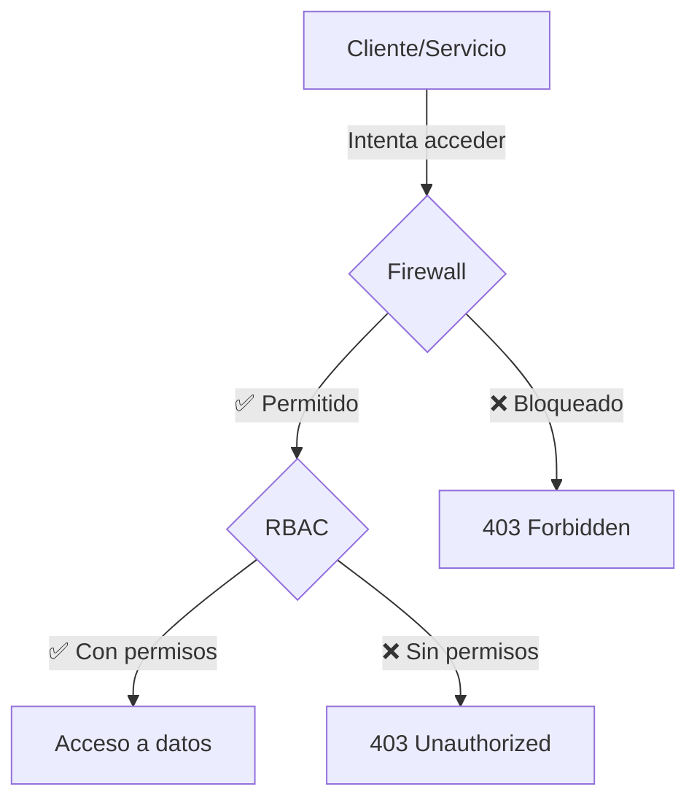

# Seguridad en Azure Storage: Guía Completa de Firewall, Resource Instances y Mejores Prácticas


## Introducción

La seguridad de las cuentas de almacenamiento en Azure es crítica para proteger tus datos. En este artículo profundizaremos en las diferentes opciones de firewall disponibles cuando no se usa Azure private endpoint, con especial énfasis en **Resource Instances**, **Trusted Services** y las configuraciones recomendadas cuando no se utilizan Private Endpoints.

## Conceptos Fundamentales

### ¿Qué es el Firewall de Storage Account?

El firewall de Azure Storage Account es una capa de seguridad que controla el acceso al **endpoint público** de tu cuenta de almacenamiento. Es importante entender que:

- **Un solo firewall** protege TODOS los servicios (Blob, Files, Queue, Table)
- Las reglas aplican a nivel de **Storage Account**, no por servicio individual
- El firewall controla **quién** puede conectarse, mientras que RBAC controla **qué** puede hacer



## Tipos de Reglas de Red

Azure Storage ofrece **cuatro tipos** de reglas de red que puedes configurar:

### 1. Virtual Network Rules

Permiten tráfico desde subnets específicas dentro de Azure Virtual Networks.

```powershell
# Agregar regla de VNet
Add-AzStorageAccountNetworkRule `
    -ResourceGroupName "myRG" `
    -Name "mystorageaccount" `
    -VirtualNetworkResourceId "/subscriptions/xxx/resourceGroups/rg/providers/Microsoft.Network/virtualNetworks/vnet/subnets/subnet"
```

**Límite:** Máximo 400 reglas por Storage Account

### 2. IP Network Rules

Permiten tráfico desde rangos de IP públicas específicas.

```powershell
# Agregar regla de IP
Add-AzStorageAccountNetworkRule `
    -ResourceGroupName "myRG" `
    -Name "mystorageaccount" `
    -IPAddressOrRange "203.0.113.0/24"
```

**Límite:** Máximo 400 reglas por Storage Account

### 3. Resource Instance Rules ⭐

Permiten tráfico desde **recursos Azure específicos** identificados por su Resource ID.

```powershell
# Agregar Resource Instance
Add-AzStorageAccountNetworkRule `
    -ResourceGroupName "myRG" `
    -Name "mystorageaccount" `
    -TenantId "your-tenant-id" `
    -ResourceId "/subscriptions/xxx/resourceGroups/rg/providers/Microsoft.Synapse/workspaces/myworkspace"
```

**Límite:** Máximo 200 reglas por Storage Account

### 4. Trusted Service Exceptions

Permiten tráfico desde servicios de Microsoft en la lista de confianza.

```powershell
# Habilitar Trusted Services
Update-AzStorageAccountNetworkRuleSet `
    -ResourceGroupName "myRG" `
    -Name "mystorageaccount" `
    -Bypass AzureServices,Logging,Metrics
```

**Límite:** Sin límite (es un flag de configuración)

## Resource Instances: Control Granular

### ¿Qué son las Resource Instances?

Las **Resource Instance Rules** son la forma más segura de permitir acceso a servicios Azure cuando no usas Private Endpoints. A diferencia de Trusted Services (que permite CUALQUIER instancia de un servicio en tu tenant), Resource Instances te permite especificar **exactamente qué recurso** puede acceder.

### Comparación: Trusted Services vs Resource Instances

| Aspecto | Trusted Services | Resource Instances |
|---------|-----------------|-------------------|
| **Granularidad** | ❌ Cualquier instancia del tenant | ✅ Solo recursos específicos |
| **Seguridad** | ⚠️ Permisivo | ✅ Restrictivo |
| **Principio de menor privilegio** | ❌ No cumple | ✅ Cumple completamente |
| **Auditoría** | ❌ Difícil rastrear | ✅ Trazabilidad completa |
| **Compliance** | ⚠️ Puede tener problemas | ✅ SOC2, ISO27001 friendly |
| **Zero Trust** | ❌ No alineado | ✅ Completamente alineado |

### Ejemplo Práctico

Imagina que tienes múltiples Azure Synapse Workspaces en tu tenant:

=== "❌ Con Trusted Services"

    ```powershell
    Update-AzStorageAccountNetworkRuleSet `
        -Bypass AzureServices
    
    # Resultado:
    # ✅ prod-synapse → Acceso permitido
    # ✅ dev-synapse → Acceso permitido
    # ✅ test-synapse → Acceso permitido
    # ✅ Cualquier otro Synapse creado → Acceso permitido
    ```

=== "✅ Con Resource Instances"

    ```powershell
    Add-AzStorageAccountNetworkRule `
        -TenantId "xxx" `
        -ResourceId "/subscriptions/xxx/.../Microsoft.Synapse/workspaces/prod-synapse"
    
    # Resultado:
    # ✅ prod-synapse → Acceso permitido
    # ❌ dev-synapse → Bloqueado
    # ❌ test-synapse → Bloqueado
    # ❌ Cualquier otro Synapse → Bloqueado
    ```

## Requerimientos para Resource Instances

Para usar Resource Instances correctamente, necesitas cumplir varios requisitos:

### ✅ Checklist de Requerimientos

- [x] **Managed Identity**: El recurso debe tener System-Assigned Managed Identity habilitada
- [x] **Mismo Tenant**: Recurso y Storage Account en el mismo Microsoft Entra tenant
- [x] **Firewall Restrictivo**: Storage Account con `DefaultAction: Deny`
- [x] **Permisos para configurar**: Rol Storage Account Contributor o superior
- [x] **Resource ID completo**: Necesitas el Resource ID del recurso Azure
- [x] **Rol RBAC asignado**: La Managed Identity necesita roles de acceso a datos

!!! warning "Importante"
    La Resource Instance Rule solo da acceso al **endpoint público**, NO a los datos. Debes asignar roles RBAC a la Managed Identity del recurso.

### Configuración Completa Paso a Paso

```powershell
# Variables
$rgName = "myResourceGroup"
$storageAccount = "mystorageaccount"
$synapseWorkspaceName = "prod-synapse"
$synapseRG = "synapse-rg"
$tenantId = "xxxxxxxx-xxxx-xxxx-xxxx-xxxxxxxxxxxx"

# 1. Obtener Resource ID del Synapse Workspace
$synapseResourceId = (Get-AzSynapseWorkspace `
    -ResourceGroupName $synapseRG `
    -Name $synapseWorkspaceName).Id

# 2. Configurar firewall restrictivo
Update-AzStorageAccountNetworkRuleSet `
    -ResourceGroupName $rgName `
    -Name $storageAccount `
    -DefaultAction Deny `
    -Bypass Logging,Metrics

# 3. Agregar Resource Instance Rule
Add-AzStorageAccountNetworkRule `
    -ResourceGroupName $rgName `
    -Name $storageAccount `
    -TenantId $tenantId `
    -ResourceId $synapseResourceId

# 4. Obtener Managed Identity Object ID
$workspace = Get-AzSynapseWorkspace `
    -ResourceGroupName $synapseRG `
    -Name $synapseWorkspaceName
$principalId = $workspace.Identity.PrincipalId

# 5. Asignar rol RBAC para acceso a datos
New-AzRoleAssignment `
    -ObjectId $principalId `
    -RoleDefinitionName "Storage Blob Data Contributor" `
    -Scope "/subscriptions/$((Get-AzContext).Subscription.Id)/resourceGroups/$rgName/providers/Microsoft.Storage/storageAccounts/$storageAccount"

Write-Host "✅ Configuración completa!" -ForegroundColor Green
```

## Excepciones (Bypass): Logging y Metrics

Las **Exceptions** son configuraciones especiales que permiten que ciertos servicios bypaseen el firewall.

### Tipos de Excepciones

#### 1. Allow Azure services on the trusted services list

```yaml
Bypass: AzureServices

¿Qué hace?
  - Permite TODOS los servicios de la lista de Trusted Services
  - Incluye: Azure Backup, Synapse, SQL, Stream Analytics, etc.

⚠️ Recomendación: Usar Resource Instances en su lugar
```

#### 2. Allow read access to storage logging

```yaml
Bypass: Logging

¿Qué hace?
  - Permite leer el contenedor especial "$logs"
  - Solo para diagnósticos de Azure Monitor
  - NO da acceso a tus datos de aplicación

✅ Recomendación: SIEMPRE habilitado
```

#### 3. Allow read access to storage metrics

```yaml
Bypass: Metrics

¿Qué hace?
  - Permite leer las tablas "$Metrics*"
  - Solo para métricas de Azure Monitor
  - NO da acceso a tus datos de aplicación

✅ Recomendación: SIEMPRE habilitado
```

### Cómo Configurar Excepciones en el Portal

1. Ve a tu Storage Account
2. Navega a: **Security + networking** → **Networking**
3. Click en **View** junto a "Virtual networks, IP addresses, and exceptions"
4. Scroll down hasta la sección **Exceptions**
5. Marca/desmarca los checkboxes según necesites:
   - ☐ Allow Azure services on the trusted services list
   - ☑️ Allow read access to storage logging
   - ☑️ Allow read access to storage metrics
6. Click en **Save**

## Configuración Recomendada sin Private Endpoints

Esta es la configuración óptima para máxima seguridad sin el costo adicional de Private Endpoints:

### 🎯 Configuración de Producción

!!! info "Nota sobre Azure Backup"
    Si usas **Azure Backup para discos no administrados**, necesitarás habilitar `AzureServices` en el Bypass. Ver [sección de Azure Backup](#casos-especiales-servicios-que-requieren-trusted-services) para más detalles.

```powershell
# 1. Configurar firewall restrictivo con excepciones de lectura
Update-AzStorageAccountNetworkRuleSet `
    -ResourceGroupName "myRG" `
    -Name "mystorageaccount" `
    -DefaultAction Deny `
    -Bypass Logging,Metrics  # SIN AzureServices (a menos que uses Azure Backup)

# 2. Agregar Resource Instances específicas
$resources = @(
    "/subscriptions/xxx/resourceGroups/rg1/providers/Microsoft.Synapse/workspaces/prod-synapse",
    "/subscriptions/xxx/resourceGroups/rg1/providers/Microsoft.DataFactory/factories/prod-adf",
    "/subscriptions/xxx/resourceGroups/rg1/providers/Microsoft.Databricks/workspaces/prod-dbx"
)

foreach ($resourceId in $resources) {
    Add-AzStorageAccountNetworkRule `
        -ResourceGroupName "myRG" `
        -Name "mystorageaccount" `
        -TenantId "your-tenant-id" `
        -ResourceId $resourceId
}

# 3. Agregar IPs de oficina/VPN (opcional)
$officeIPs = @("203.0.113.10", "198.51.100.0/24")
foreach ($ip in $officeIPs) {
    Add-AzStorageAccountNetworkRule `
        -ResourceGroupName "myRG" `
        -Name "mystorageaccount" `
        -IPAddressOrRange $ip
}
```

### Arquitectura Visual

```
┌─────────────────────────────────────────────────────────────┐
│         Storage Account Firewall Configuration              │
├─────────────────────────────────────────────────────────────┤
│                                                             │
│ Public network access: Selected networks                    │
│ Default Action: DENY                                        │
│                                                             │
│ ━━━━━━━━━━━━━━━━━━━━━━━━━━━━━━━━━━━━━━━━━━━━━━━━━━━━━━━━│
│                                                             │
│ Exceptions (Bypass):                                        │
│   ☐ AzureServices (NO - demasiado permisivo)               │
│   ☑️ Logging (SÍ - para troubleshooting)                   │
│   ☑️ Metrics (SÍ - para monitoreo)                         │
│                                                             │
│ ━━━━━━━━━━━━━━━━━━━━━━━━━━━━━━━━━━━━━━━━━━━━━━━━━━━━━━━━│
│                                                             │
│ Resource Instances (granular):                             │
│   ✅ prod-synapse                                           │
│   ✅ prod-adf                                               │
│   ✅ prod-databricks                                        │
│                                                             │
│ VNet Rules: [subnets específicas]                          │
│ IP Rules: [oficinas, VPN]                                  │
│                                                             │
└─────────────────────────────────────────────────────────────┘
```

## Alcance del Firewall: Todos los Servicios

!!! important "Concepto Clave"
    El firewall de Storage Account protege **TODOS** los servicios, no puedes configurarlo por servicio individual.

### Servicios Afectados

El firewall aplica a todos estos endpoints:

- 🔵 **Blob Storage**: `https://{account}.blob.core.windows.net`
- 📁 **File Storage**: `https://{account}.file.core.windows.net`
- 📮 **Queue Storage**: `https://{account}.queue.core.windows.net`
- 📊 **Table Storage**: `https://{account}.table.core.windows.net`

### Control Granular por Servicio

Si necesitas que un recurso acceda solo a Blob pero no a Files, usa **RBAC**:

```powershell
# Firewall: Permite conexión al endpoint (todos los servicios)
Add-AzStorageAccountNetworkRule -ResourceId $resourceId

# RBAC: Controla acceso específico por servicio
New-AzRoleAssignment `
    -ObjectId $principalId `
    -RoleDefinitionName "Storage Blob Data Contributor" `  # Solo Blob
    -Scope $storageAccountScope

# No asignas roles para Files, Queues o Tables
# → Aunque el firewall permita conexión, no tiene permisos RBAC
```

## Validación de Configuración

### Script de Validación Completa

```powershell
function Test-StorageAccountSecurityConfig {
    param(
        [string]$ResourceGroupName,
        [string]$StorageAccountName
    )

    $rules = Get-AzStorageAccountNetworkRuleSet `
        -ResourceGroupName $ResourceGroupName `
        -Name $StorageAccountName

    Write-Host "`n🔍 VALIDACIÓN DE CONFIGURACIÓN ÓPTIMA" -ForegroundColor Cyan
    Write-Host "═══════════════════════════════════════`n" -ForegroundColor Cyan

    $score = 0
    $maxScore = 5

    # Check 1: DefaultAction
    if ($rules.DefaultAction -eq "Deny") {
        Write-Host "✅ DefaultAction: Deny (Correcto)" -ForegroundColor Green
        $score++
    } else {
        Write-Host "❌ DefaultAction: Allow (Cambiar a Deny)" -ForegroundColor Red
    }

    # Check 2: Bypass óptimo
    if ($rules.Bypass -notlike "*AzureServices*" -and 
        $rules.Bypass -like "*Logging*" -and 
        $rules.Bypass -like "*Metrics*") {
        Write-Host "✅ Bypass: Logging,Metrics (Óptimo)" -ForegroundColor Green
        $score++
    } elseif ($rules.Bypass -like "*AzureServices*") {
        Write-Host "⚠️  Bypass incluye AzureServices (Considerar usar Resource Instances)" -ForegroundColor Yellow
    }

    # Check 3: Resource Instances
    if ($rules.ResourceAccessRules.Count -gt 0) {
        Write-Host "✅ Resource Instances: $($rules.ResourceAccessRules.Count) configuradas" -ForegroundColor Green
        foreach ($rule in $rules.ResourceAccessRules) {
            $resourceName = $rule.ResourceId.Split('/')[-1]
            Write-Host "   → $resourceName" -ForegroundColor Gray
        }
        $score++
    } else {
        Write-Host "⚠️  No hay Resource Instances configuradas" -ForegroundColor Yellow
    }

    # Check 4: VNet Rules
    if ($rules.VirtualNetworkRules.Count -gt 0) {
        Write-Host "✅ VNet Rules: $($rules.VirtualNetworkRules.Count)" -ForegroundColor Green
        $score++
    }

    # Check 5: IP Rules
    if ($rules.IpRules.Count -gt 0) {
        Write-Host "✅ IP Rules: $($rules.IpRules.Count)" -ForegroundColor Green
        $score++
    }

    # Resumen
    Write-Host "`n════════════════════════════════════════" -ForegroundColor Cyan
    Write-Host "Puntaje de Seguridad: $score/$maxScore" -ForegroundColor $(
        if ($score -eq $maxScore) { "Green" } 
        elseif ($score -ge 3) { "Yellow" } 
        else { "Red" }
    )

    if ($score -ge 4 -and $rules.Bypass -notlike "*AzureServices*") {
        Write-Host "🎉 CONFIGURACIÓN ÓPTIMA" -ForegroundColor Green
    } else {
        Write-Host "⚠️  Revisar configuración según recomendaciones" -ForegroundColor Yellow
    }
}

# Uso
Test-StorageAccountSecurityConfig -ResourceGroupName "myRG" -StorageAccountName "mystorageaccount"
```

## Mejores Prácticas

### ✅ Recomendaciones de Seguridad

1. **Usa Resource Instances en lugar de Trusted Services**
   - Mayor control y trazabilidad
   - Cumple con Zero Trust
   - Mejor para compliance

2. **Siempre habilita Logging y Metrics**
   - Necesario para troubleshooting
   - No expone tus datos
   - Bajo riesgo de seguridad

3. **Aplica el principio de menor privilegio**
   - Firewall: Solo recursos que realmente necesitan acceso
   - RBAC: Solo los permisos mínimos necesarios

4. **Documenta tus Resource Instances**
   - Mantén un registro de qué recurso accede y por qué
   - Facilita auditorías y compliance

5. **Revisa periódicamente las reglas**
   - Elimina recursos que ya no existen
   - Verifica que las reglas siguen siendo necesarias

### ⚠️ Errores Comunes a Evitar

!!! danger "No hagas esto"
    - ❌ Dejar `DefaultAction: Allow` en producción
    - ❌ Usar solo Trusted Services por conveniencia
    - ❌ Olvidar asignar roles RBAC después de crear Resource Instance
    - ❌ No documentar para qué sirve cada regla
    - ❌ Deshabilitar Logging y Metrics

## Casos Especiales: Servicios que Requieren Trusted Services

Algunos servicios de Azure **NO soportan Resource Instances** y requieren que tengas habilitado `Bypass: AzureServices`. Es importante conocer estos casos para planificar tu estrategia de seguridad.

### Azure Backup

**Azure Backup** es uno de los servicios más importantes que requiere Trusted Services para ciertos escenarios:

!!! warning "Azure Backup y Trusted Services"
    Azure Backup necesita `Bypass: AzureServices` habilitado para:
    
    - **Backup de discos no administrados** (unmanaged disks) en VMs
    - **Restore de VMs** con discos no administrados
    - Algunos escenarios de backup de Azure Files
    
    **NO necesita** Trusted Services para:
    
    - Backup de discos administrados (managed disks) - Azure los gestiona automáticamente

#### Configuración para Azure Backup

Si usas Azure Backup, tienes dos opciones:

=== "Opción 1: Trusted Services (Menos Seguro)"

    ```powershell
    # Habilitar Trusted Services para Azure Backup
    Update-AzStorageAccountNetworkRuleSet `
        -ResourceGroupName "myRG" `
        -Name "mystorageaccount" `
        -DefaultAction Deny `
        -Bypass AzureServices,Logging,Metrics
    
    # ⚠️ Esto permite acceso a TODOS los servicios trusted
    # No solo Azure Backup
    ```

=== "Opción 2: Híbrida (Más Seguro)"

    ```powershell
    # Combinar Trusted Services + Resource Instances
    Update-AzStorageAccountNetworkRuleSet `
        -ResourceGroupName "myRG" `
        -Name "mystorageaccount" `
        -DefaultAction Deny `
        -Bypass AzureServices,Logging,Metrics  # Para Azure Backup
    
    # Agregar Resource Instances para otros servicios
    Add-AzStorageAccountNetworkRule `
        -TenantId "xxx" `
        -ResourceId "/subscriptions/xxx/.../Microsoft.Synapse/workspaces/prod-synapse"
    
    # Resultado:
    # ✅ Azure Backup funciona (via Trusted Services)
    # ✅ Synapse tiene acceso controlado (via Resource Instance)
    # ⚠️ Otros servicios trusted también tienen acceso
    ```

### Otros Servicios que Pueden Requerir Trusted Services

| Servicio | ¿Soporta Resource Instances? | Notas |
|----------|------------------------------|-------|
| **Azure Backup** | ❌ Solo vía Trusted Services | Para discos no administrados |
| **Azure Site Recovery** | ❌ Solo vía Trusted Services | Replicación y DR |
| **Azure Import/Export** | ❌ Solo vía Trusted Services | Transferencia masiva de datos |
| **Azure DevTest Labs** | ❌ Solo vía Trusted Services | Creación de imágenes |
| **Azure Event Grid** | ⚠️ Depende del escenario | Algunos casos necesitan Trusted Services |
| **Azure Synapse** | ✅ Soporta Resource Instances | **Recomendado** usar Resource Instances |
| **Azure Data Factory** | ✅ Soporta Resource Instances | **Recomendado** usar Resource Instances |
| **Azure Databricks** | ✅ Soporta Resource Instances | **Recomendado** usar Resource Instances |
| **Azure SQL Database** | ✅ Soporta Resource Instances | **Recomendado** usar Resource Instances |
| **Azure Stream Analytics** | ✅ Soporta Resource Instances | **Recomendado** usar Resource Instances |

### Estrategia Recomendada con Azure Backup

Si necesitas usar Azure Backup pero quieres mantener la máxima seguridad:

1. **Evalúa si realmente necesitas Trusted Services**
   ```powershell
   # ¿Usas discos no administrados?
   Get-AzVM | Where-Object {$_.StorageProfile.OsDisk.ManagedDisk -eq $null}
   
   # Si el resultado está vacío, NO necesitas Trusted Services para Backup
   ```

2. **Migra a Managed Disks si es posible**
   - Los managed disks NO requieren Trusted Services
   - Mejor rendimiento y gestión
   - Recomendado por Microsoft

3. **Si DEBES usar Trusted Services, documéntalo**
   ```yaml
   Storage Account: mystorageaccount
   Bypass: AzureServices
   Motivo: Azure Backup de VMs con discos no administrados
   VMs afectadas: 
     - vm-legacy-01
     - vm-legacy-02
   Plan de migración: Q2 2026
   ```

4. **Usa Resource Instances para todo lo demás**
   - Synapse, Data Factory, Databricks → Resource Instances
   - Solo Azure Backup usa Trusted Services
   - Documenta qué servicios usan cada método

### Ejemplo de Configuración Real con Azure Backup

```powershell
# Escenario: Necesitas Azure Backup + Synapse + Data Factory

$rgName = "myResourceGroup"
$storageAccount = "mystorageaccount"
$tenantId = "your-tenant-id"

# 1. Configurar con Trusted Services (requerido para Azure Backup)
Update-AzStorageAccountNetworkRuleSet `
    -ResourceGroupName $rgName `
    -Name $storageAccount `
    -DefaultAction Deny `
    -Bypass AzureServices,Logging,Metrics

Write-Host "✅ Trusted Services habilitado (Azure Backup)" -ForegroundColor Yellow

# 2. Agregar Resource Instances para control granular de otros servicios
# Aunque Trusted Services está habilitado, esto añade trazabilidad
$resources = @(
    "/subscriptions/xxx/resourceGroups/rg1/providers/Microsoft.Synapse/workspaces/prod-synapse",
    "/subscriptions/xxx/resourceGroups/rg1/providers/Microsoft.DataFactory/factories/prod-adf"
)

foreach ($resourceId in $resources) {
    Add-AzStorageAccountNetworkRule `
        -ResourceGroupName $rgName `
        -Name $storageAccount `
        -TenantId $tenantId `
        -ResourceId $resourceId
    
    Write-Host "✅ Resource Instance agregada: $($resourceId.Split('/')[-1])" -ForegroundColor Green
}

# 3. Documentar en tags
$tags = @{
    "FirewallConfig" = "TrustedServices+ResourceInstances"
    "TrustedServicesReason" = "Azure Backup - Unmanaged Disks"
    "MigrationPlan" = "Move to Managed Disks by Q2-2026"
}

Update-AzStorageAccount `
    -ResourceGroupName $rgName `
    -Name $storageAccount `
    -Tag $tags

Write-Host "✅ Configuración documentada en tags" -ForegroundColor Green
```

!!! tip "Mejora Continua"
    **Planifica la eliminación de Trusted Services:**
    
    1. Identifica VMs con discos no administrados
    2. Crea un plan de migración a managed disks
    3. Una vez migrado, deshabilita Trusted Services
    4. Usa solo Resource Instances para máxima seguridad

## Troubleshooting

### Error 403: Acceso Denegado

Si recibes errores 403, verifica en este orden:

1. **Firewall**: ¿El recurso tiene una Resource Instance Rule?
   ```powershell
   (Get-AzStorageAccountNetworkRuleSet -ResourceGroupName "rg" -Name "sa").ResourceAccessRules
   ```

2. **RBAC**: ¿La Managed Identity tiene roles asignados?
   ```powershell
   Get-AzRoleAssignment -ObjectId $principalId -Scope $storageScope
   ```

3. **Managed Identity**: ¿Está habilitada?
   ```powershell
   $workspace = Get-AzSynapseWorkspace -Name "myworkspace"
   $workspace.Identity.Type
   ```

4. **Tenant**: ¿Ambos recursos están en el mismo tenant?
   ```powershell
   (Get-AzResource -ResourceId $resourceId).TenantId
   ```

### Verificar Acceso por Servicio

```powershell
$ctx = New-AzStorageContext -StorageAccountName "sa" -UseConnectedAccount

# Probar Blob
try {
    Get-AzStorageContainer -Context $ctx -MaxCount 1
    Write-Host "✅ Blob: Accesible"
} catch {
    Write-Host "❌ Blob: $($_.Exception.Message)"
}

# Probar Queue
try {
    Get-AzStorageQueue -Context $ctx | Select-Object -First 1
    Write-Host "✅ Queue: Accesible"
} catch {
    Write-Host "❌ Queue: $($_.Exception.Message)"
}
```

## Cuándo Usar Private Endpoints

Considera usar Private Endpoints en lugar de o además de las configuraciones de firewall cuando:

- ✅ Necesitas cumplimiento estricto de compliance
- ✅ No quieres exponer endpoints públicos en absoluto
- ✅ Requieres conectividad desde On-Premises vía ExpressRoute
- ✅ La latencia es crítica y necesitas tráfico privado
- ✅ Presupuesto disponible (hay costos adicionales)

La configuración con Resource Instances es suficiente cuando:

- ✅ Los recursos están en Azure (no on-premises)
- ✅ El endpoint público con firewall es aceptable
- ✅ Quieres balancear seguridad y costos
- ✅ No hay requisitos de red privada obligatorios

## Conclusión

La seguridad de Azure Storage Account requiere una configuración cuidadosa del firewall. Las principales conclusiones son:

1. **Resource Instances > Trusted Services** para control granular
2. **Siempre habilita Logging y Metrics** para observabilidad
3. **Combina Firewall + RBAC** para defensa en profundidad
4. **Un firewall protege todos los servicios** (Blob, Files, Queue, Table)
5. **Sin Private Endpoints, usa Resource Instances** como mejor práctica
6. **Azure Backup requiere Trusted Services** para discos no administrados (considera migrar a managed disks)

### Configuración Resumida Óptima

=== "Sin Azure Backup"

    ```powershell
    # La configuración perfecta para producción sin Private Endpoints
    Update-AzStorageAccountNetworkRuleSet `
        -DefaultAction Deny `
        -Bypass Logging,Metrics  # NO AzureServices
    
    # Agregar solo recursos específicos necesarios
    Add-AzStorageAccountNetworkRule -ResourceId $specificResourceId
    
    # Asignar roles RBAC mínimos necesarios
    New-AzRoleAssignment -ObjectId $principalId -RoleDefinitionName "Storage Blob Data Reader"
    ```

=== "Con Azure Backup"

    ```powershell
    # Si necesitas Azure Backup para discos no administrados
    Update-AzStorageAccountNetworkRuleSet `
        -DefaultAction Deny `
        -Bypass AzureServices,Logging,Metrics  # Requerido para Azure Backup
    
    # Agregar Resource Instances para trazabilidad de otros servicios
    Add-AzStorageAccountNetworkRule -ResourceId $specificResourceId
    
    # Asignar roles RBAC
    New-AzRoleAssignment -ObjectId $principalId -RoleDefinitionName "Storage Blob Data Reader"
    
    # Documentar y planificar migración a Managed Disks
    ```

## Referencias

- [Azure Storage network security](https://learn.microsoft.com/en-us/azure/storage/common/storage-network-security)
- [Resource instance network rules](https://learn.microsoft.com/en-us/azure/storage/common/storage-network-security-resource-instances)
- [Trusted Azure services](https://learn.microsoft.com/en-us/azure/storage/common/storage-network-security-trusted-azure-services)
- [Manage network security exceptions](https://learn.microsoft.com/en-us/azure/storage/common/storage-network-security-manage-exceptions)

---

!!! tip "¿Necesitas ayuda?"
    Si tienes dudas sobre la configuración de seguridad de tu Storage Account, revisa la documentación oficial o abre un caso de soporte con Microsoft Azure.
