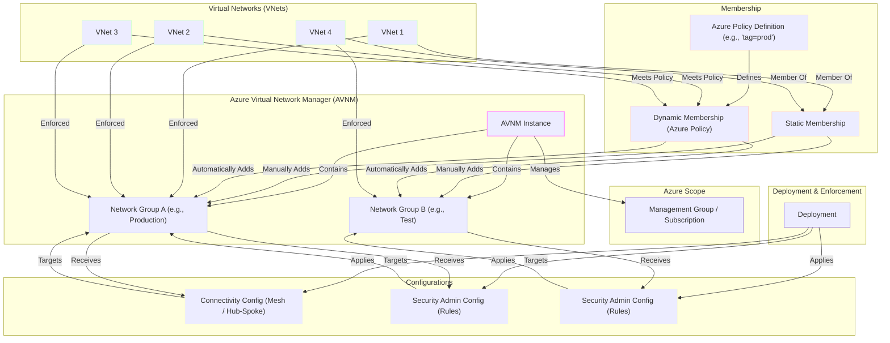

# Azure Virtual Network Manager: Illustrative relationship between components

## Diagram Explanation

1.  **Azure Scope**: Azure Virtual Network Manager (AVNM) operates within a defined **scope**, which can be a **Management Group** or a **Subscription**. This determines which VNets AVNM can "see" and manage.
2.  **AVNM Instance**: This is the main Azure Virtual Network Manager resource. Network groups and configurations are created and managed from here.
3.  **Network Groups**:
    * These are **logical containers** for your Virtual Networks (VNets).
    * They allow you to group VNets with common characteristics (environment, region, etc.).
    * A VNet can belong to multiple network groups.
4.  **Membership**: How VNets are added to Network Groups:
    * **Static Membership**: You add VNets **manually**, selecting them one by one.
    * **Dynamic Membership**: Uses **Azure Policy** to automatically add VNets that meet certain criteria (like tags, names, locations). VNets matching the policy are dynamically added (and removed) from the group.
5.  **Virtual Networks (VNets)**: These are the Azure virtual networks that are being managed.
6.  **Configurations**: AVNM allows you to apply two main types of configurations to Network Groups:
    * **Connectivity Config**: Defines how VNets connect within a group (or between groups). You can create topologies like **Mesh** (all connected to each other) or **Hub-and-Spoke** (a central VNet connected to several "spoke" VNets).
    * **Security Admin Config**: Allows you to define high-level **security rules** that apply to the VNets in a group. These rules can **override** Network Security Group (NSG) rules, enabling centralized and mandatory security policies.
7.  **Deployment & Enforcement**:
    * The created configurations (connectivity and security) must be **Deployed**.
    * During deployment, AVNM translates these configurations and applies them to the VNets that are members of the target network groups in the selected regions.
    * Once deployed, the VNets within the groups **receive** and **apply** (Enforced) these configurations, establishing the defined connections and security rules.

    And maybe this post will be published in the official [documentation of Azure Virtual Network Manager](https://github.com/MicrosoftDocs/azure-docs/pull/126940), who knows? 😉