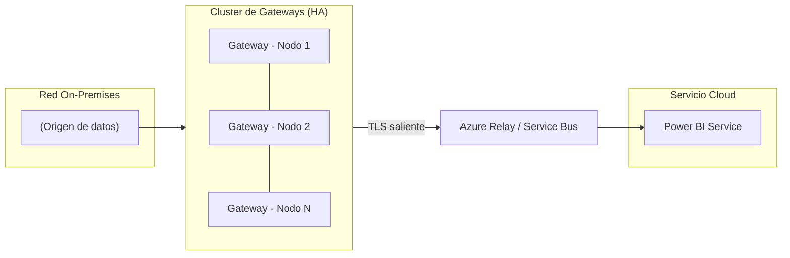

# Power BI On-Premises Data Gateway: guía práctica (instalación estándar)

## Resumen

Esta entrada explica de forma práctica qué es el Power BI On-Premises Data Gateway Standard, su arquitectura básica, y cómo realizar una instalación estándar y configurarlo para refrescos y conexiones seguras desde el servicio de Power BI. Está orientada a administradores y responsables de plataforma que necesiten conectar fuentes de datos locales a Power BI sin usar soluciones de red avanzadas (no cubre la instalación en Virtual Network Data Gateway ni escenarios sovereign).

## ¿Qué es el On-Premises Data Gateway?

El On-Premises Data Gateway es un componente que actúa como puente entre los servicios cloud de Microsoft (por ejemplo, Power BI, Power Automate, Power Apps) y tus datos que residen en la red local o en entornos no accesibles públicamente. Proporciona un canal saliente seguro (TLS) para permitir conexiones desde la nube hacia los orígenes de datos on‑premises sin abrir puertos entrantes en tu red.

Principales funciones:
- Habilitar refrescos programados de datasets de Power BI.
- Soportar consultas en vivo (DirectQuery/Live Connection) hacia orígenes compatibles.
- Permitir que flujos y aplicaciones en cloud accedan a bases de datos y servicios internos.

## Arquitectura básica

- Gateway instalado en uno o varios servidores dentro de la red local.
- El servicio gateway establece conexiones salientes a los endpoints de Microsoft (no requiere inbound).
- En producción, se recomienda desplegar gateways en modo cluster (alta disponibilidad) y definir data sources centralizados en el panel de administración de Power BI.

### Diagrama (simplificado)

### Arquitectura: Gateway en cluster (alta disponibilidad)

!!! note
    Físicamente el Gateway establece conexiones salientes TLS hacia los servicios de Azure (Azure Service Bus / Azure Relay). Las solicitudes brokered se mantienen gracias a las conexiones salientes iniciadas por el gateway.    
    

## Instalación (instalación estándar)

Los pasos siguientes describen una instalación típica y segura de un Gateway estándar:

1. Descargar el instalador oficial
   - [Descargar el instalador del gateway desde el sitio oficial de Microsoft](https://go.microsoft.com/fwlink/?LinkId=2116849&clcid=0x409).

2. Ejecutar el instalador en el servidor destinado
   - Ejecuta el instalador con privilegios de administrador.
   - Acepta los términos y elige la instalación estándar cuando se solicite.

3. Iniciar sesión y registrar el gateway
   - Al finalizar la instalación se abrirá un asistente que solicita iniciar sesión con una cuenta organizativa (Entra ID).
   - Registra el gateway en tu tenant y proporciona un nombre descriptivo para el gateway.

4. Definir la clave de recuperación
   - El asistente pedirá que crees una "recovery key". Guárdala en un lugar seguro: es necesaria para migrar o restaurar el gateway.

5. Elegir cuenta de servicio (opcional)
   - Puedes ejecutar el servicio con la cuenta de sistema local por defecto o configurar una cuenta de dominio/service account con los permisos mínimos necesarios para acceder a los orígenes de datos.

6. Verificar conectividad
   - Asegúrate de que el servidor puede establecer conexiones TLS salientes a los endpoints de Microsoft (comprobar reglas de firewall/proxy si existen).

7. (Opcional) Agregar nodos al cluster
   - Para alta disponibilidad, instala el gateway en otro servidor y en lugar de registrar un nuevo gateway selecciona unirte al cluster existente.

## Configuración en el servicio Power BI

1. Abrir el portal de Power BI y acceder a "Manage gateways" (Administrar gateways).
2. Crear y/o revisar Data Sources dentro del gateway: especifica el tipo de origen (SQL Server, Analysis Services, etc.), cadena de conexión, y credenciales.
3. En los datasets de Power BI: configurar el dataset para usar el gateway correspondiente y programar refrescos.
4. Para DirectQuery/Live connection: asegúrate de que el data source esté correctamente configurado y que el usuario tenga permisos adecuados.

Consejos prácticos:
- Centraliza la definición de data sources para facilitar el mantenimiento.
- Usa credenciales de tipo "service principal" o cuentas administradas cuando el origen lo permita y por seguridad.

## Buenas prácticas y seguridad

- Alta disponibilidad: despliega gateways en cluster para evitar puntos únicos de fallo.
- Mínimos privilegios: la cuenta que use el gateway solo debería tener los permisos necesarios en los orígenes de datos.
- Key management: guarda la recovery key en un almacén seguro y documenta el proceso de recuperación.
- Parches y mantenimiento: aplica actualizaciones del sistema operativo y del gateway según las políticas de tu organización.
- Monitorización: habilita logs y métricas para detectar problemas de rendimiento y errores en los refrescos.
- Red y firewall: permite únicamente el tráfico saliente necesario hacia los endpoints de Microsoft y evita abrir puertos entrantes.

## Monitorización y diagnóstico

- Revisa el panel de estado del gateway en Power BI Service para incidentes y estado de los nodos.
- Examina los registros locales del gateway (ubicación estándar indicada por el instalador) para errores detallados.
- Utiliza contadores de rendimiento (CPU, memoria, latencia de red) en el servidor para diagnosticar cuellos de botella.
- Para problemas de refresco: revisa el historial de refrescos del dataset en Power BI y los detalles del error proporcionados por el servicio.

## Referencias y lecturas recomendadas

- Documentación oficial de Microsoft (Power BI - On-premises data gateway): https://learn.microsoft.com/power-bi/connect-data/service-gateway-onprem

