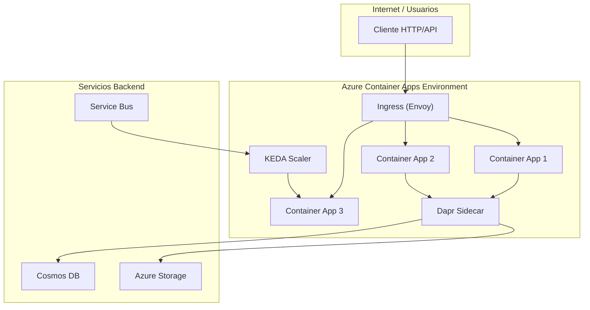
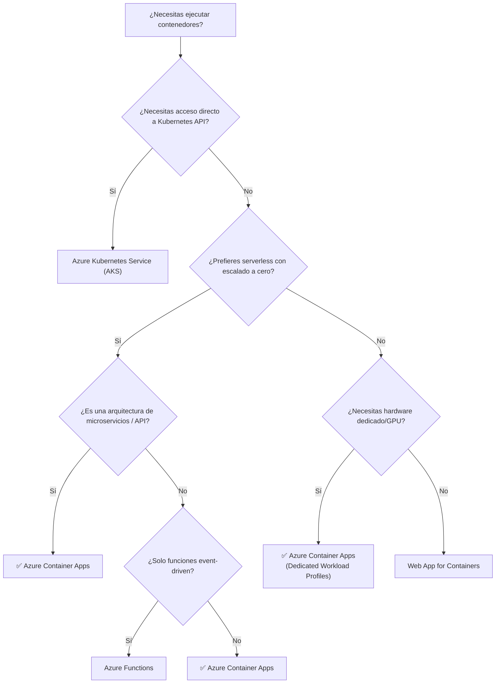

# Azure Container Apps en 2025: La Evolución del Serverless para Contenedores

## Resumen

Azure Container Apps ha evolucionado significativamente desde su lanzamiento en 2022. Este artículo actualizado explora las capacidades actuales del servicio, las novedades incorporadas en 2024-2025, y cómo se posiciona como la solución ideal para ejecutar aplicaciones nativas de la nube sin la complejidad de gestionar Kubernetes directamente.

## TL;DR

- Azure Container Apps es un servicio serverless que ejecuta contenedores sin gestionar infraestructura, construido sobre Kubernetes, KEDA, Dapr y Envoy
- Novedades 2024-2025: GPUs serverless, Dynamic Sessions, Azure Functions integradas, workload profiles dedicados con GPUs A100/T4
- Casos de uso: microservicios, APIs, procesamiento de eventos, cargas AI/ML, aplicaciones con IA generativa
- Escalado automático (incluso a cero), revisiones, traffic splitting, integración nativa con servicios Azure

## El Problema que Resuelve

> **«Necesito ejecutar aplicaciones Cloud Native en contenedores, pero no quiero la complejidad operativa de Kubernetes, OpenShift, etc.»**

Esta es una necesidad recurrente en equipos de desarrollo que quieren aprovechar las ventajas de los contenedores y arquitecturas de microservicios sin dedicar recursos a:

- Configurar y mantener clusters de Kubernetes
- Gestionar nodos, redes, almacenamiento
- Administrar actualizaciones y parches del orquestador
- Implementar observabilidad y monitorización avanzada desde cero

## Azure Container Apps: La Solución Serverless

Azure Container Apps es un **servicio gestionado serverless** que permite ejecutar contenedores sin preocuparse por la infraestructura subyacente. Lanzado inicialmente en 2022 y con mejoras continuas, se ha convertido en una opción madura para desplegar aplicaciones modernas.

### Arquitectura Subyacente

Aunque no gestionas directamente Kubernetes, bajo el telón Azure Container Apps funciona sobre:

- **Azure Kubernetes Service (AKS)**: proporciona el orquestador
- **KEDA** (Kubernetes Event Driven Autoscaling): escalado basado en eventos
- **Dapr** (Distributed Application Runtime): integración nativa para microservicios
- **Envoy**: proxy para enrutamiento y observabilidad



### Características Distintivas

Azure Container Apps se diferencia de otras soluciones de contenedores en Azure por:

1. **Optimización para microservicios**: diseñado específicamente para aplicaciones que abarcan múltiples contenedores desplegados como servicios independientes

2. **Tecnologías open-source integradas**:
   - [Dapr](https://dapr.io/): service-to-service invocation, pub/sub, state management
   - [KEDA](https://keda.sh/): escalado basado en eventos y métricas
   - [Envoy](https://www.envoyproxy.io/): balanceo de carga y observabilidad

3. **Arquitecturas event-driven**: escalado basado en:
   - Tráfico HTTP
   - Mensajes en colas (Service Bus, Storage Queues, Event Hubs)
   - Métricas personalizadas
   - **Escalado a cero** para reducir costes

4. **Soporte para cargas de larga duración**: procesos background, jobs y tareas programadas

## Novedades 2024-2025: Lo que ha Cambiado

Desde el post original de 2022, Azure Container Apps ha incorporado capacidades empresariales significativas:

### 1. GPUs Serverless y Dedicadas (2024)

**Serverless GPUs** disponibles en regiones West US 3, Australia East y Sweden Central:

- **NVIDIA T4**: coste-efectivas para inferencia de modelos pequeños (<10GB)
- **NVIDIA A100**: para modelos grandes (>10GB), training, y cargas computacionales intensivas

**Dedicated GPU workload profiles**:

- Perfiles NC24-A100, NC48-A100, NC96-A100
- Aislamiento garantizado con hardware dedicado
- Ideal para cargas de IA/ML continuas con baja latencia

```bash
# Ejemplo: Crear environment con GPU serverless
az containerapp env create \
  --name my-gpu-environment \
  --resource-group my-rg \
  --location westus3 \
  --enable-workload-profiles

# Desplegar app con GPU T4
az containerapp create \
  --name my-ai-app \
  --resource-group my-rg \
  --environment my-gpu-environment \
  --image myregistry.azurecr.io/ml-inference:latest \
  --cpu 8 --memory 56Gi \
  --workload-profile-name Consumption-GPU-NC8as-T4 \
  --target-port 8080 \
  --ingress external
```

### 2. Dynamic Sessions (Preview - 2024)

Ejecución segura y aislada de código generado por IA, ideal para:

- Sandboxing de código no confiable
- Evaluación de código generado por LLMs
- Agentes de IA que ejecutan código dinámicamente

Características:

- Aislamiento completo mediante Hyper-V
- Contenedores gestionados (Python, Node.js) o personalizados
- Escalado rápido y efímero

### 3. Azure Functions en Container Apps (GA - 2024)

Despliegue de Azure Functions como contenedores dentro de Container Apps:

- Todos los triggers de Functions disponibles
- Escalado basado en KEDA
- Compartir infraestructura con microservicios y APIs
- **Soporte para GPUs** en funciones compute-intensive

```bash
# Crear Function App optimizada para Container Apps
az containerapp create \
  --name my-function-app \
  --resource-group my-rg \
  --environment my-environment \
  --image myregistry.azurecr.io/my-functions:latest \
  --kind functionapp \
  --ingress external \
  --target-port 80
```

### 4. Workload Profiles Mejorados

**Consumption Profile** (por defecto):
- Escalado automático
- Pago solo por uso activo
- Hasta 4 vCPU / 8 GiB memoria por réplica

**Dedicated Profiles** (opcionales):
- General purpose (D4, D8, D16, D32)
- Memory optimized (E4, E8, E16, E32)
- GPU enabled (NC24-A100, NC48-A100, NC96-A100)

### 5. Networking y Seguridad Avanzada

- **Private Endpoints**: acceso privado sin exposición pública
- **User Defined Routes (UDR)**: control total del tráfico de salida
- **NAT Gateway integration**: simplifica conectividad saliente
- **Azure Front Door integration**: CDN y WAF con Private Link
- **Client certificate authentication (mTLS)**: autenticación mutua TLS

### 6. Certificados Gestionados y Key Vault (GA - 2024)

- Certificados TLS gratuitos gestionados automáticamente
- Integración con Azure Key Vault para certificados personalizados
- Renovación automática

### 7. Componentes Java Gestionados (Preview - 2024)

Para aplicaciones Spring:

- **Eureka Server**: service discovery gestionado
- **Config Server**: configuración centralizada
- **Tomcat support**: despliegue directo desde código
- **JVM memory fit**: configuración automática de memoria JVM

### 8. Observabilidad Mejorada

- **OpenTelemetry Agent** (Preview): exportación de métricas, logs y traces sin configurar colector
- **Aspire Dashboard** (Preview): dashboard interactivo para aplicaciones .NET
- **Java metrics**: métricas de garbage collection, memoria, threads
- Integración completa con Azure Monitor y Application Insights

## Comparativa: ¿Cuándo Usar Container Apps?

| Servicio | Caso de Uso Ideal |
|----------|-------------------|
| **Azure Container Apps** | Microservicios, APIs, event-driven apps, cargas AI/ML serverless, aplicaciones con escalado a cero |
| **Azure Kubernetes Service (AKS)** | Control total de Kubernetes API, workloads complejos con requisitos específicos de K8s |
| **Azure Red Hat OpenShift** | Despliegue OpenShift gestionado, migración desde on-premises OpenShift |
| **Azure Functions** | Funciones FaaS puras, integraciones rápidas con triggers Azure, sin contenedores |
| **Web App for Containers** | Aplicaciones web en contenedores Windows/Linux, migración lift-and-shift |
| **Container Instances** | Contenedores de corta duración, batch jobs simples, aislamiento por hipervisor |
| **Service Fabric** | Aplicaciones distribuidas legacy, necesidad de reliable services/actors |
| **Container Registry** | Almacenamiento, gestión y replicación de imágenes de contenedor |

### Diagrama de Decisión Simplificado



## Casos de Uso Prácticos

### 1. Aplicación de IA Generativa con RAG

Implementar un chatbot con Retrieval Augmented Generation:

- **Frontend**: contenedor React/Vue en Container App con ingress externo
- **API Gateway**: contenedor .NET/Java con autenticación Entra ID
- **RAG Service**: contenedor Python con GPU T4 para embeddings y inference
- **Vector Store**: Cosmos DB con búsqueda vectorial
- Escalado basado en peticiones HTTP, escala a cero en inactividad

### 2. Procesamiento de Eventos IoT

Pipeline de procesamiento de telemetría:

- **Ingestion**: Container App escalando con Event Hubs (KEDA scaler)
- **Processing**: múltiples Container Apps para transformación, enriquecimiento
- **Storage**: escritura en Azure Storage / Cosmos DB mediante Dapr
- Escalado automático según volumen de mensajes

### 3. Microservicios con Dapr

Arquitectura de e-commerce:

- **Catalog Service**: gestión de productos
- **Order Service**: procesamiento de pedidos
- **Inventory Service**: control de stock
- **Payment Service**: integración con pasarelas de pago

Comunicación via Dapr service invocation, state management en Redis/Cosmos DB, pub/sub con Service Bus.

### 4. Jobs Programados y Batch Processing

- **Jobs** en Container Apps para tareas programadas (cron)
- Procesamiento de archivos cargados en Storage
- Generación de informes nocturnos
- Limpieza de datos y mantenimiento

## Despliegue: Ejemplos Prácticos

### Despliegue Rápido con Azure CLI

```bash
# Variables
RESOURCE_GROUP="my-container-apps-rg"
LOCATION="westeurope"
ENVIRONMENT="my-environment"
APP_NAME="my-api"

# Crear resource group
az group create --name $RESOURCE_GROUP --location $LOCATION

# Crear environment
az containerapp env create \
  --name $ENVIRONMENT \
  --resource-group $RESOURCE_GROUP \
  --location $LOCATION

# Desplegar desde imagen pública
az containerapp create \
  --name $APP_NAME \
  --resource-group $RESOURCE_GROUP \
  --environment $ENVIRONMENT \
  --image mcr.microsoft.com/k8se/quickstart:latest \
  --target-port 80 \
  --ingress external \
  --min-replicas 0 \
  --max-replicas 10
```

### Despliegue con Bicep

```bicep
param location string = resourceGroup().location
param environmentName string = 'my-environment'
param containerAppName string = 'my-api'
param containerImage string = 'mcr.microsoft.com/k8se/quickstart:latest'

resource environment 'Microsoft.App/managedEnvironments@2023-05-01' = {
  name: environmentName
  location: location
  properties: {
    appLogsConfiguration: {
      destination: 'log-analytics'
      logAnalyticsConfiguration: {
        customerId: logAnalytics.properties.customerId
        sharedKey: logAnalytics.listKeys().primarySharedKey
      }
    }
  }
}

resource containerApp 'Microsoft.App/containerApps@2023-05-01' = {
  name: containerAppName
  location: location
  properties: {
    managedEnvironmentId: environment.id
    configuration: {
      ingress: {
        external: true
        targetPort: 80
        transport: 'auto'
      }
    }
    template: {
      containers: [
        {
          name: 'main'
          image: containerImage
          resources: {
            cpu: json('0.5')
            memory: '1Gi'
          }
        }
      ]
      scale: {
        minReplicas: 0
        maxReplicas: 10
        rules: [
          {
            name: 'http-rule'
            http: {
              metadata: {
                concurrentRequests: '100'
              }
            }
          }
        ]
      }
    }
  }
}

resource logAnalytics 'Microsoft.OperationalInsights/workspaces@2022-10-01' = {
  name: '${environmentName}-logs'
  location: location
  properties: {
    sku: {
      name: 'PerGB2018'
    }
  }
}
```

### Despliegue con Dapr Habilitado

```bash
# Crear app con Dapr
az containerapp create \
  --name order-service \
  --resource-group $RESOURCE_GROUP \
  --environment $ENVIRONMENT \
  --image myregistry.azurecr.io/order-service:v1 \
  --target-port 3000 \
  --ingress internal \
  --min-replicas 1 \
  --enable-dapr \
  --dapr-app-id order-service \
  --dapr-app-port 3000 \
  --dapr-app-protocol http

# Invocar otro servicio via Dapr
# Desde código: http://localhost:3500/v1.0/invoke/inventory-service/method/check-stock
```

## Administración del Ciclo de Vida: Revisiones

Una de las características más potentes de Container Apps son las **revisiones** (revisions):

- Cada cambio en la configuración o imagen crea una nueva revisión
- Múltiples revisiones activas simultáneamente
- **Traffic splitting**: distribuir tráfico entre revisiones (A/B testing, blue/green)
- **Labels**: asignar etiquetas (blue, green, canary) para URLs estables

### Ejemplo: Blue/Green Deployment

```bash
# Desplegar revisión "blue" (producción actual)
az containerapp create \
  --name $APP_NAME \
  --resource-group $RESOURCE_GROUP \
  --environment $ENVIRONMENT \
  --image myregistry.azurecr.io/myapp:v1.0 \
  --revision-suffix blue \
  --ingress external \
  --target-port 80 \
  --revisions-mode multiple

# Fijar 100% tráfico a blue
az containerapp ingress traffic set \
  --name $APP_NAME \
  --resource-group $RESOURCE_GROUP \
  --revision-weight $APP_NAME--blue=100

# Asignar label "blue"
az containerapp revision label add \
  --name $APP_NAME \
  --resource-group $RESOURCE_GROUP \
  --label blue \
  --revision $APP_NAME--blue

# Desplegar revisión "green" (nueva versión)
az containerapp update \
  --name $APP_NAME \
  --resource-group $RESOURCE_GROUP \
  --image myregistry.azurecr.io/myapp:v2.0 \
  --revision-suffix green

# Probar green en URL específica: https://my-app---green.<environment-domain>

# Traffic splitting progresivo: 80% blue, 20% green
az containerapp ingress traffic set \
  --name $APP_NAME \
  --resource-group $RESOURCE_GROUP \
  --revision-weight $APP_NAME--blue=80 $APP_NAME--green=20

# Si green funciona bien, cambiar 100% a green
az containerapp ingress traffic set \
  --name $APP_NAME \
  --resource-group $RESOURCE_GROUP \
  --revision-weight $APP_NAME--green=100

# Desactivar revisión blue
az containerapp revision deactivate \
  --name $APP_NAME \
  --resource-group $RESOURCE_GROUP \
  --revision $APP_NAME--blue
```

## Networking: Opciones y Escenarios

### Niveles de Accesibilidad

1. **External ingress**: aplicación accesible desde Internet
2. **Internal ingress**: solo accesible dentro del environment o VNet
3. **No ingress**: para background workers o jobs

### Integración con VNet

```bash
# Crear environment con VNet personalizada
az containerapp env create \
  --name $ENVIRONMENT \
  --resource-group $RESOURCE_GROUP \
  --location $LOCATION \
  --infrastructure-subnet-resource-id /subscriptions/.../subnets/aca-subnet \
  --internal-only false

# Subnet mínimo: /27 (para workload profiles)
# Subnet mínimo: /23 (para consumption only)
```

### Private Endpoints

```bash
# Crear environment con private endpoint
az containerapp env create \
  --name $ENVIRONMENT \
  --resource-group $RESOURCE_GROUP \
  --location $LOCATION \
  --enable-workload-profiles \
  --public-network-access Disabled

# Crear private endpoint
az network private-endpoint create \
  --name my-private-endpoint \
  --resource-group $RESOURCE_GROUP \
  --vnet-name my-vnet \
  --subnet my-subnet \
  --private-connection-resource-id /subscriptions/.../managedEnvironments/$ENVIRONMENT \
  --group-id managedEnvironment \
  --connection-name my-connection
```

## Observabilidad y Monitorización

### Integración con Azure Monitor

Container Apps se integra automáticamente con:

- **Log Analytics**: logs de contenedor, system logs
- **Application Insights**: telemetría de aplicaciones, distributed tracing
- **Metrics**: CPU, memoria, peticiones HTTP, réplicas activas

```bash
# Habilitar Application Insights
az containerapp env create \
  --name $ENVIRONMENT \
  --resource-group $RESOURCE_GROUP \
  --location $LOCATION \
  --logs-workspace-id <LOG_ANALYTICS_WORKSPACE_ID> \
  --logs-workspace-key <LOG_ANALYTICS_WORKSPACE_KEY>
```

### Consultas Útiles en Log Analytics

```kusto
// Logs de aplicación
ContainerAppConsoleLogs_CL
| where ContainerAppName_s == "my-api"
| where TimeGenerated > ago(1h)
| project TimeGenerated, Log_s
| order by TimeGenerated desc

// Métricas de réplicas
ContainerAppSystemLogs_CL
| where Category == "ContainerAppScaling"
| where ContainerAppName_s == "my-api"
| project TimeGenerated, ReplicaCount_d
| render timechart
```

### OpenTelemetry (Preview)

```bash
# Habilitar agente OpenTelemetry
az containerapp env telemetry app-insights set \
  --name $ENVIRONMENT \
  --resource-group $RESOURCE_GROUP \
  --connection-string "InstrumentationKey=...;IngestionEndpoint=..."

# Las apps envían automáticamente traces, metrics y logs a App Insights
```

## Costes y Optimización

### Modelo de Facturación

**Consumption Plan**:

- **Consumo activo**: vCPU-segundos y GiB-segundos consumidos
- **Consumo idle**: tarifa reducida cuando réplicas están idle (no procesando, <0.01 vCPU, <1KB/s red)
- **Requests**: primeros 2 millones gratis/mes, luego por millón adicional
- **GPUs serverless**: sin cargo por idle, solo por uso activo

**Dedicated Plan** (workload profiles):

- Cargo fijo por gestión del plan si usas perfiles dedicados
- Cargo por instancia de perfil (D4, E8, NC24-A100, etc.)
- Escalado in/out ajusta coste según demanda

### Estrategias de Optimización

1. **Escala a cero**: configura `minReplicas: 0` para apps con tráfico intermitente
2. **Right-sizing**: ajusta CPU/memoria a necesidades reales
3. **Workload profiles**: agrupa apps similares en el mismo perfil dedicado
4. **Savings Plans**: Azure Container Apps elegible para planes de ahorro
5. **GPUs serverless**: para cargas AI/ML variables, usa serverless en lugar de dedicado

```bash
# Configurar escalado a cero
az containerapp update \
  --name $APP_NAME \
  --resource-group $RESOURCE_GROUP \
  --min-replicas 0 \
  --max-replicas 10 \
  --scale-rule-name http-rule \
  --scale-rule-type http \
  --scale-rule-metadata concurrentRequests=50
```

## Seguridad: Mejores Prácticas

### 1. Managed Identities

```bash
# Habilitar system-assigned identity
az containerapp identity assign \
  --name $APP_NAME \
  --resource-group $RESOURCE_GROUP \
  --system-assigned

# Asignar rol para acceder a Key Vault
IDENTITY_ID=$(az containerapp identity show \
  --name $APP_NAME \
  --resource-group $RESOURCE_GROUP \
  --query principalId -o tsv)

az keyvault set-policy \
  --name my-keyvault \
  --object-id $IDENTITY_ID \
  --secret-permissions get list
```

### 2. Secretos

```bash
# Añadir secreto
az containerapp secret set \
  --name $APP_NAME \
  --resource-group $RESOURCE_GROUP \
  --secrets db-connection="Server=...;Password=..."

# Referenciar en variable de entorno
az containerapp update \
  --name $APP_NAME \
  --resource-group $RESOURCE_GROUP \
  --set-env-vars "DB_CONNECTION=secretref:db-connection"
```

### 3. Autenticación Built-in (EasyAuth)

```bash
# Habilitar autenticación con Entra ID
az containerapp auth update \
  --name $APP_NAME \
  --resource-group $RESOURCE_GROUP \
  --enable \
  --action RequireAuthentication \
  --aad-tenant-id <TENANT_ID> \
  --aad-client-id <CLIENT_ID> \
  --aad-client-secret <CLIENT_SECRET>
```

### 4. Restricciones de IP

```bash
# Limitar acceso por IP
az containerapp ingress access-restriction set \
  --name $APP_NAME \
  --resource-group $RESOURCE_GROUP \
  --rule-name office-network \
  --ip-address 203.0.113.0/24 \
  --action Allow
```

## Conclusión

Azure Container Apps en 2025 es una plataforma madura y completa para ejecutar aplicaciones Cloud Native sin la complejidad de gestionar Kubernetes directamente. Con las incorporaciones de 2024-2025, se ha convertido en una opción viable para:

- **Microservicios y APIs**: escalado automático, revisiones, traffic splitting
- **Event-driven architectures**: integración con KEDA y múltiples event sources
- **Cargas AI/ML**: GPUs serverless y dedicadas, Dynamic Sessions
- **Aplicaciones empresariales**: networking avanzado, private endpoints, integración con Azure Functions

### ¿Cuándo Elegir Container Apps?

✅ **Sí**, si:

- Quieres serverless con escalado a cero
- Necesitas desplegar microservicios o APIs rápidamente
- Prefieres no gestionar Kubernetes directamente
- Quieres integración nativa con Dapr, KEDA, Envoy
- Necesitas GPUs para cargas AI/ML con tráfico variable

❌ **No**, si:

- Necesitas acceso completo a Kubernetes API y CRDs
- Tienes requisitos muy específicos de configuración de K8s
- Ya tienes inversión significativa en operadores y herramientas K8s personalizadas

En resumen: **si no necesitas acceso directo a Kubernetes API y trabajas con aplicaciones Cloud Native, Azure Container Apps es tu servicio en Azure**.

## Referencias y Recursos

- [Documentación oficial de Azure Container Apps](https://learn.microsoft.com/azure/container-apps/)
- [Novedades en Azure Container Apps (GitHub)](https://aka.ms/aca/updates)
- [Dapr en Azure Container Apps (GitHub)](https://aka.ms/dapr-aca-updates)
- [Azure Container Apps - Precios](https://azure.microsoft.com/pricing/details/container-apps/)
- [Landing Zone Accelerators para Container Apps](https://aka.ms/aca-lza)
- [Arquitecturas de referencia](https://learn.microsoft.com/azure/architecture/browse/?expanded=azure&products=azure-container-apps)
- [Azure Container Apps en Microsoft Learn](https://learn.microsoft.com/training/browse/?products=azure-container-apps)

---

*Artículo actualizado en octubre de 2025. Para la versión original de 2022, ver [Introducción a Azure Container Apps (Keepler Blog)](https://keepler.io/es/2022/09/14/introduccion-a-azure-container-apps/).*
