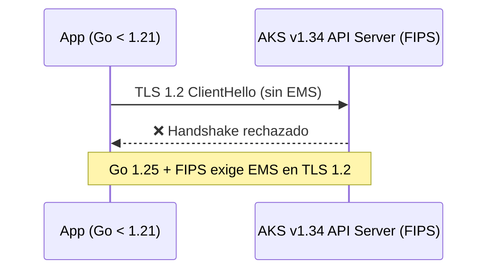

# AKS v1.34: FIPS, TLS 1.2 EMS y la retirada definitiva de Azure Linux 2.0

## Resumen

AKS v1.34 llega con cambios que afectan directamente a entornos en producción: los componentes del plano de control se compilan ahora con Go 1.25 y módulos criptográficos FIPS, lo que impone el Extended Master Secret (EMS) en conexiones TLS 1.2 de nodos FIPS. Además, a partir del **31 de marzo de 2026** los nodos con Azure Linux 2.0 dejan de funcionar. Si tienes clústeres con esa imagen, debes migrar ya.

## ¿Qué cambió en AKS v1.34?

### Enforcement de EMS en TLS 1.2 (nodos FIPS)

Go 1.25 rechaza handshakes TLS 1.2 que no incluyan el Extended Master Secret (EMS) cuando FIPS está activado. Esto afecta a:

- Aplicaciones cliente que hablan con el API server de Kubernetes
- Admission webhooks registrados contra `kube-apiserver`
- Cualquier componente compilado con Go < 1.21

Las aplicaciones compiladas con Go < 1.21 no enviaban EMS por defecto en TLS 1.2, por lo que fallarán al conectarse a componentes de AKS v1.34 en nodos FIPS.



### Retirada de Azure Linux 2.0

| Fecha | Evento |
|-------|--------|
| 30 nov 2025 | Fin de soporte y actualizaciones de seguridad |
| 31 mar 2026 | Eliminación de imágenes de nodo |

Desde el 31 de marzo **no puedes escalar** ni recuperar nodos con Azure Linux 2.0. Las operaciones de reimage y redeploy fallarán.

## Cómo verificar si estás afectado

### Comprobar versión de Kubernetes y osSKU

```bash
az aks show \
  --resource-group <rg> \
  --name <cluster> \
  --query "agentPoolProfiles[].{name:name, osSku:osSku, k8sVersion:currentOrchestratorVersion}" \
  -o table
```

### Comprobar si FIPS está habilitado en el node pool

```bash
az aks nodepool show \
  --resource-group <rg> \
  --cluster-name <cluster> \
  --name <nodepool> \
  --query "enableFips"
```

## Cómo migrar

### Opción 1: Actualizar node pools a Azure Linux 3

```bash
az aks nodepool upgrade \
  --resource-group <rg> \
  --cluster-name <cluster> \
  --name <nodepool> \
  --os-sku AzureLinux
```

!!! note
    `AzureLinux` en la CLI apunta a la versión 3.x por defecto desde finales de 2025.

### Opción 2: Actualizar a versión de Kubernetes compatible

Si el node pool está en una versión antigua, primero actualiza Kubernetes:

```bash
az aks upgrade \
  --resource-group <rg> \
  --name <cluster> \
  --kubernetes-version 1.32.x
```

### Resolver problemas de TLS 1.2 EMS

Si tienes aplicaciones compiladas con Go < 1.21:

```bash
# Verificar versión de Go en tu aplicación
go version

# Rebuild con Go 1.21+
go build -o myapp .
```

Para webhooks, verificar que el servidor TLS responde con EMS:

```bash
openssl s_client -connect <webhook-endpoint>:443 -tls1_2 2>&1 | grep "extended master secret"
```

## Buenas prácticas

- Comprueba la versión de Go de todos los componentes que usen la API de Kubernetes antes de activar FIPS.
- Si usas cert-manager, ingress controllers o admission webhooks de terceros, verifica que estén actualizados.
- Para migration de AzureLinux 2.0, crea primero un nuevo node pool con AzureLinux 3, drena el antiguo y elimínalo.
- Suscríbete a las [AKS release notes](https://github.com/Azure/AKS/releases) para anticipar cambios similares.

!!! warning
    No esperes al 31 de marzo para migrar Azure Linux 2.0. Una vez eliminadas las imágenes, las operaciones de scaling y remediation fallan sin previo aviso.

## Referencias

- [AKS Security Bulletin AKS-2026-0001](https://learn.microsoft.com/azure/aks/security-bulletins/overview#aks-2026-0001-tls-12-handshake-enforcement-with-extended-master-secret-ems-in-aks-v134)
- [Azure Linux 2.0 retirement announcement](https://azure.microsoft.com/updates?id=500645)
- [Upgrade AKS node pool OS version](https://learn.microsoft.com/azure/aks/upgrade-os-version)
- [AKS release notes](https://github.com/Azure/AKS/releases)
