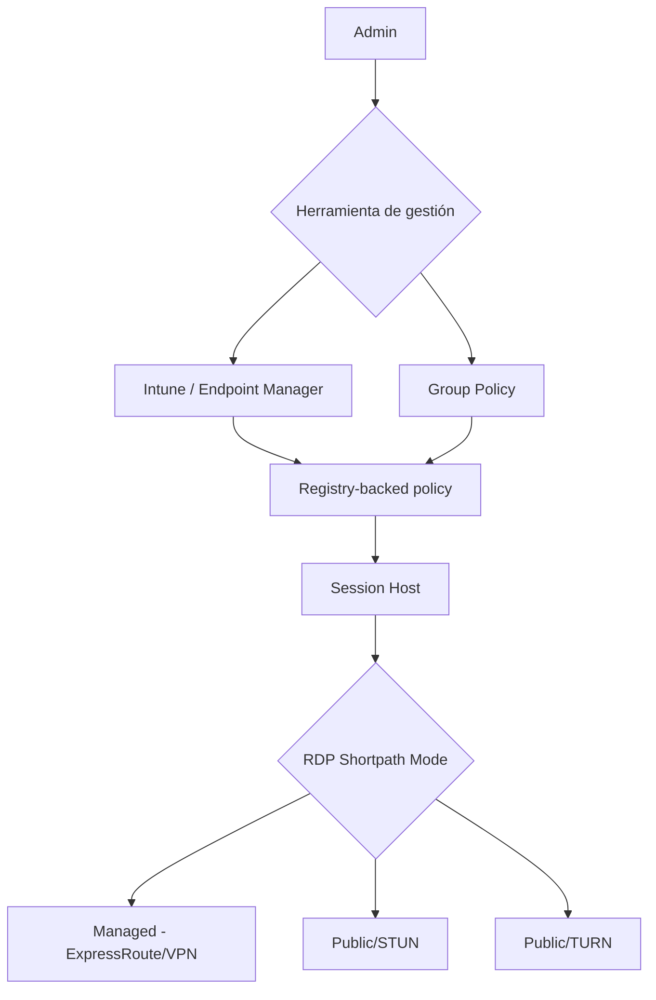

# AVD: gestión centralizada de RDP Shortpath vía Intune y GPO ya es GA

## Resumen

Azure Virtual Desktop permite desde enero de 2026 configurar **todos los modos de transporte de RDP Shortpath** —Managed, Public/STUN y Public/TURN— directamente desde Microsoft Intune o Group Policy. Esta funcionalidad es ahora GA y elimina la necesidad de gestionar configuraciones dispersas en múltiples capas. Los admins de VDI pueden controlar el comportamiento de transporte de red desde una sola política, aplicada a nivel de session host.

## ¿Qué es RDP Shortpath?

RDP Shortpath es una característica de Azure Virtual Desktop que establece una ruta de transporte UDP directa entre el cliente y el session host, evitando el relay de Azure. Esto reduce la latencia y mejora la experiencia de usuario, especialmente en redes con buena conectividad.

Hay tres modos de transporte configurables:

| Modo | Descripción | Cuándo usar |
|------|-------------|-------------|
| **Managed** | UDP directo sobre Azure ExpressRoute o VPN | Usuarios corporativos con red privada |
| **Public/STUN** | UDP directo con hole punching NAT | Usuarios en internet con NAT estándar |
| **Public/TURN** | UDP con relay cuando STUN falla | NAT simétrico, redes restrictivas |

## Qué cambia con la GA de enero 2026

Antes de este cambio, la configuración de Shortpath requería combinar ajustes en:

- Host pool properties (portal de AVD)
- Registry keys en los session hosts (manual o via scripts)

Ahora **todo se configura con registry-backed policies** desplegadas vía Intune o GPO. Estas configuraciones aplican a nivel de session host, como una capa adicional sobre las host pool settings.



## Configuración vía Intune

### 1. Crear un perfil de configuración de dispositivo

En el portal de Intune:

1. Ve a **Devices → Configuration profiles → Create profile**
2. Plataforma: **Windows 10 and later**
3. Tipo de perfil: **Settings catalog**

### 2. Buscar y configurar las políticas de RDP Shortpath

Busca en el catálogo: `Remote Desktop`

Las claves relevantes están bajo:

```
Administrative Templates > Windows Components > Remote Desktop Services > 
Remote Desktop Session Host > Connections
```

### 3. Valores recomendados para entornos corporativos con red privada

```
Enable RDP Shortpath for managed networks: Enabled
Enable RDP Shortpath for public networks: Enabled (STUN)
RDP Shortpath maximum transport unit: 1400
```

### Configuración equivalente vía GPO

```powershell
# Verificar configuración actual en un session host
Get-ItemProperty -Path "HKLM:\SOFTWARE\Policies\Microsoft\Windows NT\Terminal Services" |
    Select-Object fUseUdpPortRedirector, UdpRedirectorPort
```

```
GPO Path: Computer Configuration > Administrative Templates > 
Windows Components > Remote Desktop Services > Remote Desktop Session Host > Connections

- Enable RDP Shortpath for managed networks: Enabled
- Enable RDP Shortpath for public networks: Enabled
```

## Cómo verificar que Shortpath está funcionando

En el cliente de Windows App o Remote Desktop, durante una sesión activa:

```
Connection Information → Transport: UDP (RDP Shortpath)
```

Desde PowerShell en el session host:

```powershell
Get-WinEvent -LogName "Microsoft-Windows-RemoteDesktopServices-RdpCoreCDV/Operational" |
    Where-Object { $_.Message -like "*Shortpath*" } |
    Select-Object TimeCreated, Message -First 10
```

## Buenas prácticas

- Las políticas de Intune/GPO se aplican **además** de las host pool settings, no las reemplazan. Comprueba que no haya conflicto entre capas.
- Para usuarios con NAT simétrico o firewalls corporativos restrictivos, habilita Public/TURN como fallback, pero monitoriza el uso de relay: tiene mayor latencia que STUN.
- Aplica las políticas primero en un grupo piloto antes de desplegarlas a todos los session hosts.
- Documenta qué modo está activo en cada host pool para facilitar el troubleshooting.

!!! note
    RDP Shortpath es independiente de Private Link. Si usas Private Link para el tráfico de gestión, Shortpath afecta únicamente al canal de datos de la sesión de usuario.

## Referencias

- [What's new in Azure Virtual Desktop - January 2026](https://learn.microsoft.com/azure/virtual-desktop/whats-new#january-2026)
- [RDP Shortpath overview](https://learn.microsoft.com/azure/virtual-desktop/rdp-shortpath)
- [Configure RDP Shortpath](https://learn.microsoft.com/azure/virtual-desktop/configure-rdp-shortpath)
