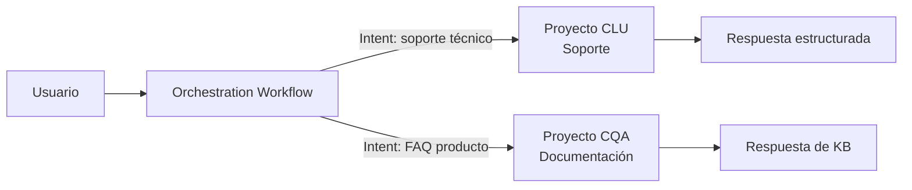

# Azure AI Language completo en Microsoft Foundry: migración desde Language Studio

## Resumen

Desde enero de 2026, todas las capacidades de Azure AI Language están disponibles en **Microsoft Foundry** (portal nuevo). Esto incluye la experiencia completa de Language Studio —gestión de proyectos, entrenamiento, despliegue— y una nueva funcionalidad clave: **Orchestration workflow**, que permite enrutar consultas de usuario entre proyectos CLU y CQA desde una interfaz unificada. Si aún usas Language Studio clásico, es el momento de migrar.

## ¿Qué incluye Azure AI Language en Foundry?

### Capacidades migradas desde Language Studio

- **Conversational Language Understanding (CLU)**: intents, entities, entrenamiento de modelos de lenguaje conversacional
- **Custom Question Answering (CQA)**: bases de conocimiento para responder preguntas
- **Named Entity Recognition, Sentiment Analysis, Key Phrase Extraction** y otras capacidades cognitivas
- **Custom Text Classification** y **Custom NER**

### Novedad: Orchestration Workflow

El Orchestration Workflow es un orquestador que recibe una consulta de usuario y la enruta al proyecto CLU o CQA más adecuado según la intención detectada.



Esto reduce la complejidad de aplicaciones que antes necesitaban lógica de enrutamiento propia en el backend.

## Cómo acceder a las capacidades en Foundry

### 1. Crear un recurso Azure AI Language

```bash
az cognitiveservices account create \
  --name my-language-resource \
  --resource-group myRG \
  --kind TextAnalytics \
  --sku S \
  --location eastus \
  --yes
```

### 2. Acceder a Foundry

Navega a [https://ai.azure.com](https://ai.azure.com) y asegúrate de que el toggle **New Foundry** está activado.

En el panel izquierdo verás las secciones de **Language** con todos los proyectos disponibles.

### 3. Crear un Orchestration Workflow

Desde Foundry → Language → **Orchestration Workflow** → New project:

```json
{
  "projectName": "mi-orquestador",
  "language": "es",
  "projectKind": "Orchestration",
  "intents": [
    {
      "category": "SoporteTecnico",
      "target": {
        "targetProjectKind": "Luis",
        "apiVersion": "2022-10-01",
        "projectName": "soporte-clu"
      }
    },
    {
      "category": "FAQ",
      "target": {
        "targetProjectKind": "QuestionAnswering",
        "projectName": "docs-cqa"
      }
    }
  ]
}
```

### 4. Llamar al orquestador desde tu aplicación

```python
from azure.ai.language.conversations import ConversationAnalysisClient
from azure.core.credentials import AzureKeyCredential

client = ConversationAnalysisClient(
    endpoint="https://<resource>.cognitiveservices.azure.com/",
    credential=AzureKeyCredential("<key>")
)

result = client.analyze_conversation(
    task={
        "kind": "Conversation",
        "analysisInput": {
            "conversationItem": {
                "id": "1",
                "participantId": "user",
                "text": "¿Cómo instalo el agente de monitorización?"
            }
        },
        "parameters": {
            "projectName": "mi-orquestador",
            "deploymentName": "production"
        }
    }
)

print(result["result"]["prediction"]["topIntent"])
```

## Migración desde Language Studio

Microsoft ha publicado una guía de migración paso a paso. El proceso consiste en:

1. Abrir el proyecto existente en Language Studio clásico
2. Exportar el modelo entrenado (JSON)
3. Importarlo en Foundry desde **Language → Import project**
4. Reentrenar y validar
5. Actualizar los endpoints en la aplicación (misma API, diferente portal de gestión)

!!! warning
    Language Studio clásico seguirá funcionando durante el período de transición, pero las nuevas funcionalidades —incluyendo Orchestration Workflow mejorado— solo estarán disponibles en el nuevo portal Foundry.

!!! note
    El `endpoint` y las API keys no cambian al migrar. Lo que cambia es la interfaz de administración.

## Buenas prácticas

- Prueba el Orchestration Workflow en un entorno de desarrollo antes de apuntar tráfico de producción.
- Configura intents de fallback para evitar que consultas sin match claro lleguen a un proyecto equivocado.
- Usa Managed Identity en lugar de API keys para acceder al recurso de Language desde tu aplicación.

```bash
# Asignar rol Cognitive Services User a la identidad gestionada
az role assignment create \
  --assignee <principal-id> \
  --role "Cognitive Services Language Reader" \
  --scope /subscriptions/<sub>/resourceGroups/<rg>/providers/Microsoft.CognitiveServices/accounts/<resource>
```

## Referencias

- [What's new in Azure Language in Foundry Tools - January 2026](https://learn.microsoft.com/azure/ai-services/language-service/whats-new#january-2026)
- [Migrate from Azure Language Studio to Microsoft Foundry](https://learn.microsoft.com/azure/ai-services/language-service/migration-studio-to-foundry)
- [Orchestration workflow quickstart](https://learn.microsoft.com/azure/ai-services/language-service/orchestration-workflow/quickstart)
