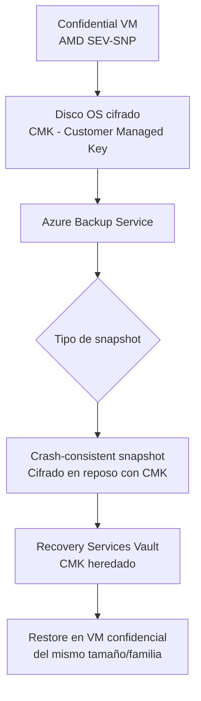

# Azure Backup para Confidential VMs: protección de datos en entornos de computación confidencial

## Resumen

Desde enero de 2026, Azure Backup soporta en **preview pública** la protección de Confidential Virtual Machines. Es un paso importante para organizaciones que usan computación confidencial y necesitan garantías de backup sin comprometer el aislamiento de memoria que ofrecen las Confidential VMs. Si tu organización trabaja con datos sensibles bajo regulaciones estrictas y ya usa Confidential VMs, este es el momento de evaluar la integración.

## ¿Qué son las Confidential VMs?

Las Confidential VMs de Azure usan hardware TEE (Trusted Execution Environment) —basado en AMD SEV-SNP— para cifrar la memoria de la VM durante la ejecución. Ni los administradores del host ni Microsoft pueden acceder a esa memoria.

Esto tiene una implicación directa en backup: los mecanismos tradicionales de snapshot no pueden leer el contenido cifrado de los discos sin el contexto de la VM.

## Cómo funciona el backup de Confidential VMs

Azure Backup usa un mecanismo específico que respeta el modelo de confianza de las Confidential VMs:



Los puntos clave del comportamiento:

- El snapshot se cifra con la **Customer Managed Key (CMK)** del disco original
- Los datos nunca se descifran fuera del entorno confidencial
- El restore requiere una VM compatible (misma familia, AMD SEV-SNP)

## Requisitos previos

- VM de la serie **DCasv5** o **ECasv5** (AMD SEV-SNP)
- OS disk cifrado con **CMK** (no Platform Managed Key)
- Recovery Services Vault con **cross-region restore** habilitado si se necesita DR

## Configurar backup desde la CLI

```bash
# Variables
VAULT="my-backup-vault"
RG="my-rg"
VM_ID="/subscriptions/<sub>/resourceGroups/<rg>/providers/Microsoft.Compute/virtualMachines/<vm>"

# Crear Recovery Services Vault si no existe
az backup vault create \
  --resource-group $RG \
  --name $VAULT \
  --location eastus

# Habilitar backup en la Confidential VM
az backup protection enable-for-vm \
  --resource-group $RG \
  --vault-name $VAULT \
  --vm $VM_ID \
  --policy-name DefaultPolicy
```

## Limitaciones en preview

| Limitación | Detalle |
|------------|---------|
| Tipo de consistencia | Solo crash-consistent (no application-consistent) |
| Restore cross-subscription | No disponible en preview |
| Familias soportadas | DCasv5, ECasv5 únicamente |
| Key rotation durante backup | No soportado; rota la CMK fuera de la ventana de backup |

!!! warning
    Durante la preview, no se garantiza SLA de RPO/RTO para Confidential VMs. Evalúa si es adecuado para cargas de producción críticas o úsalo en entornos de pre-producción primero.

## Buenas prácticas

- Almacena la CMK en **Azure Key Vault** con soft delete y purge protection habilitados. Si pierdes la clave, los backups son irrecuperables.
- Configura alertas de Azure Backup para detectar fallos en la ventana de backup.
- Documenta los requisitos de VM para el restore: si necesitas recuperar en otra región, debes tener la familia DCasv5/ECasv5 disponible allí.

```bash
# Verificar que el disco está cifrado con CMK
az vm show \
  --resource-group $RG \
  --name <vm-name> \
  --query "storageProfile.osDisk.managedDisk.securityProfile"
```

## Referencias

- [What's new in Azure Backup - January 2026](https://learn.microsoft.com/azure/backup/whats-new#january-2026)
- [Overview of Azure Confidential VMs](https://learn.microsoft.com/azure/confidential-computing/confidential-vm-overview)
- [Azure Backup support matrix for Azure VMs](https://learn.microsoft.com/azure/backup/backup-support-matrix-iaas)
