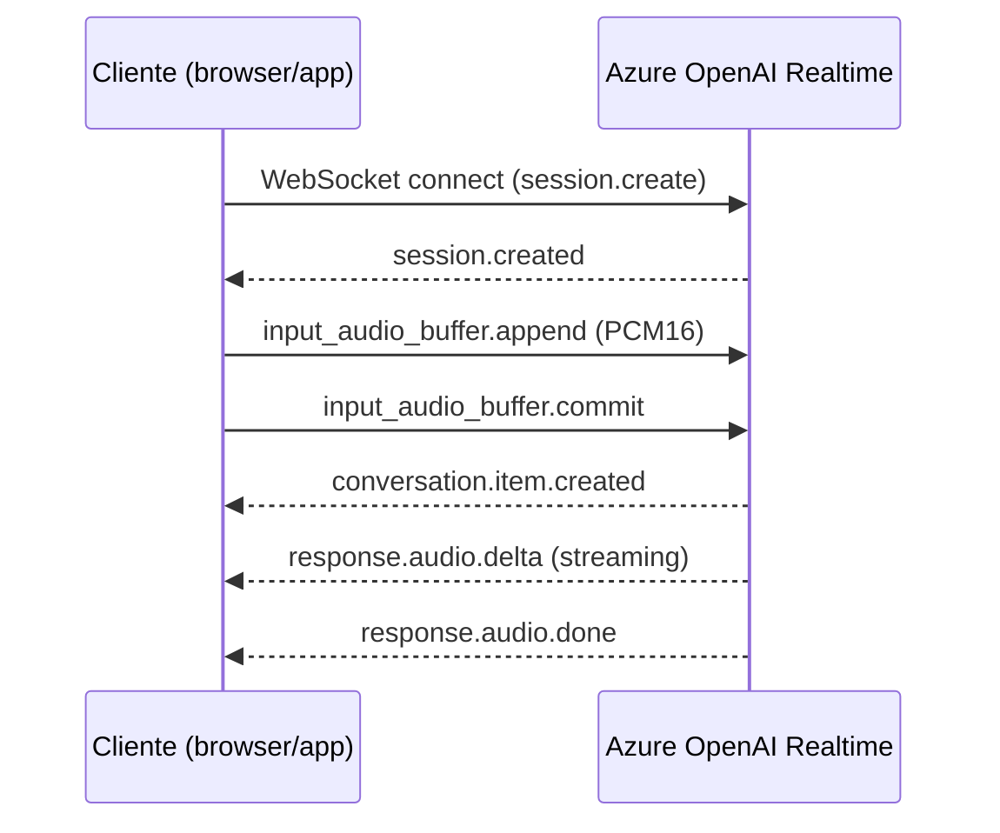

# GPT-4o Realtime 1.5 y Audio 1.5: mejor seguimiento de instrucciones y soporte multilingüe

## Resumen

En febrero de 2026, Microsoft publicó las versiones `gpt-4o-realtime-preview-1.5` y `gpt-4o-audio-preview-1.5` en Azure OpenAI. Estas versiones mejoran significativamente el seguimiento de instrucciones del system prompt, la calidad de respuesta en conversaciones en múltiples idiomas y la estabilidad de la Realtime API para casos de uso de voz. Si tienes aplicaciones de voz o audio sobre Azure OpenAI, conviene planificar la migración a estas versiones.

## ¿Qué cambia en estas versiones?

### gpt-4o-realtime-preview-1.5

La Realtime API de Azure OpenAI permite conversaciones de baja latencia vía WebSocket: el cliente envía audio y recibe respuesta de voz sin pasar por transcripción intermedia.

Mejoras en 1.5:

- **Instruction following**: el modelo respeta mejor restricciones del system prompt (idioma forzado, formato de respuesta, limitaciones de dominio)
- **Multilingüe**: mejor calidad en español, alemán, francés, japonés y portugués
- **Latencia reducida**: aproximadamente 15-20% menos latencia de TTFB (Time To First Byte de audio) en condiciones de carga estándar *(dato estimado según release notes)*

### gpt-4o-audio-preview-1.5

Versión asíncrona (sin WebSocket) para procesamiento de audio. Acepta audio como input y devuelve texto o audio como output.

Mejoras en 1.5:

- Mejor reconocimiento de acentos regionales
- Soporte de entrada de audio de hasta 25 MB por request
- Reducción de alucinaciones en transcripción de vocabulario técnico

## Arquitectura básica con la Realtime API



## Actualizar el modelo en tu configuración

Si ya usas la Realtime API, actualiza el deployment a la nueva versión:

```bash
# Crear deployment de la nueva versión
az cognitiveservices account deployment create \
  --resource-group myRG \
  --name myAOAIresource \
  --deployment-name gpt4o-realtime-15 \
  --model-name gpt-4o-realtime-preview \
  --model-version "2025-06-03" \
  --model-format OpenAI \
  --sku-capacity 10 \
  --sku-name Standard
```

!!! note
    El nombre del modelo en la API sigue siendo `gpt-4o-realtime-preview`; la versión `2025-06-03` corresponde al release 1.5. Verifica el nombre exacto de versión disponible en tu región en el [Azure OpenAI model availability table](https://learn.microsoft.com/azure/ai-services/openai/concepts/models).

## Ejemplo de cliente Python (Realtime API)

```python
import asyncio
import json
import websockets
from azure.identity import DefaultAzureCredential

AOAI_ENDPOINT = "wss://<resource>.openai.azure.com"
DEPLOYMENT = "gpt4o-realtime-15"
API_VERSION = "2025-01-01-preview"

async def realtime_session():
    token = DefaultAzureCredential().get_token("https://cognitiveservices.azure.com/.default").token
    url = f"{AOAI_ENDPOINT}/openai/realtime?deployment={DEPLOYMENT}&api-version={API_VERSION}"
    
    headers = {"Authorization": f"Bearer {token}"}
    
    async with websockets.connect(url, extra_headers=headers) as ws:
        # Enviar configuración de sesión con system prompt estricto
        await ws.send(json.dumps({
            "type": "session.update",
            "session": {
                "modalities": ["text", "audio"],
                "instructions": "Responde siempre en español. Solo responde sobre soporte técnico de Azure.",
                "voice": "alloy",
                "input_audio_format": "pcm16",
                "output_audio_format": "pcm16"
            }
        }))
        response = await ws.recv()
        print(json.loads(response))

asyncio.run(realtime_session())
```

!!! warning
    Usa siempre `DefaultAzureCredential` o Managed Identity en producción. No hardcodees API keys en el código; usa variables de entorno o Azure Key Vault.

## Coste estimado

Los precios de la Realtime API se cobran por tokens de audio y texto:

| Tipo | Precio estimado (consultar precios actuales) |
|------|---------------------------------------------|
| Audio input | ~$0.10 / 1K audio tokens |
| Audio output | ~$0.20 / 1K audio tokens |
| Text tokens | Similar a gpt-4o estándar |

Monitoriza el consumo desde **Azure Monitor** o el dashboard de Azure OpenAI en Foundry para evitar sorpresas en la factura.

## Buenas prácticas

- Prueba el instruction following con casos límite antes de desplegar en producción: el modelo es mejor en 1.5 pero no infalible.
- Implementa un VAD (Voice Activity Detection) del lado cliente para reducir tokens innecesarios de silencio.
- Configura `turn_detection` de tipo `server_vad` si quieres que el servidor detecte el fin de turno automáticamente.

## Referencias

- [Azure OpenAI models - February 2026 updates](https://learn.microsoft.com/azure/ai-services/openai/whats-new#february-2026)
- [Azure OpenAI Realtime API reference](https://learn.microsoft.com/azure/ai-services/openai/realtime-audio-reference)
- [Azure OpenAI model availability](https://learn.microsoft.com/azure/ai-services/openai/concepts/models)
