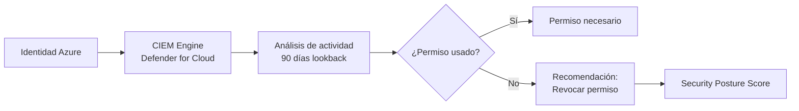

# Defender for Cloud: CIEM en GA y threat protection para agentes de IA en preview

## Resumen

La semana del 2 de febrero de 2026 fue relevante para Defender for Cloud: el módulo **CIEM (Cloud Infrastructure Entitlement Management)** alcanzó GA, y al día siguiente —3 de febrero— se lanzó en preview la **protección contra amenazas para AI agents**. Son dos novedades independientes pero complementarias: la primera para gestionar el exceso de permisos en identidades cloud, la segunda para detectar ataques emergentes en sistemas que usan modelos de lenguaje como agentes autónomos.

## CIEM GA: gestión de permisos con lookback de 90 días

### ¿Qué es CIEM en Defender for Cloud?

CIEM analiza los permisos efectivos de identidades en Azure (usuarios, service principals, managed identities) y los compara con su uso real. El resultado es una lista de **recomendaciones de reducción de permisos** basadas en actividad.

Diferencia clave con RBAC estático: CIEM observa qué permisos se usan realmente durante un período de tiempo, no solo qué permisos están asignados.

### Qué trae la versión GA

| Característica | Preview anterior | GA (feb 2026) |
|----------------|------------------|----------------|
| Lookback de actividad | 30 días | **90 días** |
| Soporte PCI DSS | No | No (aún limitado) |
| Identidades analizadas | Usuarios, SPNs | Usuarios, SPNs, Managed Identities |
| Exportación a CSV | No | Sí |



### Cómo revisar las recomendaciones CIEM

Desde el portal de Defender for Cloud:

**Defender for Cloud → Recommendations → Identity and access**

O directamente vía REST API:

```bash
az security assessment list \
  --scope /subscriptions/<sub-id> \
  --query "[?contains(name,'identity')].{Name:displayName, Status:status.code}" \
  --output table
```

## Threat Protection para AI Agents: preview

### ¿Qué detecta?

Los AI agents son sistemas que usan LLMs para ejecutar acciones autónomas (llamar APIs, leer bases de datos, modificar recursos). Esta preview añade detección de:

- **Prompt injection**: intentos de manipular el comportamiento del agente mediante inputs maliciosos
- **Jailbreak attempts**: intentos de evadir las instrucciones del system prompt
- **Anomalous tool use**: el agente accede a herramientas o datos fuera de su patrón habitual
- **Data exfiltration via LLM output**: el agente devuelve datos sensibles embebidos en respuestas

### Cobertura actual

La preview cubre agentes construidos sobre:

- **Azure OpenAI** (GPT-4o, GPT-4)
- **Azure AI Foundry** (agentes con herramientas)

### Habilitar la protección

Requiere **Defender for AI Services** habilitado:

```bash
az security pricing create \
  --name AiServices \
  --tier Standard
```

Las alertas aparecerán en **Defender for Cloud → Security alerts** con categoría `AI`.

!!! warning
    La preview de threat protection para AI agents no cubre agentes desplegados fuera de Azure OpenAI o Foundry (por ejemplo, agentes usando modelos open-source en contenedores propios). Revisa los límites de cobertura antes de incluirlo en tu arquitectura de seguridad.

## Buenas prácticas combinadas

- Usa CIEM para revisar los permisos de la **Managed Identity** que usa tu AI agent. Los agentes tienden a requerir permisos amplios; CIEM ayuda a detectar si puedes restringirlos.
- Configura alertas CIEM en Azure Monitor para recibir notificaciones cuando una identidad no usa un permiso durante más de 60 días.
- Para AI agents en producción, habilita logging detallado de inputs/outputs y almacénalos en Log Analytics; las alertas de Defender for AI se correlacionan con estos logs.

```bash
# Exportar recomendaciones CIEM a CSV para revisión
az security assessment list \
  --scope /subscriptions/<sub-id> \
  --query "[?contains(name,'identity')]" \
  --output json > ciem-recommendations.json
```

## Referencias

- [Defender for Cloud - What's new - February 2026](https://learn.microsoft.com/azure/defender-for-cloud/release-notes#february-2026)
- [Cloud Infrastructure Entitlement Management (CIEM)](https://learn.microsoft.com/azure/defender-for-cloud/permissions-management)
- [Threat protection for AI workloads](https://learn.microsoft.com/azure/defender-for-cloud/ai-threat-protection)
