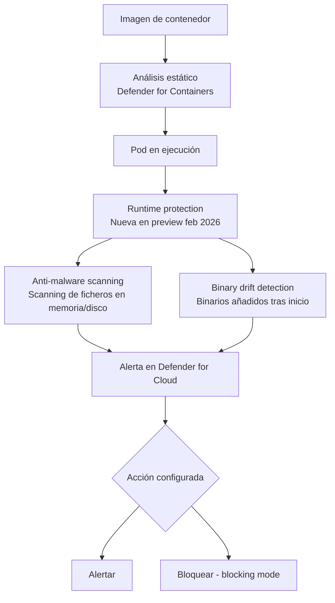

# Defender for Cloud: anti-malware en runtime y bloqueo de binary drift en contenedores

## Resumen

El 22 de febrero de 2026, Defender for Cloud publicó dos nuevas capacidades en preview para seguridad de contenedores en runtime: **anti-malware scanning** en pods de Kubernetes y **binary drift blocking**. Ambas operan a nivel de nodo, sin modificar las imágenes, y amplían la protección más allá del análisis estático de imágenes de contenedor. Son especialmente relevantes para equipos que ejecutan cargas de trabajo en AKS y necesitan detección de amenazas en tiempo de ejecución.

## ¿Qué problema resuelven?

El análisis de imágenes (Defender for Containers ya lo hacía) detecta vulnerabilidades y malware conocido **antes** del despliegue. Pero no cubre:

- Malware descargado o generado **en runtime** dentro de un contenedor
- Binarios que aparecen en el sistema de ficheros del contenedor **después** del inicio (binary drift)

Estos dos vectores son los usados habitualmente en ataques post-compromiso a clusters Kubernetes.



## Anti-malware scanning en runtime

Escanea ficheros en los sistemas de ficheros de contenedores activos en busca de firmas de malware conocido y comportamiento heurístico.

**Cobertura:**
- Ficheros escritos en el sistema de ficheros del contenedor durante runtime
- Ficheros en volúmenes montados (emptyDir, PVC)
- Memoria de procesos (análisis heurístico)

**Modo de despliegue:** DaemonSet en los nodos del cluster AKS.

## Binary drift blocking

Un contenedor debería ejecutar únicamente los binarios presentes en su imagen original. Si durante el runtime aparece un binario nuevo (descargado con curl, compilado en el contenedor, etc.), se trata de **binary drift**.

Esta feature puede configurarse en modo **alert** (solo registra) o **block** (bloquea la ejecución del binario nuevo).

## Habilitar las funcionalidades

Requieren **Defender for Containers** habilitado en el plan:

```bash
# Habilitar Defender for Containers
az security pricing create \
  --name Containers \
  --tier Standard
```

La protección en runtime se despliega automáticamente como un DaemonSet llamado `microsoft-defender-collector-ds` en los nodos del cluster.

### Verificar el despliegue en AKS

```bash
kubectl get daemonset -n kube-system | grep defender

# Output esperado:
# microsoft-defender-collector-ds   <node-count>   <node-count>   ...
```

### Configurar binary drift en modo blocking

En el portal de Defender for Cloud → **Environment settings → [Tu suscripción] → Defender plans → Containers → Settings**

O vía API:

```bash
az security setting update \
  --name "Containers" \
  --input-type "binaryDriftPolicy" \
  --value '{"mode": "Block"}'
```

!!! warning
    El modo **Block** puede interrumpir operaciones legítimas si algún proceso del cluster genera binarios en runtime como parte de su funcionamiento normal (por ejemplo, compiladores JIT, scripts de inicialización). Prueba primero en modo **Alert** y revisa las alertas durante al menos una semana antes de activar Block.

## Alertas generadas

En **Defender for Cloud → Security alerts**, busca categoría `Containers`:

| Alerta | Descripción |
|--------|-------------|
| `Malware detected in container` | Firma de malware encontrada en fichero del contenedor |
| `Binary drift detected` | Binario nuevo ejecutado en contenedor existente |
| `Suspicious process in container` | Proceso con comportamiento anómalo |

## Buenas prácticas

- Implementa **read-only root filesystems** en los pods que no necesiten escritura. Esto previene binary drift por diseño antes de que la feature tenga que bloquearlo.

```yaml
# securityContext en el pod spec
securityContext:
  readOnlyRootFilesystem: true
```

- Usa el modo Alert durante las primeras semanas para identificar procesos legítimos que podrían activar falsos positivos.
- Correlaciona las alertas de binary drift con los logs de tu pipeline CI/CD para confirmar si el binario fue introducido por un proceso propio o por un atacante.

## Referencias

- [Defender for Cloud - What's new - February 2026](https://learn.microsoft.com/azure/defender-for-cloud/release-notes#february-2026)
- [Container runtime protection overview](https://learn.microsoft.com/azure/defender-for-cloud/container-runtime-protection)
- [Binary drift detection](https://learn.microsoft.com/azure/defender-for-cloud/binary-drift-detection)
