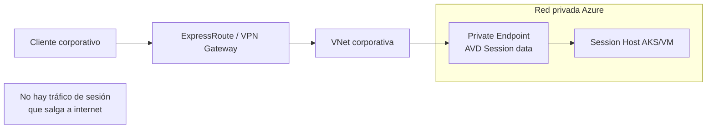

# AVD: RDP Shortpath UDP sobre Azure Private Link ya es GA

## Resumen

Desde febrero de 2026, **RDP Shortpath con UDP sobre Azure Private Link** es GA en Azure Virtual Desktop. Esto permite que el tráfico de sesión de usuario (no solo el de gestión) viaje por la red privada de Azure en lugar de internet, combinando la baja latencia de UDP de RDP Shortpath con el aislamiento de red de Private Link. Es la opción recomendada para organizaciones con requisitos estrictos de seguridad de red y conectividad ExpressRoute o VPN.

## ¿Qué combinación es esta?

AVD tiene dos canales de tráfico diferenciados:

| Canal | Descripción | Opción privada disponible |
|-------|-------------|---------------------------|
| **Control plane** | Gestión, registro de sesión, configuración | Private Link (GA desde 2023) |
| **Session data** | Tráfico de la sesión de usuario (pantalla, audio, input) | **RDP Shortpath UDP + Private Link (GA feb 2026)** |

Hasta ahora, Private Link cubría el control plane pero el tráfico de sesión podía salir a internet si no había Shortpath Managed. Con esta GA, el tráfico de sesión también puede mantenerse completamente en la red privada usando UDP.

## Arquitectura



## Requisitos

- **Session hosts**: Windows 11 22H2 o superior, o Windows Server 2022
- **Cliente**: Windows App (actualizado) o Remote Desktop client 1.2.5000+
- **Red**: Private Endpoint desplegado para el servicio de datos de AVD
- **RDP Shortpath Managed** habilitado en el host pool

## Configurar Private Link para tráfico de sesión

### 1. Crear el Private Endpoint para sesión

En el portal de Azure → Azure Virtual Desktop → tu host pool → **Networking → Private endpoints**

O vía CLI:

```bash
HOSTPOOL_ID=$(az desktopvirtualization hostpool show \
  --resource-group myRG \
  --name myHostPool \
  --query id -o tsv)

az network private-endpoint create \
  --name avd-session-pe \
  --resource-group myRG \
  --vnet-name myVNet \
  --subnet mySubnet \
  --private-connection-resource-id $HOSTPOOL_ID \
  --group-id sessionHost \
  --connection-name avd-session-connection
```

### 2. Crear la zona DNS privada y el vínculo

```bash
az network private-dns zone create \
  --resource-group myRG \
  --name "privatelink.wvd.microsoft.com"

az network private-dns link vnet create \
  --resource-group myRG \
  --zone-name "privatelink.wvd.microsoft.com" \
  --name avd-dns-link \
  --virtual-network myVNet \
  --registration-enabled false
```

### 3. Verificar que el cliente usa UDP sobre Private Link

Durante una sesión activa, en Windows App o Remote Desktop:

```
Connection Information → Transport: UDP
                       → Path: Private
```

Desde PowerShell en el session host:

```powershell
# Verificar conexiones UDP activas del servicio RDS
Get-NetUDPEndpoint |
    Where-Object { $_.LocalPort -gt 49152 } |
    Select-Object LocalAddress, LocalPort, OwningProcess
```

## Impacto en costes de red

!!! note
    El tráfico a través de Private Endpoints tiene coste de proceso. Para sesiones de usuario con alto consumo de ancho de banda (vídeo, CAD), evalúa el coste de Private Endpoint frente al coste de ancho de banda de salida a internet que evitas.

| Coste | Con Private Link | Sin Private Link (internet) |
|-------|-----------------|----------------------------|
| Proceso PE | ~0,01 $/hora por PE | — |
| Datos inbound | ~0,01 $/GB | — |
| Datos outbound | ~0,01 $/GB | Tarifa de salida a internet |

## Buenas prácticas

- Despliega el Private Endpoint en una subred dedicada para AVD; facilita las reglas de NSG y el troubleshooting.
- Usa **Network Watcher** para verificar que el tráfico UDP efectivamente no sale a internet.
- Si tienes clientes remotos sin VPN/ExpressRoute (por ejemplo, BYOD en casa), estos seguirán usando la ruta pública. Private Link solo aplica a clientes dentro de la red privada conectada.

## Referencias

- [What's new in Azure Virtual Desktop - February 2026](https://learn.microsoft.com/azure/virtual-desktop/whats-new#february-2026)
- [RDP Shortpath for managed networks](https://learn.microsoft.com/azure/virtual-desktop/rdp-shortpath)
- [Azure Private Link for Azure Virtual Desktop](https://learn.microsoft.com/azure/virtual-desktop/private-link-overview)
