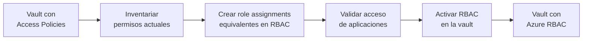

# Azure Key Vault API 2026-02-01: RBAC como modelo de autorización por defecto

## Resumen

Con la versión de API `2026-02-01` de Azure Key Vault, **RBAC se convierte en el modelo de autorización por defecto** para nuevas vaults. Las vaults creadas sin especificar explícitamente el modelo de acceso ya no usarán Vault Access Policies; usarán RBAC de Azure. Este cambio alinea Key Vault con el resto de servicios de Azure y simplifica la gestión de accesos, pero requiere atención si tienes scripts o plantillas de IaC que asumen el comportamiento anterior.

## Vault Access Policies vs. RBAC: la diferencia clave

| Aspecto | Vault Access Policies | Azure RBAC |
|---------|-----------------------|------------|
| Scope de asignación | Solo a nivel de vault | Vault, secret, key, certificate individual |
| Auditoría | Limitada | Azure Activity Log completo |
| Integración con Entra ID | Manual | Nativa (grupos, conditional access) |
| Compatibilidad con PIM | No | Sí |
| Separación de responsabilidades | Difícil | Simple con roles built-in |

## Roles built-in relevantes para Key Vault

```
Key Vault Administrator         → Acceso completo (gestión + datos)
Key Vault Certificates Officer  → Gestión de certificados
Key Vault Crypto Officer        → Gestión de claves
Key Vault Secrets Officer       → Gestión de secrets
Key Vault Reader                → Lectura de metadatos (sin leer valores)
Key Vault Secrets User          → Leer valores de secrets
Key Vault Crypto User           → Usar claves (encrypt, decrypt, sign)
```

## Crear una vault con RBAC (nueva API)

Con la API `2026-02-01`, RBAC es el default. No es necesario especificar el parámetro `enableRbacAuthorization`:

```bash
az keyvault create \
  --name myVault \
  --resource-group myRG \
  --location westeurope
  # enableRbacAuthorization = true por defecto
```

Para crear una vault con Access Policies (modelo anterior) hay que ser explícito:

```bash
az keyvault create \
  --name myVault \
  --resource-group myRG \
  --location westeurope \
  --enable-rbac-authorization false
```

## Migrar una vault existente de Access Policies a RBAC



### Paso 1: Inventariar Access Policies actuales

```bash
az keyvault show \
  --name myVault \
  --query "properties.accessPolicies[].{Object:objectId, Permissions:permissions}" \
  --output table
```

### Paso 2: Crear role assignments equivalentes

```bash
VAULT_ID=$(az keyvault show --name myVault --query id -o tsv)

# Dar acceso a secrets a una Managed Identity
az role assignment create \
  --assignee <principal-id> \
  --role "Key Vault Secrets User" \
  --scope "$VAULT_ID"

# Acceso más restrictivo: solo a un secret específico
az role assignment create \
  --assignee <principal-id> \
  --role "Key Vault Secrets User" \
  --scope "$VAULT_ID/secrets/myDatabasePassword"
```

### Paso 3: Activar RBAC

```bash
az keyvault update \
  --name myVault \
  --enable-rbac-authorization true
```

!!! warning
    Al activar RBAC en una vault, las Access Policies existentes **dejan de ser evaluadas inmediatamente**. Cualquier identity que no tenga un role assignment de RBAC perderá el acceso. Realiza la migración en una ventana de mantenimiento y prueba primero en un entorno no productivo.

## Actualizar templates Bicep/Terraform

### Bicep

```bicep
resource keyVault 'Microsoft.KeyVault/vaults@2026-02-01' = {
  name: vaultName
  location: location
  properties: {
    sku: {
      family: 'A'
      name: 'standard'
    }
    tenantId: subscription().tenantId
    enableRbacAuthorization: true  // explícito por claridad
    enableSoftDelete: true
    softDeleteRetentionInDays: 90
  }
}
```

### Terraform

```hcl
resource "azurerm_key_vault" "main" {
  name                       = var.vault_name
  resource_group_name        = var.resource_group_name
  location                   = var.location
  tenant_id                  = data.azurerm_client_config.current.tenant_id
  sku_name                   = "standard"
  enable_rbac_authorization  = true  # default en API 2026-02-01, pero explícito aquí
  soft_delete_retention_days = 90
  purge_protection_enabled   = true
}
```

## Buenas prácticas

- Usa el scope más restrictivo posible para los role assignments: un secret específico en lugar de toda la vault cuando sea posible.
- Activa **Privileged Identity Management (PIM)** para roles con acceso a datos (Secrets Officer, Crypto Officer) y exige justificación y aprobación para activarlos.
- Revisa periódicamente los role assignments con Microsoft Entra ID Access Reviews.

!!! note
    Si usas Terraform con el provider `azurerm` y versiones anteriores a la que soporta API 2026-02-01, el parámetro `enable_rbac_authorization` puede seguir siendo necesario de forma explícita. Actualiza el provider a la versión más reciente.

## Referencias

- [Azure Key Vault REST API 2026-02-01](https://learn.microsoft.com/rest/api/keyvault/)
- [Azure built-in roles for Key Vault](https://learn.microsoft.com/azure/key-vault/general/rbac-guide)
- [Migrate from Vault Access Policy to Azure RBAC](https://learn.microsoft.com/azure/key-vault/general/rbac-migration)
