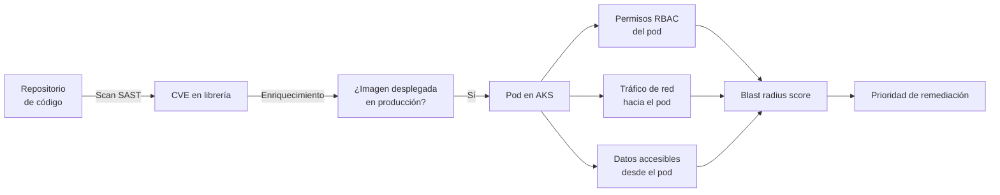

# Defender for Cloud: Code to Runtime, visibilidad de la cadena SDLC hasta producción

## Resumen

El 10 de marzo de 2026, Defender for Cloud lanzó en preview **Code to Runtime enrichment**, una funcionalidad que conecta una vulnerabilidad encontrada en código fuente o imagen de contenedor con su **radio de explosión en producción**: qué recursos del cluster están expuestos, qué identidades pueden acceder a ellos y qué flujos de red están activos. Está diseñada para que los equipos de seguridad prioricen remediaciones no por criticidad CVSS, sino por impacto real.

## ¿Qué problema resuelve?

Un scanner de imágenes puede generar cientos de CVEs por semana. Sin contexto de producción, es imposible decidir cuáles parchear primero.

Code to Runtime enrichment responde a:

- ¿Este CVE está en un contenedor que está realmente corriendo en producción?
- ¿Ese pod tiene permisos de RBAC para acceder a secrets o APIs críticas?
- ¿Hay tráfico de red real hacia ese pod desde internet?



## Fuentes de datos que correlaciona

| Fuente | Qué aporta |
|--------|------------|
| GitHub Advanced Security / Azure DevOps | CVEs en código fuente, SAST findings |
| Defender for Containers | CVEs en imágenes, configuraciones en runtime |
| AKS RBAC | Permisos del service account del pod |
| Network policies / NSG flow logs | Tráfico real hacia/desde el pod |
| Azure Resource Graph | Recursos accesibles desde el namespace |

## Requisitos para habilitar la funcionalidad

- **Defender for Containers** habilitado (plan Standard)
- **Defender for DevOps** conectado a al menos un repositorio (GitHub o Azure DevOps)
- AKS con el agente de Defender instalado

```bash
# Verificar que el agente de Defender está instalado en AKS
kubectl get daemonset -n kube-system | grep defender

# Habilitar Defender for DevOps (requiere conexión al repositorio desde el portal)
az security connector create \
  --name my-github-connector \
  --resource-group myRG \
  --hierarchy-identifier <github-org-id> \
  --environment-name GitHub
```

## Cómo usar Code to Runtime en la práctica

Desde **Defender for Cloud → Recommendations → Code to Runtime insights**:

1. Selecciona un CVE de alta criticidad
2. Observa el panel **Runtime context**: te muestra si hay pods afectados en producción
3. Revisa **Blast radius**: identidades, secretos y endpoints accesibles desde el pod vulnerable
4. Exporta el path completo para el equipo de desarrollo con contexto de priorización

### Consulta KQL en Microsoft Sentinel (si integrado)

```kql
SecurityRecommendation
| where RecommendationName contains "Code to Runtime"
| extend BlastRadius = tostring(Properties["blastRadiusScore"])
| where toint(BlastRadius) > 70
| project TimeGenerated, AffectedResourceId, RecommendationName, BlastRadius
| sort by BlastRadius desc
```

## Limitaciones en preview

- Actualmente cubre **AKS** únicamente (no otros runtimes de contenedores)
- La correlación con código fuente requiere que el repositorio esté conectado a **Defender for DevOps**
- No hay SLA de latencia para la actualización del blast radius cuando cambia el estado del cluster

!!! warning
    En preview, los datos de blast radius pueden tener un retraso de hasta 4 horas respecto al estado actual del cluster. No uses estos datos para decisiones de respuesta a incidentes en tiempo real; úsalos para priorización de remediaciones planificadas.

## Buenas prácticas

- Integra Code to Runtime en tu proceso de revisión de vulnerabilidades semanal o quincenal; no como alerta en tiempo real.
- Combina el blast radius score con el SLA de parches de tu organización para crear una matriz de priorización: CVE crítico + blast radius alto → parche urgente.
- Usa los datos de permisos RBAC del pod para aplicar el principio de mínimo privilegio: si un pod tiene acceso a secrets que no necesita, es el momento de reducirlo.

## Referencias

- [Defender for Cloud - What's new - March 2026](https://learn.microsoft.com/azure/defender-for-cloud/release-notes#march-2026)
- [Code to runtime context overview](https://learn.microsoft.com/azure/defender-for-cloud/code-to-runtime-context)
- [Defender for DevOps overview](https://learn.microsoft.com/azure/defender-for-cloud/defender-for-devops-introduction)
