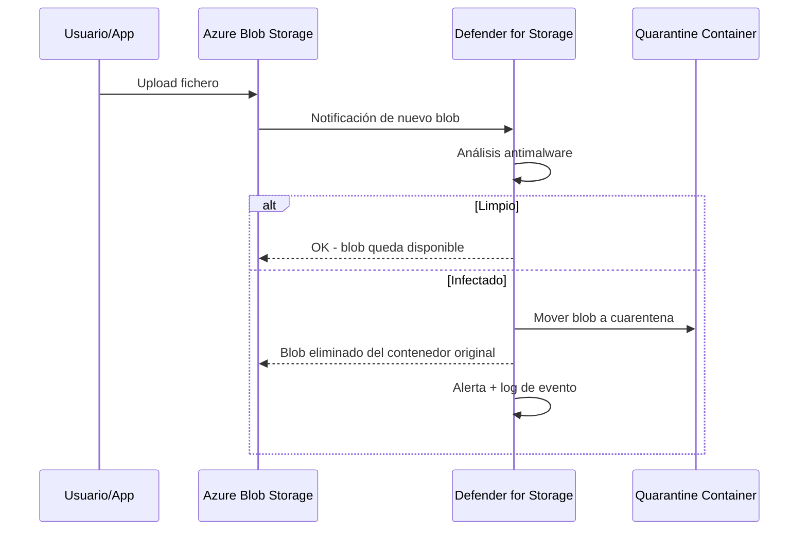

# Defender for Storage: remediación automática de malware en GA y escaneo bajo demanda para Azure Files

## Resumen

El 31 de marzo de 2026, Defender for Storage alcanza GA en dos funcionalidades de alto impacto: **automated malware remediation** (eliminación automática de blobs infectados en Blob Storage) y **on-demand malware scanning para Azure Files** en preview. Si tienes flujos de upload de ficheros de usuario o compartición de ficheros en Azure, estas novedades reducen el tiempo de exposición ante ficheros maliciosos de horas a minutos.

## ¿Qué es Defender for Storage?

Defender for Storage analiza el contenido subido a cuentas de Azure Storage en busca de malware, datos sensibles y anomalías de acceso. Hasta ahora, cuando detectaba malware, generaba una alerta pero **no tomaba acción automática**: el blob infectado permanecía en el storage hasta que alguien lo eliminaba manualmente.

## Automated Malware Remediation (GA)

Con esta funcionalidad en GA, cuando se detecta un blob infectado:

1. Defender for Storage genera la alerta habitual
2. **Automáticamente mueve o elimina el blob infectado** según la configuración
3. Escribe un log del evento con hash del fichero, contenedor de origen y acción tomada



### Configurar automated remediation

Desde el portal: **Defender for Cloud → Environment settings → [Storage account] → Malware scanning → Remediation action**

O vía ARM/Bicep:

```bicep
resource storageDefender 'Microsoft.Security/defenderForStorageSettings@2022-12-01-preview' = {
  name: 'current'
  scope: storageAccount
  properties: {
    isEnabled: true
    malwareScanning: {
      onUploadIsEnabled: true
      sensitiveDataDiscovery: {
        isEnabled: true
      }
    }
    overrideSubscriptionLevelSettings: true
  }
}
```

Para la acción de remediación automática, configura la Event Grid subscription que Defender for Storage usa internamente:

```bash
# La acción de remediación se configura en el portal de Defender for Cloud
# Settings > Malware scanning > On detection: Delete / Move to quarantine
```

!!! note
    El contenedor de cuarentena se crea automáticamente si no existe. Por defecto se llama `malware-scan-results` en la misma cuenta de storage.

## On-demand Malware Scanning para Azure Files (Preview)

Azure Files (SMB y NFS) ahora puede analizarse bajo demanda. Esto cubre el caso de uso de:

- **Comparticiones de ficheros legados** que ya tenían contenido antes de habilitar Defender
- **Auditorías periódicas** de storage compartido
- **Respuesta a incidentes** para escanear una compartición sospechosa

### Iniciar un escaneo bajo demanda

```bash
# Via Azure CLI (preview extension)
az security storage malware-scan trigger \
  --resource-group myRG \
  --storage-account myStorageAccount \
  --share-name myFileShare
```

O desde el portal: **Storage account → Microsoft Defender for Cloud → Scan now**

### Revisar resultados

```bash
# Los resultados aparecen en Log Analytics si tienes Diagnostic Settings configurado
# Query KQL
AzureDiagnostics
| where Category == "StorageMalwareScan"
| where OperationName == "ScanCompleted"
| project TimeGenerated, ResourceId, ResultType, FilePath, ThreatName
| sort by TimeGenerated desc
```

## Consideraciones de coste

Defender for Storage cobra por:

- **Transacciones analizadas** (on-upload scanning): tarifa por millón de transacciones
- **GB escaneados** (on-demand scan): tarifa por GB analizado

!!! warning
    Para cuentas de storage con alto volumen de uploads (por ejemplo, pipelines de datos o ingestas masivas), revisa el coste estimado antes de habilitar on-upload scanning en todas las cuentas. Considera habilitarlo solo en las cuentas que reciben ficheros de origen externo o no confiable.

## Buenas prácticas

- Configura el contenedor de cuarentena con **acceso restringido**: solo los admins de seguridad deben poder acceder a los ficheros en cuarentena para análisis forense.
- Integra las alertas de Defender for Storage con **Microsoft Sentinel** para correlacionar con otros eventos de seguridad.
- Para Azure Files, programa escaneos bajo demanda periódicos en comparticiones de acceso externo o compartido entre equipos.

## Referencias

- [Defender for Cloud - What's new - March 2026](https://learn.microsoft.com/azure/defender-for-cloud/release-notes#march-2026)
- [Malware scanning in Defender for Storage](https://learn.microsoft.com/azure/defender-for-cloud/defender-for-storage-malware-scan)
- [Configure automated malware remediation](https://learn.microsoft.com/azure/defender-for-cloud/defender-for-storage-configure-malware-scan)
