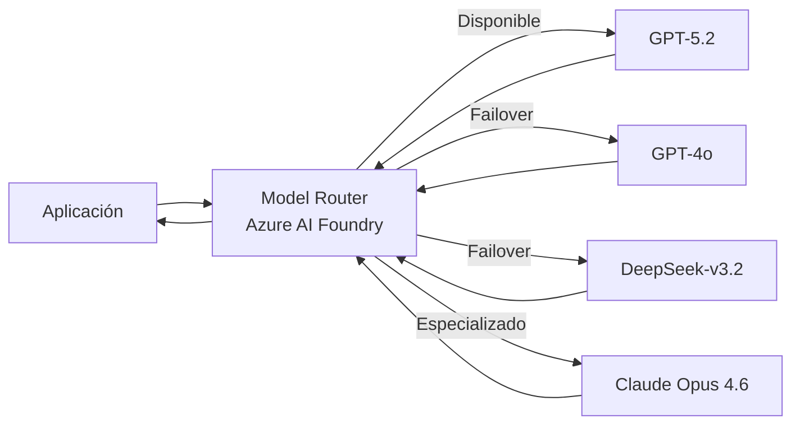

# Azure AI Foundry Model Router: nuevos modelos y failover automático en marzo 2026

## Resumen

En marzo de 2026, el **Model Router de Azure AI Foundry** incorpora cuatro nuevos modelos —incluyendo versiones actualizadas de GPT, DeepSeek y Claude— y estrena **failover automático entre modelos**: si el modelo primario no está disponible o supera su cuota, el router redirige la petición al siguiente candidato de forma transparente. Es una capacidad crítica para aplicaciones que necesitan alta disponibilidad en sus llamadas a LLMs sin gestionar lógica de fallback propia.

## ¿Qué es el Model Router en Foundry?

El Model Router es un endpoint unificado en Azure AI Foundry que recibe una petición de inferencia y decide qué modelo la procesa, basándose en:

- **Disponibilidad del modelo** (capacidad, cuota disponible)
- **Coste por token** (puede optimizar por precio)
- **Capacidades requeridas** (si el prompt requiere visión, búsqueda, etc.)



## Nuevos modelos disponibles en marzo 2026

| Modelo | Tipo | Características destacadas |
|--------|------|---------------------------|
| `gpt-5.2` | OpenAI GPT | Mejor razonamiento, contexto 256K |
| `DeepSeek-v3.2` | DeepSeek | Open-weights, alta eficiencia en código |
| `claude-opus-4-6` | Anthropic | Larga ventana de contexto, seguimiento de instrucciones |
| `phi-4-mini` | Microsoft | Ligero, bajo coste, ideal para tasks simples |

## Failover automático: cómo funciona

Cuando una petición llega al Model Router:

1. El router intenta el modelo con mayor prioridad configurada
2. Si recibe `429 Too Many Requests` o `503 Service Unavailable`, reintenta automáticamente con el siguiente modelo del grupo de failover
3. El proceso es transparente para el cliente: recibe una respuesta del modelo alternativo sin errores

### Configurar un grupo de failover

Desde Foundry → **Model Router → Deployments → Create deployment group**:

```json
{
  "deploymentGroupName": "production-llm",
  "models": [
    {
      "modelId": "gpt-5.2",
      "priority": 1,
      "quotaAllocation": 80
    },
    {
      "modelId": "gpt-4o",
      "priority": 2,
      "quotaAllocation": 60
    },
    {
      "modelId": "DeepSeek-v3.2",
      "priority": 3,
      "quotaAllocation": 100
    }
  ],
  "failoverPolicy": {
    "enableAutoFailover": true,
    "failoverOnQuotaExhaustion": true,
    "failoverOnServiceUnavailable": true
  }
}
```

## Llamar al Model Router desde tu aplicación

El endpoint del Model Router es compatible con la API de Azure OpenAI, por lo que no necesitas cambiar el SDK:

```python
from openai import AzureOpenAI
from azure.identity import DefaultAzureCredential, get_bearer_token_provider

token_provider = get_bearer_token_provider(
    DefaultAzureCredential(),
    "https://cognitiveservices.azure.com/.default"
)

client = AzureOpenAI(
    azure_endpoint="https://<foundry-resource>.openai.azure.com/",
    azure_ad_token_provider=token_provider,
    api_version="2025-01-01-preview"
)

response = client.chat.completions.create(
    model="production-llm",   # nombre del deployment group, no el modelo individual
    messages=[
        {"role": "user", "content": "Explica qué es el Model Router de Azure AI Foundry"}
    ]
)

# La respuesta incluye qué modelo respondió efectivamente
print(response.model)   # ej: "gpt-5.2" o "gpt-4o" si hubo failover
print(response.choices[0].message.content)
```

## Monitorización del router

Puedes ver qué modelo procesó cada petición en las métricas de Foundry:

```bash
# KQL en Log Analytics para ver distribución de uso por modelo
AzureDiagnostics
| where ResourceProvider == "MICROSOFT.COGNITIVESERVICES"
| where Category == "RequestResponse"
| extend ModelUsed = tostring(Properties["model"])
| summarize Requests = count() by ModelUsed, bin(TimeGenerated, 1h)
| render columnchart
```

!!! note
    El coste se factura según el modelo que efectivamente procesó la petición, no el modelo primario configurado. Si hay failover frecuente a modelos más caros, aparecerá reflejado en la factura. Configura alertas de coste en Azure Cost Management.

## Buenas prácticas

- Incluye siempre un modelo de bajo coste como último nivel de failover para evitar que las peticiones fallen por agotamiento de cuota.
- Usa `response.model` para registrar qué modelo procesó cada petición y detectar patrones de failover excesivo.
- No asumas que el modelo alternativo tiene las mismas capacidades que el primario: valida que el output del grupo de failover es aceptable para tu caso de uso.

## Referencias

- [Azure AI Foundry Model Router](https://learn.microsoft.com/azure/ai-foundry/model-router)
- [Azure OpenAI models available in Foundry](https://learn.microsoft.com/azure/ai-services/openai/concepts/models)
- [Azure AI Foundry What's new - March 2026](https://learn.microsoft.com/azure/ai-foundry/whats-new)
