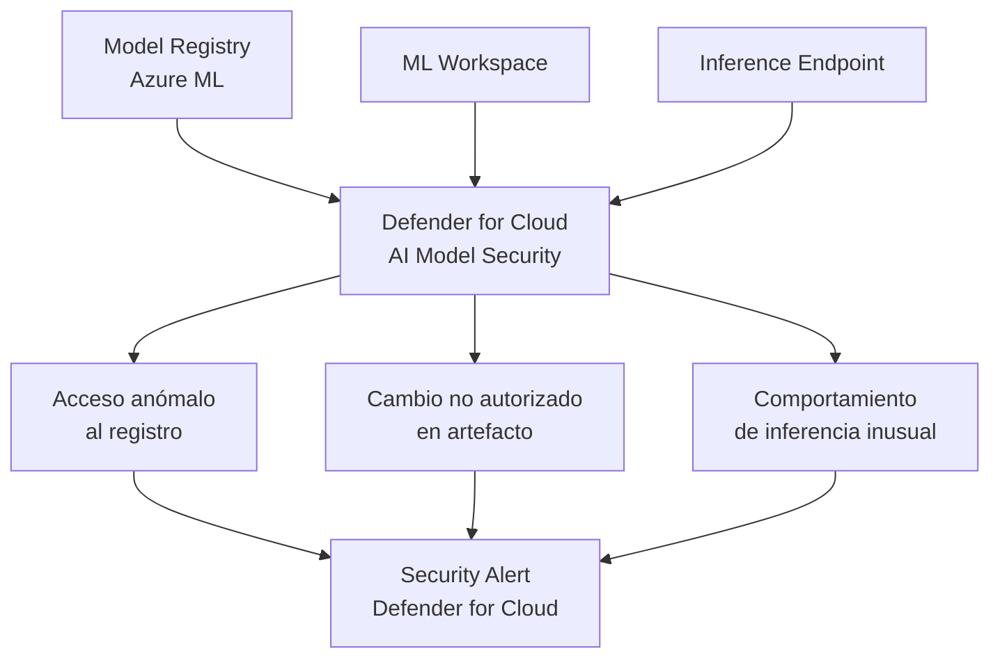

# Defender for Cloud: protección de modelos de IA en Azure ML registries y workspaces

## Resumen

El 30 de marzo de 2026, Defender for Cloud lanzó en preview la **protección de seguridad para modelos de IA** en Azure Machine Learning. Cubre dos activos críticos de MLOps: los **model registries** (donde se almacenan y versionan los modelos) y los **workspaces** (donde se entrenan y despliegan). La feature detecta anomalías en acceso a modelos, cambios no autorizados en artefactos y comportamientos de inferencia sospechosos en endpoints desplegados.

## ¿Por qué proteger los modelos de ML?

Los modelos de ML son activos de alto valor y vectores de ataque emergentes:

| Riesgo | Descripción |
|--------|-------------|
| **Model theft** | Descarga no autorizada de modelos entrenados con datos propietarios |
| **Model poisoning** | Modificación de artefactos del modelo para alterar su comportamiento |
| **Inference abuse** | Uso masivo del endpoint para extraer información del modelo (model extraction) |
| **Data leakage via output** | El modelo memoriza y devuelve datos de entrenamiento sensibles |



## Qué detecta la preview

### En Model Registries

- Descarga masiva de artefactos de modelos fuera del patrón habitual
- Acceso desde IPs o identidades no habituales al registro
- Cambios en versiones de modelos sin actividad de entrenamiento previa (posible sustitución)

### En Workspaces

- Notebooks que acceden a datasets fuera del scope del proyecto
- Jobs de entrenamiento con destinos de almacenamiento inusuales
- Acceso a secretos del workspace desde identidades no esperadas

### En Inference Endpoints

- Volumen de requests anómalo (posible model extraction)
- Prompts con patrones de adversarial attack detectados
- Respuestas que contienen patrones de PII no esperados

## Habilitar la protección

Requiere **Defender for Azure Machine Learning** habilitado:

```bash
az security pricing create \
  --name MachineLearning \
  --tier Standard
```

### Verificar que los workspaces están cubiertos

```bash
az security pricing show --name MachineLearning \
  --query "{Tier:pricingTier, Extensions:extensions}" \
  --output json
```

## Revisar alertas de AI model security

En **Defender for Cloud → Security alerts**, filtra por categoría `Machine Learning`:

```bash
# Listar alertas activas de ML vía CLI
az security alert list \
  --query "[?contains(alertType,'MachineLearning')].{Alert:alertDisplayName, Severity:severity, Time:timeGeneratedUtc}" \
  --output table
```

### KQL para Microsoft Sentinel

```kql
SecurityAlert
| where ProductName == "Azure Defender for Machine Learning"
| extend ResourceId = tostring(Entities[0].ResourceId)
| summarize Alerts = count() by AlertDisplayName, Severity, bin(TimeGenerated, 1d)
| sort by Alerts desc
```

## Recomendaciones de endurecimiento para workspaces de ML

Defender for Cloud genera recomendaciones específicas para reducir la superficie de ataque:

- **Desactivar acceso público al workspace**: usar Private Link
- **Restringir el rol Contributor** del workspace a pipelines de CI/CD solamente
- **Habilitar customer-managed keys** para el storage de artefactos
- **Activar audit logging** en el workspace

```bash
# Deshabilitar acceso público al workspace de Azure ML
az ml workspace update \
  --name myWorkspace \
  --resource-group myRG \
  --public-network-access Disabled
```

!!! warning
    Esta feature está en **preview** y no tiene SLA de cobertura completa. Algunos tipos de ataques sofisticados (model extraction lento y distribuido, por ejemplo) pueden no detectarse en esta versión. Combina con rate limiting en los inference endpoints y monitorización de costes de inferencia.

## Buenas prácticas

- Aplica el principio de mínimo privilegio en el acceso a model registries: separa roles de lectura (para inferencia) y escritura (para pipelines de entrenamiento).
- Versiona los modelos con checksums verificables y almacénalos en contenedores de storage con immutability policies habilitadas.
- Configura alertas de Azure Monitor en los inference endpoints para detectar picos de uso fuera de las horas habituales.

## Referencias

- [Defender for Cloud - What's new - March 2026](https://learn.microsoft.com/azure/defender-for-cloud/release-notes#march-2026)
- [Threat protection for AI workloads in Azure ML](https://learn.microsoft.com/azure/defender-for-cloud/ai-threat-protection)
- [Security best practices for Azure Machine Learning](https://learn.microsoft.com/azure/machine-learning/concept-enterprise-security)
