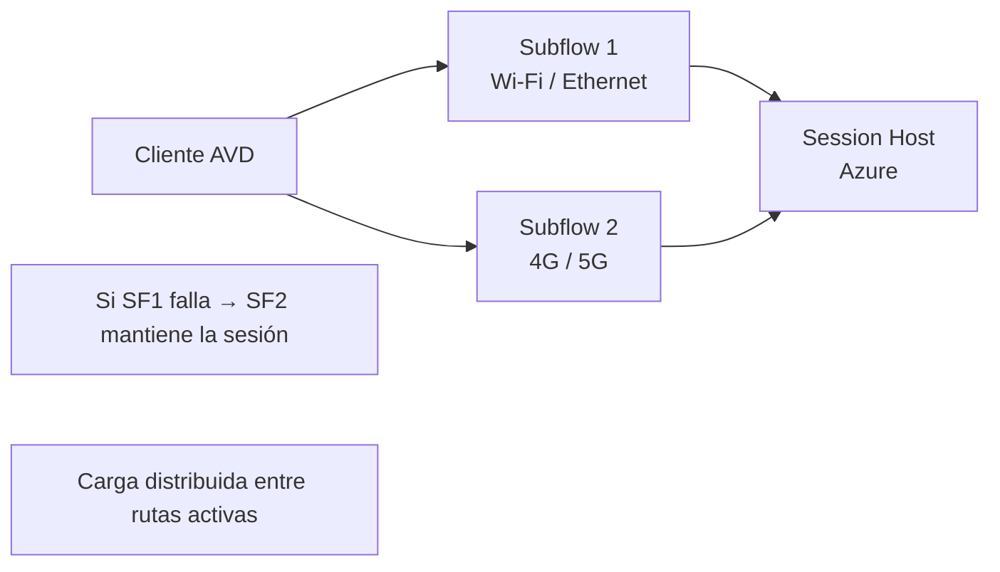

# AVD RDP Multipath: resiliencia de red con múltiples rutas TCP en preview

## Resumen

En abril de 2026, Azure Virtual Desktop lanza en preview **RDP Multipath**, una extensión del protocolo RDP que mantiene **múltiples rutas TCP simultáneas** entre el cliente y el session host. Si una ruta falla —por ejemplo, una interfaz de red, un ISP o una VPN— la sesión continúa automáticamente a través de las rutas restantes sin reconexión visible para el usuario. Es especialmente útil para usuarios móviles o con conectividad variable que requieren sesiones RDP estables.

## ¿Cómo funciona RDP Multipath?

RDP Multipath usa el protocolo **MPTCP (Multipath TCP)** para establecer subrutas (subflows) sobre diferentes interfaces de red o rutas. Si el cliente tiene conectividad Wi-Fi y 4G/5G simultáneamente, Multipath puede usar ambas:



## Diferencia con RDP Shortpath

| Característica | RDP Shortpath | RDP Multipath |
|----------------|---------------|---------------|
| Protocolo base | UDP | TCP |
| Objetivo principal | Reducir latencia | Aumentar resiliencia |
| Rutas simultáneas | 1 | Múltiples |
| Escenario ideal | Redes corporativas estables | Usuarios móviles o con WAN redundante |
| Estado (abril 2026) | GA | Preview |

Ambas características son complementarias y pueden estar activas al mismo tiempo.

## Requisitos de la preview

- **Session hosts**: Windows Server 2025 o Windows 11 24H2
- **Cliente**: Windows App versión 2.0.80 o superior
- **Red**: El cliente debe tener múltiples interfaces activas para aprovechar las rutas paralelas
- **OS del cliente**: Windows 11 con MPTCP habilitado

### Verificar MPTCP en el cliente Windows

```powershell
# Verificar estado de MPTCP en Windows 11
Get-NetTCPSetting | Select-Object SettingName, AutoTuningLevelLocal, MultiPath

# Habilitar MPTCP si está desactivado
Set-NetTCPSetting -SettingName InternetCustom -MultiPath Enabled
```

## Habilitar RDP Multipath en el host pool

En el portal de AVD → Host pool → **RDP Properties → Network settings**

O vía CLI:

```bash
az desktopvirtualization hostpool update \
  --resource-group myRG \
  --name myHostPool \
  --custom-rdp-property "multipath:i:1"
```

## Verificar que Multipath está activo

Durante una sesión activa, en Windows App:

```
Connection Information → Transport: TCP (RDP Multipath)
                       → Active paths: 2
```

Desde el session host, verificar conexiones MPTCP activas:

```powershell
# Ver conexiones TCP con información de subflows (Windows Server 2025)
Get-NetTCPConnection -State Established |
    Where-Object { $_.LocalPort -eq 3389 -or $_.RemotePort -eq 3389 } |
    Select-Object LocalAddress, RemoteAddress, State
```

## Casos de uso recomendados

- **Usuarios móviles** con laptops que alternan entre Wi-Fi corporativo y datos móviles
- **Sesiones críticas** que no pueden interrumpirse por cambios de red (salas de control, trading, soporte remoto crítico)
- **Oficinas con doble ISP** donde los usuarios necesitan failover transparente

!!! warning
    En la preview, RDP Multipath puede no estar disponible en todas las regiones de Azure. Verifica la disponibilidad regional en la documentación oficial antes de planificar el rollout.

!!! note
    RDP Multipath y RDP Shortpath pueden coexistir en la misma configuración de host pool: Shortpath mejora la latencia en redes con buena calidad, mientras que Multipath añade resiliencia. Si Shortpath (UDP) no está disponible por restricciones de red, la sesión cae a TCP, donde Multipath puede proporcionar resiliencia.

## Buenas prácticas

- Despliega la preview en un subconjunto de usuarios itinerantes y recoge feedback antes del rollout general.
- Monitoriza el consumo de ancho de banda: con múltiples rutas activas, el tráfico total puede aumentar si el cliente usa ambas interfaces simultáneamente.
- Documenta las interfaces de red disponibles en los dispositivos de los usuarios; si todos están en redes Ethernet de un solo path, Multipath no aportará beneficio.

## Referencias

- [What's new in Azure Virtual Desktop - April 2026](https://learn.microsoft.com/azure/virtual-desktop/whats-new#april-2026)
- [RDP Multipath for Azure Virtual Desktop](https://learn.microsoft.com/azure/virtual-desktop/rdp-multipath)
- [Configure RDP properties for Azure Virtual Desktop](https://learn.microsoft.com/azure/virtual-desktop/customize-rdp-properties)
