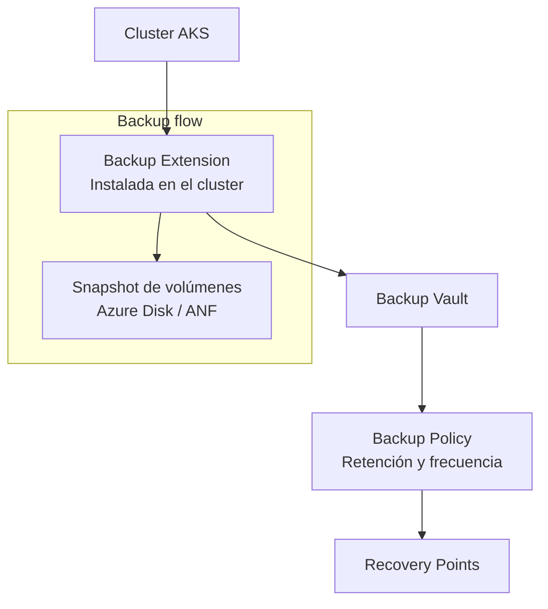

# Azure Backup para AKS: experiencia CLI simplificada para habilitar protección

## Resumen

En abril de 2026, Azure Backup lanza una experiencia de CLI simplificada para **habilitar backup en clusters de AKS**. El proceso anterior requería múltiples pasos manuales: crear el Backup vault, registrar extensiones, configurar permisos RBAC en el cluster y en las cuentas de storage, y asociar la política. Ahora es posible hacerlo en un único comando `az aks backup enable`. Útil para equipos que gestionan muchos clusters o necesitan estandarizar el backup de AKS en pipelines de CI/CD.

## Arquitectura de backup de AKS

Azure Backup para AKS hace snapshots de:

- **Recursos de Kubernetes** (deployments, configmaps, secrets, PVCs y sus definiciones)
- **Volúmenes persistentes** (datos en disco, via CSI snapshot)

El proceso usa una **extensión de backup instalada en el cluster** que interactúa con el Backup vault:



## Habilitación con el nuevo comando simplificado

### Antes (proceso manual)

```bash
# 1. Crear Backup vault
# 2. Instalar extensión de backup en el cluster
# 3. Crear backup instance manualmente
# 4. Asignar permisos RBAC al vault en el cluster
# 5. Asignar permisos en el Resource Group de snapshots
# (5+ comandos, gestión manual de IDs)
```

### Ahora (comando unificado)

```bash
az aks backup enable \
  --resource-group myRG \
  --cluster-name myAKSCluster \
  --vault-name myBackupVault \
  --vault-resource-group myBackupRG \
  --backup-policy-name dailyAKSPolicy \
  --backup-storage-location-name eastus
```

Este comando:

1. Instala la extensión de backup en el cluster si no está presente
2. Crea el Backup vault si no existe (o usa uno existente)
3. Configura automáticamente los role assignments necesarios
4. Crea la Backup instance asociando cluster, vault y policy

## Gestionar políticas de backup

### Crear una política personalizada

```bash
# Ver políticas disponibles en el vault
az dataprotection backup-policy list \
  --resource-group myBackupRG \
  --vault-name myBackupVault \
  --output table

# Crear política con retención de 30 días y backup diario
az dataprotection backup-policy create \
  --resource-group myBackupRG \
  --vault-name myBackupVault \
  --name dailyAKSPolicy \
  --datasource-types AzureKubernetesService \
  --policy '{
    "policyRules": [
      {
        "backupParameters": {
          "objectType": "AzureBackupParams",
          "backupType": "Incremental"
        },
        "trigger": {
          "objectType": "ScheduleBasedTriggerContext",
          "schedule": {
            "repeatingTimeIntervals": ["R/2026-01-01T02:00:00+00:00/P1D"]
          },
          "taggingCriteria": [{"tagInfo": {"tagName": "Default"}, "isDefault": true}]
        },
        "dataStore": {
          "dataStoreType": "OperationalStore",
          "objectType": "DataStoreInfoBase"
        },
        "name": "BackupHourly",
        "objectType": "AzureBackupRule"
      }
    ]
  }'
```

## Verificar el estado del backup

```bash
# Ver instancias de backup del cluster
az dataprotection backup-instance list \
  --resource-group myBackupRG \
  --vault-name myBackupVault \
  --query "[?contains(name,'myAKSCluster')].{Name:name, Status:properties.currentProtectionState}" \
  --output table

# Ver recovery points disponibles
az dataprotection recovery-point list \
  --resource-group myBackupRG \
  --vault-name myBackupVault \
  --backup-instance-name <backup-instance-name> \
  --output table
```

## Restaurar desde un recovery point

```bash
az aks backup restore \
  --resource-group myRG \
  --cluster-name myAKSCluster \
  --vault-name myBackupVault \
  --vault-resource-group myBackupRG \
  --recovery-point-id <recovery-point-id> \
  --restore-location eastus \
  --restore-to-cluster-id <target-cluster-resource-id>
```

!!! warning
    La restauración de AKS es **destructiva para los recursos restaurados**. Si restauras en el mismo cluster, los recursos existentes con los mismos nombres serán sobreescritos. Considera siempre restaurar primero en un cluster de prueba.

## Integrar en pipelines de CI/CD

```yaml
# Ejemplo: GitHub Actions step para habilitar backup en nuevo cluster
- name: Enable AKS Backup
  run: |
    az aks backup enable \
      --resource-group ${{ env.RESOURCE_GROUP }} \
      --cluster-name ${{ env.CLUSTER_NAME }} \
      --vault-name ${{ env.BACKUP_VAULT }} \
      --vault-resource-group ${{ env.BACKUP_RG }} \
      --backup-policy-name dailyAKSPolicy \
      --backup-storage-location-name ${{ env.LOCATION }}
```

## Buenas prácticas

- Almacena el Backup vault en un Resource Group **separado** del cluster. Si el RG del cluster se elimina accidentalmente, los backups permanecen.
- Habilita **soft delete** en el Backup vault para prevenir la eliminación accidental de recovery points.
- Prueba la restauración al menos una vez al mes en un cluster de staging para validar que los backups son funcionales.

```bash
# Habilitar soft delete en el vault
az dataprotection backup-vault update \
  --resource-group myBackupRG \
  --vault-name myBackupVault \
  --soft-delete-state On \
  --soft-delete-retention-duration-in-days 14
```

## Referencias

- [What's new in Azure Backup - April 2026](https://learn.microsoft.com/azure/backup/whats-new#april-2026)
- [Back up Azure Kubernetes Service using Azure Backup](https://learn.microsoft.com/azure/backup/azure-kubernetes-service-backup-overview)
- [Tutorial: Back up AKS cluster using Azure CLI](https://learn.microsoft.com/azure/backup/azure-kubernetes-service-cluster-backup-using-azure-cli)
