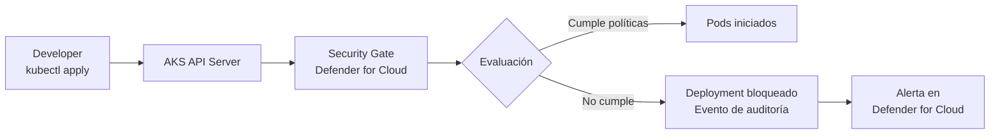
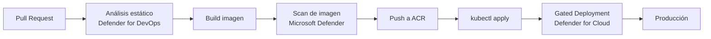

# Defender for Containers en GA en Azure Government y AKS Automatic K8s gated deployment

## Resumen

La semana del 22 de abril cierra el ciclo de novedades del primer cuatrimestre de 2026 con dos GAs relevantes en Defender for Cloud: **Defender for Containers alcanza GA en Azure Government** —igualando la paridad con la nube comercial— y **Kubernetes gated deployment en AKS Automatic** pasa a GA (disponible desde el 12 de marzo). Este último permite bloquear automáticamente el despliegue de cargas de trabajo en AKS que no cumplan las políticas de seguridad definidas en Defender for Cloud, sin intervención manual.

## Defender for Containers GA en Azure Government

Hasta ahora, los clientes en Azure Government tenían acceso limitado a Defender for Containers. Con la GA de abril 2026, las capacidades disponibles en la nube comercial son ahora paridad completa:

| Capacidad | Nube Comercial | Azure Government (GA abr 2026) |
|-----------|----------------|-------------------------------|
| Vulnerability assessment de imágenes | ✅ | ✅ |
| Runtime threat protection | ✅ | ✅ |
| Binary drift detection | ✅ | ✅ |
| Anti-malware en runtime | ✅ | ✅ |
| Kubernetes security posture | ✅ | ✅ |
| Code to Runtime enrichment | ✅ (preview) | Preview |

### Habilitar en Azure Government

```bash
# Conectarse al entorno de Government
az cloud set --name AzureUSGovernment
az login

# Habilitar Defender for Containers
az security pricing create \
  --name Containers \
  --tier Standard
```

## AKS Automatic K8s Gated Deployment (GA desde 12 marzo)

### ¿Qué es Kubernetes Gated Deployment?

Gated Deployment integra Defender for Cloud con el flujo de despliegue de AKS Automatic. Cuando un deployment llega al cluster, la gate evalúa el estado de seguridad antes de permitir que los pods se inicien:



### Qué políticas puede evaluar la gate

- Imagen con vulnerabilidades críticas no parcheadas
- Imagen desde registry no confiable
- Contenedor con `privileged: true` sin excepción
- Ausencia de readiness/liveness probes
- Uso de `latest` como tag de imagen

### Habilitar Gated Deployment

Requiere AKS Automatic (no AKS Standard):

```bash
# Crear cluster AKS Automatic con Gated Deployment
az aks create \
  --resource-group myRG \
  --name myAKSAutomatic \
  --tier standard \
  --aks-custom-headers AKSHTTPCustomFeatures=Microsoft.ContainerService/AKSAutomatic \
  --enable-defender \
  --defender-config '{
    "gatedDeployment": {
      "enabled": true,
      "blockOnVulnerabilities": true,
      "blockOnUntrustedRegistry": true
    }
  }'
```

### Configurar excepciones

Para workloads legítimas que requieren privilegios especiales:

```yaml
apiVersion: v1
kind: Pod
metadata:
  name: my-privileged-pod
  annotations:
    security.microsoft.com/gated-deployment-exception: "approved"
    security.microsoft.com/gated-deployment-approver: "security-team"
    security.microsoft.com/gated-deployment-reason: "Required for node monitoring"
spec:
  containers:
  - name: monitor
    image: myacr.azurecr.io/node-monitor:1.2.3  # imagen con tag explícito
    securityContext:
      privileged: true
```

!!! warning
    Las excepciones deben ser revisadas periódicamente. Un proceso de aprobación sin revisión se convierte en una brecha: con el tiempo, todos los deployments problemáticos tienen excepción y la gate pierde efectividad.

## Integrar Gated Deployment con el pipeline CI/CD

La práctica recomendada es que los problemas se detecten **antes de llegar al cluster**:



La gate actúa como última línea de defensa, no como sustituto del análisis en pipeline.

## Buenas prácticas

- Empieza con la gate en modo **audit** (solo registra, no bloquea) para identificar qué deployments existentes no cumplirían las políticas antes de activar el bloqueo.
- Define un proceso de gestión de excepciones claro: quién aprueba, cuánto tiempo dura la excepción y cómo se revisa.
- Para Azure Government: verifica que las políticas de seguridad de tu agencia permiten el uso de capacidades en preview (como Code to Runtime) antes de habilitarlas.

```bash
# Ver eventos de gated deployment en el cluster
kubectl get events --namespace kube-system |
    grep -i "gated\|blocked\|security"
```

## Referencias

- [Defender for Cloud - What's new - March/April 2026](https://learn.microsoft.com/azure/defender-for-cloud/release-notes#april-2026)
- [Kubernetes gated deployment in AKS](https://learn.microsoft.com/azure/defender-for-cloud/kubernetes-gated-deployment)
- [Defender for Containers in Azure Government](https://learn.microsoft.com/azure/defender-for-cloud/defender-for-containers-introduction)
- [AKS Automatic overview](https://learn.microsoft.com/azure/aks/intro-aks-automatic)
