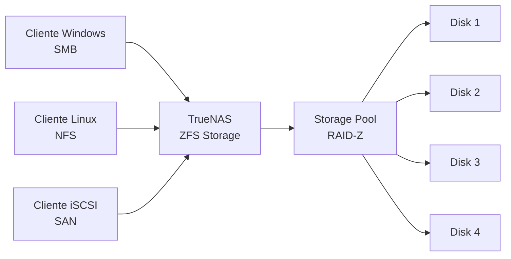

# TrueNAS: almacenamiento de datos escalable con ZFS

## Resumen

TrueNAS es un sistema de almacenamiento en red (NAS) de código abierto basado en ZFS, construido sobre FreeBSD o Linux. Proporciona almacenamiento centralizado, snapshots, replicación, y acceso a datos vía SMB/NFS/iSCSI para pequeñas oficinas, laboratorios y entornos empresariales. Se despliega en hardware propio o virtualizado, y su modelo de gestión es muy intuitivo: desde el dashboard web configuran desde la capacidad de almacenamiento hasta políticas de respaldo y acceso de usuarios.

## ¿Qué es TrueNAS?

TrueNAS es un appliance de almacenamiento basado en ZFS (filesystem con capacidades avanzadas como snapshots, compresión y deduplicación). Corre sobre un OS Linux (TrueNAS Core/Scale) o FreeBSD (TrueNAS Enterprise) y proporciona:

- **Almacenamiento centralizado**: acceso desde múltiples clientes (Windows, macOS, Linux)
- **Snapshots y replicación**: backup y DR integrado
- **Gestión de datos**: cuotas, compresión, deduplicación
- **Escalabilidad**: desde 2 bahías hasta sistemas multi-exabyte



## Variantes de TrueNAS

| Variante | Base OS | Licencia | Uso |
|----------|---------|----------|-----|
| **TrueNAS Core** | FreeBSD | Open Source | Laboratorio, hogar, PYME |
| **TrueNAS Scale** | Linux (Debian) | Open Source | Entornos modernos, Kubernetes |
| **TrueNAS Enterprise** | FreeBSD | Comercial | Empresas con soporte SLA |

## Instalación en hardware propio

### Requisitos mínimos

- CPU: x86-64 moderno (Intel/AMD)
- RAM: 8GB mínimo (16GB recomendado)
- Almacenamiento: 2+ discos SATA/SAS de 2TB+
- Red: Gigabit Ethernet

### Pasos de instalación

1. **Descargar imagen ISO**: desde [truenas.com/downloads](https://truenas.com/download-truenas-core/)
2. **Crear USB instalable**: con Etcher o dd
3. **Bootear desde USB** y seguir el instalador
4. **Configurar red**: IP estática, gateway, DNS
5. **Acceder al dashboard**: `https://<IP-truenas>:6000`

## Configuración inicial: crear un Pool de almacenamiento

Desde el dashboard web:

**Storage → Create Pool:**

```text
Pool name: tank (nombre convencional)
Disks: Seleccionar mínimo 2 discos
Layout: RAID-Z1 (redundancia 1 disco)
      o RAID-Z2 (redundancia 2 discos para pools grandes)
```

### Esquema de RAID-Z recomendado

| Discos | Layout | Capacidad útil | Redundancia |
|--------|--------|----------------|-------------|
| 4 | RAID-Z1 | 3 discos | 1 fallo |
| 6 | RAID-Z2 | 4 discos | 2 fallos |
| 8 | RAID-Z3 | 5 discos | 3 fallos |

## Crear datasets y comparticiones

### Dataset (contenedor lógico)

```text
Storage → Datasets → Add Dataset
Name: tank/homes
Encryption: On (recomendado)
```

### Compartición SMB (para Windows/macOS)

```text
Sharing → Windows Shares (SMB) → Add
Dataset: tank/homes
Name: homes
Purpose: Default share
Permissions: Administrador (propietario)
```

Los usuarios acceden vía `\\<IP-truenas>\homes` en Windows.

### Compartición NFS (para Linux)

```text
Sharing → Unix (NFS) Shares → Add
Dataset: tank/homes
Mapall User: nobody
Path: /mnt/tank/homes
```

Los clientes Linux montan: `mount -t nfs <IP-truenas>:/mnt/tank/homes /mnt/homes`

## Point-in-time recovery y replicación

### Crear recuperación puntual automática (Point-in-time Snapshots)

TrueNAS crea **versiones puntuales** de los datasets en momentos específicos. Estos NO son backups completos, sino **"fotografías" del estado del filesystem** que permiten restaurar archivos a un momento anterior si se modifican o se borran accidentalmente.

```text
Tasks → Periodic Snapshot Tasks
Dataset: tank/homes
Schedule: Daily at 2:00 AM
Retention: Keep last 7 days
```

### Replicar a otro TrueNAS (backup remoto)

Para backup verdadero, la **replicación** copia los datos hacia otra instancia de TrueNAS (o almacenamiento remoto):

```text
Tasks → Replication Tasks
Source Dataset: tank/homes
Target: <IP-otro-truenas>:/mnt/backup/homes
Schedule: Daily after snapshot
```

!!! note
    Las versiones puntuales (snapshots) NO ocupan espacio inicial en ZFS; crece bajo demanda según cambios. Son ideales para **recuperación rápida de archivos eliminados**, no para DR. Para disaster recovery, necesitas replicación o backup remoto.

## Actualización de software de TrueNAS

TrueNAS SCALE usa "trains" (ramas de actualización) que siguen caminos de versiones lineales. Desde **System → Update**:

### Perfiles disponibles

- **Stable**: Versiones probadas y recomendadas (default para producción)
- **Nightly**: Versiones en desarrollo diario (solo testing)
- **Release Candidate**: Candidatos a versión estable

### Proceso de actualización

1. **Antes de actualizar**: crear un backup de configuración
   ```text
   System → General → Save Configuration
   ✅ Marcar: Export Password Secret Seed
   ```

2. **Realizar actualización**:
   ```text
   System → Update → Check for Updates
   → Install Update
   ```

3. **Durante la actualización**: TrueNAS descarga archivos y reinicia automáticamente

4. **Después**: limpiar caché del navegador (CTRL+F5) antes de loguear

!!! warning
    Actualiza durante ventanas de mantenimiento programado. Los clientes desconectados durante la actualización experimentarán un corte de servicio. Todos los parámetros auxiliares pueden cambiar entre versiones mayores; revisa la documentación de cambios (release notes) antes de actualizar.

## Instalación de apps en TrueNAS Scale

TrueNAS Scale incluye **TrueCharts** o **iX Apps** —catálogos de aplicaciones containerizadas que corren en Kubernetes integrado.

```text
Apps → Discover Apps → [Buscar aplicación]
    → Install → Configurar
    → Deploy
```

Las apps comparten el almacenamiento de TrueNAS directamente, útil para servicios como Pi-hole, Plex, Home Assistant, etc.

## Monitoreo y alertas

**Dashboard → Reporting:**

- Uso de almacenamiento en tiempo real
- Temperatura y estado de discos
- Performance (IOPS, throughput)

**Sistema → Settings → Email:**

Configura notificaciones automáticas si:

- Un disco falla
- Capacidad del pool > 85%
- Temperatura de discos alta

## Buenas prácticas

- **Planifica capacidad**: deja 10-20% de espacio libre en el pool para que ZFS funcione óptimamente
- **Monitorea salud**: revisa el estado de discos regularmente desde **Storage → Disks**
- **Respalda la configuración**: **System → General → Save Configuration**
- **Actualiza regularmente**: **System → Update → Check for Updates**

```bash
# Desde shell (Advanced → Shell), ver estado del pool
zpool status tank

# Ver dataset usage
zfs list -o space
```

!!! warning
    NO añadas discos a un pool existente esperando aumentar capacidad. Los RAID-Z no se pueden expandir; necesitas migrar a un nuevo pool o usar RAID concatenado (no recomendado). Planifica el tamaño inicial correctamente.

## Referencias

- [TrueNAS Official Documentation](https://www.truenas.com/docs/)
- [ZFS Administration Guide](https://openzfs.org/wiki/Documentation)
- [TrueNAS Community Forums](https://www.truenas.com/community/)
- [TrueCharts Apps for TrueNAS Scale](https://truecharts.org/)
