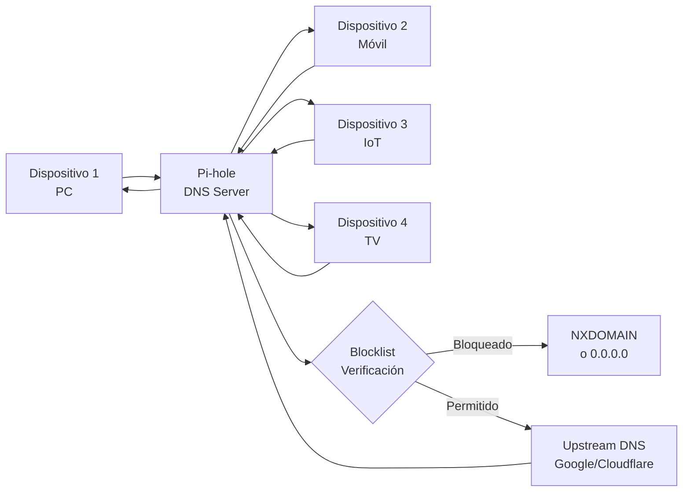

# Pi-hole: bloqueador de anuncios y filtro DNS a nivel de red

## Resumen

Pi-hole es una solución de **DNS-level ad-blocking** que funciona como un servidor DNS en tu red local. Intercepta todas las solicitudes DNS de los dispositivos conectados y bloquea dominios clasificados como anuncios, malware o rastreadores, sin necesidad de instalar software en cada dispositivo. Se despliega típicamente en una Raspberry Pi (de ahí el nombre), aunque corre en cualquier Linux, contenedor Docker o VM. Útil para redes caseras, laboratorios, pequeñas oficinas o como infraestructura de seguridad en entornos de desarrollo.

## ¿Qué es Pi-hole?

Pi-hole es un servidor DNS que actúa como un proxy entre tus dispositivos y el DNS upstream (Google, Cloudflare, etc.). Cuando un dispositivo intenta resolver un dominio, Pi-hole consulta su lista de bloqueo (blocklist) y si el dominio está en ella, devuelve una respuesta NXDOMAIN o una IP local en lugar de permitir la conexión.

**Diferencia clave con adblockers de navegador:**

- Los adblockers en el navegador solo filtran en ese navegador
- Pi-hole funciona a nivel de DNS, bloqueando en **toda la red** y en **todos los dispositivos**, incluyendo apps móviles, IoT, etc.

## Arquitectura



## Configuración en Docker

Para entornos de laboratorio o integración en stack de contenedores:

```bash
docker run -d \
  --name pihole \
  --net=host \
  -e TZ="Europe/Madrid" \
  -e WEBPASSWORD="your-password" \
  -e DNS1="1.1.1.1" \
  -e DNS2="1.0.0.1" \
  -p 53:53/tcp -p 53:53/udp \
  -p 80:80 \
  -v pihole_config:/etc/pihole \
  -v pihole_dnsmasq:/etc/dnsmasq.d \
  --restart unless-stopped \
  pihole/pihole:latest
```

O con docker-compose:

```yaml
version: '3'
services:
  pihole:
    image: pihole/pihole:latest
    hostname: pihole
    ports:
      - "53:53/tcp"
      - "53:53/udp"
      - "80:80"
    environment:
      TZ: "Europe/Madrid"
      WEBPASSWORD: "your-secure-password"
      DNS1: "1.1.1.1"
      DNS2: "1.0.0.1"
    volumes:
      - pihole_config:/etc/pihole
      - pihole_dnsmasq:/etc/dnsmasq.d
    restart: unless-stopped

volumes:
  pihole_config:
  pihole_dnsmasq:
```

## Instalación en TrueNAS Scale (Apps)

TrueNAS Scale incluye un catálogo de aplicaciones containerizadas. Pi-hole está disponible en **TrueCharts**, el repositorio comunitario de apps para TrueNAS.

### Pasos para instalar Pi-hole en TrueNAS Scale

#### 1. Agregar el repositorio de TrueCharts

Desde el dashboard de TrueNAS Scale:

**Apps → Manage Catalogs → Add Catalog**

```text
Name: truecharts
Repository: https://github.com/truecharts/catalog
Branch: main
Preferred Trains: community
```

#### 2. Instalar Pi-hole desde el catálogo

**Apps → Discover → Buscar "Pi-hole"**

Selecciona **Pi-hole** y haz click en **Install**.

#### 3. Configuración de Pi-hole

En la pantalla de configuración, ajusta los siguientes parámetros:

**Application Configuration:**

| Campo | Valor | Descripción |
|-------|-------|-------------|
| Application Name | `pihole` | Nombre del contenedor |
| Timezone | `Europe/Madrid` | Tu zona horaria local |
| Web Password | `••••••` | Contraseña para el dashboard web (mínimo 8 caracteres) |
| Shared Memory Size | `64` | Tamaño de memoria compartida en MiB |

#### 4. Configuración de red

**Network Configuration:**

| Parámetro | Valor | Propósito |
|-----------|-------|----------|
| **WebUI Port** | 20720 | Puerto alternativo para acceso web (evita conflictos con puerto 80) |
| **Port Bind Mode** | Publish port on the host | Permite acceso desde otros dispositivos |
| **HTTPS Port** | 30132 | Puerto HTTPS del dashboard |
| **DNS Port** | 53 | Puerto DNS (estándar) |
| **DNS Bind Mode** | Publish port on the host | Hace disponible DNS en toda la red |
| **Host IP (DNS)** | `192.168.xx.xx` | IP del TrueNAS donde responde DNS |

!!! note
    El puerto DNS (53) debe estar disponible en la red. Si otro servicio lo usa, cámbialo a uno > 1024 (ej: 5353), pero entonces los clientes necesitan configurar ese puerto específicamente.

#### 5. Configuración de almacenamiento

**Storage Configuration:**

| Volumen | Tipo | Descripción |
|--------|------|-------------|
| Pi-Hole Config | `ixVolume` | Dataset automático para `/etc/pihole` |
| Pi-Hole DNSMASQ Config | `ixVolume` | Dataset automático para `/etc/dnsmasq.d` |

Activa **Enable ACL** en ambos para permisos adecuados.

#### 6. Configuración de recursos

**Resources Configuration:**

| Recurso | Valor | Nota |
|--------|-------|------|
| CPUs | 2 | Suficiente para resolver ~5k consultas/min |
| Memory | 4096 MB (4 GB) | Mínimo para cache DNS decente |

!!! warning
    No asignes todos los cores del servidor. Deja al menos 2 cores libres para TrueNAS. Monitorea uso real con **Apps → Installed Applications → Pi-hole → Resources**.

#### 7. Desplegar

Haz click en **Install**. TrueNAS crea el contenedor, lo inicia y gestiona automáticamente su ciclo de vida.

#### 8. Acceder al dashboard

Una vez desplegado (estado "Running"), accede a:

```text
http://<IP-truenas>:20720/admin
```

O si usaste puerto 80:

```text
http://<IP-truenas>/admin
```

Contraseña: la que configuraste en **Web Password**.

### Ventajas de instalación en TrueNAS Scale

- **Almacenamiento integrado**: Los datos de Pi-hole se guardan en datasets ZFS con snapshots automáticos
- **Aislamiento**: Corre en contenedor sin afectar al OS de TrueNAS
- **Gestión centralizada**: Actualización, reinicio y logs desde el dashboard de TrueNAS
- **Persistencia**: La configuración se mantiene incluso si TrueNAS se reinicia
- **Fácil respaldo**: Snapshot automático del dataset con `tank/ix-applications/pihole`

### Monitoreo en TrueNAS

Desde **Apps → Installed Applications → Pi-hole**:

```text
Status: Running / Stopped
Resources: CPU, RAM, Network I/O
Logs: Ver stdout/stderr en tiempo real
Actions: Restart, Stop, Shell
```

Para ver logs en tiempo real:

```bash
# Desde Advanced → Shell en TrueNAS
kubectl logs -f -n ix-pihole deployment/pihole
```

!!! note
    Si usas TrueNAS Core (no Scale), necesitas ejecutar Pi-hole como contenedor Docker independiente o instalarlo directamente en FreeBSD. TrueNAS Core no tiene el catálogo de Apps integrado.

## Configurar dispositivos para usar Pi-hole

### En el router (opción recomendada)

Configura el DNS primario en tu router WiFi/LAN para que apunte a la IP de Pi-hole. Así **todos los dispositivos** usan automáticamente Pi-hole como DNS sin configuración individual.

```text
Router → Settings → DHCP → Primary DNS: <IP-de-pihole>
```

### En dispositivos individuales

Si no puedes modificar el router:

**Windows:**
```text
Settings → Network & Internet → Change adapter options → 
IPv4 Properties → Use these DNS servers: <IP-pihole>
```

**macOS / Linux:**
```bash
# En /etc/resolv.conf
nameserver <IP-pihole>
```

**iPhone / iPad:**
```text
Settings → WiFi → [Tu red] → Configure DNS → Manual
Add DNS Server: <IP-pihole>
```

## Gestionar listas de bloqueo

### Dashboard web

Accede a `http://<IP-pihole>/admin`

En **Settings → Adlists**:

```text
https://raw.githubusercontent.com/StevenBlack/hosts/master/hosts
https://adaway.org/hosts.txt
https://www.claudedrake.de/amalgamated_hosts.txt
```

Estas son listas comunitarias verificadas de dominios de anuncios y malware.

### Agregar dominios personalizados

En **Whitelist / Blacklist**:

- **Whitelist**: dominios que quieres permitir (útil para desbloquear un sitio bloqueado por error)
- **Blacklist**: dominios adicionales que quieres bloquear

```text
# Ejemplo: bloquear un rastreador específico
tracker.example.com
analytics.badcompany.net
```

## Buenas prácticas

- **Backup del dashboard**: exporte la configuración regularmente desde **Settings → Teleport**
- **Monitorización**: revisa el panel **Query Log** periódicamente para detectar patrones anómalos
- **Actualizar listas**: agrega listas comunitarias confiables pero no todas a la vez; prueba el impacto en experiencia de usuario
- **HA en pequeña escala**: despliega una segunda instancia de Pi-hole como fallback en caso de que la primera no esté disponible

!!! warning
    Algunos servicios legítimos pueden estar bloqueados por listas demasiado agresivas. Si una app o web no funciona correctamente tras instalar Pi-hole, verifica el Query Log para confirmar que el dominio está siendo bloqueado y añádelo a la whitelist.

!!! note
    Pi-hole es software de código abierto. Revisa periódicamente el repositorio GitHub para actualizaciones de seguridad y nuevas blocklists comunitarias.

## Casos de uso comunes

- **Red doméstica**: reduce publicidad y rastreadores sin adblocks de navegador
- **Laboratorio de seguridad**: simula comportamiento de malware analizando qué dominios intenta contactar
- **Red corporativa pequeña**: filtrado de contenido inapropiado a nivel de DNS
- **IoT**: bloquea conexiones no deseadas de dispositivos smart home

## Referencias

- [Pi-hole official website](https://pi-hole.net/)
- [Pi-hole GitHub repository](https://github.com/pi-hole/pi-hole)
- [Pi-hole Docker Hub](https://hub.docker.com/r/pihole/pihole/)
- [StevenBlack Hosts lists](https://github.com/StevenBlack/hosts)
