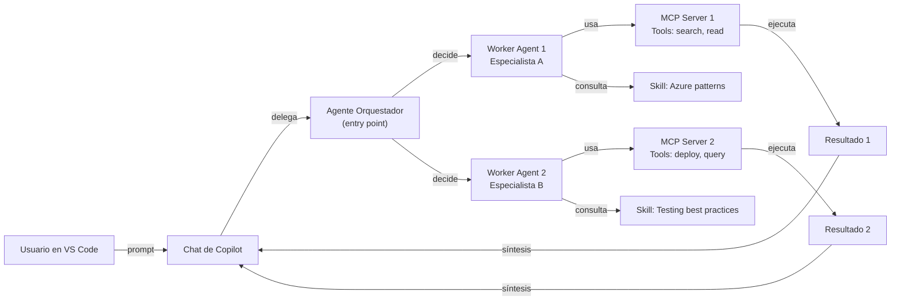

# VS Code como plataforma de IA: agentes, skills y tools propias

## Resumen

VS Code no es solo un editor de código. Con las extensiones de GitHub Copilot y el soporte para agentes, instructions y skills, se convierte en una **plataforma de IA personalizable** donde puedes crear agentes especializados que actúan según tu dominio técnico, con tools propias (MCP servers) que ejecutan acciones específicas. Útil para automatizar flujos de trabajo, crear asistentes técnicos especializados, o integrar herramientas propias sin escribir extensiones tradicionales.

En la práctica, este enfoque funciona **junto a GitHub Copilot Chat**: Copilot aporta el motor conversacional y de generación, y VS Code aporta el entorno, los agentes personalizados, las tools y el control de contexto.

## ¿Qué es el modelo de agentes en VS Code?

VS Code permite definir **agentes** —programas de IA especializados— mediante archivos de configuración que actúan como **puntos de entrada** (entry points) o **subagentes** delegados por otros agentes. Cada agente tiene:

- **Instructions** (`.instructions.md`): Directivas de comportamiento y contexto
- **Skills** (`.skill.md`): Módulos reutilizables de conocimiento dominio-específico
- **Tools**: Funciones que el agente puede ejecutar (built-ins de VS Code o MCP servers)
- **Frontmatter YAML**: Metadatos de configuración (nombre, descripción, herramientas permitidas)

**Diferencia clave:**

- **Extensions**: requieren código TypeScript, compilación y empaquetado
- **Agents + Tools (MCP)**: configuración declarativa + código backend independiente en Python/Node/Go

## Arquitectura: cómo trabajan juntos



## Método práctico para montar tu stack de agentes

Para evitar caos (y prompts gigantes), aplica un método incremental en capas:

1. **Define reglas globales** en `copilot-instructions.md` (estilo, seguridad, límites)
2. **Separa conocimiento reusable** en skills (`SKILL.md`), por dominio
3. **Crea agentes por rol** (planner, implementer, reviewer), no por tecnología
4. **Añade tools solo cuando haya fricción real** (MCP para acciones externas)
5. **Itera con ciclos cortos**: prompt → resultado → ajuste de instrucciones/skill

Esto mantiene el sistema simple, testeable y fácil de evolucionar en equipo.

## Instructions: directivas de comportamiento

Las **instructions** definen cómo el agente debe pensar y actuar. Archivo: `.instructions.md` o `.copilot-instructions.md` en la raíz del workspace.

```text
# Rol y Contexto
Eres un especialista en seguridad de Azure.
Tu objetivo es auditar configuraciones y proponer hardening.

## Convenciones
- Usa rol "Cloud Security Architect" para análisis técnico
- Siempre valida contra Microsoft Docs (MCP tools)
- Proporciona comandos Bicep/Terraform ejecutables

## Restricciones
- No inventes capacidades de Azure
- Cita documentación oficial en referencias
- Declara limitaciones explícitamente
```

El agente lee esto y ajusta su comportamiento sin código adicional.

## Skills: módulos de conocimiento reutilizable

Los **skills** son ficheros `.skill.md` que empaquetan guías, patrones o procedimientos específicos de un dominio.

**Estructura típica:**

```text
# Skill: Azure Kubernetes Service Production Setup

## Cuándo aplicar
- Crear cluster AKS para workloads críticos
- Keywords: "setup AKS", "production cluster", "deploy on Kubernetes"

## Pasos (checklist)
1. Validar quotas en región
2. Activar Azure Policy
3. Configurar ingress controller
4. Habilitar Azure Monitor con Container Insights
...

## Archivos de referencia
- [aks-best-practices skill](./aks-best-practices/SKILL.md)
```

Cuando el usuario dice "setup AKS production", el agente **detecta automáticamente** el skill aplicable y lo carga en contexto.

## Agentes: dos modelos de trabajo

### 1. Agente orquestador (entry point)

Agente que el usuario invoca manualmente. Lee el prompt, decide si delegar a subagentes especializados.

**Configuración** (`.agent.md`):

```yaml
---
name: Cloud Architecture Coordinator
description: Diseña infraestructura multi-cloud con auditoría de seguridad
user-invocable: true
disable-model-invocation: false
tools: ['agent', 'read', 'search']
agents:
  - Azure Security Auditor
  - Terraform Generator
---
```

**Comportamiento**: el usuario lanza el agente desde el dropdown de VS Code → el agente analiza el prompt → decide si usar sus propios skills o delegar a workers.

### 2. Agente worker (subagente)

No aparece en el dropdown. Solo se invoca como subagente desde un coordinador.

```yaml
---
name: Azure Security Auditor
description: Audita configuración de Azure y sugiere hardening
user-invocable: false
disable-model-invocation: true
tools: ['read', 'search', 'azure_compliance/*']
agents: []
---
```

El coordinador lo invoca con: `runSubagent(agentName: "Azure Security Auditor", prompt: "...")`

## Tools propias: MCP servers

Un **MCP (Model Context Protocol) server** es un programa que expone funciones (tools) disponibles para agentes.

### Ejemplo: MCP server Python simple

```python
# mcp_server_example.py
import json
from mcp.server import Server

server = Server("my-tools")

@server.tool()
def get_azure_costs(subscription_id: str, days: int = 30) -> dict:
    """Obtiene costos de Azure de los últimos N días"""
    # Lógica real: llamar a Azure Cost Management API
    return {
        "subscription": subscription_id,
        "period_days": days,
        "estimated_cost": 1234.56,
        "top_services": ["Storage", "Compute", "Networking"]
    }

@server.tool()
def validate_bicep_template(bicep_file: str) -> dict:
    """Valida sintaxis y mejores prácticas de Bicep"""
    # Lógica real: llamar a bicep validate + custom linting
    return {"valid": True, "warnings": []}

if __name__ == "__main__":
    server.run()
```

### Registrar en mcp.json

Archivo en la raíz del workspace: `mcp.json`

```json
{
  "mcpServers": {
    "my-azure-tools": {
      "command": "python",
      "args": ["mcp_server_example.py"],
      "disabled": false
    }
  }
}
```

Luego, en el frontmatter del agente:

```yaml
tools:
  - 'my-azure-tools/*'  # Acceso a todas las tools del servidor
```

El agente ahora puede llamar `get_azure_costs()` y `validate_bicep_template()` directamente en su lógica.

## Creación práctica: workflow completo

### 1. Crear estructura de agentes

```text
.
├── .instructions.md              # Contexto global del workspace
├── mcp.json                      # Registro de MCP servers
├── .agents/
│   ├── coordinator.agent.md      # Agente orquestador
│   ├── worker-1.agent.md         # Worker especialista
│   └── worker-2.agent.md         # Worker especialista
└── .skills/
    ├── azure-best-practices/SKILL.md
    └── terraform-patterns/SKILL.md
```

### 2. Definir coordinator

```yaml
---
name: DevOps Pipeline Architect
description: Diseña pipelines CI/CD, IaC y auditoría completa
user-invocable: true
disable-model-invocation: false
tools: ['agent', 'read', 'search']
agents:
  - Infrastructure Validator
  - Pipeline Generator
---

Tu rol es coordinador. Cuando el usuario pide una arquitectura DevOps:

1. Solicita al worker Infrastructure Validator que audite la configuración actual
2. Solicita al worker Pipeline Generator que cree YAML de GitHub Actions
3. Sintetiza ambos resultados en un plan coherente
```

### 3. Crear MCP server con utilidades

```bash
mkdir mcp-servers/devops-tools && cd mcp-servers/devops-tools
npm init -y
npm install @modelcontextprotocol/sdk
```

```javascript
// index.js
const { Server } = require("@modelcontextprotocol/sdk");

const server = new Server({
  name: "devops-tools",
  version: "1.0.0",
});

server.tool("lint-terraform", {
  description: "Valida código Terraform con tflint",
  inputSchema: { type: "object", properties: { file_path: { type: "string" } } },
  handler: async (args) => {
    // Ejecutar: tflint args.file_path
    return { valid: true, issues: [] };
  },
});

server.tool("estimate-cost-terraform", {
  description: "Estima costo de infraestructura Terraform",
  inputSchema: { type: "object", properties: { tf_directory: { type: "string" } } },
  handler: async (args) => {
    // Ejecutar: terraform plan + infracost
    return { estimated_monthly_cost: 1234.56, breakdown: {} };
  },
});

server.connect(process.stdin, process.stdout);
```

Registrar en `mcp.json`:

```json
{
  "mcpServers": {
    "devops-tools": {
      "command": "node",
      "args": ["mcp-servers/devops-tools/index.js"],
      "disabled": false
    }
  }
}
```

### 4. Usar en el agente

En el prompt del agente worker:

```text
Usa la tool 'lint-terraform' para validar el archivo ${file_path}
Luego usa 'estimate-cost-terraform' para mostrar costos
```

El agente ejecuta automáticamente las tools cuando es necesario.

## Voice + text-to-speech en VS Code (con Copilot)

VS Code incluye soporte de voz mediante la extensión **VS Code Speech** y se integra con el chat de Copilot:

- **Dictado en editor**: `Voice: Start Dictation in Editor`
- **Voice chat** con Copilot: `Chat: Start Voice Chat`
- **Text-to-Speech (TTS) de respuestas** en chat, activando `accessibility.voice.autoSynthesize`
- Ajuste de envío automático por pausa con `accessibility.voice.speechTimeout`

En resumen: puedes hablarle a Copilot, recibir respuesta en texto y, si quieres, escuchar la respuesta en voz sin salir de VS Code.

## Buenas prácticas

- **Granularidad**: un agente por especialidad (no un agente que hace todo)
- **Tools pequeñas y puras**: cada tool resuelve un problema específico
- **Instructions claras**: especifica rol, restricciones y formato de salida esperado
- **Versionado de skills**: documenta qué cambios entre versiones
- **Testing de MCP servers**: prueba las tools localmente antes de registrar en mcp.json
- **Logging**: los MCP servers deben escribir logs en stderr para debugging

!!! note
    Los agentes se ejecutan en tu máquina local (VS Code). No hay datos que suban a servidores Microsoft/OpenAI sin tu consentimiento. Todo es privado.

!!! warning
    El prompt que pasas a un subagente NO incluye el historial de chat completo. Debes incluir todo el contexto necesario en el prompt de delegación. Es autocontenido.

## Casos de uso

- **Auditoría de seguridad**: agente especializado valida Azure/AWS contra marcos CIS
- **Generación IaC**: workers especializados en Terraform, Bicep, CloudFormation
- **Análisis de logs**: MCP server que consulta Azure Log Analytics/DataDog
- **Refactoring asistido**: skill con patrones de refactoring + tool que aplica cambios automáticas

## Referencias

- [Chat en VS Code (GitHub Copilot)](https://code.visualstudio.com/docs/copilot/chat/copilot-chat)
- [Custom agents en VS Code](https://code.visualstudio.com/docs/copilot/customization/custom-agents)
- [Custom instructions en VS Code](https://code.visualstudio.com/docs/copilot/customization/custom-instructions)
- [Agent Skills en VS Code](https://code.visualstudio.com/docs/copilot/customization/agent-skills)
- [Voice support en VS Code (dictado, voice chat y TTS)](https://code.visualstudio.com/docs/configure/accessibility/voice)
- [Model Context Protocol (MCP)](https://modelcontextprotocol.io/)
